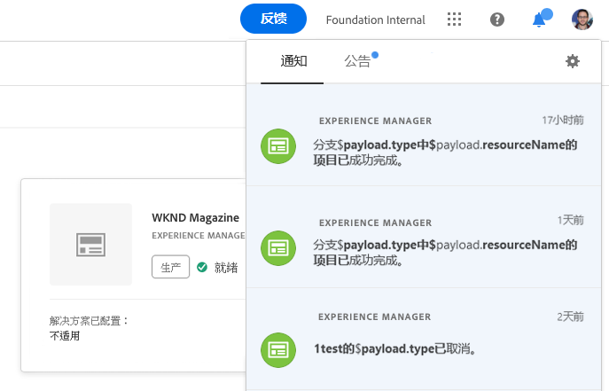
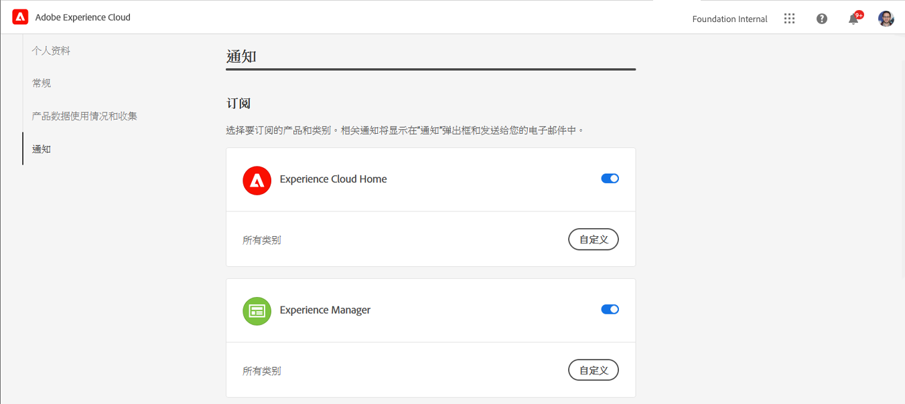
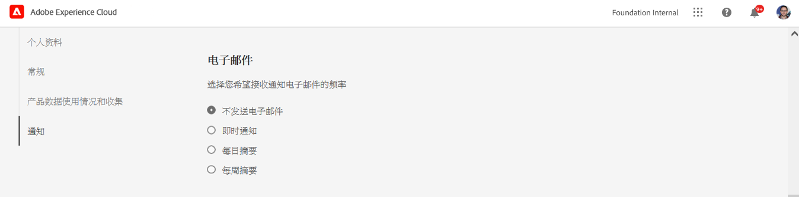

# 通知 {#notifications}

[!UICONTROL Cloud Manager] 允许用户在生产部署期间，当生产管道开始和完成（成功或失败）时接收通知。

这些通知通过Adobe发送 [!UICONTROL Experience Cloud] 向具有角色的用户发送通知系统 **业务所有者**, **项目经理**&#x200B;和 **部署管理器**.

通知显示在 [!UICONTROL Cloud Manager] UI和整个Adobe [!UICONTROL Experience Cloud].

当有新通知时，铃铛图标出现标记。 单击该面板可打开一个面板以查看通知。

该面板仅列出最新通知。 单击 **查看全部** 来查看所有通知。

## 电子邮件通知 {#email-notifications}

默认情况下，通知可在跨Adobe的用户界面中使用 [!UICONTROL Experience Cloud] 解决方案。 个人用户也可以选择按照以下步骤通过电子邮件发送这些通知。

1. 单击铃铛图标以显示通知。
1. 单击 **编辑首选项** 图标（形状类似齿轮）。
1. 在打开的窗口中，单击 **通知** 中。
   
1. 向下滚动到 **电子邮件** 标题。
   
1. 选择接收电子邮件的方式。
   * 不发送电子邮件（默认）
   * 即时通知
   * 每日摘要
   * 每周摘要

进行选择后，您的选择将自动保存，而无需单击保存或应用按钮。
