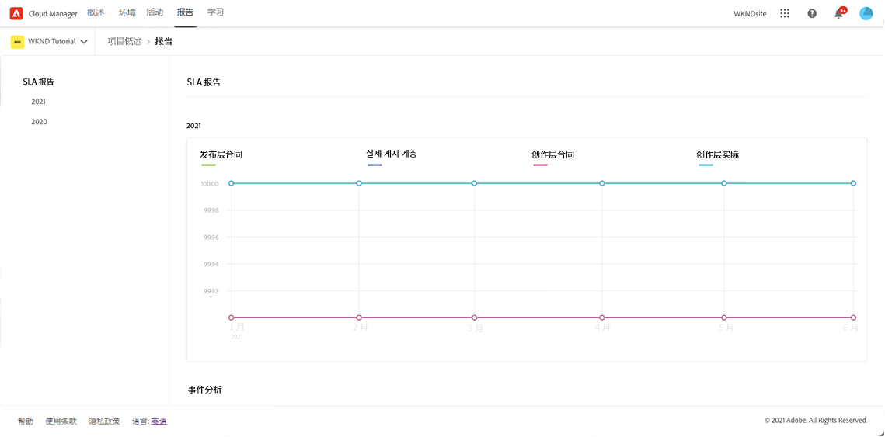
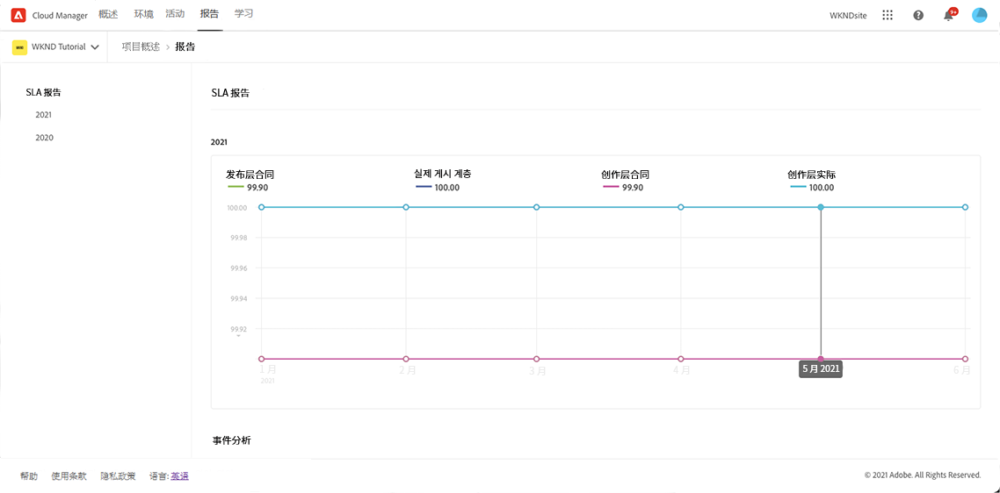
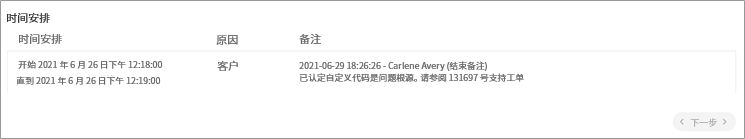

# SLA报告 {#sla-reporting}

请阅读以下各节，了解AEMas a Cloud Service中的SLA报告。

## 简介 {#introduction}

客户能够看到其生产AEM环境相对于其合同的服务级别协议(SLA)的性能。 可通过“报表”选项卡上的菜单进行访问，可从主标题访问该菜单。

请参阅以下示例，该图显示了2021年的月度SLA达到情况。

滚动到数据点会显示该月的特定值。

>[!NOTE]
>这些报表将逐步提供给客户。 如果在主导航中未看到“报表”选项，请联系您的Adobe代表以了解何时提供您的报表。

此图表下的“事件分析”部分显示在当前选定年份中针对该程序发生的事件集。

每个事件都有一个时间范围、原因和一组注释，如下图所示。

## SLA量度 {#sla-metrics}

* **发布层合**
同这是在您与发布层Adobe签订的合同中定义的SLA。

* **发布层实**
际值这是由Adobe或我们的供应商造成的生产发布层保理事件的测量正常运行时间。

* **创作**
层合同这是在您的合同中为创作层定义的与Adobe的SLA。

* **创作层实**
际值这是由Adobe或我们的供应商造成的生产创作层保理事件的测量正常运行时间。

