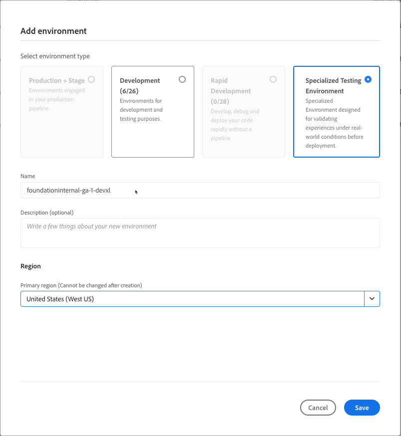

# 添加专门的测试环境{#add-special-test-enviro}

>[!NOTE]
>
>&#x200B;>本文中介绍的功能只能通过私人测试版计划获得。 要注册私密测试版，请参阅[专业测试环境](/help/implementing/cloud-manager/release-notes/current.md#specialized-test-environment)。

专业化测试环境（简称DevXL）是您可以创建的一种新型Cloud Manager环境。 它旨在支持高级用例，例如用户验收测试(UAT)和性能验证。 与传统开发、快速开发或暂存环境不同，DevXL环境在生产部署管道之外运行。 因此，它们为您提供了更大的灵活性，同时保持严格的隔离以防止对生产工作流的干扰。

DevXL旨在镜像典型暂存环境的大小、可扩展性和配置。 此方法确保在DevXL中执行的测试可以生成对代码和内容在类似生产的条件下的执行情况的真实洞察。 该环境还支持从生产或暂存环境直接复制内容。 在部署工作流、访问控制和网络配置方面，它还与开发环境保持同等地位。

## 主要功能和配置 {#key-features}

| 类别 | DevXL行为 |
| --- | --- |
| 用途 | UAT和性能测试。 |
| 管道类型 | 不在生产管道中。 |
| 环境大小 | 匹配暂存环境。 |
| 隔离 | 与其他环境完全隔离。 |
| 代码管道 | 与开发环境（验证、生成、部署）相同。 |
| 内容复制 | 从生产或暂存环境中允许。 |
| 内容恢复 | 与开发环境相同。 |
| 访问日志 | 与开发环境相同。 |
| Developer Console | 与开发环境相同。 |
| IP 允许列表 | 与开发环境相同。 |
| 联网 | 与开发环境相同（服务、域名、SSL证书、高级网络）。 |

另请参阅[管理环境](/help/implementing/cloud-manager/manage-environments.md)

## 添加专门的测试环境 {#add-specialized-testing-environment}

要添加或编辑环境，用户必须是&#x200B;**业务负责人**&#x200B;角色的成员。

**添加专用测试环境：**

1. 在 [my.cloudmanager.adobe.com](https://my.cloudmanager.adobe.com/) 登录 Cloud Manager 并选择适当的组织。

1. 在&#x200B;**[我的程序](/help/implementing/cloud-manager/navigation.md#my-programs)**&#x200B;控制台上，单击要为其添加环境的程序。

1. 执行下列操作之一：

   如果&#x200B;**添加环境**&#x200B;选项灰显（已禁用），则可能是由于缺少权限或依赖于许可资源。

   * 在&#x200B;**[我的程序](/help/implementing/cloud-manager/navigation.md#my-programs)**&#x200B;控制台的&#x200B;**环境**&#x200B;信息卡上，单击&#x200B;**添加环境**。

   

   * 在左侧面板上，单击 **环境**，然后在“环境”页面的右上角附近，单击&#x200B;**添加环境**。

     

1. 在&#x200B;**添加环境**&#x200B;对话框中，执行以下操作：

   * 单击&#x200B;**专用测试环境**。
   * 提供环境&#x200B;**名称**。 创建环境后，无法更改环境名称。
   * （可选）为环境提供&#x200B;**描述**。
   * 从下拉列表中选择&#x200B;**主区域**。 创建后，DevXL环境的主区域(例如&#x200B;*美国（美国西部）*)将被锁定且无法更改。

   

1. 单击&#x200B;**保存**。

   **概述**&#x200B;页面现在在&#x200B;**环境**&#x200B;信息卡中显示您的新环境。 现在可以为新环境设置管道。
