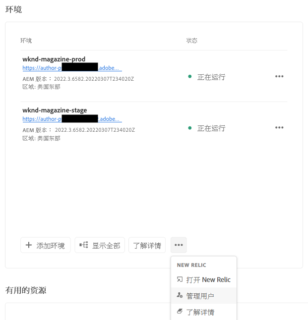
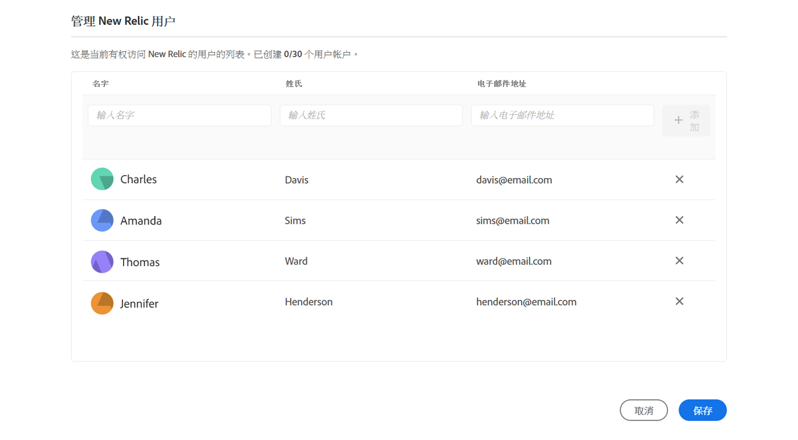
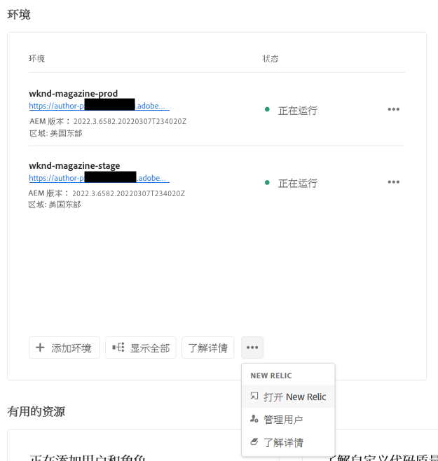

# 新遗迹一号 {#user-access}

了解用于AEMas a Cloud Service的New Relic One应用程序性能监控(APM)服务以及如何访问该服务。

## 简介 {#introduction}

Adobe非常重视应用程序的监控、可用性和性能。 AEMas a Cloud Service提供对自定义New Relic One监视包的访问，这是标准产品产品的一部分，可确保您的团队能够最大程度地查看您的AEMas a Cloud Service系统和环境性能量度。

本文档介绍如何管理对在AEMas a Cloud Service环境中启用的New Relic One应用程序性能监控(APM)功能的访问，以帮助支持性能并让您充分利用AEMas a Cloud Service。

创建新生产程序后，将自动创建与您的AEMas a Cloud Service程序关联的New Relic One子帐户。

## 功能 {#transaction-monitoring}

New Relic One APM for AEMas a Cloud Service具有许多功能。

* 直接访问专用的New Relic One帐户(由Adobe支持管理的访问)

* 分析New Relic One APM代理，它显示具有行号的精确方法调用，包括外部依赖关系和数据库

* 通过将基础架构级别监控和应用程序(Adobe Experience Manager)监控中的关键量度整合在一起，实现整体性能优化

* 直接在“新旧物分析”量度中显示AEMas a Cloud ServiceJMX Mbeans和运行状况检查，从而可以深入检查应用程序堆栈性能和运行状况量度。

## 管理New Relic One用户 {#manage-users}

按照以下步骤定义与您的AEMas a Cloud Service计划关联的New Relic One子帐户的用户。

>[!NOTE]
>
>中的用户 **业务所有者** 或 **部署管理器** 必须登录角色才能管理New Relic One用户。

1. 在 [my.cloudmanager.adobe.com](https://my.cloudmanager.adobe.com/) 登录 Cloud Manager 并选择适当的组织。

1. 单击要管理New Relic One用户的程序。

1. 在 **环境** 在项目概述页面上，单击省略号按钮并选择 **管理用户**.

   

   * 您还可以访问 **管理用户** 选项 **环境** 屏幕。

1. 在 **管理新旧版用户** 对话框中，输入要添加的用户的名字和姓氏，然后单击 **添加** 按钮。 对要添加的所有用户重复此步骤。

   

1. 要删除New Relic One用户，请单击表示用户的行右端的删除按钮。

1. 单击 **保存** 创建用户。

定义用户后，New Relic会向您授予其访问权限的每个用户发送确认电子邮件，以便用户完成设置过程并登录。

>[!NOTE]
>
>如果您管理New Relic One用户，则还必须将您自己添加为用户，才能也拥有访问权限。 作为 **业务所有者** 或 **部署管理器** 不足以访问New Relic One。 您还必须将自己创建为用户。

## 激活您的新Relic One用户帐户 {#activate-account}

创建新Relic One用户帐户后，如预览部分所述 [管理New Relic One用户](#manage-users), New Relic会向这些用户发送一封确认电子邮件至提供的地址。 要使用这些帐户，用户必须首先通过重置密码来激活其使用New Relic的帐户。

请按照以下步骤激活您作为New Relic用户的帐户。

1. 单击New Relic电子邮件中提供的链接。 这会打开您浏览器到New Relic登录页面。

1. 在“New Relic”登录页面上，选择 **忘记密码了？**.

   

1. 输入您收到确认电子邮件的电子邮件地址，然后选择 **发送我的重置链接**.

   

1. New Relic将向您发送一封包含确认帐户链接的电子邮件。

如果您没有收到New Relic发来的确认电子邮件，请参阅 [疑难解答部分。](#troubshooting)

## 访问New Relic One {#accessing-new-relic}

一旦 [激活了你的新旧账户，](#activate-account) 您可以通过Cloud Manager或直接访问New Relic One。

要通过Cloud Manager访问New Relic One，请执行以下操作：

1. 在 [my.cloudmanager.adobe.com](https://my.cloudmanager.adobe.com/) 登录 Cloud Manager 并选择适当的组织。

1. 单击要访问New Relic One的程序。

1. 在 **环境** 在项目概述页面上，单击省略号按钮并选择 **打开新文物**.

   

   * 您还可以通过位于 **环境** 屏幕。

1. 在打开的新浏览器选项卡中，登录到New Relic One。

要直接访问New Relic One，请执行以下操作：

1. 导航到New Relic的登录页面： [`https://login.newrelic.com/login`](https://login.newrelic.com/login)

1. 登录到新文物一号。

### 验证电子邮件 {#verify-email}

如果在登录New Relic One期间要求您验证电子邮件，则表示您的电子邮件与多个帐户关联。 这允许您选择要访问的帐户。

如果您未验证您的电子邮件地址，New Relic将尝试使用与您的电子邮件地址关联的最近创建的用户记录登录。 要避免在每次登录期间验证您的电子邮件，请单击 **记住我** 复选框。

如需更多帮助，请通过 [AEM支持门户](https://helpx.adobe.com/cn/enterprise/using/support-for-experience-cloud.html).

## New Relic One Access疑难解答 {#troubleshooting}

如果您是作为New Relic One用户添加的，如 [管理New Relic One用户](#manage-users) 且找不到原始帐户确认电子邮件时，请按照以下步骤操作。

1. 导航到New Relic的登录页面： [`login.newrelic.com/login`](https://login.newrelic.com/login).

1. 选择 **忘记密码了？**.

   

1. 输入用于创建帐户的电子邮件地址，然后选择 **发送我的重置链接**.

   

1. New Relic将向您发送一封包含确认帐户链接的电子邮件。

如果您完成注册过程，并且由于电子邮件或密码错误消息而无法登录帐户，请通过 [Admin Console。](https://adminconsole.adobe.com/)

如果您没有收到New Relic发送的电子邮件：

* 检查 [垃圾过滤器](https://docs.newrelic.com/docs/accounts/accounts-billing/account-setup/create-your-new-relic-account/).
* 如果适用， [将新旧内容添加到电子邮件允许列表](https://docs.newrelic.com/docs/accounts/accounts/account-maintenance/account-email-settings/#email-whitelist).
* 如果这两个建议都不有帮助，请提供有关支持票证的反馈，Adobe支持团队将进一步帮助您。

## 限制 {#limitations}

以下限制适用于将用户添加到New Relic One:

* 最多可添加25个用户。 如果已达到最大用户数，请删除用户以便能够添加新用户。
* 添加到New Relic的用户类型为 **受限** 请参阅 [有关详细信息，请参阅New Relic文档。](https://docs.newrelic.com/docs/accounts/original-accounts-billing/original-users-roles/users-roles-original-user-model/#:~:text=In%20general%2C%20Admins%20take%20responsibility,Restricted%20Users%20can%20use%20them.&amp;text=One%20或%20more%20pindules%20who，更改)%20any%20New%20Relic%20features。)
* AEM as a Cloud Service仅提供New Relic One APM解决方案，不支持警报、日志记录或API集成。

要获取有关New Relic One产品的AEMas a Cloud Service计划的更多帮助或其他指导，请通过 [AEM支持门户](https://helpx.adobe.com/enterprise/using/support-for-experience-cloud.html).

## 关于新文物一号的常见问题 {#faqs}

### Adobe用New Relic One监视什么？ {#adobe-monitor}

Adobe通过New Relic One的Java插件监控AEMas a Cloud Service的创作、发布和预览（如果可用）服务。 Adobe支持跨非生产和生产AEMas a Cloud Service环境的自定义New Relic One APM遥测和监控。

您的New Relic One帐户已附加到由Adobe维护的主帐户，并有多个应用程序报告到该帐户中：每个AEMas a Cloud Service环境3个。

* 每个环境有一个用于创作服务的应用程序
* 每个环境（包括Golden Publish）有一个用于发布服务的应用程序
* 每个环境有一个用于预览服务的应用程序

请注意：

* 每个应用程序都使用一个许可证密钥。
* AEMas a Cloud Service环境仅报告给一个New Relic One帐户。
* New Relic One的完整监控量度和事件将保留7天。

### 谁可以访问New Relic One云服务数据？ {#access-new-relic-cloud}

您团队的成员最多可以获得10个的完全读取访问权限。 读取访问将包括New Relic One代理收集的所有APM量度。

### 是否支持自定义SSO配置？ {#custom-sso}

由Adobe设置的New Relic One帐户不支持自定义SSO配置。

### 如果我已经拥有内部New Relic订购，该怎么办？ {#new-relic-subscription}

New Relic One是New Relic的新可观测平台，它使Adobe支持和您的团队能够在一个位置观察、监控和查看量度和事件。

New Relic One使用户能够在他们有权访问的所有帐户中进行搜索，并在一个视图中显示所有服务和主机的数据。

虽然Adobe支持将使用New Relic One和其他内部工具监控AEMas a Cloud Service应用程序作为服务的一部分，但您的团队可以继续利用New Relic进行本地托管服务和基础架构。 他们将能够将AdobeNew Relic One帐户和客户管理的New Relic帐户中的数据可视化。

>[!NOTE]
>
>要在New Relic One中查看两个数据集，用户必须拥有正确的权限，并对两个帐户(AdobeNew Relic One和客户管理的New Relic帐户)使用相同的登录方法。
