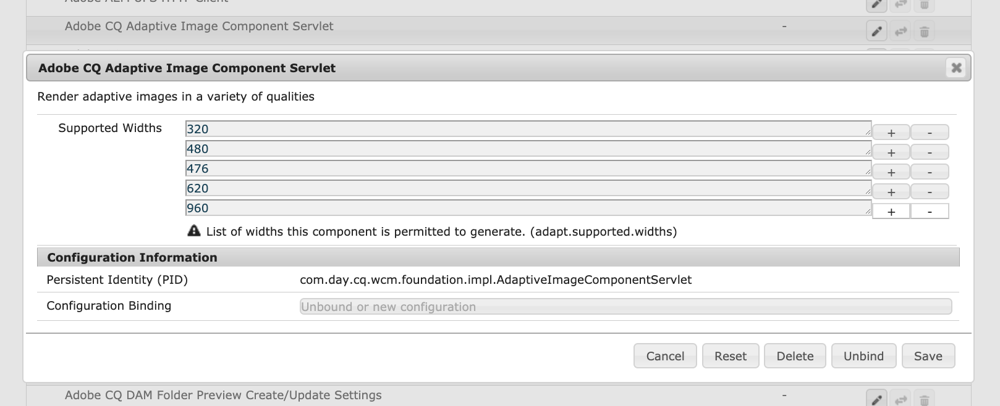

# 将Adobe Experience Manager的OSGi配置为Cloud Service{#configuring-osgi-for-aem-as-a-cloud-service}

[OSG](https://www.osgi.org/) 是Adobe Experience Manager(AEM)技术堆栈中的一个基本元素。它用于控制AEM的复合束及其配置。

OSGi提供标准化基元，允许从小的、可重用的和协作的组件构建应用程序。 这些组件可以组成应用程序并进行部署。 这允许轻松管理OSGi包，因为可以单独停止、安装和启动它们。 互依关系将自动处理。 每个OSGi组件都包含在各种包中的一个。 有关详细信息，请参阅[OSGi规范](https://www.osgi.org/Specifications/HomePage)。

您可以通过AEM代码项目中的配置文件管理OSGi组件的配置设置。

## OSGi配置文件{#osgi-configuration-files}

配置更改在AEM Project的代码包(`ui.apps`)中定义为运行模式特定配置文件夹下的配置文件(`.cfg.json`):

`/apps/example/config.<runmode>`

OSGi配置文件的格式基于JSON，使用Apache Sling项目定义的`.cfg.json`格式。

OSGi通过其永久标识(PID)配置目标OSGi组件，该标识默认为OSGi组件的Java™类名。 例如，为通过以下方式实现的OSGi服务提供OSGi配置：

`com.example.workflow.impl.ApprovalWorkflow.java`

OSGi配置文件在以下位置定义：

`/apps/example/config/com.example.workflow.impl.ApprovalWorkflow.cfg.json`

遵循cfg.json OSGi配置格式。

>[!NOTE]
>
>先前版本的AEM支持使用不同文件格式（如.cfg.、.config和XML sling:OsgiConfig资源定义）的OSGi配置文件。 这些格式已由cfg.json OSGi配置格式取代。

## 运行模式分辨率{#runmode-resolution}

使用运行模式可以将特定OSGi配置定向到特定AEM实例。 要使用运行模式，请在`/apps/example`（其中您的项目名称为示例）下创建配置文件夹，格式为：

`/apps/example/config.<author|publish>.<dev|stage|prod>/`

如果配置文件夹名称中定义的运行模式与AEM使用的运行模式匹配，则会使用此类文件夹中的任何OSGi配置。

例如，如果AEM使用运行模式作者和开发，则应用`/apps/example/config.author/`和`/apps/example/config.author.dev/`中的配置节点，而不应用`/apps/example/config.publish/`和`/apps/example/config.author.stage/`中的配置节点。

如果同一PID的多个配置适用，则应用具有最多匹配运行模式数的配置。

此规则的粒度在PID级别。 这意味着您不能为`/apps/example/config.author/`中的同一PID定义某些属性，而为同一PID定义`/apps/example/config.author.dev/`中的更多特定属性。 匹配运行模式数目最多的配置对整个PID是有效的。

在本地开发时，可以传入运行模式启动参数以指定使用哪种运行模式OSGI配置。

## OSGi配置值{#types-of-osgi-configuration-values}的类型

有三种OSGi配置值可与Adobe Experience Manager一起用作Cloud Service。

1. **内联值**，即硬编码到OSGi配置并以Git存储的值。例如：

   ```json
   {
      "connection.timeout": 1000
   }
   ```

1. **机密值**，即出于安全原因不能存储在Git中的值。例如：

   ```json
   {
   "api-key": "$[secret:server-api-key]"
   } 
   ```

1. **特定于环境的值**，这些值是不同于开发环境的值，因此无法按运行模式准确定位(因为Adobe Experience Manager作 `dev` 为Cloud Service存在单个运行模式)。例如：

   ```json
   {
    "url": "$[env:server-url]"
   }
   ```

   请注意，单个OSGi配置文件可以结合使用这些配置值类型的任意组合。 例如：

   ```json
   {
   "connection.timeout": 1000,
   "api-key": "$[secret:server-api-key]",
   "url": "$[env:server-url]"
   }
   ```

## 如何选择适当的OSGi配置值类型{#how-to-choose-the-appropriate-osgi-configuration-value-type}

OSGi的常见情况使用内联OSGi配置值。 特定于环境的配置仅用于开发环境之间值不同的特定用例。


特定于环境的配置扩展了包含内联值的传统静态定义OSGi配置，从而提供了通过Cloud Manager API在外部管理OSGi配置值的能力。 必须了解何时应使用定义内联值并将其存储在Git中的常见和传统方法，而不是将这些值抽象为特定于环境的配置。

以下指导说明何时使用非机密和机密环境特定配置：

### 何时使用内联配置值{#when-to-use-inline-configuration-values}

内联配置值被视为标准方法，应尽可能使用。 内嵌配置提供以下优势：

* 维护这些组件，并在Git中提供管理和版本历史记录
* 值隐式绑定到代码部署
* 它们不需要任何额外的部署考虑或协调

只要定义OSGi配置值，就使用内联值进行开始，并且只在用例需要时选择机密或特定于环境的配置。

### 何时使用非机密环境特定配置值{#when-to-use-non-secret-environment-specific-configuration-values}

当值在开发环境中不同时，仅对非机密配置值使用特定于环境的配置(`$[env:ENV_VAR_NAME]`)。 这包括本地开发实例和作为Cloud Service开发环境的任何Adobe Experience Manager。 避免将非机密环境特定配置用于Adobe Experience Manager作为Cloud Service阶段或生产环境。

* 只对不同开发环境（包括本地开发实例）的配置值使用非机密环境特定配置。
* 请改用舞台和生产非机密值的OSGi配置中的标准内联值。 因此，不建议使用特定于环境的配置以便于在运行时更改舞台和生产环境的配置；这些更改应通过源代码管理引入。

### 何时使用特定于机密环境的配置值{#when-to-use-secret-environment-specific-configuration-values}

Adobe Experience Manager作为Cloud Service，要求对任何机密OSGi配置值（如口令、专用API密钥或出于安全原因无法存储在Git中的任何其他值）使用环境特定配置(`$[secret:SECRET_VAR_NAME]`)。

使用特定于机密环境的配置将所有Adobe Experience Manager上的机密值存储为Cloud Service环境，包括舞台和生产。

## 创建OSGi配置{#creating-sogi-configurations}

有两种创建OSGi配置的方法，如下所述。 前一种方法通常用于配置自定义OSGi组件，这些组件具有开发人员所熟知的OSGi属性和值，后一种方法用于AEM提供的OSGi组件。

### 写入OSGi配置{#writing-osgi-configurations}

JSON格式的OSGi配置文件可以直接在AEM项目中手工编写。 这通常是为知名OSGi组件创建OSGi配置的最快捷方式，尤其是由定义这些配置的同一开发人员设计和开发的自定义OSGi组件。 此方法还可用于跨不同运行模式文件夹复制/粘贴和更新同一OSGi组件的配置。

1. 在IDE中，打开`ui.apps`项目，找到或创建配置文件夹(`/apps/.../config.<runmode>`)，该文件夹目标新OSGi配置需要生效的运行模式
1. 在此配置文件夹中，新建一个`<PID>.cfg.json`文件。 PID是OSGi组件的永久标识，通常是OSGi组件实现的全类名。 例如：
   `/apps/.../config/com.example.workflow.impl.ApprovalWorkflow.cfg.json`
请注意，OSGi配置工厂文件名使用命 `<PID>-<factory-name>.cfg.json` 名约定
1. 打开新的`.cfg.json`文件，然后按照[JSON OSGi配置格式](https://sling.apache.org/documentation/bundles/configuration-installer-factory.html#configuration-files-cfgjson-1)定义OSGi属性和值对的键/值组合。
1. 保存对新`.cfg.json`文件所做的更改
1. 将新OSGi配置文件添加并提交到Git

### 使用AEM SDK快速启动{#generating-osgi-configurations-using-the-aem-sdk-quickstart}生成OSGi配置

AEM SDK Quickstart Jar的AEM Web Console可用于配置OSGi组件，以及将OSGi配置导出为JSON。 这对于配置AEM提供的OSGi组件很有用，这些组件的OSGi属性及其值格式可能无法由在AEM项目中定义OSGi配置的开发人员很好地理解。

>[!NOTE]
>
>AEM Web控制台的配置UI会将`.cfg.json`文件写入存储库。 因此，请注意这一点，以避免在AEM项目定义的OSGi配置可能与生成的配置不同时在本地开发期间出现潜在的意外行为。

1. 以管理员用户身份登录到AEM SDK Quickstart Jar的AEM Web控制台
1. 导航到OSGi >配置
1. 要进行配置，请找到OSGi组件并点按其标题进行编辑
   
1. 根据需要通过Web UI编辑OSGi配置属性值
1. 将永久标识(PID)记录到安全位置。 稍后将用于生成OSGi配置JSON
1. 点按保存
1. 导航到OSGi > OSGi Installer Configuration Printer
1. 粘贴到步骤5中复制的PID中，确保将序列化格式设置为“OSGi Configurator JSON”
1. 点按打印
1. JSON格式的OSGi配置将显示在序列化配置属性部分
   
1. 在IDE中，打开`ui.apps`项目，找到或创建配置文件夹(`/apps/.../config.<runmode>`)，该文件夹目标新OSGi配置需要生效的运行模式。
1. 在此配置文件夹中，新建一个`<PID>.cfg.json`文件。 PID与步骤5中的值相同。
1. 将步骤10中的序列化配置属性粘贴到`.cfg.json`文件中。
1. 保存对新`.cfg.json`文件所做的更改。
1. 将新OSGi配置文件添加并提交到Git。


## OSGi配置属性格式{#osgi-configuration-property-formats}

### 内联值{#inline-values}

内联值按照标准JSON语法以标准名称 — 值对格式设置。 例如：

```json
{
   "my_var1": "val",
   "my_var2": [ "abc", "def" ],
   "my_var3": 500
}
```

### 环境特定配置值{#environment-specific-configuration-values}

OSGi配置应为要根据环境定义的变量分配一个占位符：

```
use $[env:ENV_VAR_NAME]
```

客户只应将此技术用于与其自定义代码相关的OSGI配置属性；它不能用于覆盖Adobe定义的OSGI配置。

>[!NOTE]
>
>占位符不能用在[repoint语句](/help/implementing/deploying/overview.md#repoinit)中。

### 密钥配置值{#secret-configuration-values}

OSGi配置应为要根据环境定义的机密分配一个占位符：

```
use $[secret:SECRET_VAR_NAME]
```

### 变量命名{#variable-naming}

以下内容适用于环境特定配置值和机密配置值。

变量名称必须遵循以下规则：

* 最小长度：2
* 最大长度：100
* 必须匹配正则表达式：`[a-zA-Z_][a-zA-Z_0-9]*`

变量的值不能超过2048个字符。

### 默认值 {#default-values}

以下内容适用于环境特定配置值和机密配置值。

如果未设置每个环境的值，则在运行时不替换占位符，并保留原位，因为未发生插值。 要避免这种情况，可以使用以下语法将默认值作为占位符的一部分提供：

```
$[env:ENV_VAR_NAME;default=<value>]
```

如果提供了默认值，则占位符将替换为每环境值（如果提供）或提供的默认值。

### 本地开发{#local-development}

以下内容适用于环境特定配置值和机密配置值。

变量可以在本地环境中定义，以便在运行时由本地AEM拾取。 例如，在Linux®上：

```bash
export ENV_VAR_NAME=my_value
```

建议编写一个简单的bash脚本，该脚本设置配置中使用的环境变量，并在启动AEM之前执行它。 [https://direnv.net/](https://direnv.net/)等工具有助于简化此方法。 根据值的类型，如果可以在每个人之间共享，则可以将这些值签入源代码管理。

从文件读取机密值。 因此，对于每个使用机密的占位符，必须创建包含机密值的文本文件。

例如，如果使用`$[secret:server_password]`，则必须创建名为&#x200B;**server_password**&#x200B;的文本文件。 所有这些机密文件必须存储在同一目录中，并且框架属性`org.apache.felix.configadmin.plugin.interpolation.secretsdir`必须配置为该本地目录。

### 作者配置与发布配置{#author-vs-publish-configuration}

如果OSGI属性要求创作值和发布值不同：

* 必须使用单独的`config.author`和`config.publish` OSGi文件夹，如[运行模式分辨率部分](#runmode-resolution)中所述。
* 应使用独立变量名称。 建议使用变量名称相同的前缀，如`author_<variablename>`和`publish_<variablename>`

### 配置示例{#configuration-examples}

在以下示例中，假定除了舞台和prod环境之外，还有三个开发环境。

**示例1**

其目的是使OSGI属性`my_var1`的值对于舞台和产品相同，但对于三个开发环境中的每个属性都不同。

<table>
<tr>
<td>
<b>文件夹</b>
</td>
<td>
<b>myfile.cfg.json的内容</b>
</td>
</tr>
<tr>
<td>
config
</td>
<td>
<pre>
{ 
 "my_var1":"val",
 "my_var2":“abc”，
 "my_var3":500
}
</pre>
</td>
</tr>
<tr>
<td>
config.dev
</td>
<td>
<pre>
{ 
 "my_var1":"$[env:my_var1]"
 "my_var2":“abc”，
 "my_var3":500
}
</pre>
</td>
</tr>
</table>

**示例2**

其目的是使OSGI属性`my_var1`的值对于舞台、prod和三个开发环境中的每个不同。 因此，必须调用Cloud Manager API来为每个开发环境设置`my_var1`的值。

<table>
<tr>
<td>
<b>文件夹</b>
</td>
<td>
<b>myfile.cfg.json的内容</b>
</td>
</tr>
<tr>
<td>
config.stage
</td>
<td>
<pre>
{ 
 "my_var1":"val1",
 "my_var2":“abc”，
 "my_var3":500
}
</pre>
</td>
</tr>
<tr>
<td>
config.prod
</td>
<td>
<pre>
{ 
 "my_var1":"val2",
 "my_var2":“abc”，
 "my_var3":500
}
</pre>
</td>
</tr>
<tr>
<td>
config.dev
</td>
<td>
<pre>
{ 
 "my_var1":"$[env:my_var1]"
 "my_var2":“abc”，
 "my_var3":500
}
</pre>
</td>
</tr>
</table>

**示例3**

其目的是使OSGi属性`my_var1`的值对于舞台、生产和只对其中一个开发环境相同，但对于其他两个开发环境不同。 在这种情况下，必须调用Cloud Manager API以为每个开发环境设置`my_var1`的值，包括应与舞台和生产具有相同值的开发环境的值。 它不会继承文件夹&#x200B;**config**&#x200B;中设置的值。

<table>
<tr>
<td>
<b>文件夹</b>
</td>
<td>
<b>myfile.cfg.json的内容</b>
</td>
</tr>
<tr>
<td>
config
</td>
<td>
<pre>
{ 
 "my_var1":"val1",
 "my_var2":“abc”，
 "my_var3":500
}
</pre>
</td>
</tr>
<tr>
<td>
config.dev
</td>
<td>
<pre>
{ 
 "my_var1":"$[env:my_var1]"
 "my_var2":“abc”，
 "my_var3":500
}
</pre>
</td>
</tr>
</table>

实现此目的的另一种方法是为config.dev文件夹中的替换令牌设置默认值，使其与&#x200B;**config**&#x200B;文件夹中的值相同。

<table>
<tr>
<td>
<b>文件夹</b>
</td>
<td>
<b>myfile.cfg.json的内容</b>
</td>
</tr>
<tr>
<td>
config
</td>
<td>
<pre>
{ 
 "my_var1":"val1",
 "my_var2":“abc”，
 "my_var3":500
}
</pre>
</td>
</tr>
<tr>
<td>
config.dev
</td>
<td>
<pre>
{ 
 "my_var1":"$[env:my_var1;default=val1]"
 "my_var2":“abc”，
 "my_var3":500
}
</pre>
</td>
</tr>
</table>

## 用于设置属性{#cloud-manager-api-format-for-setting-properties}的Cloud Manager API格式

请参阅[此页](https://www.adobe.io/apis/experiencecloud/cloud-manager/docs.html#!AdobeDocs/cloudmanager-api-docs/master/create-api-integration.md)，了解如何配置API。
>[!NOTE]
>
>确保已使用的云管理器API已分配角色“部署管理器 — Cloud Service”。 其他角色无法执行以下所有命令。

### 通过API {#setting-values-via-api}设置值

调用API会将新变量和值部署到云环境，类似于典型的客户代码部署渠道。 创作和发布服务将重新启动并引用新值，通常需要几分钟时间。

```
PATCH /program/{programId}/environment/{environmentId}/variables
```

```
]
        {
                "name" : "MY_VAR1",
                "value" : "plaintext value",
                "type" : "string"  <---default
        },
        {
                "name" : "MY_VAR2",
                "value" : "<secret value>",
                "type" : "secretString"
        }
]
```

>[!NOTE]
>默认变量不是通过API设置的，而是在OSGi属性本身中设置的。
>
>有关详细信息，请参阅[此页](https://www.adobe.io/apis/experiencecloud/cloud-manager/api-reference.html#/Environment_Variables/patchEnvironmentVariables)。

### 通过API {#getting-values-via-api}获取值

```
GET /program/{programId}/environment/{environmentId}/variables
```

有关详细信息，请参阅[此页](https://www.adobe.io/apis/experiencecloud/cloud-manager/api-reference.html#/Environment_Variables/getEnvironmentVariables)。

### 通过API {#deleting-values-via-api}删除值

```
PATCH /program/{programId}/environment/{environmentId}/variables
```

要删除变量，请将其包含为空值。

有关详细信息，请参阅[此页](https://www.adobe.io/apis/experiencecloud/cloud-manager/api-reference.html#/Environment_Variables/patchEnvironmentVariables)。

### 通过命令行{#getting-values-via-cli}获取值

```bash
$ aio cloudmanager:list-environment-variables ENVIRONMENT_ID
Name     Type         Value
MY_VAR1  string       plaintext value 
MY_VAR2  secretString ****
```


### 通过命令行{#setting-values-via-cli}设置值

```bash
$ aio cloudmanager:set-environment-variables ENVIRONMENT_ID --variable MY_VAR1 "plaintext value" --secret MY_VAR2 "some secret value"
```

### 通过命令行{#deleting-values-via-cli}删除值

```bash
$ aio cloudmanager:set-environment-variables ENVIRONMENT_ID --delete MY_VAR1 MY_VAR2
```

>[!NOTE]
>
>有关如何使用Adobe I/O CLI的Cloud Manager插件配置值的详细信息，请参阅[此页](https://github.com/adobe/aio-cli-plugin-cloudmanager#aio-cloudmanagerset-environment-variables-environmentid)。

### 变量数{#number-of-variables}

每个环境最多可声明200个变量。

## 特定于机密和环境的配置值{#deployment-considerations-for-secret-and-environment-specific-configuration-values}的部署注意事项

由于特定于机密和环境的配置值位于Git之外，因此作为Cloud Service部署机制，客户不是正式Adobe Experience Manager的一部分，因此客户应作为Cloud Service部署流程管理、管理并集成到Adobe Experience Manager中。

如上所述，调用API会将新变量和值部署到云环境，类似于典型的客户代码部署渠道。 创作和发布服务将重新启动并引用新值，通常需要几分钟时间。 请注意，在此过程中，Cloud Manager在常规代码部署期间执行的质量门和测试不会执行。

通常，客户会先调用API设置环境变量，然后再在Cloud Manager中部署依赖于它们的代码。 在某些情况下，在已部署代码后，您可能希望修改现有变量。

>[!NOTE]
>
>当管道(AEM更新或客户部署)正在使用时，API可能无法成功，具体取决于当时正在执行端到端管道的哪部分。 错误响应将指示请求未成功，但不会指示具体原因。

在某些情况下，计划客户代码部署依赖现有变量来生成新值，这与当前代码不符。 如果您担心此问题，建议以附加方式修改变量。 为此，请创建新变量名，而不是只更改旧变量的值，这样旧代码就不会引用新值。 然后，当新客户版本看起来稳定时，您可以选择删除旧值。

同样，由于变量的值未进行版本控制，因此回滚代码可能会导致引用导致问题的较新值。 前面提到的附加变量策略也有助于实现。

此附加变量策略对于灾难恢复方案也很有用，在这些情况下，如果需要重新部署前几天的代码，则其引用的变量名称和值仍将保持不变。 这取决于一种策略，即客户在删除那些较旧的变量前等待几天，否则较旧的代码将没有适当的变量可供引用。
