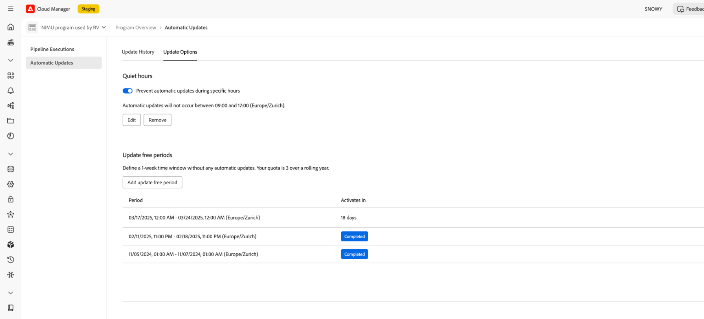

# 无讯息小时数和更新空闲时段 {#quiet-hours-update-free-periods}

>[!NOTE]
>此功能将从9月25日起作为&#x200B;**有限可用性**&#x200B;功能提供。 请发送电子邮件至[aemcs-update-free@adobe.com](mailto:aemcs-update-free@adobe.com)，在您的程序上激活该功能。

>[!WARNING]
>只有在您加入[自动维护更新](/help/implementing/deploying/aem-version-updates.md)后，才能使用“免打扰时间”和“更新空闲时段”功能。

AEM as a Cloud Service [自动维护更新](/help/implementing/deploying/aem-version-updates.md)确保您的实例保持安全，并且使用最新维护版本保持最新。 话虽如此，在某些情况下（如上线活动），您可能需要“保护”这些关键的工作时间免受任何潜在干扰。 因此，AEM as a Cloud Service提供了设置时间范围的选项，在此时间范围内，正在进行的程序将不会发生自动更新。

您可以使用两个计划选项配置这些时间范围：

* **无讯息小时数** — 您可以定义不会发生更新的每日时间间隔（最多8小时）。
* **更新空闲时段** — 您可以定义一个不会发生更新的7天时段。 在12个月的时间范围内，您最多可以有三个更新空闲时段。

更新空闲时段和免打扰时间功能是按“每个程序”配置的。

此外，有关计划的AEM as a Cloud Service自动维护期间的信息，请参阅[Experience Manager版本路线图](https://experienceleague.adobe.com/zh-hans/docs/experience-manager-release-information/aem-release-updates/update-releases-roadmap)页面。

## 安静时间 {#quiet-hours}

通过使用“安静时间”功能，您可以定义一天中的时间窗口，而无需任何自动更新。 所有维护更新都将发生转移，以超出配置的时间范围。 例如，如果在您指定的免打扰时间内计划了更新，则该更新将在免打扰小时间隔结束后自动启动。 配置的时间间隔不能超过8小时，因此仍然可以每天进行更新。

您可以使用本地时区为每个程序&#x200B;**定义这些无讯息小时数**。

### 如何配置免打扰时间间隔 {#configure-quiet-hours}

可以使用AEM Cloud Manager界面配置安静时间间隔，如下所示：

转到&#x200B;**活动>自动更新>更新选项**。

1. 确保已切换&#x200B;**阻止在特定时间自动更新**&#x200B;选项。
2. 单击&#x200B;**编辑**。
3. 在配置窗口中设置免打扰时间间隔。

设置后，您指定的开始和结束小时将应用于前进的每个日历日。 您可以根据需要禁用或重新配置免打扰时间值。

## 更新可用期间 {#update-free-periods}

通过使用更新空闲时段功能，您可以定义一个不进行更新的7天时间范围。 配置完毕后，所有维护更新将自动转移，在定义的时间范围之外发生。 在12个月的间隔内，最多可以有三个更新空闲时段。 此外，更新自由期间最多可提前一年指定。

在配置此选项时，请记住，为了便于自动更新，时间段之间（至少）必须有一周的时间间隔。 因此，这一周的时间间隔将自动强制执行，并将在您配置的更新空闲时段之间添加到日历中。 这可能会导致某些日历日期无法供选择。

您可以为每个程序&#x200B;**定义更新空闲时段**。

### 如何配置更新空闲时段 {#configure-update-free-periods}

可以使用AEM Cloud Manager界面配置更新自由时段功能，如下所示：

转到&#x200B;**活动>自动更新>更新选项**。

1. 转到更新空闲时段部分。
2. 单击&#x200B;**添加更新可用时段**。
3. 从日历中选择一周的更新空闲时段。

当前活动的更新可用时段附近将显示&#x200B;**活动**&#x200B;图标，而已完成的更新可用时段附近将显示&#x200B;**完成**&#x200B;图标。
