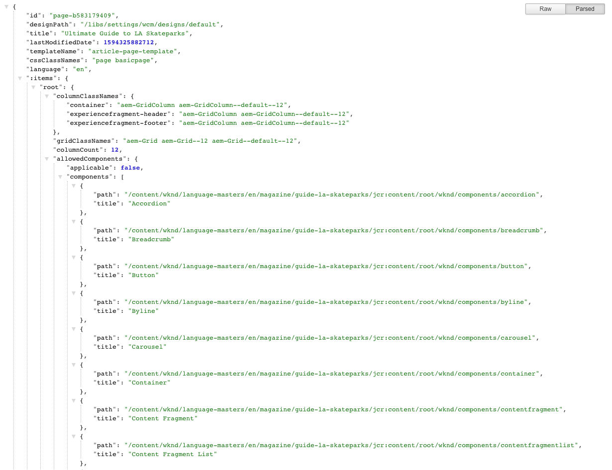

# 内容服务的JSON导出程序{#json-exporter-for-content-services}

AEM内容服务旨在将AEM中/从Content Services交付的内容的描述和交付推广到网页焦点之外。

它们使用可供任何客户使用的标准化方法，将内容交付到非传统AEM网页的渠道。 这些渠道可以包括：

* 单页应用程序
* 本机移动设备应用程序
* AEM外部的其他渠道和接触点

对于使用结构化内容的内容片段，您可以使用JSON导出程序以JSON数据模型格式交付(y)AEM页面的内容，从而提供内容服务。 然后，您自己的应用程序就可以使用此功能。

## 包含内容片段核心组件{#json-exporter-with-content-fragment-core-components}的JSON导出程序

使用AEM JSON导出程序，您可以以JSON数据模型格式交付(y)AEM页面的内容。 然后，您自己的应用程序就可以使用此功能。

在AEM中，使用选择器`model`和`.json`扩展来实现投放。

`.model.json`

1. 例如，URL，如：

   ```shell
   http://localhost:4502/content/wknd/language-masters/en/magazine/guide-la-skateparks.model.json
   ```

1. 将提供以下内容：

   

您也可以通过专门定位结构化内容片段来交付其内容。

使用片段的整个路径（通过`jcr:content`）完成此操作；例如，带有后缀（如）。

`.../jcr:content/root/container/container/contentfragment.model.json`

您的页面可以包含一个内容片段或多种类型的多个组件。 您还可以使用列表组件等机制自动搜索相关内容。

* 例如，URL，如：

   ```shell
   http://localhost:4502/content/wknd/language-masters/en/magazine/guide-la-skateparks/jcr:content/root/container/container/contentfragment.model.json
   ```

* 将提供以下内容：

   

   >[!NOTE]
   >
   >您可以[调整您自己的组件](enabling-json-exporter.md)以访问和使用此数据。

   >[!NOTE]
   >
   >虽然不是标准实施，但支持[多个选择器，](enabling-json-exporter.md#multiple-selectors)但`model`必须是第一个选择器。

### 更多信息 {#further-information}

另请参阅：

* 资产 HTTP API
   * [资产 HTTP API](/help/assets/developer-reference-material-apis.md)
* Sling 模型:
   * [Sling模型 — 自130年起将模型类与资源类型关联](https://sling.apache.org/documentation/bundles/models.html#associating-a-model-class-with-a-resource-type-since-130)
* 包含JSON的AEM:
   * [为组件启用JSON导出](enabling-json-exporter.md)

## 相关文档{#related-documentation}

有关更多详细信息，请参阅：

* [Assets用户指南中的内容片段](/help/assets/content-fragments/content-fragments.md)
* [内容片段模型](/help/assets/content-fragments/content-fragments-models.md)
* [使用内容片段创作](/help/sites-cloud/authoring/fundamentals/content-fragments.md)
* [核心](https://docs.adobe.com/content/help/zh-Hans/experience-manager-core-components/using/introduction.html) 组件和内容 [片段组件](https://docs.adobe.com/content/help/zh-Hans/experience-manager-core-components/using/components/content-fragment-component.html)
