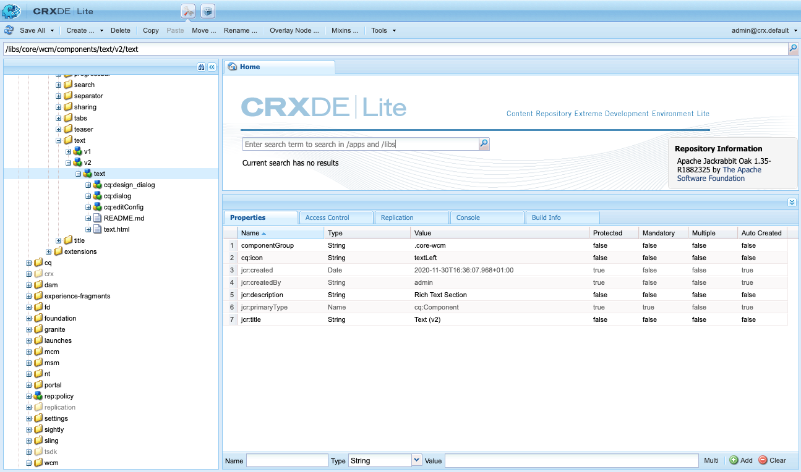

# 组件参考指南 {#components-reference-guide}

组件是在AEM中构建体验的核心。 使用[核心组件](https://experienceleague.adobe.com/docs/experience-manager-core-components/using/introduction.html?lang=zh-hans)和[AEM项目原型](https://experienceleague.adobe.com/docs/experience-manager-core-components/using/developing/archetype/overview.html)，可以轻松开始使用一组现成的可靠组件。 [WKND教程](/help/implementing/developing/introduction/develop-wknd-tutorial.md)将指导开发人员了解如何使用这些工具以及如何构建自定义组件来创建AEM站点。

>[!TIP]
>
>在引用此文档之前，请确保您已完成[WKND教程](/help/implementing/developing/introduction/develop-wknd-tutorial.md)，并因此熟悉[核心组件](https://experienceleague.adobe.com/docs/experience-manager-core-components/using/introduction.html?lang=zh-Hans)和[AEM项目原型](https://experienceleague.adobe.com/docs/experience-manager-core-components/using/developing/archetype/overview.html)。

由于WKND教程涵盖了大多数用例，因此，本文档仅用于补充这些资源。 它提供了有关如何在AEM中构建和配置组件的深入技术细节，并非旨在作为快速入门指南。

## 概述 {#overview}

本节将介绍关键概念和问题，并介绍开发您自己的组件时所需的详细信息。

### 规划 {#planning}

在开始实际配置或编码组件之前，您应该询问：

* 您到底需要新组件做什么？
* 您是需要从头开始创建组件，还是可以从现有组件继承基础知识？
* 您的组件是否需要逻辑来选择/处理内容？
   * 逻辑应该与用户界面层分开。 HTL旨在帮助确保做到这一点。
* 您的组件是否需要CSS格式？
   * CSS格式应与组件定义分开。 定义命名HTML元素的约定，以便您可以通过外部CSS文件修改这些约定。
* 您的新组件可能会引入哪些安全影响？

### 重用现有组件 {#reusing-components}

在投入时间创建全新组件之前，请考虑自定义或扩展现有组件。 [核心组件](https://experienceleague.adobe.com/docs/experience-manager-core-components/using/introduction.html?lang=zh-Hans)提供了一套灵活、强大且经过充分测试的生产就绪组件。

#### 扩展核心组件 {#extending-core-components}

核心组件还提供了[清晰的自定模式](https://experienceleague.adobe.com/docs/experience-manager-core-components/using/developing/customizing.html)，您可以使用这些模式来调整它们以适应您自己的项目需求。

#### 覆盖组件 {#overlying-components}

组件也可以基于搜索路径逻辑使用[覆盖](/help/implementing/developing/introduction/overlays.md)重新定义。 但是，在这种情况下，将不会触发[Sling资源合并器](/help/implementing/developing/introduction/sling-resource-merger.md)，并且`/apps`必须定义整个叠加。

#### 扩展组件对话框 {#extending-component-dialogs}

也可以使用Sling资源合并器覆盖组件对话框并定义属性`sling:resourceSuperType`。

这意味着您只需要重新定义所需的差异，而不是重新定义整个对话框。

### 内容逻辑和渲染标记  {#content-logic-and-rendering-markup}

您的组件已使用[HTML](https://www.w3schools.com/htmL/html_intro.asp)呈现。 您的组件必须定义获取所需HTML所需的内容，然后根据需要在Author和Publish环境中呈现该内容。

建议将负责标记和呈现的代码与控制用于选择组件内容的逻辑的代码分开。

[HTL](https://experienceleague.adobe.com/docs/experience-manager-htl/content/overview.html)支持此理念，这是一种模板化语言，旨在确保使用真正的编程语言来定义基础业务逻辑。 此机制会突出显示为给定视图调用的代码，如有必要，还允许为同一组件的不同视图使用特定逻辑。

此（可选）逻辑可以通过不同的方式实现，并且可通过特定命令从HTL调用：

* 使用Java - [HTL Java Use-API](https://experienceleague.adobe.com/docs/experience-manager-htl/content/java-use-api.html)让HTL文件可以访问自定义Java类中的Helper方法。 这使您能够使用Java代码实施用于选择和配置组件内容的逻辑。
* 使用JavaScript - [HTL JavaScript Use-API](https://experienceleague.adobe.com/docs/experience-manager-htl/using/htl/use-api-javascript.html)让HTL文件可以访问使用JavaScript编写的帮助程序代码。 这使您能够使用JavaScript代码实施用于选择和配置组件内容的逻辑。
* 使用客户端库 — 现代网站在很大程度上依赖于由复杂的JavaScript和CSS代码驱动的客户端处理。 有关详细信息，请参阅文档[在AEM as a Cloud Service](/help/implementing/developing/introduction/clientlibs.md)上使用客户端库。

## 组件结构 {#structure}

AEM组件的结构强大而灵活。 主要工作内容包括：

* [资源类型](#resource-type)
* [组件定义](#component-definition)
* [组件的属性和子节点](#properties-and-child-nodes-of-a-component)
* [对话框](#dialogs)
* [设计对话框](#design-dialogs)

### 资源类型 {#resource-type}

结构的一个关键元素是资源类型。

* 内容结构声明意图。
* 资源类型实施它们。

这是一个抽象，有助于确保即使当外观和感觉随时间变化时，意图仍会随时间而改变。

### 组件定义 {#component-definition}

组件的定义可细分如下：

* AEM组件基于[Sling.](https://sling.apache.org/documentation.html)
* AEM组件位于`/libs/core/wcm/components`下。
* 项目/站点特定的组件位于`/apps/<myApp>/components`下。
* AEM标准组件定义为`cq:Component`并具有关键元素：
   * jcr属性 — jcr属性的列表。 它们是变量，有些可能是可选的，但组件节点的基本结构、其属性和子节点由`cq:Component`定义定义。
   * 资源 — 这些资源定义组件使用的静态元素。
   * 脚本 — 这些脚本用于实施组件结果实例的行为。

#### 重要属性 {#vital-properties}

* **根节点**：
   * `<mycomponent> (cq:Component)` — 组件的层次结构节点。
* **重要属性**：
   * `jcr:title` — 组件标题；例如，当组件在[组件浏览器](/help/sites-cloud/authoring/page-editor/editor-side-panel.md#components-browser)和[组件控制台](/help/sites-cloud/authoring/components-console.md)中列出时用作标签
   * `jcr:description` — 组件的描述；在组件浏览器和组件控制台中用作鼠标悬停提示
   * 有关详细信息，请参阅[组件图标](#component-icon)部分
* **重要子节点**：
   * `cq:editConfig (cq:EditConfig)` — 定义组件的编辑属性，并使组件显示在组件浏览器中
      * 如果组件有对话框，它会自动显示在组件浏览器或Sidekick中，即使cq：editConfig不存在也是如此。
   * `cq:childEditConfig (cq:EditConfig)` — 控制未定义自身`cq:editConfig`的子组件的作者UI方面。
   * `cq:dialog (nt:unstructured)` — 此组件的对话框。 定义允许用户配置组件和/或编辑内容的界面。
   * `cq:design_dialog (nt:unstructured)` — 此组件的设计编辑

#### 组件图标 {#component-icon}

组件的图标或缩写在开发人员创建组件时通过组件的JCR属性定义。 这些属性的计算顺序如下，并且使用找到的第一个有效属性。

1. `cq:icon` — 字符串属性，指向要在组件浏览器中显示的[Coral UI库](https://opensource.adobe.com/coral-spectrum/examples/#icon)中的标准图标
   * 使用Coral图标的HTML属性的值。
1. `abbreviation` — 用于自定义组件浏览器中组件名称的缩写的字符串属性
   * 缩写应限制为两个字符。
   * 提供空字符串将从`jcr:title`属性的前两个字符生成缩写。
      * 例如，“Im”表示“图像”
      * 本地化的标题用于构建缩写。
   * 仅在该组件具有`abbreviation_commentI18n`属性（随后用作翻译提示）时才翻译缩写。
1. `cq:icon.png`或`cq:icon.svg` — 此组件的图标，显示在组件浏览器中
   * 20 x 20像素是标准组件的图标大小。
      * 较大的图标会被缩小（客户端）。
   * 推荐的颜色为rgb(112， 112， 112) > #707070
   * 标准组件图标的背景透明。
   * 仅支持`.png`和`.svg`文件。
   * 如果通过Eclipse插件从文件系统导入，则文件名需要以`_cq_icon.png`或`_cq_icon.svg`形式转义。
   * 如果同时存在`.png`和`.svg`，则前导优先顺序将优先于。

如果在组件中未找到以上任何属性（`cq:icon`、`abbreviation`、`cq:icon.png`或`cq:icon.svg`）：

* 系统将在`sling:resourceSuperType`属性之后的超级组件上搜索相同的属性。
* 如果在超级组件级别未找到任何内容或发现空缩写，则系统将根据当前组件的`jcr:title`属性的第一个字母生成缩写。

要取消从超级组件继承图标，在组件上设置空`abbreviation`属性将还原为默认行为。

[组件控制台](/help/sites-cloud/authoring/components-console.md#component-details)显示如何定义特定组件的图标。

#### SVG图标示例 {#svg-icon-example}

```xml
<?xml version="1.0" encoding="utf-8"?>
<!DOCTYPE svg PUBLIC "-//W3C//DTD SVG 1.1//EN" "https://www.w3.org/Graphics/SVG/1.1/DTD/svg11.dtd">
<svg version="1.1" id="Layer_1" xmlns="https://www.w3.org/2000/svg" xmlns:xlink="https://www.w3.org/1999/xlink" x="0px" y="0px"
     width="20px" height="20px" viewBox="0 0 20 20" enable-background="new 0 0 20 20" xml:space="preserve">
    <ellipse cx="5" cy="5" rx="3" ry="3" fill="#707070"/>
    <ellipse cx="15" cy="5" rx="4" ry="4" fill="#707070"/>
    <ellipse cx="5" cy="15" rx="5" ry="5" fill="#707070"/>
    <ellipse cx="15" cy="15" rx="4" ry="4" fill="#707070"/>
</svg>
```

### 组件的属性和子节点 {#properties-and-child-nodes-of-a-component}

定义组件所需的许多节点/属性对这两个UI都是通用的，它们的差异保持独立，以便您的组件可以在两个环境中工作。

组件是`cq:Component`类型的节点，具有以下属性和子节点：

| 名称 | 类型 | 描述 |
|---|---|---|
| `.` | `cq:Component` | 这表示当前组件。 组件为节点类型`cq:Component`。 |
| `componentGroup` | `String` | 这表示可在[组件浏览器](/help/sites-cloud/authoring/page-editor/editor-side-panel.md#components-browser)中选择组件的组。 以`.`开头的值用于无法从UI选择的组件，例如其他组件继承的基础组件。 |
| `cq:isContainer` | `Boolean` | 该指示组件是否为容器组件，因此可以包含其他组件，例如段落系统。 |
| `cq:dialog` | `nt:unstructured` | 这是组件的“编辑”对话框的定义。 |
| `cq:design_dialog` | `nt:unstructured` | 这是组件的“设计”对话框的定义。 |
| `cq:editConfig` | `cq:EditConfig` | 这将定义组件的[编辑配置。](#edit-behavior) |
| `cq:htmlTag` | `nt:unstructured` | 这会返回添加到周围HTML标记的其他标记属性。 允许向自动生成的div添加属性。 |
| `cq:noDecoration` | `Boolean` | 如果为true，则组件不会使用自动生成的div和css类渲染。 |
| `cq:template` | `nt:unstructured` | 如果找到，则在从组件浏览器添加组件时，此节点将用作内容模板。 |
| `jcr:created` | `Date` | 这是创建组件的日期。 |
| `jcr:description` | `String` | 这是组件的描述。 |
| `jcr:title` | `String` | 这是组件的标题。 |
| `sling:resourceSuperType` | `String` | 设置后，组件将继承此组件。 |
| `component.html` | `nt:file` | 这是组件的HTL脚本文件。 |
| `cq:icon` | `String` | 此值指向组件](#component-icon)的[图标，并显示在组件浏览器中。 |

如果查看&#x200B;**Text**&#x200B;组件，您可以看到以下几个元素：



特别感兴趣的物业包括：

* `jcr:title` — 这是组件浏览器中用于标识该组件的组件的标题。
* `jcr:description` — 这是组件的描述。
* `sling:resourceSuperType` — 这表示扩展组件时的继承路径（通过覆盖定义）。

特别感兴趣的子节点包括：

* `cq:editConfig` — 这控制编辑时组件的可视化方面。
* `cq:dialog` — 这将定义用于编辑此组件内容的对话框。
* `cq:design_dialog` — 这将为此组件指定设计编辑选项。

### 对话框 {#dialogs}

对话框是组件的关键元素，因为它们为作者提供了一个界面，用于在内容页面上配置组件并提供该组件的输入。 有关内容作者如何与组件交互的详细信息，请参阅[创作文档](/help/sites-cloud/authoring/page-editor/edit-content.md)。

根据组件的复杂性，您的对话框可能需要一个或多个选项卡。

AEM组件的对话框：

* 是`nt:unstructured`类型的`cq:dialog`节点。
* 位于其`cq:Component`节点下及其组件定义旁边。
* 定义用于编辑此组件内容的对话框。
* 使用Granite UI组件定义。
* 根据其内容结构和`sling:resourceType`属性呈现服务器端（作为Sling组件）。
* 包含描述对话框中的字段的节点结构
   * 这些节点是`nt:unstructured`，具有所需的`sling:resourceType`属性。


在该对话框中，将定义各个字段：

标题组件的对话框定义

### 设计对话框 {#design-dialogs}

“设计”对话框类似于用于编辑和配置内容的对话框，但它们为模板作者提供了界面，以便预配置页面模板上的该组件，并提供其设计详细信息。 然后，内容作者使用页面模板来创建内容页面。 有关如何创建模板的详细信息，请参阅[模板文档](/help/sites-cloud/authoring/page-editor/templates.md)。

编辑页面模板](/help/sites-cloud/authoring/page-editor/templates.md)时使用了[设计对话框，但并非所有组件都需要。 例如，**标题**&#x200B;和&#x200B;**图像组件**&#x200B;都具有设计对话框，而&#x200B;**社交媒体共享组件**&#x200B;没有。

### Coral用户界面和Granite用户界面 {#coral-and-granite}

Coral UI和Granite UI定义了AEM的外观。

* [Coral UI](https://opensource.adobe.com/coral-spectrum/documentation/)在所有云解决方案中提供一致的UI。
* [Granite UI](https://helpx.adobe.com/experience-manager/6-5/sites/developing/using/reference-materials/granite-ui/api/jcr_root/libs/granite/ui/index.html)提供封装在Sling组件中的Coral UI标记，用于构建UI控制台和对话框。

Granite UI提供在创作环境中创建对话框所需的一系列基本构件。 必要时，您可以扩展此选择并创建自己的构件。

有关其他详细信息，请参阅以下资源：

* [AEM UI 的结构](/help/implementing/developing/introduction/ui-structure.md)

### 自定义对话框字段 {#customizing-dialog-fields}

<!--
Content not found

>[!TIP]
>
>See the [AEM Gems session](https://docs.adobe.com/content/ddc/en/gems/customizing-dialog-fields-in-touch-ui.html) on customizing dialog fields.
-->

要创建要在组件对话框中使用的构件，需要创建Granite UI字段组件。

如果将对话框视为表单元素的简单容器，则还可以将对话框内容的主要内容视为表单字段。 创建新表单字段要求您创建资源类型；这等同于创建组件。 为了帮助您完成该任务，Granite UI提供了一个通用字段组件以作为继承来源（使用`sling:resourceSuperType`）：

`/libs/granite/ui/components/coral/foundation/form/field`

更具体地说，Granite UI提供了一系列字段组件，这些组件适合在对话框中使用，或者更一般地说是在[表单中使用。](https://helpx.adobe.com/experience-manager/6-5/sites/developing/using/reference-materials/granite-ui/api/jcr_root/libs/granite/ui/components/foundation/form/index.html)

创建资源类型后，可以通过在对话框中添加新节点来实例化字段，其中属性`sling:resourceType`引用您刚刚引入的资源类型。

#### 对对话框字段的访问权限 {#access-to-dialog-fields}

您还可以使用渲染条件(`rendercondition`)来控制谁有权访问对话框中的特定选项卡/字段；例如：

```text
+ mybutton
  - sling:resourceType = granite/ui/components/coral/foundation/button
  + rendercondition
    - sling:resourceType = myapp/components/renderconditions/group
    - groups = ["administrators"]
```

## 使用组件 {#using-components}

创建组件后，必须启用它才能使用它。 使用它可显示组件的结构与存储库中生成内容的结构之间的关系。

### 将组件添加到模板 {#adding-your-component-to-the-template}

定义组件后，必须使其可用。 要使组件可在模板中使用，必须在模板的布局容器策略中启用该组件。

有关如何创建模板的详细信息，请参阅[模板文档](/help/sites-cloud/authoring/page-editor/templates.md)。

### 组件及其创建的内容 {#components-and-the-content-they-create}

如果我们在以下页面上创建和配置&#x200B;**Title**&#x200B;组件的实例： `/content/wknd/language-masters/en/adventures/extreme-ironing.html`


然后，我们可以查看在存储库中创建的内容的结构：


特别是，如果您查看&#x200B;**标题组件**&#x200B;的实际文本：

* 内容包含保存作者输入的标题的实际文本的`jcr:title`属性。
* 它还包含对组件定义的`sling:resourceType`引用。

定义的属性取决于各个定义。 尽管它们可能比上述情况更为复杂，但它们仍然遵循同样的基本原则。

## 组件层次结构和继承 {#component-hierarchy-and-inheritance}

AEM中的组件遵循&#x200B;**资源类型层次结构**。 用于使用属性`sling:resourceSuperType`扩展组件。 这将使组件继承自其他组件。

有关详细信息，请参阅[重用组件](#reusing-components)部分。

## 编辑行为 {#edit-behavior}

本节介绍如何配置组件的编辑行为。 这包括各种属性，例如组件可用的操作、in.place编辑器的特征以及与组件上的事件相关的侦听器。

组件的编辑行为是通过在组件节点（类型为`cq:Component`）下添加类型为`cq:EditConfig`的`cq:editConfig`节点以及添加特定属性和子节点来配置的。 以下属性和子节点可用：

* `cq:editConfig`节点属性
* [`cq:editConfig`子节点](#configuring-with-cq-editconfig-child-nodes)：
   * `cq:dropTargets` （节点类型`nt:unstructured`）：定义可以从内容查找器的资源中接受放置的放置目标的列表（允许单个放置目标）
   * `cq:inplaceEditing` （节点类型`cq:InplaceEditingConfig`）：为组件定义就地编辑配置
   * `cq:listeners` （节点类型`cq:EditListenersConfig`）：定义在组件上发生操作之前或之后发生的情况

AEM中有许多现有配置。 您可以使用&#x200B;**CRXDE Lite**&#x200B;中的查询工具轻松搜索特定属性或子节点。

### 组件占位符 {#component-placeholders}

组件必须始终呈现对作者可见的一些HTML，即使组件没有内容也是如此。 否则，它可能会从编辑器的界面中消失，从技术上讲，它会在页面上和编辑器中呈现但不可见。 在这种情况下，作者将无法选择空组件并与之交互。

因此，组件应呈现占位符，只要它们在页面编辑器中呈现页面时（当WCM模式为`edit`或`preview`时）不呈现任何可见输出。
占位符的典型HTML标记如下：

```HTML
<div class="cq-placeholder" data-emptytext="Component Name"></div>
```

呈现上述占位符HTML的典型HTL脚本如下：

```HTML
<div class="cq-placeholder" data-emptytext="${component.properties.jcr:title}"
     data-sly-test="${(wcmmode.edit || wcmmode.preview) && isEmpty}"></div>
```

在上一个示例中，`isEmpty`是一个变量，仅当组件没有内容并且作者不可见时才会为真。

为避免重复，Adobe建议组件的实施者对这些占位符使用HTL模板，[类似于核心组件提供的占位符。](https://github.com/adobe/aem-core-wcm-components/blob/master/content/src/content/jcr_root/apps/core/wcm/components/commons/v1/templates.html)

然后，通过下面的HTL行完成上一个链接中的模板使用：

```HTML
<sly data-sly-use.template="core/wcm/components/commons/v1/templates.html"
     data-sly-call="${template.placeholder @ isEmpty=!model.text}"></sly>
```

在上一个示例中，`model.text`是变量，仅当内容包含内容且可见时才会为真。

可在核心组件[中看到此模板的示例用法，例如在标题组件中。](https://github.com/adobe/aem-core-wcm-components/blob/master/content/src/content/jcr_root/apps/core/wcm/components/title/v2/title/title.html#L27)

### 使用cq：EditConfig子节点进行配置 {#configuring-with-cq-editconfig-child-nodes}

#### 将Assets拖放到对话框中 — cq：dropTargets {#cq-droptargets}

`cq:dropTargets`节点（节点类型`nt:unstructured`）定义可以从从内容查找器拖动的资产中接受放置的放置目标。 它是类型为`cq:DropTargetConfig`的节点。

`cq:DropTargetConfig`类型的子节点定义组件中的放置目标。

### 就地编辑 — cq：inplaceEditing {#cq-inplaceediting}

就地编辑器允许用户直接在内容流中编辑内容，而无需打开对话框。 例如，标准&#x200B;**Text**&#x200B;和&#x200B;**Title**&#x200B;组件都有一个就地编辑器。

对于每种组件类型，就地编辑器都并非必要/有意义的编辑器。

`cq:inplaceEditing`节点（节点类型`cq:InplaceEditingConfig`）为组件定义了就地编辑配置。 它可以具有以下属性：

| 属性名称 | 属性类型 | 属性值 |
|---|---|---|
| `active` | `Boolean` | `true`以启用就地编辑组件。 |
| `configPath` | `String` | 编辑器配置的路径，可由配置节点指定 |
| `editorType` | `String` | 可用类型为： `plaintext`用于非HTML内容，`title`在编辑开始之前将图形标题转换为纯文本，以及`text`使用富文本编辑器 |

以下配置启用就地编辑组件并将`plaintext`定义为编辑器类型：

```text
    <cq:inplaceEditing
        jcr:primaryType="cq:InplaceEditingConfig"
        active="{Boolean}true"
        editorType="plaintext"/>
```

### 处理字段事件 — cq：listeners {#cq-listeners}

在自定义[客户端库](/help/implementing/developing/introduction/clientlibs.md)中使用侦听器处理对话框字段上的事件的方法。

要将逻辑注入到字段中，您应：

* 将您的字段标记为给定的CSS类（挂钩）。
* 在客户端库中定义一个挂接在该CSS类名称上的JS侦听器（这可确保您的自定义逻辑仅限定于您的字段，而不影响相同类型的其他字段）。

要实现此目的，您需要了解要与之交互的底层构件库。 [请参阅Coral UI文档](https://opensource.adobe.com/coral-spectrum/documentation/)，以识别您要对哪个事件做出反应。

`cq:listeners`节点（节点类型`cq:EditListenersConfig`）定义在对该组件执行操作之前或之后发生的情况。 下表定义了它可能的属性。

| 属性名称 | 属性值 |
|---|---|
| `beforedelete` | 处理程序会在删除组件之前触发。 |
| `beforeedit` | 处理程序在编辑组件之前触发。 |
| `beforecopy` | 处理程序在复制组件之前触发。 |
| `beforeremove` | 处理程序会在移动组件之前触发。 |
| `beforeinsert` | 处理程序会在插入组件之前触发。 |
| `beforechildinsert` | 处理程序在组件插入另一个组件（仅限容器）之前触发。 |
| `afterdelete` | 在删除组件后，将触发该处理程序。 |
| `afteredit` | 处理程序在编辑组件后触发。 |
| `aftercopy` | 在复制组件后，将触发处理程序。 |
| `afterinsert` | 在插入组件后，将触发处理程序。 |
| `aftermove` | 处理程序在组件移动后触发。 |
| `afterchildinsert` | 将组件插入另一个组件（仅限容器）后，将触发处理程序。 |

>[!NOTE]
>
>对于嵌套组件，在`cq:listeners`节点上定义为属性的操作存在某些限制。 对于嵌套组件，以下属性&#x200B;**的值必须**&#x200B;为`REFRESH_PAGE`：
>
>* `aftermove`
>* `aftercopy`

事件处理程序可以通过自定义实施实施。 例如，（其中`project.customerAction`是静态方法）：

`afteredit = "project.customerAction"`

以下示例等效于`REFRESH_INSERTED`配置：

`afterinsert="function(path, definition) { this.refreshCreated(path, definition); }"`

使用下列配置，在删除、编辑、插入或移动组件后刷新页面：

```text
    <cq:listeners
        jcr:primaryType="cq:EditListenersConfig"
        afterdelete="REFRESH_PAGE"
        afteredit="REFRESH_PAGE"
        afterinsert="REFRESH_PAGE"
        afterMove="REFRESH_PAGE"/>
```

### 字段验证 {#field-validation}

Granite UI和Granite UI小组件中的字段验证是使用`foundation-validation` API完成的。 有关详细信息，请参阅[`foundation-valdiation` Granite文档](https://helpx.adobe.com/experience-manager/6-5/sites/developing/using/reference-materials/granite-ui/api/jcr_root/libs/granite/ui/components/coral/foundation/clientlibs/foundation/js/validation/index.html)。

### 检测对话框的可用性 {#dialog-ready}

如果您有一个自定义JavaScript，只有在对话框可用并准备就绪时才必须运行，则您应该监听`dialog-ready`事件。

只要对话框加载（或重新加载）并准备就绪，即表示只要对话框的DOM中存在更改（创建/更新），就会触发此事件。

`dialog-ready`可用于挂接JavaScript自定义代码，该代码对对话框或类似任务中的字段执行自定义。

## 预览行为 {#preview-behavior}

在切换到预览模式时，即使页面未刷新，也会设置[WCM模式](https://www.adobe.io/experience-manager/reference-materials/cloud-service/javadoc/com/day/cq/wcm/api/WCMMode.html) Cookie。

对于呈现时对WCM模式敏感的组件，需要定义它们以专门刷新自身，然后依赖Cookie的值。

## 记录组件 {#documenting-components}

作为开发人员，您希望能够轻松访问组件文档，以便快速了解组件的以下内容：

* 描述
* 预期用途
* 内容结构和属性
* 公开的API和扩展点
* 等等。

因此，很容易在组件本身中使用任何现有的文档标记。

您只需在组件结构中放置一个`README.md`文件即可。

组件结构中的

然后，此Markdown将显示在[组件控制台](/help/sites-cloud/authoring/components-console.md)中。

在组件控制台中显示

支持的Markdown与[内容片段](/help/sites-cloud/administering/content-fragments/overview.md)相同。
