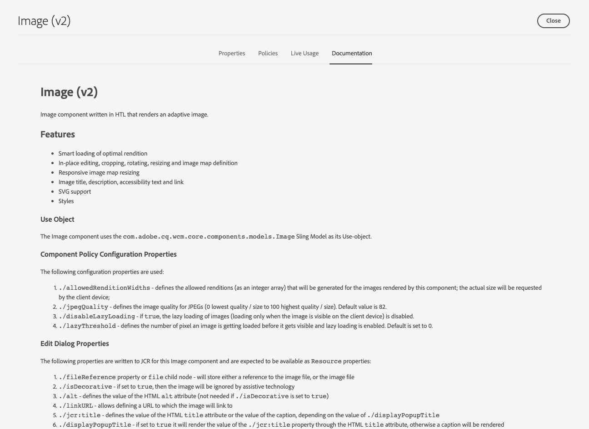

# 组件参考指南{#components-reference-guide}

组件是在AEM构建体验的核心。 [核心组件](https://experienceleague.adobe.com/docs/experience-manager-core-components/using/introduction.html)和[AEM项目原型](https://experienceleague.adobe.com/docs/experience-manager-core-components/using/developing/archetype/overview.html)使您能轻松开始使用一套现成的、强大的组件。 [WKND Tutorial](/help/implementing/developing/introduction/develop-wknd-tutorial.md)将指导开发人员如何使用这些工具以及如何构建自定义组件以创建新的AEM站点。

>[!TIP]
>
>在引用此文档之前，请确保您已完成[WKND教程](/help/implementing/developing/introduction/develop-wknd-tutorial.md)，因此您熟悉[核心组件](https://experienceleague.adobe.com/docs/experience-manager-core-components/using/introduction.html)和[AEM项目原型。](https://experienceleague.adobe.com/docs/experience-manager-core-components/using/developing/archetype/overview.html)

由于WKND教程涵盖大多数使用案例，因此此文档仅作为这些资源的补充。 它详细说明了组件在AEM中的结构和配置方式，并非作为入门指南。

## 概述 {#overview}

本部分介绍开发您自己的组件时所需的详细信息，包括主要概念和问题。

### 规划 {#planning}

在开始实际配置或编码组件之前，您应该询问：

* 您到底需要新组件做什么？
* 您是需要从头开始创建组件，还是可以从现有组件继承基础知识？
* 您的组件是否需要逻辑才能选择／操作内容？
   * 逻辑应与用户界面层保持分离。 HTL旨在帮助确保这种情况发生。
* 您的组件是否需要CSS格式？
   * CSS格式应与组件定义分开。 定义命名HTML元素的约定，以便通过外部CSS文件修改它们。
* 您的新组件可能会带来哪些安全影响？

### 重用现有组件{#reusing-components}

在花费时间创建全新组件之前，请考虑自定义或扩展现有组件。 [核心组](https://experienceleague.adobe.com/docs/experience-manager-core-components/using/introduction.html) 件提供一套灵活、强大且经过测试的生产就绪型组件。

#### 扩展核心组件{#extending-core-components}

核心组件还优惠[清晰的自定义模式](https://experienceleague.adobe.com/docs/experience-manager-core-components/using/developing/customizing.html)，您可以使用这些模式根据您自己的项目的需要进行调整。

#### 覆盖组件{#overlying-components}

还可以基于搜索路径逻辑使用[叠加](/help/implementing/developing/introduction/overlays.md)来重新定义组件。 但是，在这种情况下，将不会触发[Sling资源合并](/help/implementing/developing/introduction/sling-resource-merger.md)，并且`/apps`必须定义整个叠加。

#### 扩展组件对话框{#extending-component-dialogs}

也可以使用Sling Resource Merage（Sling资源合并）覆盖组件对话框并定义属性`sling:resourceSuperType`。

这意味着您只需重新定义所需的差异，而不是重新定义整个对话框。

### 内容逻辑和渲染标记{#content-logic-and-rendering-markup}

组件将使用[HTML进行呈现。](https://www.w3schools.com/htmL/html_intro.asp) 您的组件需要定义需要的HTML，以获取所需内容，然后根据需要在创作和发布环境上呈现它。

建议将标记和渲染的代码与控制用于选择组件内容的逻辑的代码分开，以使代码负责。

此理念得到[HTL](https://experienceleague.adobe.com/docs/experience-manager-htl/using/overview.html)的支持，该模板语言被有意限制，以确保使用真正的编程语言来定义基础业务逻辑。 此机制会高亮显示为给定视图调用的代码，并根据需要允许同一组件的不同视图使用特定逻辑。

此（可选）逻辑可以采用不同的方式实现，并通过特定命令从HTL调用：

* 使用Java - [HTL Java Use-API](https://helpx.adobe.com/experience-manager/htl/using/use-api-java.html)使HTL文件能够访问自定义Java类中的帮助方法。 这允许您使用Java代码实现用于选择和配置组件内容的逻辑。
* 使用JavaScript - [HTL JavaScript Use-API](https://experienceleague.adobe.com/docs/experience-manager-htl/using/htl/use-api-javascript.html)使HTL文件能够访问用JavaScript编写的帮助代码。 这允许您使用JavaScript代码实现用于选择和配置组件内容的逻辑。
* 使用客户端库——现代网站严重依赖由复杂的JavaScript和CSS代码驱动的客户端处理。 有关详细信息，请参阅文档[将AEM上的客户端库用作Cloud Service](/help/implementing/developing/introduction/clientlibs.md)。

### 开发您自己的组件{#developing-your-own-components}

在此处开发内容？

## 组件结构{#structure}

AEM组件结构强大灵活。 主要内容如下：

* [资源类型](#resource-type)
* [组件定义](#component-definition)
* [组件的属性和子节点](#properties-and-child-nodes-of-a-component)
* [对话框](#dialogs)
* [设计对话框](#design-dialogs)

### 资源类型 {#resource-type}

结构的关键元素是资源类型。

* 内容结构声明意图。
* 资源类型将实现这些类型。

这是一个抽象，有助于确保即使外观和感觉随着时间而改变，意图也会保持不变。

### 组件定义{#component-definition}

组件的定义可以按如下方式进行划分：

* AEM组件基于[Sling。](https://sling.apache.org/documentation.html)
* AEM组件位于`/libs/core/wcm/components`下。
* 项目／站点特定组件位于`/apps/<myApp>/components`下。
* AEM标准组件定义为`cq:Component`，并具有关键元素：
   * jcr属性-jcr属性的列表。 这些是变量，有些可能是可选的，但组件节点的基本结构、其属性和子节点由`cq:Component`定义定义。
   * 资源——这些资源定义组件使用的静态元素。
   * 脚本——这些脚本用于实现组件的结果实例的行为。

#### 重要属性{#vital-properties}

* **根节点**:
   * `<mycomponent> (cq:Component)` -组件的层次结构节点。
* **重要属性**:
   * `jcr:title` -组件标题；例如，当组件在组件浏览器和组件控制台中列出时， [将](/help/sites-cloud/authoring/fundamentals/environment-tools.md#components-browser) 用作 [标签](/help/sites-cloud/authoring/features/components-console.md)
   * `jcr:description` -组件说明；用作组件浏览器和组件控制台中的鼠标悬停提示
   * 有关详细信息，请参阅[组件图标](#component-icon)一节
* **重要子节点**:
   * `cq:editConfig (cq:EditConfig)` -定义组件的编辑属性，使组件显示在组件浏览器中
      * 如果组件具有对话框，则它将自动显示在组件浏览器或Sidekick中，即使cq:editConfig不存在也是如此。
   * `cq:childEditConfig (cq:EditConfig)` -控制未定义其自身的子组件的作者UI方面 `cq:editConfig`。
   * `cq:dialog (nt:unstructured)` -此组件的对话框。定义允许用户配置组件和／或编辑内容的界面。
   * `cq:design_dialog (nt:unstructured)` -此组件的设计编辑

#### 组件图标{#component-icon}

当开发人员创建组件时，组件的图标或缩写是通过组件的JCR属性定义的。 这些属性将按以下顺序计算，并使用找到的第一个有效属性。

1. `cq:icon` -指向Coral UI库中标准图标的字符串属 [性，](https://helpx.adobe.com/experience-manager/6-5/sites/developing/using/reference-materials/coral-ui/coralui3/Coral.Icon.html) 要在组件浏览器中显示
   * 使用Coral图标的HTML属性值。
1. `abbreviation` -用于自定义组件浏览器中组件名称的缩写的字符串属性
   * 缩写应限制为两个字符。
   * 如果提供空字符串，将根据`jcr:title`属性的前两个字符生成缩写。
      * 例如，“Im”表示“Image”
      * 本地化的标题将用于构建缩写。
   * 仅当组件具有`abbreviation_commentI18n`属性时，缩写才被翻译，然后该属性用作翻译提示。
1. `cq:icon.png` 或 `cq:icon.svg` -此组件的图标，显示在组件浏览器中
   * 20 x 20像素是标准组件图标的大小。
      * 将缩小大图标（客户端）。
   * 建议颜色为rgb(112, 112, 112)> #707070
   * 标准组件图标的背景是透明的。
   * 仅支持`.png`和`.svg`文件。
   * 如果通过Eclipse插件从文件系统导入，则文件名需要转义为`_cq_icon.png`或`_cq_icon.svg`。
   * `.png` 如果两者都 `.svg` 存在，就会成为先例。

如果组件上没有找到上述属性（`cq:icon`、`abbreviation`、`cq:icon.png`或`cq:icon.svg`）:

* 系统将在超级组件上搜索与`sling:resourceSuperType`属性相同的属性。
* 如果在超级组件级别找不到缩写或空缩写，系统将根据当前组件`jcr:title`属性的首字母构建缩写。

要取消超级组件中图标的继承，在组件上设置空`abbreviation`属性将恢复为默认行为。

[组件控制台](/help/sites-cloud/authoring/features/components-console.md#component-details)显示如何定义特定组件的图标。

#### SVG图标示例{#svg-icon-example}

```xml
<?xml version="1.0" encoding="utf-8"?>
<!DOCTYPE svg PUBLIC "-//W3C//DTD SVG 1.1//EN" "https://www.w3.org/Graphics/SVG/1.1/DTD/svg11.dtd">
<svg version="1.1" id="Layer_1" xmlns="https://www.w3.org/2000/svg" xmlns:xlink="https://www.w3.org/1999/xlink" x="0px" y="0px"
     width="20px" height="20px" viewBox="0 0 20 20" enable-background="new 0 0 20 20" xml:space="preserve">
    <ellipse cx="5" cy="5" rx="3" ry="3" fill="#707070"/>
    <ellipse cx="15" cy="5" rx="4" ry="4" fill="#707070"/>
    <ellipse cx="5" cy="15" rx="5" ry="5" fill="#707070"/>
    <ellipse cx="15" cy="15" rx="4" ry="4" fill="#707070"/>
</svg>
```

### 组件{#properties-and-child-nodes-of-a-component}的属性和子节点

定义组件所需的许多节点／属性对于两个UI都是通用的，差异保持独立，这样您的组件就可以在两个环境中工作。

组件是`cq:Component`类型的节点，具有以下属性和子节点：

| 名称 | 类型 | 描述 |
|---|---|---|
| `.` | `cq:Component` | 这表示当前组件。 组件的节点类型为`cq:Component`。 |
| `componentGroup` | `String` | 这表示在[组件浏览器中可以选择组件的组。](/help/sites-cloud/authoring/fundamentals/environment-tools.md#components-browser) 以开始的值 `.` 用于无法从UI（如从其他组件继承的基本组件）中进行选择的组件。 |
| `cq:isContainer` | `Boolean` | 这表示该组件是否为容器组件，因此可以包含其他组件，如段落系统。 |
| `cq:dialog` | `nt:unstructured` | 这是组件的编辑对话框的定义。 |
| `cq:design_dialog` | `nt:unstructured` | 这是组件的设计对话框的定义。 |
| `cq:editConfig` | `cq:EditConfig` | 这定义组件的[编辑配置。](#edit-behavior) |
| `cq:htmlTag` | `nt:unstructured` | 这将返回添加到周围HTML标签的其他标签属性。 支持向自动生成的div添加属性。 |
| `cq:noDecoration` | `Boolean` | 如果为true，则不会使用自动生成的div和css类呈现组件。 |
| `cq:template` | `nt:unstructured` | 如果找到此节点，则当从组件浏览器添加组件时，该节点将用作内容模板。 |
| `jcr:created` | `Date` | 这是组件的创建日期。 |
| `jcr:description` | `String` | 这是组件的描述。 |
| `jcr:title` | `String` | 这是组件的标题。 |
| `sling:resourceSuperType` | `String` | 设置后，组件会从此组件继承。 |
| `component.html` | `nt:file` | 这是组件的HTL脚本文件。 |
| `cq:icon` | `String` | 此值指向组件](#component-icon)的[图标，并显示在组件浏览器中。 |

如果我们查看&#x200B;**Text**&#x200B;组件，可以看到以下许多元素：


特定权益的物业包括：

* `jcr:title` -这是用于在组件浏览器中标识组件的组件的标题。
* `jcr:description` -这是组件的说明。
* `sling:resourceSuperType` -这表示在扩展组件（通过覆盖定义）时的继承路径。

特定感兴趣的子节点包括：

* `cq:editConfig` -此操作控制编辑时组件的可视方面。
* `cq:dialog` -这定义用于编辑此组件内容的对话框。
* `cq:design_dialog` -它指定此组件的设计编辑选项。

### 对话框 {#dialogs}

对话框是组件的关键元素，因为它们为作者提供了在内容页面上配置组件并提供该组件的输入的界面。 有关内容作者如何与组件交互的详细信息，请参阅[创作文档](/help/sites-cloud/authoring/fundamentals/editing-content.md)。

根据组件的复杂性，对话框可能需要一个或多个选项卡。

AEM组件的对话框：

* 是`cq:dialog`类型`nt:unstructured`的节点。
* 位于其`cq:Component`节点下，并位于其组件定义旁。
* 定义用于编辑此组件内容的对话框。
* 使用Granite UI组件进行定义。
* 根据内容结构和`sling:resourceType`属性呈现服务器端（作为Sling组件）。
* 包含描述对话框中字段的节点结构
   * 这些节点是`nt:unstructured`，具有必需的`sling:resourceType`属性。


在对话框中，定义了单个字段：


### 设计对话框{#design-dialogs}

设计对话框与用于编辑和配置内容的对话框类似，但它们为模板作者提供了界面，用于在页面模板上预配置和提供该组件的设计详细信息。 然后，内容作者使用页面模板创建内容页面。 有关如何创建模板的详细信息，请参阅[模板文档](/help/sites-cloud/authoring/features/templates.md)。

[编辑页面模板时会使用设计对话框](/help/sites-cloud/authoring/features/templates.md)，但并非所有组件都需要设计对话框。例如，**标题**&#x200B;和&#x200B;**图像组件**&#x200B;都具有设计对话框，而&#x200B;**社交媒体共享组件**&#x200B;没有。

### Coral UI和Granite UI {#coral-and-granite}

Coral UI和Granite UI定义AEM的外观。

* [Coral UI可](https://helpx.adobe.com/experience-manager/6-5/sites/developing/using/reference-materials/coral-ui/coralui3/index.html) 在所有云解决方案中提供一致的UI。
* [Granite UI](https://helpx.adobe.com/experience-manager/6-5/sites/developing/using/reference-materials/granite-ui/api/jcr_root/libs/granite/ui/index.html) 提供打包到Sling组件中的Coral UI标记，用于构建UI控制台和对话框。

Granite UI提供了在创作环境下创建对话框所需的大量基本构件。 必要时，您可以扩展此选择并创建您自己的构件。

有关其他详细信息，请参阅以下资源：

* [Coral UI 指南](https://helpx.adobe.com/experience-manager/6-5/sites/developing/using/reference-materials/coral-ui/coralui3/index.html)
* [Granite UI文档](https://helpx.adobe.com/experience-manager/6-5/sites/developing/using/reference-materials/granite-ui/api/index.html)
* [AEM UI的结构](/help/implementing/developing/introduction/ui-structure.md)

### 自定义对话框字段{#customizing-dialog-fields}

>[!TIP]
>
>有关自定义对话框字段，请参见[AEM Gems会话](https://docs.adobe.com/content/ddc/en/gems/customizing-dialog-fields-in-touch-ui.html)。

要创建要在组件对话框中使用的新构件，需要创建新的Granite UI字段组件。

如果您将对话框视为表单元素的简单容器，则还可以将对话框内容的主要内容看作表单字段。 创建新表单字段需要创建资源类型；这等效于创建新组件。 为了帮助您在该任务中，Granite UI会优惠一个要继承的通用字段组件（使用`sling:resourceSuperType`）:

`/libs/granite/ui/components/coral/foundation/form/field`

更具体地说，Granite UI提供一系列适用于对话框的字段组件，或更一般地以[形式使用。](https://helpx.adobe.com/experience-manager/6-5/sites/developing/using/reference-materials/granite-ui/api/jcr_root/libs/granite/ui/components/foundation/form/index.html)

创建资源类型后，您可以通过在对话框中添加新节点来实例化字段，该节点的属性`sling:resourceType`引用您刚引入的资源类型。

#### 访问对话框字段{#access-to-dialog-fields}

您还可以使用渲染条件(`rendercondition`)来控制谁有权访问对话框中的特定选项卡／字段；例如：

```text
+ mybutton
  - sling:resourceType = granite/ui/components/coral/foundation/button
  + rendercondition
    - sling:resourceType = myapp/components/renderconditions/group
    - groups = ["administrators"]
```

## 使用组件{#using-components}

创建组件后，您需要启用它才能使用它。 使用它可显示组件结构与存储库中生成内容的结构之间的关系。

### 将组件添加到模板{#adding-your-component-to-the-template}

定义组件后，必须允许其使用。 要使组件可在模板中使用，必须在模板的布局容器策略中启用该组件。

有关如何创建模板的详细信息，请参阅[模板文档](/help/sites-cloud/authoring/features/templates.md)。

### 组件及其创建的内容{#components-and-the-content-they-create}

如果我们在页面上创建并配置&#x200B;**Title**&#x200B;组件的实例：`/content/wknd/language-masters/en/adventures/extreme-ironing.html`


然后，我们可以看到在存储库中创建的内容的结构：


尤其是，如果您查看&#x200B;**标题组件**&#x200B;的实际文本：

* 内容包含`jcr:title`属性，其中包含作者输入的标题的实际文本。
* 它还包含对组件定义的`sling:resourceType`引用。

定义的属性取决于各个定义。 虽然比起上面更复杂，但也遵循相同的基本原则。

## 组件层次结构和继承{#component-hierarchy-and-inheritance}

AEM中的组件受&#x200B;**资源类型层次结构**&#x200B;的约束。 它用于使用属性`sling:resourceSuperType`扩展组件。 这允许组件继承其他组件。

有关详细信息，请参阅[重用组件](#reusing-components)一节。

## 编辑行为{#edit-behavior}

本节介绍如何配置组件的编辑行为。 这包括可用于组件的操作、in.place编辑器的特性以及与组件上的事件相关的监听器等属性。

通过在组件节点（类型`cq:Component`）下添加`cq:editConfig`类型`cq:EditConfig`的节点，并添加特定属性和子节点，可配置组件的编辑行为。 以下属性和子节点可用：

* `cq:editConfig` 节点属性
* [`cq:editConfig` 子节点](#configuring-with-cq-editconfig-child-nodes):
   * `cq:dropTargets` (节点类 `nt:unstructured`型):定义可接受内容查找器资产删除的拖放列表(允许单个拖放目标)
   * `cq:inplaceEditing` (节点类 `cq:InplaceEditingConfig`型):为组件定义就地编辑配置
   * `cq:listeners` (节点类 `cq:EditListenersConfig`型):定义在组件上执行操作之前或之后发生的情况

AEM中有许多现有配置。 使用&#x200B;**查询**&#x200B;中的CRXDE Lite工具，可以轻松搜索特定属性或子节点。

### 使用cq:EditConfig子节点{#configuring-with-cq-editconfig-child-nodes}进行配置

#### 将资产拖入对话框- cq:dropTargets {#cq-droptargets}

`cq:dropTargets`节点（节点类型`nt:unstructured`）定义可接受从内容查找器拖动的资产中拖放的放置目标。 它是`cq:DropTargetConfig`类型的节点。

类型`cq:DropTargetConfig`的子节点定义组件中的放置目标。

### 就地编辑- cq:inplaceEditing {#cq-inplaceediting}

就地编辑器允许用户直接在内容流中编辑内容，无需打开对话框。 例如，标准&#x200B;**Text**&#x200B;和&#x200B;**Title**&#x200B;组件都具有内置编辑器。

对于每个组件类型，就地编辑器并非必需／有意义。

`cq:inplaceEditing`节点（节点类型`cq:InplaceEditingConfig`）为组件定义就地编辑配置。 它可以具有以下属性：

| 属性名称 | 属性类型 | 属性值 |
|---|---|---|
| `active` | `Boolean` | `true` 以启用组件的就地编辑。 |
| `configPath` | `String` | 编辑器配置的路径，可由配置节点指定 |
| `editorType` | `String` | 可用类型有：`plaintext`对于非HTML内容，`title`在开始编辑之前将图形标题转换为纯文本，`text`使用富文本编辑器 |

以下配置启用组件的插入编辑，并将`plaintext`定义为编辑器类型：

```text
    <cq:inplaceEditing
        jcr:primaryType="cq:InplaceEditingConfig"
        active="{Boolean}true"
        editorType="plaintext"/>
```

### 处理字段事件- cq:listeners {#cq-listeners}

处理对话框字段事件的方法是使用自定义[客户端库中的监听器。](/help/implementing/developing/introduction/clientlibs.md)

要将逻辑注入您的领域，您应：

* 将您的字段标记为给定的CSS类（挂接）。
* 在客户端库中定义一个挂接到该CSS类名的JS监听器（这可确保您的自定义逻辑仅限于您的字段，且不影响同一类型的其他字段）。

要实现此目的，您需要了解要与之交互的底层构件库。 [请参阅Coral UI文](https://helpx.adobe.com/experience-manager/6-5/sites/developing/using/reference-materials/coral-ui/coralui3/index.html) 档，以确定要对哪个事件做出反应。

`cq:listeners`节点（节点类型`cq:EditListenersConfig`）定义在组件上执行操作之前或之后发生的情况。 下表定义了其可能的属性。

| 属性名称 | 属性值 |
|---|---|
| `beforedelete` | 在删除组件之前将触发处理程序。 |
| `beforeedit` | 在编辑组件之前将触发该处理函数。 |
| `beforecopy` | 在复制组件之前将触发该处理函数。 |
| `beforeremove` | 在移动组件之前触发处理程序。 |
| `beforeinsert` | 在插入组件之前将触发处理程序。 |
| `beforechildinsert` | 在将组件插入另一个组件之前，将触发该处理程序(仅容器)。 |
| `afterdelete` | 删除组件后将触发处理程序。 |
| `afteredit` | 编辑组件后将触发处理程序。 |
| `aftercopy` | 在复制组件后将触发处理程序。 |
| `afterinsert` | 插入组件后将触发处理程序。 |
| `aftermove` | 在移动组件后将触发处理程序。 |
| `afterchildinsert` | 该处理函数在组件插入另一个组件后触发(仅容器)。 |

>[!NOTE]
>
>对于嵌套组件，对于定义为`cq:listeners`节点上的属性的操作有一些限制。 对于嵌套组件，以下属性&#x200B;**的值必须**&#x200B;为`REFRESH_PAGE`:
>
>* `aftermove`
>* `aftercopy`


事件处理函数可以通过自定义实现实现。 例如（其中`project.customerAction`是静态方法）:

`afteredit = "project.customerAction"`

以下示例与`REFRESH_INSERTED`配置等效：

`afterinsert="function(path, definition) { this.refreshCreated(path, definition); }"`

使用以下配置，在删除、编辑、插入或移动组件后刷新页面：

```text
    <cq:listeners
        jcr:primaryType="cq:EditListenersConfig"
        afterdelete="REFRESH_PAGE"
        afteredit="REFRESH_PAGE"
        afterinsert="REFRESH_PAGE"
        afterMove="REFRESH_PAGE"/>
```

### 字段验证{#field-validation}

Granite UI和Granite UI构件中的字段验证是使用`foundation-validation` API完成的。 有关详细信息，请参阅[`foundation-valdiation` Granite文档](https://helpx.adobe.com/experience-manager/6-5/sites/developing/using/reference-materials/granite-ui/api/jcr_root/libs/granite/ui/components/coral/foundation/clientlibs/foundation/js/validation/index.html)。

## 预览行为{#preview-behavior}

切换至预览模式时，即使页面未刷新，也会设置[ WCM模式](https://helpx.adobe.com/experience-manager/6-5/sites/developing/using/reference-materials/javadoc/com/day/cq/wcm/api/WCMMode.html) cookie。

对于呈现对WCM模式敏感的组件，需要定义它们以专门刷新它们，然后依赖cookie的值。

## 正在记录组件{#documenting-components}

作为开发人员，您希望轻松访问组件文档，以便快速了解组件：

* 描述
* 预期用途
* 内容结构和属性
* 暴露的API和扩展点
* 等等。

因此，很容易将您在组件本身中提供的任何现有文档标记公开。

您只需将`README.md`文件放入组件结构中。


此标记随后将显示在[组件控制台中。](/help/sites-cloud/authoring/features/components-console.md)



支持的标记与[内容片段的标记相同。](/help/assets/content-fragments/content-fragments.md)