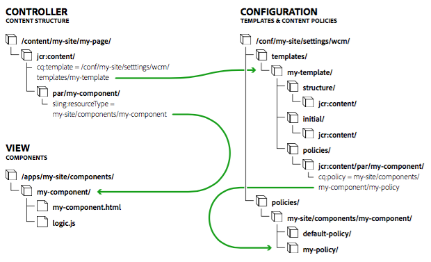

# 页面模板 {#page-templates}

创建页面时，您需要选择模板。 页面模板用作新页面的基础。 模板可定义生成页面的结构、任何初始内容以及可使用的组件（设计属性）。这具有以下几个优势：

* 页面模板允许专门的作者[创建和编辑模板](/help/sites-cloud/authoring/features/templates.md)。
   * 此类专门的作者称为&#x200B;**模板作者**
   * 模板作者必须是`template-authors`组的成员。
* 页面模板会保留与从这些模板创建的任何页面的动态连接。 这可确保模板的任何更改都反映在页面本身中。
* 页面模板可使页面组件更加通用，因此无需自定义即可使用核心页面组件。

使用页面模板，可在组件中分离出用于创建页面的片段。 您可以在UI中配置组件的必要组合，从而无需为每个页面变体开发新的页面组件。

本文档：

* 概述如何创建页面模板
* 描述创建可编辑模板所需的管理员/开发人员任务
* 描述可编辑模板的技术基础
* 描述AEM如何评估模板的可用性

>[!NOTE]
>
>本文档假定您已经熟悉创建和编辑模板。 请参阅创作文档[创建页面模板](/help/sites-cloud/authoring/features/templates.md) ，其中详细介绍了向模板作者公开的可编辑模板的功能。

>[!TIP]
>
>[WKND教程](/help/implementing/developing/introduction/develop-wknd-tutorial.md) 深入介绍了如何通过实施示例来使用页面模板，对于了解如何在新项目中设置模板非常有用

## 创建新模板{#creating-a-new-template}

创建页面模板主要由模板作者通过[模板控制台和模板编辑器](/help/sites-cloud/authoring/features/templates.md)来完成。 本节概述了此过程，并随后介绍了在技术层面发生的情况。

创建新的可编辑模板时，您需要执行以下步骤：

1. 为模板](#template-folders)创建[文件夹。 这不是强制性的，但建议使用最佳实践。
1. 选择[模板类型](#template-type)。 复制此模板以创建[模板定义](#template-definitions)。

   >[!NOTE]
   >
   >提供了一系列现成的模板类型。 如果需要，您还可以[创建您自己的特定于站点的模板类型](#creating-template-types)。

1. 配置新模板的结构、内容策略、初始内容和布局。

   **结构**

   * 利用结构，可为模板定义组件和内容。
   * 不能在生成页面上移动在模板结构中定义的组件，也不能从任何生成页面中删除这些组件。
   * 如果要使页面作者能够添加和删除组件，请在模板中添加段落系统。
   * 可以解锁组件，然后再将其锁定，以便定义初始内容。

   有关模板作者如何定义结构的详细信息，请参阅[创建页面模板](/help/sites-cloud/authoring/features/templates.md#editing-a-template-structure-template-author)。

   有关结构的技术详细信息，请参阅本文档中的[结构](#structure)。

   **策略**

   * 内容策略可定义组件的设计属性。

      * 例如，可用的组件或最小/最大尺寸。
   * 这些属性适用于模板（和使用模板创建的页面）。

   有关模板作者如何定义策略的详细信息，请参阅[创建页面模板](/help/sites-cloud/authoring/features/templates.md#editing-a-template-structure-template-author)。

   有关策略的技术详细信息，请参阅本文档中的[内容策略](#content-policies)。

   **初始内容**

   * 初始内容定义在首次基于模板创建页面时显示的内容。
   * 然后，页面作者可以编辑初始内容。

   有关模板作者如何定义结构的详细信息，请参阅[创建页面模板](/help/sites-cloud/authoring/features/templates.md#editing-a-template-initial-content-author)。

   有关初始内容的技术详细信息，请参阅本文档中的[初始内容](#initial-content)。

   **布局**

   * 您可以为各种设备定义模板布局。
   * 模板的响应式布局与页面创作时的响应式布局功能相同。

   有关模板作者如何定义模板布局的详细信息，请参阅[创建页面模板](/help/sites-cloud/authoring/features/templates.md#editing-a-template-layout-template-author)。

   有关模板布局的技术详细信息，请参阅本文档中的[布局](#layout) 。

1. 启用模板，然后为特定内容树启用它。

   * 可以启用或禁用模板，以使其对页面作者可用或不可用。
   * 可以使模板可用于或不可用于某些页面分支。

   有关模板作者如何启用模板的详细信息，请参阅[创建页面模板](/help/sites-cloud/authoring/features/templates.md#enabling-and-allowing-a-template-template-author)。

   有关启用模板的技术详细信息，请参阅本文档中的[启用和允许模板供用户使用](#enabling-and-allowing-a-template-for-use)e

1. 使用它创建内容页面。

   * 使用静态模板和可编辑的模板创建新页面的过程没有明显的区别，也没有孰优孰劣之分。
   * 对于页面作者而言，该创建过程一目了然。

   有关页面作者如何使用模板创建页面的详细信息，请参阅[创建和组织页面](/help/sites-cloud/authoring/fundamentals/organizing-pages.md#templates)。

   有关使用可编辑的模板创建页面的技术详细信息，请参阅本文档中的[生成内容页面](#resultant-content-pages)。

>[!TIP]
>
>切勿在模板中输入任何需要国际化的信息。出于内部化目的，建议使用核心组件](https://experienceleague.adobe.com/docs/experience-manager-core-components/using/get-started/localization.html)的[本地化功能。

>[!NOTE]
>
>模板是简化页面创建工作流程的强大工具。 但是，太多的模板可能会使作者不堪重负，并使页面创建令人困惑。 经验法则是将模板数量保持在100以下。
>
>Adobe不建议拥有1000个以上的模板，因为这可能会影响性能。

>[!NOTE]
>
>编辑器客户端库假定内容页面中存在`cq.shared`命名空间，如果不存在，则会导致JavaScript错误`Uncaught TypeError: Cannot read property 'shared' of undefined`。
>
>所有示例内容页面都包含`cq.shared`，因此基于这些页面的任何内容都会自动包含`cq.shared`。 但是，如果您决定从头开始创建自己的内容页面而不基于示例内容，则必须确保包含`cq.shared`命名空间。
>
>有关更多信息，请参阅[使用客户端库](/help/implementing/developing/introduction/clientlibs.md)。


## 模板文件夹{#template-folders}

要组织模板，您可以使用以下文件夹：

* `global`
* 特定于网站

>[!NOTE]
>
>即使可以嵌套文件夹，当用户在&#x200B;**模板**&#x200B;控制台中查看文件夹时，文件夹仍会显示为平面结构。

在标准AEM实例中，模板控制台中已存在`global`文件夹。 此文件夹会保存默认模板，如果在当前文件夹中没有找到策略和/或模板类型，则此文件夹可以充当备用。您可以将默认模板添加到此文件夹或创建新文件夹（推荐）。

>[!NOTE]
>
>最佳做法是创建新文件夹来保存自定义模板，而不使用`global`文件夹。

>[!CAUTION]
>
>文件夹必须由具有`admin`权限的用户创建。

模板类型和策略将按照以下优先顺序继承到所有文件夹：

1. 当前文件夹
1. 当前文件夹的父项
1. `/conf/global`
1. `/apps`
1. `/libs`

将创建所有允许条目的列表。 如果任何配置重叠(`path`/ `label`)，则只向用户显示与当前文件夹最接近的实例。

要创建新文件夹，您可以执行以下操作之一：

* 以编程方式或使用CRXDE Lite
* 使用[配置浏览器](/help/implementing/developing/introduction/configurations.md#using-configuration-browser)

## 使用CRXDE Lite{#using-crxde-lite}

1. 可以采用编程方式或通过CRXDE Lite为实例创建新文件夹（在/conf下）。

   必须使用以下结构：

   ```xml
   /conf
       <your-folder-name> [sling:Folder]
           settings [sling:Folder]
               wcm [cq:Page]
                   templates [cq:Page]
                   policies [cq:Page]
   ```

1. 然后，您可以在文件夹根节点上定义以下属性：

   `<your-folder-name> [sling:Folder]`

   * 名称: `jcr:title`
   * 类型: `String`
   * 值：要显示在&#x200B;**模板**&#x200B;控制台中的标题（文件夹的标题）。

1. 除了标准创作权限和权限(例如`content-authors`)您现在需要为作者分配组并定义所需的访问权限(ACL)，以便在新文件夹中创建模板。

   `template-authors`组是需要分配的默认组。 有关详细信息，请参阅[ACL和组](#acls-and-groups)部分。

   <!--See [Access Right Management](/help/sites-administering/user-group-ac-admin.md#access-right-management) for full details on managing and assigning access rights.-->

### 使用配置浏览器{#using-the-configuration-browser}

1. 转到&#x200B;**全局导航** -> **工具** > [**配置浏览器**。](/help/implementing/developing/introduction/configurations.md#using-configuration-browser)

   左侧列出了现有文件夹，包括`global`文件夹。

1. 单击&#x200B;**创建**。
1. 在&#x200B;**创建配置**&#x200B;对话框中，需要配置以下字段：

   * **标题**:为配置文件夹提供标题
   * **可编辑的模板**:勾号，允许在此文件夹中编辑模板

1. 单击&#x200B;**创建**

>[!NOTE]
>
>在[配置浏览器](/help/implementing/developing/introduction/configurations.md#using-configuration-browser)中，如果您希望在此文件夹中创建模板，则可以编辑全局文件夹并激活&#x200B;**可编辑的模板**&#x200B;选项，但建议不要这样做。

### ACL和组{#acls-and-groups}

创建模板文件夹（通过CRXDE或使用配置浏览器）后，必须为模板文件夹的相应组定义ACL，以确保适当的安全性。

[WKND教程](/help/implementing/developing/introduction/develop-wknd-tutorial.md)的模板文件夹可以用作示例。

#### 模板作者组{#the-template-authors-group}

`template-authors`组是用于管理模板访问权限的组，标配了AEM，但为空。 必须将用户添加到项目/站点的组。

>[!CAUTION]
>
>`template-authors`组仅适用于必须能够创建新模板的用户。
>
>编辑模板非常强大，如果未正确完成，现有模板可能会被破坏。 因此，此角色应该重点突出，并且仅包含符合条件的用户。

下表详细列出了进行模板编辑所需的权限。

<table>
 <tbody>
  <tr>
   <th>路径</th>
   <th>角色/组</th>
   <th>权限<br /> </th>
   <th>描述</th>
  </tr>
  <tr>
   <td rowspan="3"><code>/conf/&lt;<i>your-folder</i>&gt;/settings/wcm/templates</code></td>
   <td>模板作者<br /> </td>
   <td>读、写、复制</td>
   <td>在特定于<code>/conf</code>站点的空间中创建、读取、更新、删除和复制模板的模板作者</td>
  </tr>
  <tr>
   <td>匿名Web用户</td>
   <td>读取</td>
   <td>匿名Web用户在渲染页面时必须读取模板</td>
  </tr>
  <tr>
   <td>内容作者</td>
   <td>复制</td>
   <td>激活页面时，replicateContent作者需要激活页面的模板</td>
  </tr>
  <tr>
   <td rowspan="3"><code>/conf/&lt;<i>your-folder</i>&gt;/settings/wcm/policies</code></td>
   <td><code>Template Author</code></td>
   <td>读、写、复制</td>
   <td>在特定于<code>/conf</code>站点的空间中创建、读取、更新、删除和复制模板的模板作者</td>
  </tr>
  <tr>
   <td>匿名Web用户</td>
   <td>读取</td>
   <td>匿名Web用户在渲染页面时必须读取策略</td>
  </tr>
  <tr>
   <td>内容作者</td>
   <td>复制</td>
   <td>内容作者在激活页面时需要激活页面模板的策略</td>
  </tr>
  <tr>
   <td rowspan="2"><code>/conf/&lt;site&gt;/settings/template-types</code></td>
   <td>模板作者</td>
   <td>读取</td>
   <td>模板作者基于其中一种预定义的模板类型创建新模板。</td>
  </tr>
  <tr>
   <td>匿名Web用户</td>
   <td>无</td>
   <td>匿名Web用户不得访问模板类型</td>
  </tr>
 </tbody>
</table>

此默认的`template-authors`组仅涵盖项目设置，所有`template-authors`成员都可以访问和创作所有模板。 对于更复杂的设置，在设置中需要多个模板作者组来分隔对模板的访问权限，必须创建更多自定义模板作者组。 但是，模板作者组的权限将保持不变。

## 模板类型{#template-type}

创建新模板时，您需要指定模板类型：

* 模板类型有效地为模板提供模板。 创建新模板时，将使用所选模板类型的结构和初始内容创建新模板。

   * 将复制模板类型以创建模板。
   * 复制后，模板与模板类型之间的唯一连接便是用于获取信息的静态引用。

* 模板类型允许您定义：

   * 页面组件的资源类型。
   * 根节点的策略，用于定义模板编辑器中允许的组件。
   * 建议为响应式网格定义断点，并在模板类型上的设置移动模拟器。

* AEM提供了一小部分现成的模板类型，如HTML5页面和自适应表单页面。

   * 在[WKND教程中提供了其他示例。](/help/implementing/developing/introduction/develop-wknd-tutorial.md)

* 模板类型通常由开发人员定义。

现成模板类型存储在以下位置：

* `/libs/settings/wcm/template-types`

>[!CAUTION]
>
>不得更改`/libs`路径中的任何内容。 这是因为对AEM的更新会随时覆盖`/libs`的内容。

您特定于网站的模板类型应存储在以下可比位置：

* `/apps/settings/wcm/template-types`

自定义模板类型的定义应存储在用户定义的文件夹中（推荐），或者存储在`global`中。 例如：

* `/conf/<my-folder-01>/<my-folder-02>/settings/wcm/template-types`
* `/conf/<my-folder>/settings/wcm/template-types`
* `/conf/global/settings/wcm/template-types`

>[!CAUTION]
>
>模板类型必须遵循正确的文件夹结构(即`/settings/wcm/...`)，否则将找不到模板类型。

<!--
### Template Type and Mobile Device Groups {#template-type-and-mobile-device-groups-br}

The [device groups](/help/sites-developing/mobile.md#device-groups) used for an editable template (set as relative path of the property `cq:deviceGroups`) define which mobile devices are available as emulators in the [layout mode](/help/sites-authoring/responsive-layout.md) of page authoring. This value can be set in two places:

* On the editable template type
* On the editable template

When creating a new editable template, the value is copied from the template type to the individual template. If the value is not set on the type, it can be set on the template. Once a template is created, there is no inheritance from the type to the template.

>[!CAUTION]
>
>The value of `cq:deviceGroups` must be set as a relative path such as `mobile/groups/responsive` and not as an absolute path such as `/etc/mobile/groups/responsive`.

>[!NOTE]
>
>With static templates /help/sites-developing/page-templates-static.md, the value of `cq:deviceGroups` could be set at the root of the site.
>
>With editable templates, this value is now stored at the template level and is not supported at the page root level.
-->

### 创建模板类型{#creating-template-types}

如果已创建可用作其他模板基础的模板，则可以将此模板复制为模板类型。

1. 创建模板，如此处](/help/sites-cloud/authoring/features/templates.md#creating-a-new-template-template-author)所述，任何页面模板[都将用作模板类型的基础。
1. 使用CRXDE Lite，将新创建的模板从`templates`节点复制到[模板文件夹](#template-folders)下的`template-types`节点。
1. 从[template文件夹](#template-folders)下的`templates`节点中删除模板。
1. 在`template-types`节点下的模板副本中，删除所有`cq:template`和`cq:templateType` `jcr:content`属性。

您还可以使用GitHub上提供的可编辑模板示例作为基础，开发您自己的模板类型。

GITHUB上的代码

您可以在GitHub上找到此页面的代码

* [在GitHub上打开aem-sites-example-custom-template-type项目](https://github.com/Adobe-Marketing-Cloud/aem-sites-example-custom-template-type)
* 将项目下载为[a ZIP文件](https://github.com/Adobe-Marketing-Cloud/aem-sites-example-custom-template-type/archive/master.zip)

## 模板定义{#template-definitions}

可编辑模板的定义将存储在[用户定义的文件夹](#template-folders)（推荐）或`global`中。 例如：

* `/conf/<my-folder>/settings/wcm/templates`
* `/conf/<my-folder-01>/<my-folder-02>/settings/wcm/templates`
* `/conf/global/settings/wcm/templates`

模板的根节点为`cq:Template`类型，其骨架结构为：

```xml
<template-name>
  initial
    jcr:content
      root
        <component>
        ...
        <component>
  jcr:content
    @property status
  policies
    jcr:content
      root
        @property cq:policy
        <component>
          @property cq:policy
        ...
        <component>
          @property cq:policy
  structure
    jcr:content
      root
        <component>
        ...
        <component>
      cq:responsive
        breakpoints
  thumbnail.png
```

主要元素包括：

* `<template-name>`

   * ` [initial](#initial-content)`
   * `jcr:content`
   * ` [structure](#structure)`
   * ` [policies](#policies)`
   * `thumbnail.png`

### jcr:content {#jcr-content}

此节点包含模板的属性：

* **名称**: `jcr:title`
* **名称**: `status`
   * ``**类型**: `String`
   * **值**: `draft`、 `enabled` 或  `disabled`

### 结构 {#structure}

定义生成页面的结构：

* 创建新页面时，会与初始内容(`/initial`)合并。
* 对结构所做的更改将会反映在使用该模板创建的任何页面中。
* `root`(`structure/jcr:content/root`)节点定义将在生成页面中可用的组件列表。
   * 无法在任何生成页面上移动或删除在模板结构中定义的组件。
   * 解锁组件后，`editable`属性将设置为`true`。
   * 解锁已包含内容的组件后，此内容将被移动到`initial`分支。

* `cq:responsive`节点保存响应式布局的定义。

### 初始内容 {#initial-content}

定义新页面在创建时将包含的初始内容：

* 包含复制到任何新页面的`jcr:content`节点。
* 创建新页面时与结构(`/structure`)合并。
* 如果初始内容在创建后发生更改，则不会更新任何现有页面。
* `root`节点包含一个组件列表，用于定义将在生成页面中可用的组件。
* 如果在结构模式下将内容添加到组件，并且该组件随后被解锁（反之亦然），则此内容将用作初始内容。

### 布局 {#layout}

在[编辑模板时，您可以定义布局](/help/sites-cloud/authoring/features/templates.md)，它使用[标准响应式布局](/help/sites-cloud/authoring/features/responsive-layout.md)。

<!-- that can also be [configured](/help/sites-administering/configuring-responsive-layout.md). -->

### 内容策略{#content-policies}

内容策略可定义组件的设计属性。 例如，可用的组件或最小/最大尺寸。这些属性适用于模板（和使用模板创建的页面）。可以在模板编辑器中创建和选择内容策略。

* `root`节点上的属性`cq:policy`
   `/conf/<your-folder>/settings/wcm/templates/<your-template>/policies/jcr:content/root`
为页面的段落系统提供对内容策略的相对引用。

* `cq:policy`属性位于`root`下的组件显式节点上，可提供指向各个组件策略的链接。

* 实际策略定义存储在以下位置：
   `/conf/<your-folder>/settings/wcm/policies/wcm/foundation/components`

>[!NOTE]
>
>策略定义的路径取决于组件的路径。 `cq:policy` 包含对配置本身的相对引用。

### 页面策略 {#page-policies}

页面策略允许您在模板或生成页面中为页面（主Parsys）定义[内容策略](#content-policies)。

### 启用和允许模板以用于{#enabling-and-allowing-a-template-for-use}

1. **启用模板**

   模板必须通过以下任一方式启用，才能使用：

   * [从“模](/help/sites-cloud/authoring/features/templates.md) 板”控制台启 **** 用模板。

   * 在`jcr:content`节点上设置status属性。

      * 例如，在：
         `/conf/<your-folder>/settings/wcm/templates/<your-template>/jcr:content`

      * 定义属性：

         * 名称：状态
         * 类型：字符串
         * 值: `enabled`

1. **允许的模板**

   * [在子分支的相应页面或根页 **面**](/help/sites-cloud/authoring/features/templates.md#allowing-a-template-author) 的页面属性中定义允许的模板路径。
   * 设置属性：
      `cq:allowedTemplates`
在 
`jcr:content` 所需分支的节点。
   例如，值为：

   `/conf/<your-folder>/settings/wcm/templates/.*`

## 生成内容页面{#resultant-content-pages}

从可编辑模板创建的页面：

* 在模板中创建的子树是从`structure`和`initial`合并的

* 对模板和模板类型中包含的信息进行引用。 这是通过`jcr:content`节点实现的，该节点具有以下属性：

   * `cq:template`  — 提供对实际模板的动态引用；允许将对模板所做的更改反映在实际页面上。

   * `cq:templateType`  — 提供对模板类型的引用。



上图显示了模板、内容和组件如何相互关联：

* 控制器 — `/content/<my-site>/<my-page>` — 引用模板的生成页面。 内容控制着整个过程。 根据定义，访问相应的模板和组件。
* 配置 — `/conf/<my-folder>/settings/wcm/templates/<my-template>` - [模板和相关内容策略](#template-definitions)定义页面配置。
* 模型 — OSGi包 — [ OSGi包](/help/implementing/deploying/configuring-osgi.md)实施该功能。
* 查看 — `/apps/<my-site>/components` — 在创作和发布环境中，组件会渲染内容。

渲染页面时：

* **模板**:

   * 将引用其`jcr:content`节点的`cq:template`属性以访问与该页面对应的模板。

* **组件**:

   * 页面组件会将模板的`structure/jcr:content`树与页面的`jcr:content`树合并。
      * 页面组件将仅允许作者编辑已标记为可编辑的模板结构的节点（以及任何子节点）。
      * 在页面上呈现组件时，该组件的相对路径将从`jcr:content`节点获取；随后将搜索模板`policies/jcr:content`节点下的相同路径。
         * 此节点的`cq:policy`属性指向实际的内容策略（即，它包含该组件的设计配置）。
            * 这样，您就可以拥有多个重复使用相同内容策略配置的模板。

### 模板可用性 {#template-availability}

在站点管理界面中创建新页面时，可用模板的列表取决于新页面的位置以及在每个模板中指定的放置限制。

以下属性确定是否允许将模板`T`用于要作为页面`P`的子项放置的新页面。 以下每个属性都是一个包含零个或多个正则表达式的多值字符串，用于与路径匹配：

* `P`的`jcr:content`子节点或`P`的上级的`cq:allowedTemplates`属性。

* `T`的`allowedPaths`属性。

* `T`的`allowedParents`属性。

* `P`模板的`allowedChildren`属性。

评价工作如下：

* 在对以`P`开头的页面层次结构进行升序时找到的第一个非空`cq:allowedTemplates`属性与`T`的路径相匹配。 如果没有值匹配，则拒绝`T`。

* 如果`T`具有非空的`allowedPaths`属性，但没有任何值与`P`的路径匹配，则`T`将被拒绝。

* 如果上述两个属性为空或不存在，则拒绝`T`，除非它属于与`P`相同的应用程序。 `T` 属于与if相同的应 `P` 用程序，并且仅当路径的第二级名称与 `T` 路径的第二级名称相同时 `P`。例如，模板`/apps/wknd/templates/foo`属于与页面`/content/wknd`相同的应用程序。

* 如果`T`具有非空的`allowedParents`属性，但没有任何值与`P`的路径匹配，则`T`将被拒绝。

* 如果`P`的模板具有非空的`allowedChildren`属性，但没有任何值与`T`的路径匹配，则`T`将被拒绝。

* 在所有其他情况下，允许使用`T`。

下图描述了模板评估流程：


>[!CAUTION]
>
>AEM提供了多个属性来控制&#x200B;**Sites**&#x200B;下允许的模板。 但是，将它们组合在一起可能会导致非常复杂的规则，从而难以跟踪和管理。
>
>因此，Adobe建议您首先通过定义以下内容来简单操作：
>
>* 仅`cq:allowedTemplates`属性
   >
   >
* 仅在站点根目录上
>
>
有关示例，请参阅[WKND教程](/help/implementing/developing/introduction/develop-wknd-tutorial.md)内容：`/content/wknd/jcr:content`
>
>属性`allowedPaths`、`allowedParents`和`allowedChildren`也可以放在模板上，以定义更复杂的规则。 但是，如果可能，如果需要进一步限制允许的模板，则在站点的子区域上进一步定义`cq:allowedTemplates`属性会更简单。**
>
>另一个好处是，作者可以在&#x200B;**页面属性**&#x200B;的&#x200B;**Advanced**&#x200B;选项卡中更新`cq:allowedTemplates`属性。 无法使用（标准）UI更新其他模板属性，因此需要开发人员为每次更改维护规则和代码部署。

#### 子页面{#limiting-templates-used-in-child-pages}中使用的限制模板

要限制可用于在给定页面下创建子页面的模板，请使用页面`jcr:content`节点的`cq:allowedTemplates`属性指定允许作为子页面的模板列表。 列表中的每个值都必须是允许的子页面（例如`/apps/wknd/templates/page-content`）的模板的绝对路径。

可以使用模板`jcr:content`节点上的`cq:allowedTemplates`属性将此配置应用于使用此模板的所有新创建页面。

如果要添加更多约束（例如与模板层次结构有关的约束），可以使用模板上的`allowedParents/allowedChildren`属性。 然后，您可以明确指定从模板T创建的页面必须是从模板T创建的页面的父/子页面。
