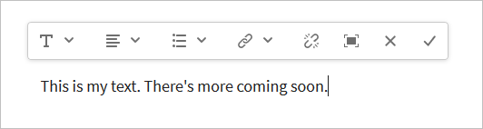

# 配置富文本编辑器 {#configure-the-rich-text-editor}

富文本编辑器(RTE)为作者提供了多种用于编辑文本内容的功能。 提供了图标、选择框、工具栏和菜单，以体验所见即所得的文本编辑体验。 管理员可将RTE配置为启用、禁用和扩展创作组件中可用的功能。 了解作者的方式 [使用RTE进行创作](/help/sites-cloud/authoring/fundamentals/rich-text-editor.md) web内容。

下面列出了RTE概念及配置RTE所需的步骤。

| 了解RTE概念 | 启用所需功能 | 配置各个功能 |
|---|---|---|
| [了解界面](#understand-rte-ui) | [了解和设置配置位置](#understand-the-configuration-paths-and-locations) | [配置插件](#enable-rte-functionalities-by-activating-plug-ins) |
| [编辑模式的类型](#editingmodes) | [激活插件](/help/implementing/developing/extending/configure-rich-text-editor-plug-ins.md#activateplugin) | [设置功能属性](#aboutplugins) |
| [关于插件](#aboutplugins) | [配置RTE工具栏](#dialogfullscreen) | [配置粘贴模式](/help/implementing/developing/extending/configure-rich-text-editor-plug-ins.md#textstyles) |

## 了解可供作者使用的用户界面 {#understand-rte-ui}

RTE界面提供 [响应式设计](/help/sites-cloud/authoring/features/responsive-layout.md) ，用于创作环境。 该界面专为在触控和桌面设备上使用而设计。


*图：已启用所有可用选项的富文本编辑器工具栏。*

工具栏提供了WYSIWYG创作体验的选项。 [!DNL Experience Manager] 管理员可以配置界面工具栏中可用的选项。 默认情况下，在 [!DNL Experience Manager]. 开发人员可以自定义 [!DNL Experience Manager] 添加更多编辑选项。

## 各种编辑模式 {#editingmodes}

作者可以在 [!DNL Experience Manager] 使用不同的组件模式。 在不同编辑模式下，用于创作内容和设置内容格式的工具栏选项以及启用RTE的组件的用户体验因RTE配置而异。

| 编辑模式 | 编辑区域 | 建议启用的功能 |
|--- |--- |--- |
| 内嵌 | 就地编辑，以便进行快速、细微的编辑；格式，而不打开对话框。 | 最少的RTE功能。 |
| RTE全屏 | 涵盖整个页面。 | 所有必需的RTE功能。 |
| 对话框 | 对话框，但不涵盖整个页面。 | 明智地启用功能。 |
| 全屏对话框 | 与全屏模式相同；包含对话框的字段以及RTE。 | 所有必需的RTE功能。 |

>[!NOTE]
>
>在内联编辑模式下，源代码编辑功能不可用。 不能以全屏模式拖动图像。 所有其他功能在所有模式下均可工作。

### 内联编辑 {#inline-editing}

要编辑页面中的内容，请慢速双击以打开内容。 此时会显示一个包含基本选项的紧凑工具栏。



*图：使用工具栏中的基本选项进行内联编辑。*

### 全屏编辑 {#full-screen-editing}

[!DNL Experience Manager] 可以以全屏视图打开组件，以隐藏页面内容并占据可用屏幕。 考虑使用全屏编辑来详细编辑内联编辑版本，因为它提供了最多的编辑选项。 可通过单击 ，使用内联编辑模式时从紧凑工具栏中选择。

在对话框全屏模式下，以及详细的RTE工具栏中，还提供了对话框中可用的选项和组件。 该变量仅适用于包含RTE和其他组件的对话框。


*图：在全屏模式下编辑时显示的详细RTE工具栏。*

### 对话框编辑 {#dialog-editing}

双击组件后，将打开一个用于编辑内容的对话框。 此时将打开现有页面顶部的对话框。 在某些特定情况下，会以弹出窗口的形式打开该对话框。 例如，当文本组件是多列页面布局中列的一部分，且可用于对话框的区域较少时。


*图：对话框编辑模式。*

## 关于RTE插件和关联的功能 {#aboutplugins}

该功能通过一系列插件提供，每个插件均具有：

* A `features` 属性，

   * 用于激活或停用该插件的基本功能。
   * 使用标准化过程进行配置。

* 在适当情况下，需要进行专门配置的更多属性和选项。

RTE的基本功能由的值激活或停用 `features` 属性。

下表列出了当前的插件，其中显示：

* 包含API文档链接的插件ID。 ID用作 [激活插件](/help/implementing/developing/extending/configure-rich-text-editor-plug-ins.md#activateplugin).
* 的允许值 `features` 属性。
* 插件提供的功能描述。

| 插件ID | 功能 | 描述 |
|--- |--- |--- |
| 编辑 | `cut`, `copy`, `paste-default`, `paste-plaintext`, `paste-wordhtml` | [剪切、复制和粘贴三种模式](/help/implementing/developing/extending/configure-rich-text-editor-plug-ins.md#textstyles). |
| [findreplace](https://helpx.adobe.com/experience-manager/6-5/sites/developing/using/reference-materials/widgets-api/index.html?class=CQ.form.rte.plugins.FindReplacePlugin) | `find`、`replace` | 查找并替换. |
| [format](https://helpx.adobe.com/experience-manager/6-5/sites/developing/using/reference-materials/widgets-api/index.html?class=CQ.form.rte.plugins.FormatPlugin) | `bold`, `italic`, `underline` | [基本文本格式](configure-rich-text-editor-plug-ins.md#textstyles). |
| [图像](https://helpx.adobe.com/experience-manager/6-5/sites/developing/using/reference-materials/widgets-api/index.html?class=CQ.form.rte.plugins.ImagePlugin) | `image` | 基本图像支持（从内容或内容查找器中拖动）。 根据浏览器的不同，作者支持的行为各不相同 |
| [键](https://helpx.adobe.com/experience-manager/6-5/sites/developing/using/reference-materials/widgets-api/index.html?class=CQ.form.rte.plugins.KeyPlugin) | - | 要定义此值，请参阅 [选项卡大小](configure-rich-text-editor-plug-ins.md#tabsize). |
| [证明](https://helpx.adobe.com/experience-manager/6-5/sites/developing/using/reference-materials/widgets-api/index.html?class=CQ.form.rte.plugins.JustifyPlugin) | `justifyleft`, `justifycenter`, `justifyright` | 段落对齐。 |
| [链接](https://helpx.adobe.com/experience-manager/6-5/sites/developing/using/reference-materials/widgets-api/index.html?class=CQ.form.rte.plugins.LinkPlugin) | `modifylink`, `unlink`, `anchor` | [超链接和锚点](configure-rich-text-editor-plug-ins.md#linkstyles). |
| [列表](https://helpx.adobe.com/experience-manager/6-5/sites/developing/using/reference-materials/widgets-api/index.html?class=CQ.form.rte.plugins.ListPlugin) | `ordered`, `unordered`, `indent`, `outdent` | 此插件可同时控制 [缩进和列表](configure-rich-text-editor-plug-ins.md#indentmargin);包括嵌套列表。 |
| [misctools](https://helpx.adobe.com/experience-manager/6-5/sites/developing/using/reference-materials/widgets-api/index.html?class=CQ.form.rte.plugins.MiscToolsPlugin) | `specialchars`、`sourceedit` | 其他工具允许作者输入 [特殊字符](configure-rich-text-editor-plug-ins.md#spchar) 或编辑HTML源。 此外，您还可以添加 [特殊字符范围](configure-rich-text-editor-plug-ins.md#definerangechar) 要定义自己的列表。 |
| 参数格式 | `paraformat` | 默认段落格式为“段落”、“标题1”、“标题2”和“标题3”(`<p>`, `<h1>`, `<h2>`和 `<h3>`)。 您可以 [添加更多段落格式](configure-rich-text-editor-plug-ins.md#paraformats) 或扩展列表。 |
| 拼写检查 | `checktext` | [语言感知拼写检查程序](configure-rich-text-editor-plug-ins.md#adddict). |
| 样式 | `styles` | 支持使用CSS类的样式。 [添加新的文本样式](configure-rich-text-editor-plug-ins.md#textstyles) 如果您要添加（或扩展）自己的样式范围以与文本一起使用。 |
| 子上标 | `subscript`、`superscript` | 基本格式的扩展，添加子脚本和超脚本。 |
| 表 | `table`, `removetable`, `insertrow`, `removerow`, `insertcolumn`, `removecolumn`, `cellprops`, `mergecells`, `splitcell`, `selectrow`, `selectcolumns` | 请参阅 [配置表样式](configure-rich-text-editor-plug-ins.md#tablestyles) 为整个表或单个单元格添加您自己的样式。 |
| 撤消 | `undo`、`redo` | 历史记录大小 [撤消和重做](configure-rich-text-editor-plug-ins.md#undohistory) 操作。 |

>[!NOTE]
>
>对话框模式不支持全屏插件。 使用 `dialogFullScreen` 设置以配置全屏模式的工具栏。

## 了解配置路径和位置 {#understand-the-configuration-paths-and-locations}

的 [RTE编辑模式和界面](#editingmodes) 您为作者提供的配置详细信息在您 [激活RTE插件](configure-rich-text-editor-plug-ins.md#activateplugin). 位置包括：

* 内联模式： `cq:editConfig/cq:inplaceEditing`.
* 全屏模式: `cq:editConfig/cq:inplaceEditing`.
* 对话框模式： `cq:dialog`.
* 全屏对话框模式： `cq:dialog`.

>[!NOTE]
>
>请勿在下命名节点 `cq:inplaceEditing` as `config`. 开 `cq:inplaceEditing` 节点，定义以下属性：
>
>* **名称**: `configPath`
>* **类型**: `String`
>* **值**:包含实际配置的节点的路径
>
>请勿将RTE配置节点命名为 `config`. 否则，RTE配置将仅对管理员生效，而对组中的用户不生效 `content-author`.

配置以下在对话框编辑模式下应用的属性：

* `useFixedInlineToolbar`:可以修复RTE工具栏，而不是浮动。 设置在RTE节点(sling:resourceType=)上定义的此布尔属性 `cq/gui/components/authoring/dialog/richtext` to `True`. 当此属性设置为 `True`，则会在 `foundation-contentloaded` 事件。 要阻止出现这种情况，请设置属性 `customStart` to `True` 并触发 `rte-start` 事件来开始RTE编辑。 当此属性为 `true`,RTE不会在单击时启动，这是默认行为。

* `customStart`:将RTE节点上定义的此布尔属性设置为 `True`，通过触发事件来控制何时启动RTE `rte-start`.

* `rte-start`:在 `contenteditable-div` ，用于开始编辑RTE。 仅当 `customStart` 已设置为 `true`.

在触屏启用对话框中使用RTE时，设置属性 `useFixedInlineToolbar` to `true` 以避免问题。

## 通过激活插件启用RTE功能 {#enable-rte-functionalities-by-activating-plug-ins}

RTE功能通过一系列插件提供，每个插件都具有features属性。 您可以配置features属性以启用或禁用每个插件的各种功能。

有关RTE插件的详细配置，请参阅 [如何激活和配置RTE插件](configure-rich-text-editor-plug-ins.md).

<!-- TBD ENGREVIEW: To confirm if the sample works in CS or not?
**Sample**: Download [this sample configuration](/help/sites-administering/assets/rte-sample-all-features-enabled-10.zip) that illustrates how to configure RTE. In this package all the features are enabled. -->

的 [核心组件文本组件](https://experienceleague.adobe.com/docs/experience-manager-core-components/using/components/text.html#the-text-component-and-the-rich-text-editor) 允许模板编辑器使用用户界面配置多个RTE插件作为内容策略，从而无需进行技术配置。 内容策略可以与RTE UI配置配合使用，如本文档中所述。 有关更多信息，请参阅 [创建页面模板](/help/sites-cloud/authoring/features/templates.md) 和 [核心组件开发人员文档](https://experienceleague.adobe.com/docs/experience-manager-core-components/using/developing/developing.html).

>出于参考目的，默认的文本组件（作为标准安装的一部分提供）可在以下位置找到：
>
>* `/libs/wcm/foundation/components/text`
>* `/libs/foundation/components/text`
>
>要创建自己的文本组件，请复制上述组件，而不是编辑这些组件。

## 配置RTE工具栏 {#dialogfullscreen}

[!DNL Experience Manager] 允许您针对不同的编辑模式以不同方式配置富文本编辑器的界面。 下面提供了默认设置。 您可以根据要求覆盖这些默认值。 您只能自定义要提供给作者的工具栏功能。 您无需指定所有工具栏配置。

为配置工具栏 `dialogFullScreen`，请使用以下示例配置。

```java
<uiSettings jcr:primaryType="nt:unstructured">
  <cui jcr:primaryType="nt:unstructured">
    <inline
      jcr:primaryType="nt:unstructured"
      toolbar="[format#bold,format#italic,format#underline,#justify,#lists,links#modifylink,links#unlink,#paraformat]">
      <popovers jcr:primaryType="nt:unstructured">
        <justify
          jcr:primaryType="nt:unstructured"
          items="[justify#justifyleft,justify#justifycenter,justify#justifyright,justify#justifyjustify]"
          ref="justify"/>
        <lists
          jcr:primaryType="nt:unstructured"
          items="[lists#unordered,lists#ordered,lists#outdent,lists#indent]"
          ref="lists"/>
        <paraformat
          jcr:primaryType="nt:unstructured"
          items="paraformat:getFormats:paraformat-pulldown"
          ref="paraformat"/>
      </popovers>
    </inline>
    <dialogFullScreen
      jcr:primaryType="nt:unstructured"
      toolbar="[format#bold,format#italic,format#underline,justify#justifyleft,justify#justifycenter,justify#justifyright,justify#justifyjustify,lists#unordered,lists#ordered,lists#outdent,lists#indent,links#modifylink,links#unlink,table#createoredit,#paraformat,image#imageProps]">
      <popovers jcr:primaryType="nt:unstructured">
        <paraformat
          jcr:primaryType="nt:unstructured"
          items="paraformat:getFormats:paraformat-pulldown"
          ref="paraformat"/>
      </popovers>
    </dialogFullScreen>
    <tableEditOptions
      jcr:primaryType="nt:unstructured"
      toolbar="[table#insertcolumn-before,table#insertcolumn-after,table#removecolumn,-,table#insertrow-before,table#insertrow-after,table#removerow,-,table#mergecells-right,table#mergecells-down,table#mergecells,table#splitcell-horizontal,table#splitcell-vertical,-,table#selectrow,table#selectcolumn,-,table#ensureparagraph,-,table#modifytableandcell,table#removetable,-,undo#undo,undo#redo,-,table#exitTableEditing,-]">
    </tableEditOptions>
  </cui>
</uiSettings>
```

内联模式和全屏模式使用不同的用户界面设置。 工具栏属性指定工具栏的选项。

例如，如果选项本身是功能(例如， `Bold`)，则指定为 `PluginName#FeatureName` (例如， `links#modifylink`)。

如果选项是弹出窗口（包含插件的某些功能），则会指定为 `#PluginName` (例如， `#format`)。

分隔符(`|`) `-`.

内嵌或全屏模式下的弹出节点包含正在使用的弹出窗口列表。 下的每个子节点 `popovers` 节点以插件命名（例如，格式）。 它有一个属性“items”，其中包含插件的功能列表（例如，format#bold）。

## RTE用户界面设置和内容策略 {#rtecontentpolicies}

管理员可以使用内容策略（例如，不执行上述配置）来控制RTE选项。 内容策略用于定义组件在 [可编辑模板](/help/sites-cloud/authoring/features/templates.md). 例如，如果将使用RTE的文本组件与可编辑的模板一起使用，则内容策略可以定义提供粗体选项和一些段落格式选项。 内容策略可重复使用，并可跨多个模板应用。

RTE流中从用户界面配置到内容策略的下游的可用选项。

* 用户界面配置设置定义可用于内容策略的选项。
* 如果RTE的用户界面配置已删除或未启用项目，则内容策略无法对其进行配置。
* 作者只能访问用户界面配置和内容策略提供的此类功能。

例如，您可以在 [文本核心组件文档](https://experienceleague.adobe.com/docs/experience-manager-core-components/using/components/text.html#the-text-component-and-the-rich-text-editor).

## 自定义工具栏图标和命令之间的映射 {#iconstoolbar}

您可以自定义RTE工具栏中显示的Coral图标与可用命令之间的映射。 除Coral图标外，您不能使用任何其他图标。

1. 创建名为的节点 `icons` 在 `uiSettings/cui`.

1. 为下方的各个图标创建节点。
1. 在每个图标节点上，指定一个Coral图标和一个映射到该图标的命令。

下面是一个用于映射命令的示例代码片段 `Bold` 到名为 `textItalic`.

```java
<text jcr:primaryType="nt:unstructured" sling:resourceType="cq/gui/components/authoring/dialog/richtext" name="./text" useFixedInlineToolbar="{Boolean}true">
    <rtePlugins jcr:primaryType="nt:unstructured">
        <format jcr:primaryType="nt:unstructured" features="bold,italic"/>
    </rtePlugins>
    <uiSettings jcr:primaryType="nt:unstructured">
        <cui jcr:primaryType="nt:unstructured">
            <inline jcr:primaryType="nt:unstructured"
                toolbar="[format#bold,format#italic,format#underline,links#modifylink,links#unlink]">
            </inline>
            <icons jcr:primaryType="nt:unstructured">
                <bold jcr:primaryType="nt:unstructured"
                    command="format#bold"
                    icon="textItalic"/>
            </icons>
        </cui>
    </uiSettings>
</text>
```

## 已知限制 {#known-limitations}

[!DNL Experience Manager] RTE功能具有以下限制：

* 仅在 [!DNL Experience Manager] 组件对话框。 向导或Foundation-forms不支持RTE。

* [!DNL Experience Manager] 无法在混合设备上使用。 <!-- TBD: Check. This is not mentioned in Known Issue /help/release-notes/known-issues.md-->

* 请勿命名RTE配置节点 `config`. 否则，RTE配置将仅对管理员生效，而对组中的用户不生效 `content-author`.

* RTE不支持在内联框架或iframe中嵌入内容。

## 最佳实践和提示 {#best-practices-and-tips}

* 对于浮动对话框，请仅启用插件，而不使用弹出对话框。 没有弹出窗口的插件大小较小，最适合用于浮动对话框。
* 通过较大的弹出窗口(如 `Paste` 插件，仅在全屏对话框模式或全屏模式下使用。 具有大弹出窗口的插件需要更多的屏幕空间来提供良好的创作体验。
* 如果您对CoralUI3 RTE使用自定义插件，请使用 `rte.coralui3` 库。

>[!MORELIKETHIS]
>
>* [配置RTE插件](configure-rich-text-editor-plug-ins.md)
>* [使用富文本编辑器进行创作](/help/sites-cloud/authoring/fundamentals/rich-text-editor.md)
>* [为可访问的站点配置RTE](rte-accessible-content.md)

