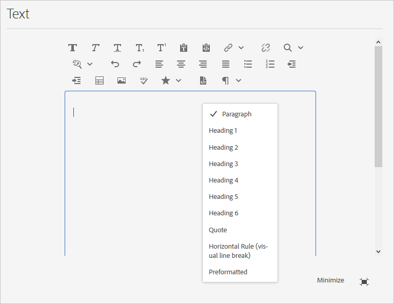

# 配置富文本编辑器{#configure-the-rich-text-editor}

富文本编辑器(RTE)为作者提供了多种用于编辑文本内容的功能。 提供了图标、选择框、工具栏和菜单，以实现所见即所得的文本编辑体验。 管理员配置RTE以启用、禁用和扩展创作组件中可用的功能。 了解作者[如何使用RTE创作](/help/sites-cloud/authoring/fundamentals/rich-text-editor.md) Web内容。

下面列出了RTE概念和配置它所需的步骤。

| 了解RTE概念 | 启用所需功能 | 配置各个功能 |
|---|---|---|
| [了解界面](#understand-rte-ui) | [了解和设置配置位置](#understand-the-configuration-paths-and-locations) | [配置插件](#enable-rte-functionalities-by-activating-plug-ins) |
| [编辑模式的类型](#editingmodes) | [激活插件](/help/implementing/developing/extending/configure-rich-text-editor-plug-ins.md#activateplugin) | [设置功能属性](#aboutplugins) |
| [关于增效工具](#aboutplugins) | [配置RTE工具栏](#dialogfullscreen) | [配置粘贴模式](/help/implementing/developing/extending/configure-rich-text-editor-plug-ins.md#textstyles) |

## 了解作者可使用的用户界面{#understand-rte-ui}

RTE接口优惠[响应式设计](/help/sites-cloud/authoring/features/responsive-layout.md)以进行创作环境。 该界面设计用于触控和桌面设备。



*图：富文本编辑器工具栏，并启用所有可用选项。*

工具栏提供了用于所见即所得创作体验的选项。 [!DNL Experience Manager] 管理员可以配置界面工具栏中提供的选项。默认情况下，[!DNL Experience Manager]中提供一整套编辑选项。 开发人员可以自定义[!DNL Experience Manager]以添加更多编辑选项。

## 编辑{#editingmodes}的各种模式

作者可以使用不同的组件模式在[!DNL Experience Manager]中创建和编辑文本内容。 用于创作内容和设置内容格式的工具栏选项，以及在不同编辑模式下启用RTE的组件的用户体验，会因RTE配置而异。

| 编辑模式 | 编辑区域 | 建议启用的功能 |
|--- |--- |--- |
| 内嵌 | 就地编辑，以便进行快速、次要的编辑；不打开对话框即可设置格式。 | 最低RTE功能。 |
| RTE全屏 | 覆盖整个页面。 | 所有必需的RTE功能。 |
| 对话框 | 对话框。 | 审慎地启用功能。 |
| 全屏对话框 | 与全屏模式相同；与RTE一起包含对话框的字段。 | 所有必需的RTE功能。 |

>[!NOTE]
>
>在内联编辑模式下，源编辑功能不可用。 无法以全屏模式拖动图像。 所有其他功能在所有模式下都有效。

### 内联编辑{#inline-editing}

要编辑页面内的内容，请慢速多次单击以打开内容。 将显示一个包含基本选项的紧凑工具栏。


*图：使用工具栏中的基本选项进行内联编辑。*

### 全屏编辑 {#full-screen-editing}

[!DNL Experience Manager] 组件可以以全屏视图打开，从而隐藏页面内容并占据可用屏幕。在优惠最多编辑选项时，可以考虑对内联编辑的详细版本进行全屏编辑。 在使用内联编辑模式时，可以通过单击打开RTE。

在对话框全屏模式下，以及详细的RTE工具栏中，对话框中的可用选项和组件也可用。 它仅适用于与其他组件一起包含RTE的对话框。


*图：在全屏模式下进行编辑时显示的详细RTE工具栏。*

### 对话框编辑{#dialog-editing}

当组件被多次单击时，将打开一个用于编辑内容的对话框。 该对话框将在现有页面的顶部打开。 在某些特定情况下，对话框会以弹出窗口的形式打开。 例如，当文本组件是多列页面布局中的列的一部分，而对话框可用的区域较少时。


*图：对话框编辑模式。*

## 关于RTE插件和关联功能{#aboutplugins}

该功能可通过一系列插件使用，每个插件都具有：

* `features`属性，

   * 用于激活或取消激活该插件的基本功能。
   * 使用标准化过程进行配置。

* 在适当时，需要进行专门配置的更多属性和选项。

RTE的基本功能会通过特定于相应插件的节点上的`features`属性的值激活或取消激活。

下表列表了当前插件，如下所示：

* 带有指向API文档的链接的插件ID。 当[激活插件](/help/implementing/developing/extending/configure-rich-text-editor-plug-ins.md#activateplugin)时，ID用作节点名称。
* 允许的`features`属性值。
* 插件提供的功能描述。

| 插件ID | 功能 | 描述 |
|--- |--- |--- |
| 编辑 | `cut`,  `copy`, `paste-default`  `paste-plaintext`,  `paste-wordhtml` | [剪切、复制和，三种粘贴模式](/help/implementing/developing/extending/configure-rich-text-editor-plug-ins.md#textstyles)。 |
| [findreplace](https://helpx.adobe.com/experience-manager/6-5/sites/developing/using/reference-materials/widgets-api/index.html?class=CQ.form.rte.plugins.FindReplacePlugin) | `find`, `replace` | 查找和替换。 |
| [format](https://helpx.adobe.com/experience-manager/6-5/sites/developing/using/reference-materials/widgets-api/index.html?class=CQ.form.rte.plugins.FormatPlugin) | `bold`,  `italic`  `underline` | [基本文本格式](configure-rich-text-editor-plug-ins.md#textstyles)。 |
| [图像](https://helpx.adobe.com/experience-manager/6-5/sites/developing/using/reference-materials/widgets-api/index.html?class=CQ.form.rte.plugins.ImagePlugin) | `image` | 基本图像支持（从内容或内容查找器中拖动）。 根据浏览器的不同，支持对作者具有不同的行为 |
| [键](https://helpx.adobe.com/experience-manager/6-5/sites/developing/using/reference-materials/widgets-api/index.html?class=CQ.form.rte.plugins.KeyPlugin) | - | 要定义此值，请参阅[选项卡大小](configure-rich-text-editor-plug-ins.md#tabsize)。 |
| [两端](https://helpx.adobe.com/experience-manager/6-5/sites/developing/using/reference-materials/widgets-api/index.html?class=CQ.form.rte.plugins.JustifyPlugin) | `justifyleft`,  `justifycenter`  `justifyright` | 段落对齐。 |
| [链接](https://helpx.adobe.com/experience-manager/6-5/sites/developing/using/reference-materials/widgets-api/index.html?class=CQ.form.rte.plugins.LinkPlugin) | `modifylink`,  `unlink`  `anchor` | [超链接和锚点](configure-rich-text-editor-plug-ins.md#linkstyles)。 |
| [列表](https://helpx.adobe.com/experience-manager/6-5/sites/developing/using/reference-materials/widgets-api/index.html?class=CQ.form.rte.plugins.ListPlugin) | `ordered`,  `unordered`,  `indent`  `outdent` | 此插件同时控制[缩进和列表](configure-rich-text-editor-plug-ins.md#indentmargin);包括嵌套列表。 |
| [错误工具](https://helpx.adobe.com/experience-manager/6-5/sites/developing/using/reference-materials/widgets-api/index.html?class=CQ.form.rte.plugins.MiscToolsPlugin) | `specialchars`,  `sourceedit` | 其他工具允许作者输入[特殊字符](configure-rich-text-editor-plug-ins.md#spchar)或编辑HTML源。 此外，如果要定义自己的列表，还可以添加[范围的特殊字符](configure-rich-text-editor-plug-ins.md#definerangechar)。 |
| Paraformat | `paraformat` | 默认段落格式为段落、标题1、标题2和标题3（`<p>`、`<h1>`、`<h2>`和`<h3>`）。 您可以[添加更多段落格式](configure-rich-text-editor-plug-ins.md#paraformats)或扩展列表。 |
| 拼写检查 | `checktext` | [语言识别拼写检查](configure-rich-text-editor-plug-ins.md#adddict)。 |
| 样式 | `styles` | 支持使用CSS类设置样式。 [如果要添加](configure-rich-text-editor-plug-ins.md#textstyles) （或扩展）您自己的样式范围以用于文本，请添加新的文本样式。 |
| 子上标 | `subscript`,  `superscript` | 基本格式的扩展，添加子脚本和超脚本。 |
| 表 | `table`, `removetable`, `insertrow`, `removerow`, `insertcolumn`, `removecolumn`, `cellprops`, `mergecells`, `splitcell`, `selectrow`, `selectcolumns` | 请参阅[配置表样式](configure-rich-text-editor-plug-ins.md#tablestyles)，为整个表或单个单元格添加您自己的样式。 |
| 撤消 | `undo`,  `redo` | [撤消和重做](configure-rich-text-editor-plug-ins.md#undohistory)操作的历史记录大小。 |

>[!NOTE]
>
>对话框模式不支持全屏插件。 使用`dialogFullScreen`设置为全屏模式配置工具栏。

## 了解配置路径和位置{#understand-the-configuration-paths-and-locations}

在[激活RTE插件](configure-rich-text-editor-plug-ins.md#activateplugin)时，RTE编辑的[模式以及您为作者提供的接口](#editingmodes)将决定配置详细信息的位置。 位置包括：

* 内联模式：`cq:editConfig/cq:inplaceEditing`。
* 全屏模式: `cq:editConfig/cq:inplaceEditing`.
* 对话框模式：`cq:dialog`。
* 全屏对话框模式：`cq:dialog`。

>[!NOTE]
>
>请勿将`cq:inplaceEditing`下的节点命名为`config`。 在`cq:inplaceEditing`节点上，定义以下属性：
>
>* **名称**: `configPath`
>* **类型**: `String`
>* **值**:包含实际配置的节点的路径

>
>
请勿将RTE配置节点命名为`config`。 否则，RTE配置仅对管理员有效，对组`content-author`中的用户无效。

配置在对话框编辑模式下应用的以下属性：

* `useFixedInlineToolbar`:您可以修复RTE工具栏而不是浮动。将在RTE节点上定义的sling:resourceType= `cq/gui/components/authoring/dialog/richtext`的布尔属性设置为`True`。 当此属性设置为`True`时，将在`foundation-contentloaded`事件上启动富文本编辑。 要避免这种情况，请将属性`customStart`设置为`True`并触发`rte-start`事件以开始RTE编辑。 当此属性为`true`时，RTE不会开始单击，这是默认行为。

* `customStart`:将在RTE节点上定义的此布尔属性设 `True`置为，以通过触发开始来控制何时事件RTE  `rte-start`。

* `rte-start`:在RTE中触发此 `contenteditable-div` 事件，以便在开始编辑RTE时触发。仅当`customStart`已设置为`true`时，它才有效。

当在触屏启用对话框中使用RTE时，请将属性`useFixedInlineToolbar`设置为`true`以避免出现问题。

## 通过激活插件{#enable-rte-functionalities-by-activating-plug-ins}启用RTE功能

RTE功能通过一系列插件提供，每个插件都具有features属性。 您可以配置features属性以启用或禁用每个插件的各种功能。

有关RTE插件的详细配置，请参阅[如何激活和配置RTE插件](configure-rich-text-editor-plug-ins.md)。

<!-- TBD ENGREVIEW: To confirm if the sample works in CS or not?
**Sample**: Download [this sample configuration](/help/sites-administering/assets/rte-sample-all-features-enabled-10.zip) that illustrates how to configure RTE. In this package all the features are enabled. -->

使用[核心组件文本组件](https://docs.adobe.com/content/help/en/experience-manager-core-components/using/components/text.html#the-text-component-and-the-rich-text-editor)，模板编辑器可以使用用户界面作为内容策略配置许多RTE插件，无需进行技术配置。 内容策略可以如本文档所述使用RTE UI配置。 有关详细信息，请参阅[创建页面模板](/help/sites-cloud/authoring/features/templates.md)和[核心组件开发人员文档](https://docs.adobe.com/content/help/en/experience-manager-core-components/using/developing/developing.html)。

>为便于参考，默认文本组件（作为标准安装的一部分提供）可在以下位置找到：
>
>* `/libs/wcm/foundation/components/text`
>* `/libs/foundation/components/text`

>
>
要创建您自己的文本组件，请复制上述组件，而不是编辑这些组件。

## 配置RTE工具栏{#dialogfullscreen}

[!DNL Experience Manager] 允许您针对不同的编辑模式以不同方式配置富文本编辑器的界面。默认设置如下。 您可以根据您的要求覆盖这些默认值。 您只能自定义要提供给作者的工具栏功能。 您无需指定所有工具栏配置。

要配置`dialogFullScreen`的工具栏，请使用以下示例配置。

```java
<uiSettings jcr:primaryType="nt:unstructured">
  <cui jcr:primaryType="nt:unstructured">
    <inline
      jcr:primaryType="nt:unstructured"
      toolbar="[format#bold,format#italic,format#underline,#justify,#lists,links#modifylink,links#unlink,#paraformat]">
      <popovers jcr:primaryType="nt:unstructured">
        <justify
          jcr:primaryType="nt:unstructured"
          items="[justify#justifyleft,justify#justifycenter,justify#justifyright,justify#justifyjustify]"
          ref="justify"/>
        <lists
          jcr:primaryType="nt:unstructured"
          items="[lists#unordered,lists#ordered,lists#outdent,lists#indent]"
          ref="lists"/>
        <paraformat
          jcr:primaryType="nt:unstructured"
          items="paraformat:getFormats:paraformat-pulldown"
          ref="paraformat"/>
      </popovers>
    </inline>
    <dialogFullScreen
      jcr:primaryType="nt:unstructured"
      toolbar="[format#bold,format#italic,format#underline,justify#justifyleft,justify#justifycenter,justify#justifyright,justify#justifyjustify,lists#unordered,lists#ordered,lists#outdent,lists#indent,links#modifylink,links#unlink,table#createoredit,#paraformat,image#imageProps]">
      <popovers jcr:primaryType="nt:unstructured">
        <paraformat
          jcr:primaryType="nt:unstructured"
          items="paraformat:getFormats:paraformat-pulldown"
          ref="paraformat"/>
      </popovers>
    </dialogFullScreen>
    <tableEditOptions
      jcr:primaryType="nt:unstructured"
      toolbar="[table#insertcolumn-before,table#insertcolumn-after,table#removecolumn,-,table#insertrow-before,table#insertrow-after,table#removerow,-,table#mergecells-right,table#mergecells-down,table#mergecells,table#splitcell-horizontal,table#splitcell-vertical,-,table#selectrow,table#selectcolumn,-,table#ensureparagraph,-,table#modifytableandcell,table#removetable,-,undo#undo,undo#redo,-,table#exitTableEditing,-]">
    </tableEditOptions>
  </cui>
</uiSettings>
```

内联模式和全屏模式使用不同的用户界面设置。 工具栏属性指定工具栏选项。

例如，如果选项本身是功能（例如，`Bold`），则它指定为`PluginName#FeatureName`（例如，`links#modifylink`）。

如果选项是弹出（包含插件的某些功能），则它指定为`#PluginName`（例如`#format`）。

可以使用`-`指定一组选项之间的分隔符(`|`)。

内嵌模式或全屏模式下的弹出节点包含使用的弹出画布的列表。 `popovers`节点下的每个子节点都以插件命名（例如，格式）。 它有一个属性“items”，其中包含插件功能的列表（例如，format#bold）。

## RTE用户界面设置和内容策略{#rtecontentpolicies}

管理员可以使用内容策略控制RTE选项，例如，不执行上述配置。 内容策略用作[可编辑模板](/help/sites-cloud/authoring/features/templates.md)的一部分时，定义组件的设计属性。 例如，如果将使用RTE的文本组件与可编辑的模板一起使用，则内容策略可以定义粗体选项可用，而少数段落格式选项可用。 内容策略可重复使用，并可应用于多个模板。

RTE流中从用户界面配置到内容策略的下游的可用选项。

* 用户界面配置设置定义哪些选项可用于内容策略。
* 如果RTE的用户界面配置已删除或未启用项，则内容策略无法对其进行配置。
* 作者只能访问用户界面配置和内容策略提供的功能。

例如，您可以看到[Text Core Component文档](https://docs.adobe.com/help/en/experience-manager-core-components/using/components/text.html#the-text-component-and-the-rich-text-editor)。

## 自定义工具栏图标和命令{#iconstoolbar}之间的映射

您可以自定义RTE工具栏上显示的珊瑚图标与可用命令之间的映射。 除珊瑚图标外，您不能使用任何其他图标。

1. 在`uiSettings/cui`下创建名为`icons`的节点。

1. 为下面的各个图标创建节点。
1. 在每个图标节点上，指定一个“珊瑚”图标和一个映射到该图标的命令。

下面是将命令`Bold`映射到名为`textItalic`的Coral图标的示例片段。

```java
<text jcr:primaryType="nt:unstructured" sling:resourceType="cq/gui/components/authoring/dialog/richtext" name="./text" useFixedInlineToolbar="{Boolean}true">
    <rtePlugins jcr:primaryType="nt:unstructured">
        <format jcr:primaryType="nt:unstructured" features="bold,italic"/>
    </rtePlugins>
    <uiSettings jcr:primaryType="nt:unstructured">
        <cui jcr:primaryType="nt:unstructured">
            <inline jcr:primaryType="nt:unstructured"
                toolbar="[format#bold,format#italic,format#underline,links#modifylink,links#unlink]">
            </inline>
            <icons jcr:primaryType="nt:unstructured">
                <bold jcr:primaryType="nt:unstructured"
                    command="format#bold"
                    icon="textItalic"/>
            </icons>
        </cui>
    </uiSettings>
</text>
```

## 已知限制{#known-limitations}

[!DNL Experience Manager] RTE功能有以下限制：

* RTE功能仅在[!DNL Experience Manager]组件对话框中受支持。 向导或基础表单不支持RTE。

* [!DNL Experience Manager] 在混合设备上不工作。  <!-- TBD: Check. This is not mentioned in Known Issue /help/release-notes/known-issues.md-->

* 请勿命名RTE配置节点`config`。 否则，RTE配置仅对管理员有效，对组`content-author`中的用户无效。

* RTE不支持在内联框架或iframe中嵌入内容。

## 最佳实践和技巧{#best-practices-and-tips}

* 对于浮动对话框，请仅启用插件，而不启用弹出对话框。 没有弹出窗口的增效工具尺寸较小，最适合浮动对话框。
* 仅在全屏对话框模式或全屏模式下，通过弹出窗口（如`Paste`插件）启用增效工具。 具有大弹出窗口的插件需要更多屏幕空间来提供良好的创作体验。
* 如果您正在对CoralUI3 RTE使用自定义插件，请使用`rte.coralui3`库。

>[!MORELIKETHIS]
>
>* [配置RTE插件](configure-rich-text-editor-plug-ins.md)
>* [使用富文本编辑器进行创作](/help/sites-cloud/authoring/fundamentals/rich-text-editor.md)
>* [为可访问站点配置RTE](rte-accessible-content.md)

