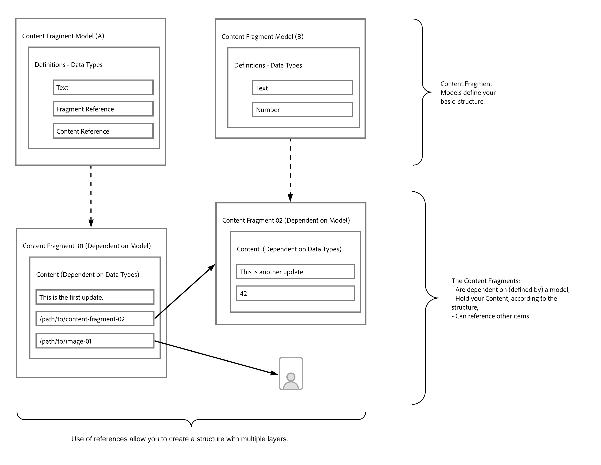

# 如何对内容{#model-your-content}进行建模

>[!CAUTION]
>
>正在进行中的工作 — 此文档的创建正在进行中，不应理解为完整或明确，也不应将其用于生产目的。

在[AEM无头开发者历程](overview.md)的这一部分中，您可以学习如何对内容结构建模。 然后，使用内容片段模型和内容片段实现Adobe Experience Manager(AEM)的结构，以便在渠道间重复使用。

## 迄今为止的故事{#story-so-far}

开始时[了解CMS。无外设开发](learn-about.md)涵盖无外设内容投放以及应使用它的原因。 然后，[将AEM Headless作为Cloud Service](getting-started.md)入门在您自己的项目上下文中描述了AEM Headless

在AEM无头旅程的上一个文档[使用AEM无头体验的第一次体验路径](/help/implementing/developing/headless-journey/path-to-first-experience.md)中，您学习了实施第一个项目所需的步骤。 读完后，您应：

* 了解设计内容时的重要规划注意事项
* 了解根据您的集成级别要求实施无外设的步骤。
* 设置必要的工具和AEM配置。
* 了解最佳实践，让您的无头旅程变得顺畅、保持内容生成高效并确保内容快速交付。

本文以这些基础为基础，因此您了解如何准备自己的AEM无头项目。

## 目标 {#objective}

* **受众**:初学者
* **目标**:了解如何对内容结构建模，然后使用AEM内容片段模型和内容片段实现该结构：
   * 介绍与数据/内容建模相关的概念和术语。
   * 了解为何需要内容建模来实现无外设内容投放。
   * 了解如何使用AEM内容片段模型（以及使用内容片段创作内容）实现此结构。
   * 了解如何对您的内容进行建模；基本样本的原则。

>[!NOTE]
>
>数据建模是一个很大的领域，它在开发关系数据库时使用。 有许多书籍和在线信息源可供使用。
>
>我们将仅考虑建模数据以与AEM Headless一起使用时需要考虑的方面。

## 内容建模{#content-modeling}

*外面是个大坏世界*。

也许，也许不是，但它肯定是一个大的&#x200B;***复杂的***&#x200B;世界，数据建模用于定义非常（非常）小的子节的简化表示，使用为特定目的所需的特定信息。

>[!NOTE]
>
>在AEM处理内容时，我们将数据建模称为内容建模。

例如：

学校很多，但它们有许多共同点：

* 位置
* 校长
* 许多教师
* 许多非教职员
* 许多学生
* 许多前教师
* 许多前学生
* 许多教室
* 许多（许多）书籍
* 多（多）件设备
* 许多课外活动
* 等等…….

即使在如此小的例子中，列表也可能看起来无穷无尽。 但是，如果您只是希望应用程序执行一个简单的任务，则需要将信息限制在基本内容中。

例如，为该地区的所有学校宣传特殊事件:

* 学校名称
* 学校位置
* 校长
* 事件类型
* 事件
* 教师组织事件

### 概念 {#concepts}

您要描述的称为&#x200B;**Entities** — 基本上是要存储相关信息的“事物”。

我们要存储的关于这些属性的信息是&#x200B;**属性**（属性），如“名称”和“教师资格”。

然后，实体之间存在各种&#x200B;**关系**。 例如，一所学校通常只有一位校长，而许多老师（而校长通常也是老师）。

分析和定义此信息的过程，以及它们之间的关系，称为&#x200B;**内容建模**。

### 基本信息 {#basics}

通常，您需要通过编写&#x200B;**描述实体及其关系的概念模式**&#x200B;来进行开始。 通常这是高级（概念）。

稳定后，您可以将模型转换为描述实体、属性和关系的&#x200B;**逻辑模式**。 在这一层面，您应仔细检查定义，以消除重复并优化您的设计。

>[!NOTE]
>
>有时，这两个步骤会合并，通常取决于方案的复杂性。

例如，您是需要为`Head Teacher`和`Teacher`单独的实体，还是只需在`Teacher`模型上添加一个附加属性？

### 确保数据完整性{#data-integrity}

数据完整性是保证内容在整个生命周期中的准确性和一致性所必需的。 这包括确保内容作者可以轻松了解存储内容的位置，因此以下内容至关重要：

* 清晰的结构
* 尽可能简洁（不牺牲精度）的结构
* 单个字段的验证
* 在适当时，将特定字段的内容限制为有意义的内容

### 消除数据冗余{#data-redundancy}

当同一信息在内容结构中存储两次时，会发生数据冗余。 这应避免，因为在创建内容时可能导致混淆，而在查询时会导致错误；更不用说滥用存储空间了。

### 优化和性能{#optimization-and-performance}

通过优化结构，您可以提高性能，包括内容创建和查询。

一切都是平衡，但创建一个过于复杂或层次过多的结构可以：

* 对于生成内容的作者而言，这令人困惑。

* 如果查询必须访问多个嵌套（引用的）内容片段以检索所需内容，则会严重影响性能。

## AEM Headless {#content-modeling-for-aem-headless}的内容建模

数据建模是一组已建立的技术，在开发关系数据库时经常使用，因此内容建模对AEM Headless意味着什么？

### 为什么？{#why}

要确保应用程序能够一致、高效地请求并从AEM接收所需内容，必须构建此内容。

这意味着您的应用程序事先知道响应的形式，因此知道如何处理它。 这比接收自由格式内容容易得多，后者必须进行分析以确定其包含的内容，从而确定其如何使用。

### 如何操作简介？{#how}

AEM使用内容片段来为应用程序提供无头投放内容所需的结构。

您的内容模型的结构是：

* 通过定义内容片段模型实现，
* 用作内容片段生成的基础。

>[!NOTE]
>
>内容片段模型还用作AEM GraphQL模式的基础，用于检索您的内容 — 有关内容的更多信息，请参阅以后的会话。

您的内容请求是使用AEM GraphQL API（标准GraphQL API的自定义实现）进行的。 AEM GraphQL API允许您对内容片段执行（复杂）查询，每个查询均根据特定模型类型而定。

返回的内容随后可供应用程序使用。

## 使用内容片段模型{#create-structure-content-fragment-models}创建结构

内容片段模型提供了各种机制，允许您定义内容的结构。

内容片段模型描述实体。

>[!NOTE]
>您必须在配置浏览器中启用内容片段功能，才能创建新模型。

>[!TIP]
>
>应命名该模型，以便内容作者知道创建内容片段时要选择的模型。

在模型中：

1. **“数** 据类型”允许您定义各个属性。例如，将包含教师姓名的字段定义为&#x200B;**Text**，将其服务年限定义为&#x200B;**Number**。
1. 数据类型&#x200B;**内容引用**&#x200B;和&#x200B;**片段引用**&#x200B;允许您创建与AEM中其他内容的关系。
1. **片段引用**&#x200B;数据类型允许您通过嵌套内容片段（根据模型类型）实现多级结构。 这对您的内容建模至关重要。

例如：

### 数据类型 {#data-types}

AEM为您提供以下数据类型来对内容进行建模：

* 单行文本
* 多行文本
* 数字
* 布尔型
* 日期和时间
* 枚举
* 标记
* 内容引用
* 片段引用
* JSON 对象

### 引用和嵌套内容{#references-nested-content}

两种数据类型提供对特定片段外部内容的引用：

* **内容**
引用提供对任何类型的其他内容的简单引用。例如，您可以在指定位置引用图像。

* **片段**
引用提供对其他内容片段的引用。此类引用用于创建嵌套内容，介绍为内容建模所需的关系。
数据类型可配置为允许片段作者：
   * 直接编辑引用的片段。
   * 根据相应的模型创建新内容片段

### 创建内容片段模型{#creating-content-fragment-models}

首先，为您的站点启用内容片段模型，这是在配置浏览器中完成的：

然后，可以对内容片段模型进行建模：

>[!NOTE]
>
>请参阅使用内容片段。

## 使用模型创作内容片段{#use-content-to-author-content}的内容

内容片段始终基于内容片段模型。 模型提供结构，片段保存内容。

### 选择合适的型号{#select-model}

实际创建内容的第一步是创建内容片段。 这基于特定的内容片段模型，您选择该模型作为创建过程的第一步。

### 创建和编辑结构化内容{#create-edit-structured-content}

创建片段后，您可以在内容片段编辑器中打开它。 在此对话框中，您可以：

* 在正常或全屏模式下编辑您的内容。
* 将您的内容格式设置为全文、纯文本或标记。
* 创建和管理内容的变体。
* 关联内容.
* 编辑元数据。
* 显示树结构。
* 预览JSON表示形式。

### 创建内容片段{#creating-content-fragments}

选择适当的模型后，将打开一个内容片段以在内容片段编辑器中进行编辑：

>[!NOTE]
>
>请参阅使用内容片段。

## 一些示例{#getting-started-examples}入门

<!--
tbc...
...and/or see the structures covered for the GraphQL samples...
...will those (ever) be delivered as an official sample package?
-->

有关示例等基本结构，请参阅示例内容片段结构。

## 下一步是什么{#whats-next}

既然您已经学习了如何建立结构模型并创建相关内容，下一步是[了解如何使用GraphQL查询访问和检索内容片段内容](access-your-content.md)。 这将介绍并讨论GraphQL，然后查看一些示例查询，了解实际操作情况。

## 其他资源 {#additional-resources}

* [使用内容片段](/help/assets/content-fragments/content-fragments.md)  — 内容片段的导入页面
   * [配置浏览器中的内容片段](/help/assets/content-fragments/content-fragments-configuration-browser.md)  — 在配置浏览器中启用内容片段功能
   * [内容片段模型](/help/assets/content-fragments/content-fragments-models.md)  — 创建和编辑内容片段模型
   * [管理内容片段](/help/assets/content-fragments/content-fragments-managing.md)  — 创建和创作内容片段；本页将引导您进入其他详细章节
* [AEM GraphQL模式](/help/implementing/developing/headless-journey/access-your-content.md) - GraphQL如何实现模型
* [示例内容片段结构](/help/assets/content-fragments/content-fragments-graphql-samples.md#content-fragment-structure-graphql)
* [AEM无头入门](https://experienceleague.adobe.com/docs/experience-manager-learn/getting-started-with-aem-headless/graphql/overview.html)  — 一个简短的视频教程系列概述了使用AEM无头功能，包括内容建模和GraphQL
