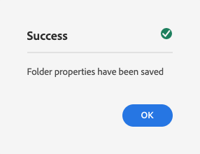

# 创建资产文件夹无头快速开始指南{#creating-an-assets-folder}

内容片段模型定义内容片段的结构。 然后，内容片段存储在资产文件夹中。

##  什么是资产文件夹？{#what-is-an-assets-folder}

[现在，您已创建内容片](create-content-model.md) 段模型，该模型定义了您未来的内容片段的结构，您可能很兴奋能够创建一些片段。

但是，您首先需要创建一个资产文件夹来存储资产。

资产文件夹用于[组织传统内容资产](/help/assets/manage-digital-assets.md)，如图像和视频以及内容片段。

## 如何创建资产文件夹{#how-to-create-an-assets-folder}

管理员只需偶尔创建文件夹，即可在创建内容时对其进行组织。 为便于本入门指南使用，我们只需创建一个文件夹。

1. 以Cloud Service身份登录AEM，并从主菜单中选择&#x200B;**导航->资产->文件**。
1. 点按或单击&#x200B;**创建->文件夹**。
1. 为您的文件夹提供&#x200B;**标题**&#x200B;和&#x200B;**名称**。
   * **标题**&#x200B;应为描述性。
   * **名称**&#x200B;将成为存储库中的节点名称。
      * 它将根据标题自动生成，并根据[AEM命名约定进行调整。](/help/implementing/developing/introduction/naming-conventions.md)
      * 如有必要，可进行调整。

   
1. 选择刚创建的文件夹，然后从工具栏中选择&#x200B;**属性**（或使用`p` [键盘快捷键。](/help/sites-cloud/authoring/getting-started/keyboard-shortcuts.md)）
1. 在&#x200B;**属性**&#x200B;窗口中，选择&#x200B;**Cloud Services**&#x200B;选项卡。
1. 对于&#x200B;**云配置**&#x200B;选择您之前创建的[配置。](create-configuration.md)

   
1. 点按或单击&#x200B;**保存并关闭**。
1. 点按或单击确认窗口中的&#x200B;**确定**。

   

您可以在刚刚创建的文件夹中创建其他子文件夹。 子文件夹将继承父文件夹的&#x200B;**云配置**。 但是，如果希望使用其他配置的模型，则可以覆盖此值。

如果您使用的是本地化的站点结构，则可以在新文件夹下[创建语言根](/help/assets/translate-assets.md)。

## 后续步骤{#next-steps}

现在，您已经为内容片段创建了文件夹，现在可以转到入门指南的第四部分，并[创建内容片段。](create-content-fragment.md)

>[!TIP]
>
>有关管理内容片段的完整详细信息，请参阅[内容片段文档](/help/assets/content-fragments/content-fragments.md)
