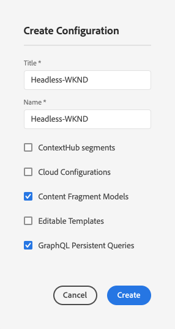

# 创建配置无头快速入门指南{#creating-configuration}

在AEM as a Cloud Service中开始使用无头功能时，您需要创建一个配置。

## 什么是配置？{#what-is-a-configuration}

配置浏览器为AEM中的配置提供了通用配置API、内容结构和解析机制。

在AEM中进行无头内容管理时，请将配置视为AEM中的一个工作区，您可以在其中创建内容模型，该模型定义将来内容和内容片段的结构。 您可以有多个配置来分隔这些模型。

如果您熟悉全栈AEM实施中的[页面模板，则](/help/sites-cloud/authoring/features/templates.md)配置在内容模型管理中的使用情况类似。

## 如何创建配置{#how-to-create-a-configuration}

管理员只需创建一次配置，或在组织内容模型时非常自行地创建新工作区。 在本快速入门指南中，我们只需创建一个配置。

1. 以Cloud Service身份登录AEM，然后从主菜单中选择&#x200B;**工具 — >常规 — >配置浏览器**。
1. 为您的配置提供&#x200B;**标题**&#x200B;和&#x200B;**名称**。
   * **Title**&#x200B;应该是描述性的。
   * **Name**&#x200B;将成为存储库中的节点名称。
      * 它将根据标题自动生成，并根据[AEM命名约定进行调整。](/help/implementing/developing/introduction/naming-conventions.md)
      * 如有必要，可进行调整。
1. 选中以下选项：
   * **内容片段模型**
   * **GraphQL永久查询**

   

1. 点按或单击&#x200B;**创建**

您可以根据需要创建多个配置。 配置也可以嵌套。

>[!NOTE]
>
>除&#x200B;**内容片段模型**&#x200B;和&#x200B;**GraphQL持久查询**&#x200B;之外，可能还需要配置选项，具体取决于您的实施要求。

## 后续步骤{#next-steps}

使用此配置，您现在可以转到入门指南的第二部分，并[创建内容片段模型。](create-content-model.md)

>[!TIP]
>
>有关配置浏览器的完整详细信息，请[参阅配置浏览器文档。](/help/implementing/developing/introduction/configurations.md)
