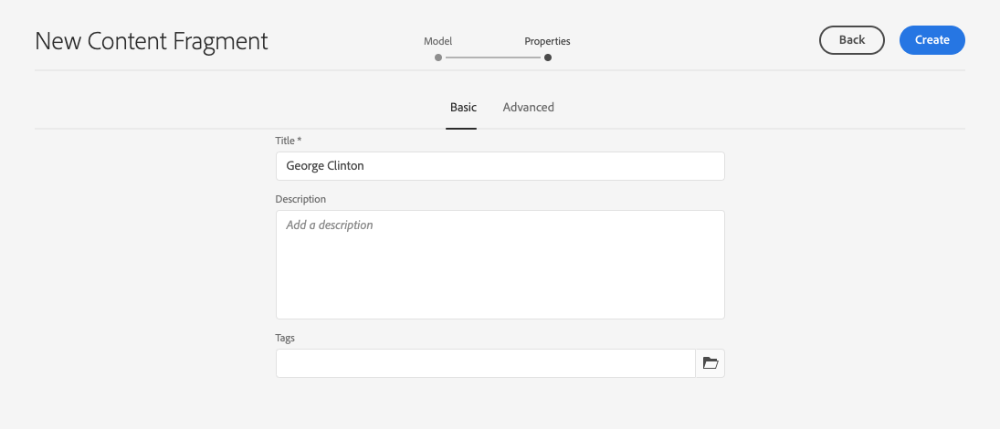
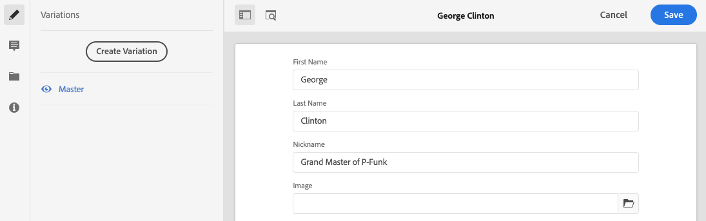

# 创建内容片段无头快速入门指南{#creating-content-fragments}

了解如何使用AEM内容片段设计、创建、策划和使用独立于页面的内容进行无头交付。

## 什么是内容片段？{#what-are-content-fragments}

[现在，您已创建一个资产](create-assets-folder.md) 文件夹，可以在其中存储内容片段，接下来可以创建片段！

内容片段允许您设计、创建、策划和发布独立于页面的内容。 利用这些功能，可准备内容以准备在多个位置和多个渠道上使用。

内容片段包含结构化内容，可以采用JSON格式交付。

## 如何创建内容片段{#how-to-create-a-content-fragment}

内容作者将创建任意数量的内容片段来表示他们创建的内容。 这将是他们在AEM中的主要任务。 在本快速入门指南中，我们只需创建一个。

1. 以Cloud Service身份登录AEM，然后从主菜单中选择&#x200B;**导航 — >资产**。
1. 点按或单击您之前创建的[文件夹。](create-assets-folder.md)
1. 点按或单击&#x200B;**创建 — >内容片段**。
1. 内容片段的创建将以两个步骤的向导形式呈现。 首先选择要用于创建内容片段的模型，然后点按或单击&#x200B;**Next**。
   * 可用的模型取决于您为创建内容片段的资产文件夹](create-assets-folder.md)定义的&#x200B;[**云配置**。
   * 如果收到消息`We could not find any models`，请检查资产文件夹的配置。

   
1. 根据需要提供&#x200B;**标题**、**描述**&#x200B;和&#x200B;**标记**，然后点按或单击&#x200B;**创建**。

   
1. 点按或单击确认窗口中的&#x200B;**打开** 。

   
1. 在内容片段编辑器中提供内容片段的详细信息。

   
1. 点按或单击&#x200B;**Save**&#x200B;或&#x200B;**Save &amp; close**。

内容片段可以引用其他内容片段，从而允许在必要时使用嵌套的内容结构。

内容片段还可以引用AEM中的其他资产。 [在创建引用内容片段之](/help/assets/manage-digital-assets.md) 前，需要将这些资产存储在AEM中。

## 后续步骤{#next-steps}

现在，您已创建内容片段，接下来可以转到入门指南的最后部分和[创建API请求以访问和交付内容片段。](create-api-request.md)

>[!TIP]
>
>有关管理内容片段的完整详细信息，请参阅[内容片段文档](/help/assets/content-fragments/content-fragments.md)
