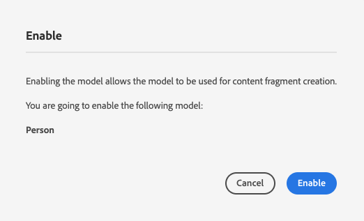
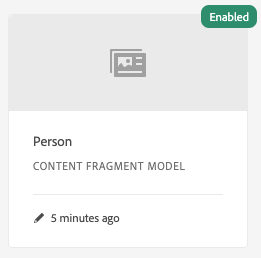

# 创建内容片段模型无头快速开始指南{#creating-content-fragment-models}

内容片段模型定义您将使用AEM无头功能创建和提供的内容的结构。

## 什么是内容片段模型？{#what-are-content-fragment-models}

[现在您已经创建了配置，](create-configuration.md) 可以使用它创建内容片段模型。

内容片段模型定义您将在AEM中创建和管理的数据和内容的结构。 它们充当了内容的基架。 选择创建内容时，作者将从您定义的内容片段模型中进行选择，该模型将指导他们创建内容。

## 如何创建内容片段模型{#how-to-create-a-content-fragment-model}

信息架构师只会在需要新模型时偶尔执行这些任务。 为了本入门指南的目的，我们只需创建一个模型。

1. 以Cloud Service身份登录AEM，从主菜单中选择&#x200B;**工具->资产->内容片段模型**。
1. 点按或单击通过创建配置创建的文件夹。

   
1. 点按或单击&#x200B;**创建**。
1. 提供&#x200B;**模型标题**、**标记**&#x200B;和&#x200B;**描述**。 还可以选择／取消选择&#x200B;**启用模型**&#x200B;以控制模型是否在创建时立即启用。

   
1. 在确认窗口中，点按或单击&#x200B;**打开**&#x200B;以配置您的型号。

   
1. 使用&#x200B;**内容片段模型编辑器**，通过拖放&#x200B;**数据类型**&#x200B;列中的字段来构建内容片段模型。

   

1. 放置字段后，必须配置其属性。 编辑器将自动切换到添加字段的&#x200B;**属性**&#x200B;选项卡，您可以在其中提供必填字段。

   
1. 构建完模型后，点按或单击&#x200B;**保存**。 新创建的模型以&#x200B;**Draft**&#x200B;模式保存。

   
1. 必须启用模型才能使用它（如果尚未启用）。 选择刚刚创建的模型，然后点按或单击&#x200B;**启用**。

   
1. 点按或单击确认对话框中的&#x200B;**启用**，确认启用模型。

   
1. 模型现已启用并可供使用。

   

**内容片段模型编辑器**&#x200B;支持许多不同的数据类型，如简单文本字段、资产引用、对其他模型的引用和JSON数据。

您可以创建多个模型。 模型可以引用其他内容片段。 使用[配置](create-configuration.md)组织模型。

## 后续步骤{#next-steps}

现在，您已通过创建模型定义了内容片段的结构，您可以转到入门指南的第三部分，并[创建文件夹，以便存储片段本身。](create-assets-folder.md)

>[!TIP]
>
>有关内容片段模型的完整详细信息，请参阅[内容片段模型文档](/help/assets/content-fragments/content-fragments-models.md)
