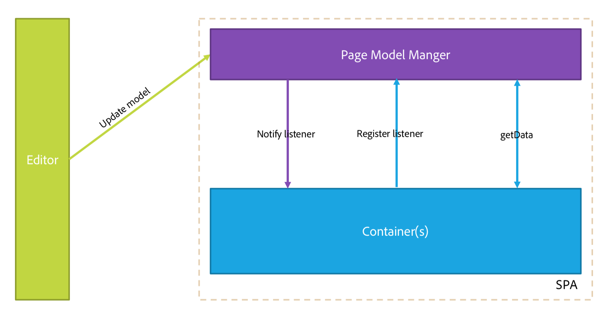

# SPA 编辑器概述 {#spa-editor-overview}

单页应用程序 (SPA) 可以为网站用户提供引人入胜的良好体验。开发人员希望能够使用 SPA 框架构建站点，而作者则希望能够在 AEM 中顺畅地为使用此类框架构建的站点编辑内容。

SPA 编辑器提供了一个全面的解决方案来支持 AEM 中的 SPA。此页面概述了 SPA 支持在 AEM 中的结构、SPA 编辑器的工作原理以及 SPA 框架和 AEM 保持同步的方式。

## 简介 {#introduction}

使用 React 和 Angular 等常见 SPA 框架构建的站点通过动态 JSON 加载其内容，并且不提供 AEM 页面编辑器放置编辑控件时所需的 HTML 结构。

要在 AEM 中启用 SPA 编辑，需要 SPA 的 JSON 输出与 AEM 存储库中的内容模型之间的映射以保存对内容所做的更改。

AEM 中的 SPA 支持引入了一个薄的 JS 层，该层在页面编辑器中加载时与 SPA JS 代码进行交互，从而发送事件并激活编辑控件的位置以允许进行上下文编辑。此功能以Content Services API端点概念为基础，因为必须通过Content Services加载SPA中的内容。

有关AEM中SPA的更多详细信息，请参阅以下内容：

* [SPA Blueprint](blueprint.md)，了解 SPA 的技术要求.
* [使用 React 在 AEM 中开始使用 SPA](getting-started-react.md)，快速了解使用 React 的简单 SPA.
* [使用 Angular 在 AEM 中开始使用 SPA](getting-started-angular.md)，快速了解使用 Angular 的简单 SPA.

## 设计 {#design}

SPA 的页面组件不通过 JSP 或 HTL 文件提供其子组件的 HTML 元素。此操作将委派给 SPA 框架。从 JCR 中以 JSON 数据结构形式获取子组件或模型的呈现。之后，根据该结构将 SPA 组件添加到页面。此行为将页面组件的初始主体构图与非 SPA 对应项区分开来。

### 页面模型管理 {#page-model-management}

页面模型的解析和管理工作将委派给提供的 `PageModel` 库。SPA 必须使用页面模型库才能由 SPA 编辑器进行初始化和创作。页面模型库通过 `aem-react-editable-components` npm 间接提供给 AEM 页面组件。页面模型是 AEM 和 SPA 之间的解释器，因此必须始终存在。在创作页面时，必须额外添加一个 `cq.authoring.pagemodel.messaging` 库以便支持与页面编辑器的通信。

如果 SPA 页面组件继承自页面核心组件，则可通过两个选项使 `cq.authoring.pagemodel.messaging` 客户端库类别可用：

* 如果模板是可编辑的，请将它添加到页面策略中。
* 或者，使用 `customfooterlibs.html` 添加类别。

对于已导出模型中的每个资源，SPA 将映射一个用于呈现的实际组件。
之后，使用容器内的组件映射呈现以 JSON 形式表示的模型。

>[!CAUTION]
>
>`cq.authoring.pagemodel.messaging` 类别的包含应限于 SPA 编辑器的上下文。

### 通信数据类型 {#communication-data-type}

在将 `cq.authoring.pagemodel.messaging` 类别添加到页面时，它会向页面编辑器发送一条消息以建立 JSON 通信数据类型。当通信数据类型设置为 JSON 时，GET 请求将与组件的 Sling 模型端点进行通信。在页面编辑器中执行更新后，已更新组件的 JSON 表示形式将发送到页面模型库。之后，页面模型库会将更新告知 SPA。

## 工作流 {#workflow}

您可以通过将 SPA 编辑器视为 SPA 和 AEM 之间的介质来理解两者之间的交互流程。

* 页面编辑器和 SPA 之间的通信采用的是 JSON 而不是 HTML。
* 页面编辑器通过 iframe 和消息 API 向 SPA 提供最新版本的页面模型。
* 页面模型管理器告知编辑器它已准备好进行编辑，并将页面模型作为 JSON 结构进行传递。
* 编辑器不更改或访问正在创作的页面的 DOM 结构，而是提供最新的页面模型。

### 基本 SPA 编辑器工作流 {#basic-spa-editor-workflow}

请记住，SPA 编辑器的关键元素，面向作者的在 AEM 中编辑 SPA 的高级工作流如下所示。

1. SPA 编辑器加载。
1. SPA 是在一个单独的框架中加载的。
1. SPA 请求 JSON 内容并在客户端呈现组件。
1. SPA 编辑器检测呈现的组件并生成叠加。
1. 作者单击叠加，这将显示组件的编辑工具栏。
1. SPA 编辑器通过向服务器发出 POST 请求来保存编辑内容。
1. SPA 编辑器向 SPA 编辑器请求更新的 JSON，后者通过 DOM 事件发送到 SPA。
1. SPA 重新呈现相关组件，并更新其 DOM。

>[!NOTE]
>
>请牢记：
>
>* SPA 始终负责其显示。
>* SPA 编辑器与 SPA 本身隔离。
>* 在生产（发布）中，从不加载 SPA 编辑器。

### 客户端服务器页面编辑工作流 {#client-server-page-editing-workflow}

这是对编辑 SPA 时的客户端-服务器交互的更详细概述。

1. SPA 初始化自身并从 Sling 模型导出器请求页面模型。
1. Sling 模型导出器从存储库中请求构成页面的资源。
1. 存储库返回资源。
1. Sling 模型导出器返回页面的模型。
1. SPA 根据页面模型实例化其组件。
1. **6a** 内容告知编辑器它已可供创作。

   **6b** 页面编辑器请求组件创作配置。

   **6c** 页面编辑器接收组件配置。
1. 当作者编辑组件时，页面编辑器将修改请求发送到默认 POST servlet。
1. 资源在存储库中进行更新。
1. 更新的资源将提供给 POST servlet。
1. 默认 POST servlet 告知页面编辑器资源已更新。
1. 页面编辑器请求新的页面模型。
1. 构成页面的资源是从存储库中请求的。
1. 存储库将构成页面的资源提供给 Sling 模型导出器。
1. 更新的页面模型将返回给编辑器。
1. 页面编辑器更新 SPA 的页面模型引用。
1. SPA 根据新的页面模型引用来更新其组件。
1. 页面编辑器的组件配置将进行更新。

   **17a** SPA 告知页面编辑器内容已就绪。

   **17b** 页面编辑器向 SPA 提供组件配置。

   **17c** SPA 提供更新后的组件配置。

### 创作工作流 {#authoring-workflow}

这是一个更详细的概述，重点说明了创作体验。

1. SPA 获取页面模型。
1. **2a** 页面模型为编辑器提供创作所需的数据。

   **2b** 在收到通知后，组件编排器将更新页面的内容结构。
1. 组件编排器将查询 AEM 资源类型和 SPA 组件之间的映射。
1. 组件编排器根据页面模型和组件映射来动态实例化 SPA 组件。
1. 页面编辑器将更新页面模型。
1. **6a** 页面模型向页面编辑器提供更新后的创作数据。

   **6b** 页面模型将更改发送到组件编排器。
1. 组件编排器将获取组件映射。
1. 组件编排器将更新页面内容。
1. 当 SPA 更新完页面内容时，页面编辑器将加载创作环境。

## 要求和限制 {#requirements-limitations}

要使作者能够使用页面编辑器编辑 SPA 的内容，必须实施您的 SPA 应用程序以便与 AEM SPA Editor SDK 进行交互。请参阅[使用 React 在 AEM 中开始使用 SPA](getting-started-react.md) 文档，了解开始使用 SPA 的最低要求。

### 支持的框架 {#supported-frameworks}

SPA 编辑器 SDK 支持以下最低版本：

* React 16.x 及更高版本
* Angular 6.x 及更高版本

这些框架的早期版本可以与 AEM SPA Editor SDK 结合使用，但它们不受支持。

### 其他框架 {#additional-frameworks}

可以实施其他 SPA 框架以与 AEM SPA Editor SDK 结合使用。请参阅 [SPA Blueprint](blueprint.md) 文档，了解框架必须满足哪些要求，才能创建由模块、组件和服务组成的框架特定的层以与 AEM SPA Editor 结合使用。

### 使用多个选择器 {#multiple-selectors}

可以定义其他自定义选择器并将其用作针对 AEM SPA SDK 开发的 SPA 的一部分。但是，此支持要求 `model` 选择器是第一个选择器，并据 JSON 导出器要求，扩展名须为 `.json`。

### 文本编辑器要求 {#text-editor-requirements}

如果您想使用在 SPA 中创建的文本组件的就地编辑器，则需要进行额外配置。

1. 在包含文本 HTML 的容器包装器元素上设置属性（可以是任意属性）。对于 WKND SPA Project，它是一个 `
` 元素，并且使用的选择器是 `data-rte-editelement`。
1. 在指向该选择器的相应 AEM 文本组件的 `cq:InplaceEditingConfig` 上设置配置 `editElementQuery`，例如 `data-rte-editelement`。这可让编辑器知道哪个 HTML 元素包装了 HTML 文本。

有关富文本编辑器的 `editElementQuery` 属性和配置的更多信息，请参阅[配置富文本编辑器。](/help/implementing/developing/extending/rich-text-editor.md)

### 限制 {#limitations}

AEM SPA Editor SDK 已获得 Adobe 的完全支持，并且在不断得到增强和扩展。SPA Editor 尚不支持以下 AEM 功能：

* 目标架构
* ContextHub
* 内联图像编辑
* 编辑配置（例如，监听器）
* 还原/重做
* 页面差异和时间扭曲
* 执行HTML重写服务器端的功能，如链接检查器、CDN重写器服务、URL缩短等。
* 开发人员架构
* AEM 启动项
