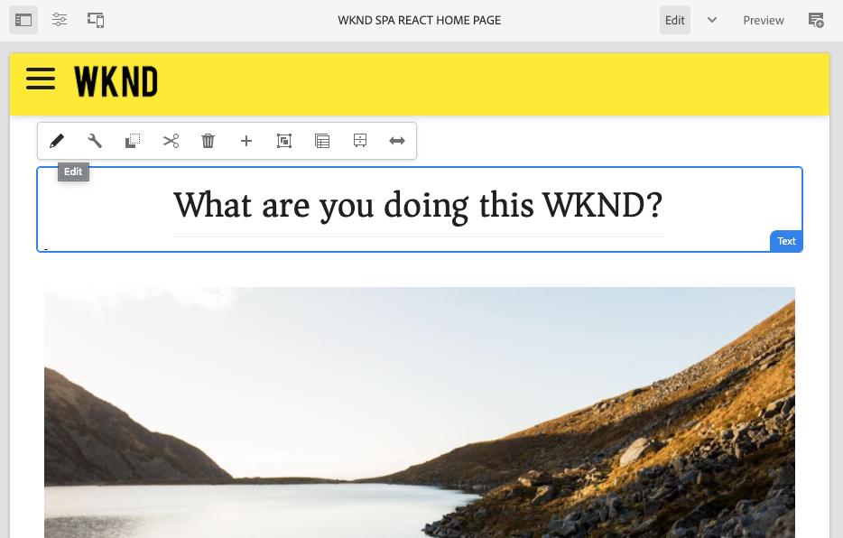

# SPA 简介和演练 {#spa-introduction}

单页应用程序 (SPA) 可以为网站用户提供引人入胜的良好体验。开发人员希望能够使用SPA框架构建站点，而作者则希望在AEM中为使用此类框架构建的站点无缝编辑内容。

SPA编辑器提供了一个全面的解决方案，可在AEM中支持SPA。 本文将介绍如何使用基本的SPA应用程序进行创作，并显示它与基础AEM SPA编辑器的关系。

## 简介 {#introduction}

### 文章目标 {#article-objective}

本文介绍了SPA的基本概念，然后通过使用一个简单的SPA应用程序来演示基本的内容编辑，引导读者完成SPA编辑器的演练。 然后，可深入探讨页面的构建以及SPA应用程序如何与AEM SPA编辑器关联并与之交互。

本介绍和演练的目标是向AEM开发人员演示SPA的相关性、其通常工作方式、AEM SPA编辑器如何处理SPA，以及它与标准AEM应用程序有何不同。

演练基于标准AEM功能和示例WKND SPA项目应用程序。 请跟进 [在此处，可从GitHub下载并安装示例WKND SPA项目应用程序。](https://github.com/adobe/aem-guides-wknd-spa)

>[!CAUTION]
>
>本文档使用 [WKND SPA项目应用程序](https://github.com/adobe/aem-guides-wknd-spa) 仅用于演示目的。 它不应用于任何项目工作。

>[!TIP]
>
>任何AEM项目都应利用 [AEM项目原型](https://experienceleague.adobe.com/docs/experience-manager-core-components/using/developing/archetype/overview.html)，它支持使用React或Angular的SPA项目并利用SPA SDK。

### 什么是SPA? {#what-is-a-spa}

单页应用程序(SPA)与常规页面的不同之处在于，它在客户端呈现，且主要由Javascript驱动，它依赖Ajax调用来加载数据和动态更新页面。 大多数或所有内容在单页加载中检索一次，并根据用户与页面的交互，根据需要异步加载其他资源。

这减少了页面刷新的需求，并为用户提供了无缝、快速且更像本机应用程序体验的体验。

AEM SPA编辑器允许前端开发人员创建可集成到AEM站点中的SPA，从而允许内容作者像任何其他AEM内容一样轻松地编辑SPA内容。

### 为什么选择SPA? {#why-a-spa}

通过更快、更流畅、更像本机应用程序，SPA不仅对网页的访客非常有吸引力，而且对营销人员和开发人员也非常有吸引力，因为SPA的工作方式很有吸引力。

#### 访客数 {#visitors}

* 访客在与内容进行交互时需要类似于本机的体验。
* 有明确的数据表明，页面越快，发生转化的可能性就越大。

#### 营销人员 {#marketers}

* 营销人员希望提供丰富的类似本机的体验，以吸引访客充分参与内容活动。
* 个性化可以使这些体验更加引人注目。

#### 开发人员 {#developers}

* 开发人员希望将内容和演示之间的问题清晰地分开。
* 清洁分离使系统更具扩展性，并允许独立的前端开发。

### SPA的工作原理是什么？ {#how-does-a-spa-work}

SPA的主要思想是减少对服务器的调用和对服务器的依赖，以最小化由服务器延迟引起的延迟，以便SPA接近本机应用程序的响应。

在传统的连续网页中，只会加载立即页面所需的数据。 这意味着当访客移动到其他页面时，将为其他资源调用服务器。 当访客与页面上的元素交互时，可能需要进行其他调用。 由于页面必须跟上访客的请求，因此这多个调用可能会产生延迟或延迟感。

要获得更流畅的体验（即接近访客从移动设备本机应用程序中的期望体验），SPA会在首次加载时为访客加载所有必需数据。 虽然这一过程最初可能需要花费一些时间，但随后便不再需要额外的服务器调用。

通过在客户端进行渲染，页面元素可以更快地做出反应，并且访客与页面的交互是即时的。 可能需要的任何其他数据都将进行异步调用，以最大化页面速度。

>[!TIP]
>
>有关SPA如何在AEM中工作的技术详细信息，请参阅以下文章：
>* [AEM中的SPA使用React快速入门](getting-started-react.md)
>* [AEM SPA使用Angular入门](getting-started-angular.md)
>
>有关SPA编辑器的设计、架构和技术工作流程的详细信息，请参阅文章：
>* [SPA 编辑器概述](editor-overview.md).

## 使用SPA编辑内容体验 {#content-editing-experience-with-spa}

构建SPA以利用AEM SPA编辑器时，内容作者注意到在编辑和创建内容时没有区别。 提供了常见的AEM功能，无需更改作者的工作流程。

1. 在AEM中编辑WKND SPA Project应用程序。

   `http://localhost:4502/editor.html/content/wknd-spa-react/us/en/home.html`

   

1. 选择文本组件后，请注意工具栏会像任何其他组件一样显示。 选择&#x200B;**编辑**。

   

1. 在AEM中照常编辑内容，并注意将保留更改。

   

1. 使用资产浏览器将新图像拖放到图像组件中。

   

1. 将保留更改。

   

与任何非SPA AEM应用程序一样，支持其他创作工具，例如在页面上拖放其他组件、重新排列组件和修改布局。

>[!NOTE]
>
>SPA编辑器不会修改应用程序的DOM。 SPA本身负责DOM。
>
>要了解其工作原理，请继续阅读本文的下一节 [SPA应用程序和AEM SPA编辑器](#spa-apps-and-the-aem-spa-editor).

## SPA应用程序和AEM SPA编辑器 {#spa-apps-and-the-aem-spa-editor}

了解SPA对最终用户的行为方式，然后检查SPA页面有助于更好地了解SAP应用程序如何与AEM中的SPA Editor配合使用。

### 使用SPA应用程序 {#using-an-spa-application}

1. 在发布服务器上或使用选项加载WKND SPA Project应用程序 **查看已发布的项目** 从 **页面信息** 菜单。

   `http://<host>:<port>/content/wknd-spa-react/us/en/home.html`

   

   请注意页面结构，包括导航到子页面、菜单和文章卡片。

1. 使用菜单导航到子页面，并查看页面是否立即加载，而无需刷新。

   

1. 在导航子页面时，打开浏览器的内置开发人员工具并监视网络活动。

   

   当您在应用程序中从一个页面移动到另一个页面时，流量非常少。 不会重新加载页面，只会请求新图像。

   SPA完全在客户端管理内容和路由。

那么，如果在子页面中导航时未重新加载页面，该页面是如何加载的？

下一节， [加载SPA应用程序](#loading-a-spa-application)，深入了解加载SPA的机制以及如何同步和异步加载内容。

### 加载SPA应用程序 {#loading-a-spa-application}

1. 如果尚未加载，请在发布服务器上或使用选项加载WKND SPA Project应用程序 **查看已发布的项目** 从 **页面信息** 菜单。

   `http://<host>:<port>/content/wknd-spa-react/us/en/home.html`

   

1. 使用浏览器的内置工具查看页面源。
1. 请注意，源的内容有限。
   * 页面的正文中没有任何内容。 它主要由样式表和对各种脚本(如 `clientlib-react.min.js`.
   * 这些脚本是此应用程序的主要驱动程序，负责渲染所有内容。

1. 使用浏览器的内置工具检查页面。 查看已完全加载的DOM的内容。

   

1. 切换到检查器中的“网络”选项卡，然后重新加载该页面。

   忽略图像请求，请注意，为页面加载的主要资源是页面本身、CSS、React Javascript、其依赖项以及页面的JSON数据。

   

1. 加载 `home.model.json` 中。

   `http://<host>:<port>/content/wknd-spa-react/us/en/home.model.json`

   

   AEM SPA编辑器可利用 [AEM Content Services](/help/assets/content-fragments/content-fragments.md) 以JSON模型的形式交付页面的整个内容。

   通过实施特定界面，Sling模型为SPA提供必要的信息。 JSON数据的提交会向下委派给每个组件（从页面、段落、组件等）。

   每个组件都会选择它公开的内容以及呈现方式(使用HTL的服务器端，或使用React或Angular的客户端)。 本文重点介绍使用React进行客户端渲染。

1. 模型还可以将页面分组在一起，以便同步加载页面，从而减少需要重新加载页面的次数。

   在WKND SPA Project应用程序的示例中， `home`, `page-1`, `page-2`和 `page-3` 页面会同步加载，因为访客通常会访问所有这些页面。

   此行为不是强制性的，且可完全定义。

   

1. 要查看行为差异，请重新加载 `home` 页面，并清除检查器的网络活动。 导航到 `page-1` ，并查看 `page-1`. `page-1` 本身无需加载。

   

### 与SPA编辑器交互 {#interaction-with-the-spa-editor}

使用WKND SPA Project示例应用程序，可以清楚地了解应用程序的行为和在发布时加载的方式，将内容服务用于JSON内容交付以及异步加载资源。

此外，对于内容作者而言，在AEM中使用SPA编辑器进行内容创建是无缝的。

在以下部分中，我们将探索允许SPA编辑器将SPA中的组件与AEM组件相关联，并实现这种无缝编辑体验的合同。

1. 在编辑器中加载WKND SPA Project应用程序，并切换到 **预览** 模式。

   `http://<host>:<port>/editor.html/content/wknd-spa-react/us/en/home.html`

1. 使用浏览器内置的开发人员工具，检查页面内容。 使用选择工具，在页面上选择一个可编辑的组件，然后查看元素详细信息。

   请注意，组件具有新的数据属性 `data-cq-data-path`.

   

   例如

   `data-cq-data-path="/content/wknd-spa-react/us/en/home/jcr:content/root/responsivegrid/text`

   此路径允许检索和关联每个组件的编辑上下文配置对象。

   这是编辑器将其识别为SPA中的可编辑组件所需的唯一标记属性。 SPA编辑器将根据此属性确定与组件关联的可编辑配置，以便正确的框架、工具栏等。 已加载。

   还为标记占位符和资产拖放功能添加了一些特定类名称。

   >[!NOTE]
   >
   >此行为与AEM中的服务器端渲染页面不同，其中 `cq` 元素。
   >
   >在SPA编辑器中使用这种方法，无需插入自定义元素，而只需依赖附加的数据属性，从而使前端开发人员可以更轻松地进行标记。

## AEM 中的 Headful 和 Headless {#headful-headless}

SPA可以在AEM中通过灵活的集成级别来启用，包括在AEM之外开发和维护的SPA。 此外，SPA还可以在AEM中利用，同时使用AEM无头地向其他端点交付内容。

>[!TIP]
>
>有关详细信息，请参阅 [AEM 中的 Headful 和 Headless](/help/implementing/developing/headful-headless.md)。

## 后续步骤 {#next-steps}

现在，您已了解AEM中的SPA编辑体验以及SPA与SPA编辑器的关系，接下来请更深入地了解如何构建SPA。

* [AEM SPA使用React快速入门](getting-started-react.md) 显示如何构建基本SPA以使用AEM中的SPA Editor（使用React）
* [AEM SPA快速入门(使用Angular)](getting-started-angular.md) 显示如何构建基本的SPA以使用AEM中的SPA编辑器Angular
* [SPA编辑器概述](editor-overview.md) 更深入地介绍了AEM与SPA之间的通信模型。
* [开发SPA for AEM](developing.md) 介绍如何吸引前端开发人员参与AEM开发SPA，以及SPA如何与AEM架构进行交互。
