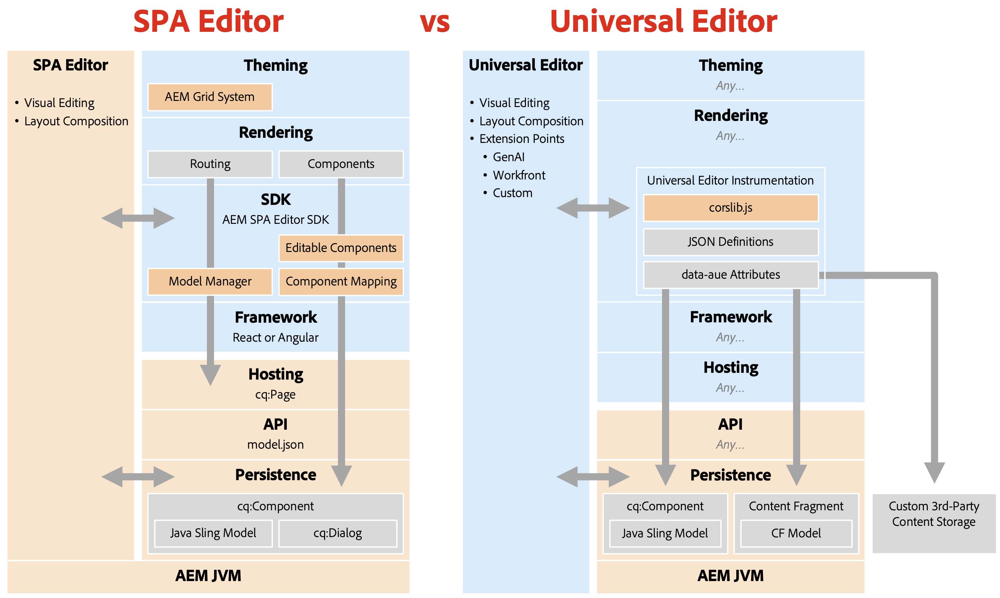

# SPA 编辑器弃用 {#spa-editor-deprecation}

尽管SPA编辑器仍受Adobe支持，但请了解它弃用对您的项目有何影响以及您对未来项目有哪些选项。

## 摘要 {#summary}

Adobe通过[2025.01版的AEM as a Cloud Service，](/help/release-notes/release-notes-cloud/2025/release-notes-2025-1-0.md#spa-editor)弃用SPA编辑器，这意味着将不再对其SDK进行进一步的增强或更新。 Adobe鼓励您将[Universal Editor](/help/implementing/universal-editor/introduction.md)用于任何新项目，以利用AEM的最新创新。

## 弃用的详细信息 {#details}

弃用SPA编辑器&#x200B;**并不意味着立即删除**，如果您有现有的实施，**只要它符合您的需求，就可以继续使用。**&#x200B;但是，请注意其弃用的以下影响。

* 今后，Adobe将仅解决P1和P2问题和安全漏洞。
* 未来不会再对其SDK进行任何开发、增强或更新。

弃用意味着以下SDK现在处于功能冻结状态。

* [AEM项目原型](https://github.com/adobe/aem-project-archetype/)
* [AEM SPA项目核心](https://github.com/adobe/aem-spa-project-core)
* [AEM SPA页面模型管理器](https://github.com/adobe/aem-spa-page-model-manager)
* [AEM SPA组件映射](https://github.com/adobe/aem-spa-component-mapping)
* [AEM SPA React 可编辑组件](https://github.com/adobe/aem-react-editable-components)
   * [AEM React核心组件](https://github.com/adobe/aem-react-core-wcm-components)
   * [AEM React核心组件库](https://github.com/adobe/aem-react-core-wcm-components-base)
   * [AEM React核心组件SPA](https://github.com/adobe/aem-react-core-wcm-components-spa)
   * [AEM React核心组件示例](https://github.com/adobe/aem-react-core-wcm-components-examples)
* [AEM SPA Angular可编辑组件](https://github.com/adobe/aem-angular-editable-components)
   * [AEM Angular核心组件](https://github.com/adobe/aem-angular-core-wcm-components)
   * [AEM Angular核心组件库](https://github.com/adobe/aem-angular-core-wcm-components-base)
   * [AEM Angular核心组件SPA](https://github.com/adobe/aem-angular-core-wcm-components-spa)
   * [AEM Angular核心组件示例](https://github.com/adobe/aem-angular-core-wcm-components-examples)
* [AEM SPA值可编辑组件](https://github.com/mavicellc/aem-vue-editable-components)

## SPA编辑器的替代项 {#alternatives}

最适合替换SPA Editor的替换取决于您的项目需求。

* **[通用编辑器](/help/edge/wysiwyg-authoring/authoring.md)**&#x200B;是直接替换SPA编辑器的最佳工具。
   * 通用编辑器也是一个可视编辑器，专门为分离实施而设计，融入Adobe从SPA编辑器获得的全部体验。
   * 此外，还为AEM 6.5](https://experienceleague.adobe.com/zh-hans/docs/experience-manager-65/content/implementing/developing/headless/universal-editor/introduction)发布了[通用编辑器(AEM 6.5的发行版本为2024.11.05)，因此除了Cloud Services之外，它还支持AMS和内部部署用例。
* **[内容片段编辑器](/help/assets/content-fragments/content-fragments-managing.md)**&#x200B;是首选基于表单的编辑器的替代方法。
   * 将内容结构化为内容片段而非页面时，内容片段编辑器最合适。

使用内容片段结构化内容不排除使用通用编辑器作为可视编辑器，并且两个编辑器都可以一起使用。

## 迁移到通用编辑器 {#migrate-ue}

通用编辑器具有许多优势，因此迁移到它对于新项目是一个很好的解决方案。

* **可视化编辑：**&#x200B;与SPA编辑器类似，作者可以在预览中直接编辑内容，并立即查看其更改如何影响访客体验。
* **面向未来：** AEM的路线图将通用编辑器优先设置为可视编辑器。 采用它可确保访问最新的创新和增强功能。
* **更简单的集成：**&#x200B;无需特定于AEM的SDK即可使用通用编辑器，从而减少技术栈栈锁定。
* **自带应用程序：**&#x200B;通用编辑器支持任何Web框架或架构，允许采用而不需要复杂的重构。
* **可扩展性：**&#x200B;通用编辑器受益于强大的[扩展框架，](/help/implementing/universal-editor/extending.md)，包括与GenAI、Workfront等的集成。

没有从SPA编辑器直接迁移到通用编辑器的路径。 这是由于这两种技术存在根本性差异。

* 通用编辑器不会重新引入模板编辑器、样式系统或响应式网格等功能。
   * 在Edge Delivery Services或Headless项目中，现在可以使用精简前端CSS和JS更高效地处理这些用例。
* 由于通用编辑器是editor-as-a-service，因此它不允许实施者将CSS或JS插入到组件对话框中。
   * 这样可防止从页面编辑器自动转换组件对话框。
   * 这会影响对话框的许多区域，例如自定义构件、字段验证、显示/隐藏规则和基于模板的自定义项。

考虑到这些技术差异，Adobe的建议是：

* 保留现有的SPA Editor网站，因为支持会继续。
* 对所有新开发内容（包括新站点、分区或页面）采用通用编辑器。

请记住，即使通用编辑器中没有直接实施某些SPA编辑器功能，也有新的方法可使用通用编辑器的新灵活性解决相同问题。

## 比较SPA编辑器和通用编辑器 {#spa-vs-ue}

通用编辑器为Web应用程序的实施者提供更大的自由度，如下图所示。

已比较

|  | SPA 编辑器 | 通用编辑器 |
|---|---|---|
| **主题** | 应用程序必须使用AEM的网格CSS实施布局。 | 应用程序可以使用任何新式CSS技术进行布局。 |
| **正在呈现** | 应用程序必须遵循SPA编辑器的路由结构。 | 应用程序可以自由实施，无需遵循任何规定或模式。 |
| **SDK** | 实施必须紧密集成SDK。 | 在创作层上，应用程序仅加载`corlib.js`并通过HTML注释指示通用编辑器。 |
| **框架** | 应用程序必须使用受支持的React或Angular版本。 | 应用程序可以使用任何框架或架构。 |
| **托管** | 应用程序必须托管在AEM的域上。 | 应用程序可以完全分离并托管在任意位置。 |
| **API** | 应用必须从`model.json` API检索内容。 | 应用程序可以使用任何API，包括自定义的API。 |
| **持久性** | SPA编辑器仅支持用于可视化编辑的页面内容。 | 通用编辑器本身支持对页面和内容片段进行可视化编辑。 |
|  |  | 可以扩展通用编辑器，以便使用相同的可视化功能编辑外部内容。 |
|  | 开发人员必须在AEM中部署Sling模型和`cq:Dialog`。 | 开发人员几乎不需要或没有AEM体验，他们也不需要编写任何Java。 |
