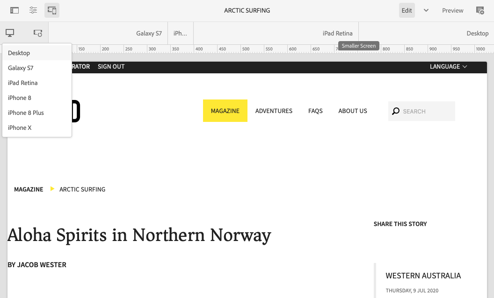

# 响应式设计 {#responsive-design}

设计您的体验，使其适应显示它们的客户端视区。 通过响应式设计，可以在两个方向上的多个设备上有效地显示相同页面。 下图演示了页面响应视区大小更改的一些方式：

* 布局：对较小的视区使用单列布局，对较大的视区使用多列布局。
* 文本大小：在较大的视区中使用较大的文本大小（如果适用，例如标题）。
* 内容：在较小的设备上显示时，仅包含最重要的内容。
* 导航：提供了特定于设备的工具来访问其他页面。
* 图像：根据窗口尺寸提供适用于客户端视区的图像演绎版。


开发可生成适应多种窗口大小和方向的HTML5的Adobe Experience Manager (AEM)应用程序。 例如，以下视区宽度范围对应于各种设备类型和方向

* 最大宽度480像素（手机、纵向）
* 最大宽度767像素（手机、横向）
* 宽度在768像素和979像素之间（平板电脑、纵向）
* 宽度在980像素和1199像素之间（平板电脑，横向）
* 宽度1200像素或更高（台式机）

有关实施响应式设计行为的信息，请参阅以下主题：

* [媒体查询](#using-media-queries)
* [流式网格](#developing-a-fluid-grid)
* [自适应图像](#using-adaptive-images)

在设计时，请使用 **模拟器** 工具栏以预览各种屏幕大小的页面。

## 在开发之前 {#before-you-develop}

在开发支持网页的AEM应用程序之前，需要做出一些设计决策。 例如，您需要具备以下信息：

* 您定位的设备
* 目标视区大小
* 每个目标视区大小的页面布局

### 应用程序结构 {#application-structure}

典型的AEM应用程序结构支持所有响应式设计实施：

* 页面组件驻留在下面 `/apps/<application_name>/components`
* 模板位于下方 `/apps/<application_name>/templates`

## 使用媒体查询 {#using-media-queries}

媒体查询允许选择性地使用CSS样式进行页面渲染。 通过AEM开发工具和功能，您可以在应用程序中高效实施媒体查询。

W3C组提供 [媒体查询](https://www.w3.org/TR/css3-mediaqueries/) 描述此CSS3功能和语法的推荐。

### 创建CSS文件 {#creating-the-css-file}

在CSS文件中，根据所定向设备的属性定义媒体查询。 以下实施策略可以有效地管理每个媒体查询的样式：

* 使用 [客户端库文件夹](clientlibs.md) 定义在渲染页面时组装的CSS。
* 在单独的CSS文件中定义每个媒体查询和相关样式。 使用表示媒体查询的设备功能的文件名很有用。
* 在单独的CSS文件中定义所有设备通用的样式。
* 在Client Library文件夹的css.txt文件中，按照所组合的CSS文件中的要求对CSS文件列表进行排序。

此 [wknd教程](develop-wknd-tutorial.md) 使用此策略在站点设计中定义样式。 WKND使用的CSS文件位于 `/apps/wknd/clientlibs/clientlib-grid/less/grid.less`.

### 在AEM页面中使用媒体查询 {#using-media-queries-with-aem-pages}

[WKND示例项目](/help/implementing/developing/introduction/develop-wknd-tutorial.md) 和 [AEM项目原型](https://experienceleague.adobe.com/docs/experience-manager-core-components/using/developing/archetype/overview.html) 使用 [页面核心组件，](https://experienceleague.adobe.com/docs/experience-manager-core-components/using/wcm-components/page.html) 其中包括通过页面策略访问的clientlibs。

如果您自己的页面组件不基于页面核心组件，则还可以将客户端库文件夹包含在其的HTL或JSP脚本中。 这样做将生成并引用CSS文件，其中包含响应式网格正常运行所需的媒体查询。

#### HTL {#htl}

```html
<sly data-sly-use.clientlib="${'/libs/granite/sightly/templates/clientlib.html'}">
<sly data-sly-call="${clientlib.all @ categories='apps.weretail.all'}"/>
```

#### JSP {#jsp}

```xml
<ui:includeClientLib categories="apps.weretail.all"/>
```

JSP脚本将生成引用样式表的以下HTML代码：

```xml
<link rel="stylesheet" href="/etc/designs/weretail/clientlibs-all.css" type="text/css">
<link href="/etc/designs/weretail.css" rel="stylesheet" type="text/css">
```

## 预览特定设备 {#previewing-for-specific-devices}

模拟器允许您预览不同视区大小的页面，以便测试响应式设计的行为。 在站点控制台中编辑页面时，您可以点按或单击 **模拟器** 图标以显示模拟器。


在模拟器工具栏中，您可以点按或单击 **设备** 图标，显示可在其中选择设备的下拉菜单。 选择设备后，页面会随之发生更改，以适应视区大小。



### 指定设备组 {#specifying-device-groups}

要指定出现在“ ”中的 **设备** 列表，添加 `cq:deviceGroups` 属性到 `jcr:content` 网站模板页面的节点。 属性的值是设备组节点的路径数组。

例如，WKND站点的模板页面为 `/conf/wknd/settings/wcm/template-types/empty-page/structure`. 以及 `jcr:content` 其下的节点包括以下属性：

* 名称：`cq:deviceGroups`
* 类型：`String[]`
* 值： `mobile/groups/responsive`

设备组节点位于 `/etc/mobile/groups` 文件夹。

## 响应图像 {#responsive-images}

响应式页面将动态适应渲染它们的设备，为用户提供更好的体验。 不过，将资产优化到断点和设备以最大限度地缩短页面加载时间也很重要。

[核心组件图像组件](https://experienceleague.adobe.com/docs/experience-manager-core-components/using/wcm-components/image.html) 自适应图像选择等功能。

* 默认情况下，图像组件使用 [自适应图像Servlet](https://experienceleague.adobe.com/docs/experience-manager-core-components/using/developing/adaptive-image-servlet.html) 以传递正确的演绎版。
* [Web优化图像交付](https://experienceleague.adobe.com/docs/experience-manager-core-components/using/developing/web-optimized-image-delivery.html) 也可通过其策略中的简单复选框使用，该复选框可以以WebP格式从DAM交付图像资产，并且平均可将图像的下载大小减小约25%。

## 布局容器 {#layout-container}

AEM布局容器允许您高效实施响应式布局，以根据客户端视区调整页面维度。

请参阅文档 [配置布局容器和布局模式](/help/sites-cloud/administering/responsive-layout.md) 有关布局容器如何工作以及如何为您的内容启用响应式布局的更多信息。
