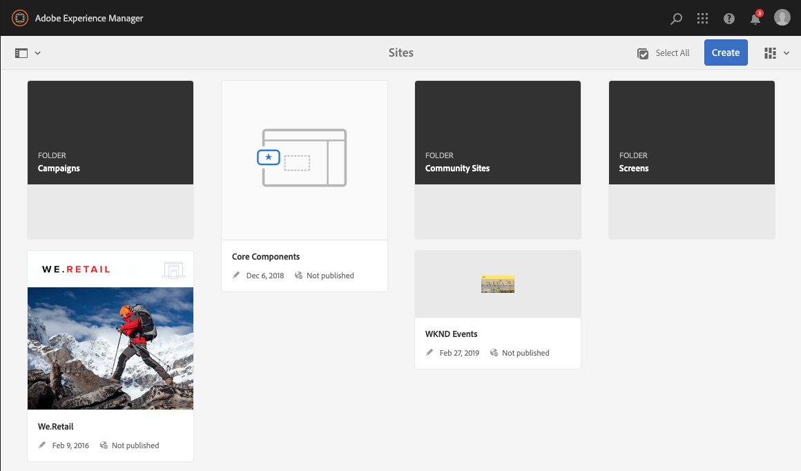
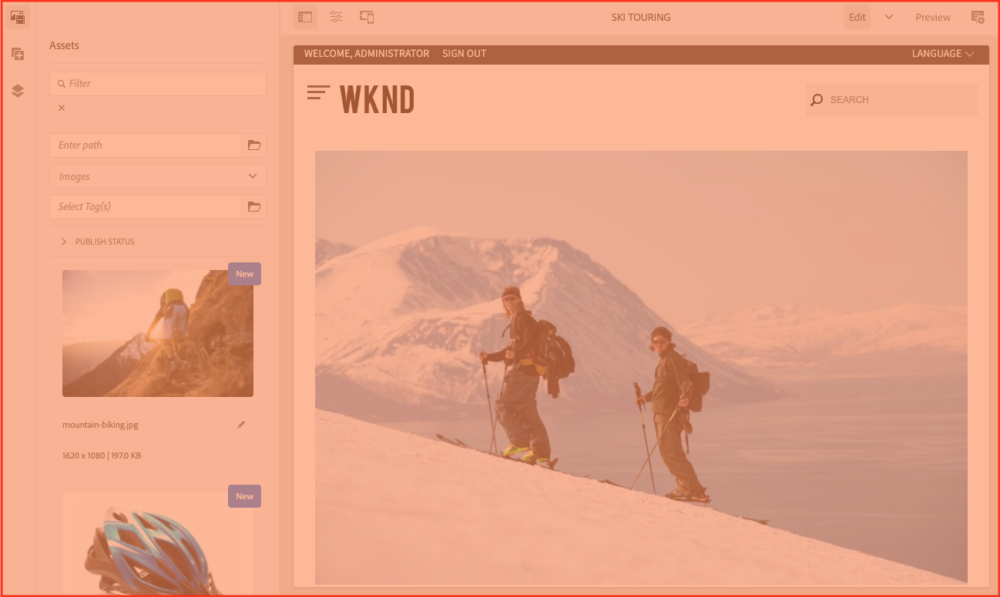
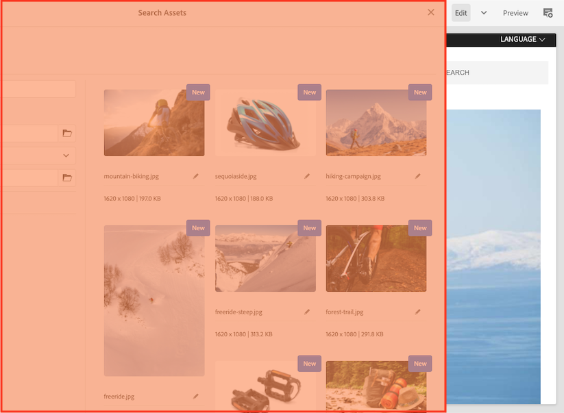
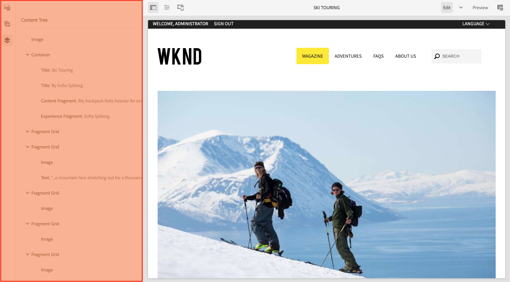
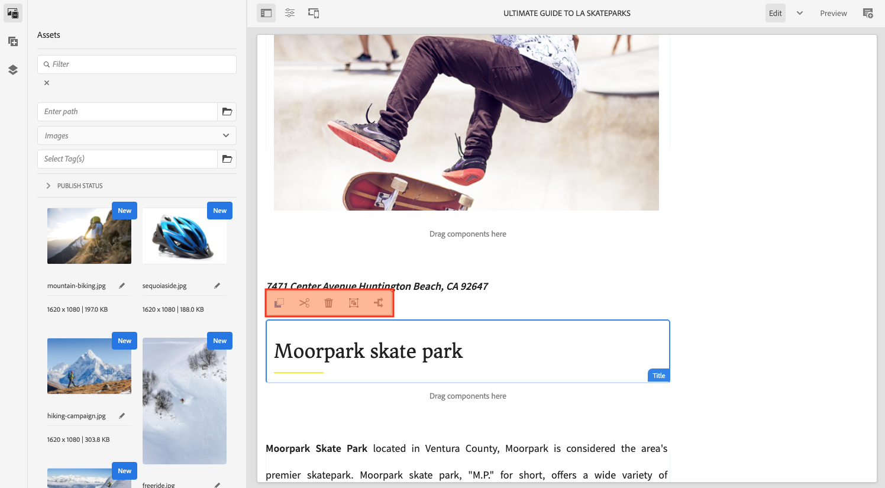

# AEM UI 的结构 {#structure-of-the-aem-ui}

AEM UI具有多个基本原则，由几个关键元素组成：

## 控制台 {#consoles}

### 基本布局和大小调整 {#basic-layout-and-resizing}

AEM的UI既适用于移动设备，也适用于桌面设备，但它不是创建两种样式，而是使用一种样式，适用于所有屏幕和设备。

所有模块都使用相同的基本布局，在AEM中，这可以看成：

布局遵循响应式设计样式，并会根据您所使用的设备/窗口的大小来调整自身。

例如，当分辨率低于1024像素（与移动设备上的情况一样）时，显示屏将相应地进行调整：

### 标题栏 {#header-bar}

标题栏显示全局元素，包括：

* 您当前使用的徽标和特定产品/解决方案；对于AEM，它还会形成指向全局导航的链接
* 搜索
* 用于访问帮助资源的图标
* 用于访问其他解决方案的图标
* 等待您发送的任何警报或收件箱项目的指示器（并可访问）
* 用户图标，以及指向配置文件管理的链接

### 工具栏 {#toolbar}

工具栏与您的位置息息相关，而且还会显示与控制以下页面中的视图或资产相关的工具。 工具栏特定于产品，但元素有一些通用性。

在任意位置，工具栏都会显示当前可用的操作：

还取决于当前是否选择了某个资源：

### 左边栏 {#left-rail}

可以根据需要打开/隐藏左边栏以显示：

* **仅限内容**
* **内容树**
* **时间线**
* **引用**
* **过滤器**

默认值为 **仅限内容** （隐藏的边栏）。

## 页面创作 {#page-authoring}

创作页面时，结构区域如下所示。

### 内容帧 {#content-frame}

页面内容在内容框架中呈现。 内容框架完全独立于编辑器，可确保不会因CSS或Javascript而发生冲突。

内容框架位于窗口的右侧部分工具栏下。

### 编辑器框架 {#editor-frame}

编辑器框架可启用编辑功能。

编辑器框架是用于所有页面创作元素的容器（抽象）。 它位于内容框架的顶部，包括：

* 顶部工具栏
* 侧面板
* 所有叠加图
* 任何其他页面创作元素；例如，组件工具栏

### 侧面板 {#side-panel}

此部分包含三个默认选项卡。 的 **资产** 和 **组件** 利用选项卡，可选择此类元素，并将其从面板中拖动到页面上。 的 **内容树** 选项卡，用于检查页面上的内容层次结构。

默认情况下，侧面板处于隐藏状态。 选择后，该窗口将显示在左侧，或在窗口大小小于1024像素时滑过以覆盖整个窗口；例如，在移动设备上。

### 侧面板 — 资产 {#side-panel-assets}

在资产选项卡中，您可以从资产范围中进行选择。 您还可以过滤特定术语或选择群组。

### 侧面板 — 资产组 {#side-panel-asset-groups}

在资产选项卡中，您可以使用下拉列表选择特定的资产组。

### 侧面板 — 组件 {#side-panel-components}

在组件选项卡中，您可以从组件范围中进行选择。 您还可以过滤特定术语或选择群组。

### 侧面板 — 内容树 {#side-panel-content-tree}

在内容树选项卡中，您可以查看页面上内容的层次结构。 单击选项卡中的条目会跳转到，并在编辑器中选择页面上的项目。

### 叠加 {#overlays}

这些选项将叠加内容框架，并由 [层](#layer) 了解如何与组件及其内容进行（完全透明）交互的机制。

叠加图位于编辑器框架中（包含所有其他页面创作元素），但它们实际上会覆盖内容框架中的相应组件。

### 图层 {#layer}

层是一个独立的功能包，可激活它以：

* 提供页面的不同视图
* 允许您处理页面和/或与页面交互

与对单个组件执行的特定操作不同，这些层可为整个页面提供复杂的功能。

AEM附带了多个已实施的页面创作层；例如，编辑、预览和注释层。

>[!NOTE]
>
>层是一个强大的概念，会影响用户对页面内容的查看以及与页面内容的交互。 在开发您自己的层时，您需要确保该层在退出时清理。

### 层切换器 {#layer-switcher}

层切换器允许您选择要使用的层。 关闭后，它表示当前正在使用的层。

图层切换器可作为工具栏（位于窗口顶部的编辑器框架内）中的下拉菜单使用。

### 组件工具栏 {#component-toolbar}

单击组件的每个实例都将显示其工具栏（单击一次或慢速双击）。 工具栏包含可用于页面上的组件实例的特定操作（例如，复制、粘贴、打开编辑器）。

组件工具栏位于相应组件的右上角或右下角，具体取决于可用空间。

## 更多信息 {#further-information}

<!--For more details about the concepts around the touch-enabled UI, continue to the article [Concepts of the AEM Touch-Enabled UI](/help/sites-developing/touch-ui-concepts.md).-->

有关更多技术信息，请参阅 [JS文档集](https://helpx.adobe.com/experience-manager/6-5/sites/developing/using/reference-materials/jsdoc/ui-touch/editor-core/index.html) ，用于页面编辑器。
