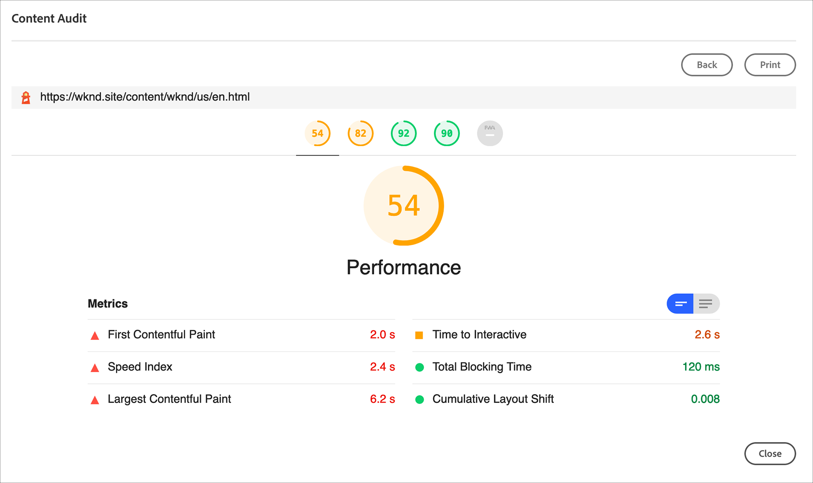

# 了解测试结果 {#understand-test-results}

云服务的 Cloud Manager 管道执行将支持执行针对暂存环境运行的测试。这与在构建和单元测试步骤中运行的测试相反，这些测试在脱机状态下运行，无法访问任何正在运行的AEM环境。
在此上下文中运行测试有两种类型：
* 客户编写的测试
* Adobe编写的测试
* 由Google的Lighthouse支持的开放源代码工具

   >[!NOTE]
   > 客户编写的测试和Adobe编写的测试都在为运行这些类型的测试而设计的容器化基础架构中运行。


## 代码质量测试 {#code-quality-testing}

作为管道的一部分，将扫描源代码，以确保部署符合特定质量标准。 目前，这是通过SonarQube和使用OakPAL的内容包级别检查的组合来实现的。 有100多个规则，这些规则结合了通用Java规则和AEM特定规则。 下表总结了测试标准的等级：

| 名称 | 定义 | 类别 | 失败阈值 |
|--- |--- |--- |--- |
| 安全等级 | A = 0漏洞 <br/>B =至少1个次要漏洞<br/> C =至少1个主要漏洞 <br/>D =至少1个关键漏洞 <br/>E =至少1个阻止程序漏洞 | 关键 | &lt; B |
| 可靠性等级 | A = 0错误 <br/>B =至少1个次要错误 <br/>C =至少1个主要错误 <br/>D =至少1个关键错误E =至少1个阻止程序错误 | 重要信息 | &lt; C |
| 可维护性等级 | 代码气味的未平仓修复成本为： <br/><ul><li>&lt;=5%已进入应用程序的时间，评级为A </li><li>评级在6%到10%之间是B </li><li>11%到20%的评级是C </li><li>21%到50%的评级是D</li><li>超过50%的东西</li></ul> | 重要信息 | &lt; A |
| 范围 | 单位测试线覆盖和条件覆盖的混合使用以下公式： <br/>`Coverage = (CT + CF + LC)/(2*B + EL)`  <br/>其中： CT =运行单元测试时已至少评估为“true”的条件 <br/>CF =运行单元测试时已至少评估为“false”的条件 <br/>LC =覆盖行=行=到覆盖——未覆盖行 <br/><br/> B =条件总数 <br/>EL =可执行行（lines到覆盖）总数 | 重要信息 | &lt; 50% |
| 跳过的单元测试 | 跳过的单元测试数。 | 信息 | > 1 |
| 未解决问题 | 总体问题类型——漏洞、错误和代码气味 | 信息 | > 0 |
| 复制行 | 重复块中涉及的行数。 <br/>对于要视为重复的代码块： <br/><ul><li>**非Java项目：**</li><li>至少应有100个连续令牌和重复令牌。</li><li>这些令牌至少应在以下位置传播： </li><li>COBOL的30行代码 </li><li>ABAP的20行代码 </li><li>10行代码，适用于其他语言</li><li>**Java项目：**</li><li> 无论令牌和行的数量如何，都至少应有10个连续和重复的语句。</li></ul> <br/>在检测重复时，会忽略缩进和字符串文本中的差异。 | 信息 | > 1% |
| Cloud Service兼容性 | 已识别的Cloud Service兼容性问题数。 | 信息 | > 0 |


>[!NOTE]
>
>有关更 [详细的定义](https://docs.sonarqube.org/display/SONAR/Metric+Definitions) ，请参阅度量定义。

您可以在此处下载规 [则列表code-quality-rules.xlsx](/help/implementing/cloud-manager/assets/CodeQuality-rules-latest.xlsx)

>[!NOTE]
>
>要进一步了解Cloud Manager执行的自定义代码质 [!UICONTROL 量规则]，请参阅 [自定义代码质量规则](/help/implementing/cloud-manager/custom-code-quality-rules.md)。

### 处理误报 {#dealing-with-false-positives}

质量扫描过程并不完美，有时会错误地识别实际上没有问题的问题。 这称为“假阳性”。

在这些情况下，可以使用标准Java注释对源代 `@SuppressWarnings` 码进行注释，该注释将规则ID指定为注释属性。 例如，一个常见问题是，用于检测硬编码密码的SonarQube规则在如何识别硬编码密码方面可能具有攻击性。

要查看特定示例，此代码在AEM项目中很常见，该项目具有连接到某些外部服务的代码：

```java
@Property(label = "Service Password")
private static final String PROP_SERVICE_PASSWORD = "password";
```

然后，SonarQube将引发阻止程序漏洞。 查看代码后，您会发现这不是漏洞，并可以使用相应的规则ID对此进行注释。

```java
@SuppressWarnings("squid:S2068")
@Property(label = "Service Password")
private static final String PROP_SERVICE_PASSWORD = "password";
```

但是，另一方面，如果代码是：

```java
@Property(label = "Service Password", value = "mysecretpassword")
private static final String PROP_SERVICE_PASSWORD = "password";
```

然后，正确的解决方案是删除硬编码密码。

>[!NOTE]
>
>尽管最好尽量使注释具 `@SuppressWarnings` 体，即仅注释导致问题的特定语句或块，但也可以在类级别添加注释。

## 编写功能测试 {#writing-functional-tests}

必须将客户编写的功能测试打包为由与要部署到AEM的对象相同的Maven版本生成的单独JAR文件。 通常，这将是一个单独的Maven模块。 生成的JAR文件必须包含所有必需的依赖关系，并且通常使用maven-assembly-plugin使用jar-with-dependencies描述符创建。

此外，JAR必须将Cloud-Manager-TestType清单头设置为integration-test。 将来，预计会支持其他标题值。 maven-assembly-plugin的示例配置是：

```java
<build>
    <plugins>
        <!-- Create self-contained jar with dependencies -->
        <plugin>
            <groupId>org.apache.maven.plugins</groupId>
            <artifactId>maven-assembly-plugin</artifactId>
            <version>3.1.0</version>
            <configuration>
                <descriptorRefs>
                    <descriptorRef>jar-with-dependencies</descriptorRef>
                </descriptorRefs>
                <archive>
                    <manifestEntries>
                        <Cloud-Manager-TestType>integration-test</Cloud-Manager-TestType>
                    </manifestEntries>
                </archive>
            </configuration>
            <executions>
                <execution>
                    <id>make-assembly</id>
                    <phase>package</phase>
                    <goals>
                        <goal>single</goal>
                    </goals>
                </execution>
            </executions>
        </plugin>
    </plugins>
```

在此JAR文件中，要执行的实际测试的类名必须以IT结尾。

例如，将执行名 `com.myco.tests.aem.ExampleIT` 为的类，但名为的类 `com.myco.tests.aem.ExampleTest` 不会执行。

测试类必须是普通JUnit测试。 测试基础架构设计并配置为与aem-testing-clients测试库使用的惯例兼容。 强烈建议开发人员使用此库并遵循其最佳实践。 有关更多 [详细信息](https://github.com/adobe/aem-testing-clients) ，请参阅Git链接。

## 自定义功能测试 {#custom-functional-test}

管道中的“自定义功能”测试步骤始终存在，无法跳过。

但是，如果生成未生成测试JAR，则默认情况下测试通过。 此步骤在阶段部署后立即完成。

>[!NOTE]
>“ **下载日志** ”按钮允许访问包含测试执行详细表单日志的ZIP文件。 这些日志不包含实际AEM运行时进程的日志——可以使用常规下载或尾日志功能访问这些日志。 有关更多 [详细信息，请参阅](/help/implementing/cloud-manager/manage-logs.md) “访问和管理日志”。

## 内容审核测试 {#content-audit-testing}

内容审核是Cloud Manager Sites Production管道中的一项功能，该管道由Google的开放源代码工具Lighthouse提供支持。 此功能在所有Cloud Manager Production管道中都启用。

它可验证部署过程并有助于确保部署了更改：

1. 满足性能、辅助功能、最佳实践、SEO（搜索引擎优化）和PWA（渐进式Web应用程序）的基准标准。

1. 不要在这些维度中包含回归。

Cloud Manager中的内容审核可确保站点上的最终用户数字体验保持为最高标准。 结果是信息性的，允许用户查看当前得分和先前得分之间的变化。 此洞察对于确定当前部署中是否会引入退化，很有价值。

### 了解内容审核结果 {#understanding-content-audit-results}

内容审核通过“生产管道”执行页面提供聚合和详细的页面级测试结果。

* 聚合级别指标衡量已审核页面的平均得分。
* 还可以通过向下展开来获取各个页面级别的分数。
* 可以详细查看各个测试的结果，以及如何修正在内容审核过程中确定的任何问题的指导。
* 测试结果的历史记录将保留在Cloud Manager中，这样客户就可以查看在管道运行中引入的更改是否包含先前运行的任何回归。

#### 聚合分数 {#aggregate-scores}

每种测试类型(性能、辅助功能、SEO、最佳实践和聚合)都有PWA级别得分。

聚合级别得分取得运行中包含的页面的平均得分。 聚合级别的更改表示当前运行中页面的平均分数与上次运行的平均分数相比，即使配置为包含的页面集合在两次运行之间发生更改也是如此。

“更改”量度的值可以是以下值之一：

* **正值** -自上次生产管道运行以来，在所选测试中页面已得到改进

* **负值** -自上次生产管道运行以来，页面在所选测试上出现倒退

* **无更改** -自上次运行生产管道以来，页面的得分相同

* **N/A** —— 没有可供比较的先前得分

   

#### 页面级别得分 {#page-level-scores}

通过钻取任何测试，可以查看更详细的页面级别评分。 用户将能够查看特定测试的各个页面的得分情况以及与上次运行测试时的更改情况。
单击任何单个页面的“详细信息”将提供有关已评估页面元素的信息，并指导您在检测到改进机会时修复问题。 测试的细节和相关指导由Google Lighthouse提供。


## 本地测试执行 {#local-test-execution}

由于测试类是JUnit测试，它们可以从主流Java IDE（如Eclipse、IntelliJ、NetBeans等）运行。

但是，当必须运行这些测试时，必须设置aem测试客户端（和基础Sling测试客户端）预期的各种系统属性。

系统属性如下：

* `sling.it.instances - should be set to 2`
* `sling.it.instance.url.1 - should be set to the author URL, for example, http://localhost:4502`
* `sling.it.instance.runmode.1 - should be set to author`
* `sling.it.instance.adminUser.1 - should be set to the author admin user, e.g. admin`
* `sling.it.instance.adminPassword.1 - should be set to the author admin password`
* `sling.it.instance.url.2 - should be set to the author URL, for example, http://localhost:4503`
* `sling.it.instance.runmode.2 - should be set to publish`
* `sling.it.instance.adminUser.2 - should be set to the publish admin user, for example, admin`
* `sling.it.instance.adminPassword.2 - should be set to the publish admin password`

