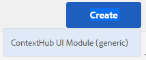
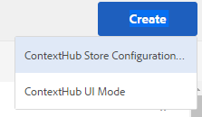

# 配置 ContextHub {#configuring-contexthub}

ContextHub是用于存储、处理和呈现上下文数据的框架。 有关ContextHub的更多详细信息，请参阅 [ContextHub开发人员概述](contexthub.md).

您可以配置ContextHub工具栏以控制它是否在“预览”模式下显示、创建ContextHub存储区以及添加UI模块。

## 显示和隐藏ContextHub UI {#showing-and-hiding-the-contexthub-ui}

配置AdobeGranite ContextHub OSGi服务以显示或隐藏 [ContextHub UI](/help/sites-cloud/authoring/personalization/targeted-content.md) 在您的页面上。 此服务的PID是 `com.adobe.granite.contexthub.impl.ContextHubImpl.`

要配置服务，您可以使用 [Web控制台](/help/implementing/deploying/configuring-osgi.md) 或在存储库中使用JCR节点：

* **Web控制台：** 要显示UI，请选择显示UI属性。 要隐藏UI，请清除隐藏UI属性。
* **JCR节点：** 要显示UI，请设置布尔值 `com.adobe.granite.contexthub.show_ui` 属性 `true`. 要隐藏UI，请将属性设置为 `false`.

显示ContextHub UI时，它仅在AEM创作实例的页面上显示。 UI不会显示在发布实例的页面上。

## 添加ContextHub UI模式和模块 {#adding-contexthub-ui-modes-and-modules}

在“预览”模式下，配置ContextHub工具栏中显示的UI模式和模块：

* UI模式：相关模块组
* 模块：用于从存储中公开上下文数据并允许作者处理上下文的小组件

UI模式在工具栏左侧显示为一系列图标。 选择后，UI模式的模块将显示在右侧。


图标是 [Coral UI图标库](https://helpx.adobe.com/experience-manager/6-4/sites/developing/using/reference-materials/coral-ui/coralui3/Coral.Icon.html#availableIcons).

### 添加UI模式 {#adding-a-ui-mode}

添加UI模式以对相关ContextHub模块进行分组。 创建UI模式时，您会提供ContextHub工具栏中显示的标题和图标。

1. 在Experience Manager边栏中，单击或点按工具>站点> Context Hub。
1. 单击或点按默认的配置容器。
1. 单击或点按Context Hub配置。
1. 单击或点按创建按钮，然后单击或点按ContextHub UI模式。

   

1. 为以下属性提供值：

   * UI模式标题：标识UI模式的标题
   * 模式图标：选择器 [Coral用户界面图标](https://helpx.adobe.com/experience-manager/6-4/sites/developing/using/reference-materials/coral-ui/coralui3/Coral.Icon.html#availableIcons) 例如 `coral-Icon--user`
   * 已启用：选择以在ContextHub工具栏中显示UI模式

1. 单击或点按保存。

### 添加UI模块 {#adding-a-ui-module}

将ContextHub UI模块添加到UI模式，以便该模块显示在ContextHub工具栏中，用于预览页面内容。 添加UI模块时，您将创建一个在ContextHub中注册的模块类型实例。 要添加UI模块，您必须知道关联模块类型的名称。

AEM提供了基本UI模块类型以及几个示例UI模块类型，您可以在这些类型上为UI模块提供基础。 下表简要描述了每个报表包。 有关开发自定义UI模块的信息，请参阅 [创建ContextHub UI模块](extending-contexthub.md#creating-contexthub-ui-module-types).

UI模块属性包括详细配置，您可以在其中为特定于模块的属性提供值。 您以JSON格式提供详细配置。 表中的“模块类型”列提供了有关每个UI模块类型所需的JSON代码信息的链接。

| 模块类型 | 描述 | 存储 |
|---|---|---|
| [contexthub.base](sample-modules.md#contexthub-base-ui-module-type) | 通用UI模块类型 | 在UI模块属性中配置 |
| [contexthub.browserinfo](sample-modules.md#contexthub-browserinfo-ui-module-type) | 显示有关浏览器的信息 | `surferinfo` |
| [contexthub.datetime](sample-modules.md#contexthub-datetime-ui-module-type) | 显示日期和时间信息 | `datetime` |
| [contexthub.location](sample-modules.md#contexthub-location-ui-module-type) | 显示客户端的纬度和经度，以及地图上的位置。 允许您更改位置。 | `geolocation` |
| [contexthub.screen-orientation](sample-modules.md#contexthub-screen-orientation-ui-module-type) | 显示设备的屏幕方向（横向或纵向） | `emulators` |
| [contexthub.tagcloud](sample-modules.md#contexthub-tagcloud-ui-module-type) | 显示有关页面标记的统计信息 | `tagcloud` |
| [granite.profile](sample-modules.md#granite-profile-ui-module-type) | 显示当前用户的配置文件信息，包括 `authorizableID`, `displayName` 和 `familyName`. 您可以更改 `displayName` 和 `familyName`. | `profile` |

1. 在Experience Manager边栏上，单击或点按工具>站点> ContextHub。
1. 单击或点按要向其添加UI模块的配置容器。
1. 单击或键入要将UI模块添加到的ContextHub配置。
1. 单击或点按要将UI模块添加到的UI模式。
1. 单击或点按创建按钮，然后单击或点按ContextHub UI模块（通用）。

   

1. 为以下属性提供值：

   * UI模块标题：标识UI模块的标题
   * 模块类型：模块类型
   * 已启用：选择以在ContextHub工具栏中显示UI模块

1. （可选）要覆盖默认的存储配置，请输入JSON对象以配置UI模块。
1. 单击或点按保存。

## 创建ContextHub存储 {#creating-a-contexthub-store}

创建ContextHub存储以保留用户数据并根据需要访问数据。 ContextHub存储基于注册的存储候选。 创建存储时，需要注册存储候选项的storeType值。 (请参阅 [创建自定义商店候选项](extending-contexthub.md#creating-custom-store-candidates).)

### 详细的存储配置 {#detailed-store-configuration}

在配置存储时， Detail Configuration属性允许您为特定于存储的属性提供值。 值基于 `config` 存储的参数 `init` 函数。 因此，是否需要提供此值以及值的格式取决于存储。

Detail Configuration属性的值是 `config` 对象。

### 示例存储候选 {#sample-store-candidates}

AEM提供了以下示例存储候选项，您可以在这些候选项上创建存储。

| 存储类型 | 描述 |
|---|---|
| [aem.segmentation](sample-stores.md#aem-segmentation-sample-store-candidate) | 存储已解析和未解析的ContextHub区段。 自动从ContextHub SegmentManager中检索区段 |
| [contexthub.geolocation](sample-stores.md#contexthub-geolocation-sample-store-candidate) | 存储浏览器位置的经度和纬度。 |
| [granite.emulators](sample-stores.md#granite-emulators-sample-store-candidate) | 为多个设备定义属性和功能，并检测当前客户端设备 |
| [granite.profile](sample-stores.md#granite-profile-sample-store-candidate) | 存储当前用户的配置文件数据 |
| [contexthub.surferinfo](sample-stores.md#contexthub-surferinfo-sample-store-candidate) | 存储有关客户端的信息，如设备信息、浏览器类型和窗口方向 |

1. 在Experience Manager边栏上，单击或点按工具>站点> ContextHub。
1. 单击或点按默认配置容器。
1. 单击或点按Contexthub配置
1. 要添加存储，请单击或点按创建图标，然后单击或点按ContextHub存储配置。

   

1. 提供基本配置属性的值，然后单击或点按下一步：

   * **配置标题：** 标识商店的标题
   * **存储类型：** 作为存储基础的存储候选项的storeType属性的值
   * **必需：** 选择
   * **已启用：** 选择以启用存储

1. （可选）要覆盖默认的存储配置，请在详细配置(JSON)框中输入JSON对象。
1. 单击或点按保存。

## 示例：使用JSONP服务  {#example-using-a-jsonp-service}

此示例说明了如何在UI模块中配置存储和显示数据。 在此示例中，jsontest.com站点的MD5服务用作存储的数据源。 该服务会以JSON格式返回给定字符串的MD5哈希代码。

配置了contexthub.generic-jsonp存储，以便存储服务调用的数据 `https://md5.jsontest.com/?text=%22text%20to%20md5%22`. 该服务会返回在UI模块中显示的以下数据：

```javascript
{
   "md5": "919a56ab62b6d5e1219fe1d95248a2c5",
   "original": "\"text to md5\""
}
```

### 创建contexthub.generic-jsonp存储 {#creating-a-contexthub-generic-jsonp-store}

contexthub.generic-jsonp示例存储候选项允许您从JSONP服务或返回JSON数据的Web服务中检索数据。 对于此存储候选项，请使用存储配置来提供有关要使用的JSONP服务的详细信息。

的 [init](contexthub-api.md#init-name-config) 函数 `ContextHub.Store.JSONPStore` Javascript类定义 `config` 初始化此存储候选项的对象。 的 `config` 对象包含 `service` 包含有关JSONP服务的详细信息的对象。 要配置存储，请提供 `service` 对象，作为Detail Configuration属性的值。

要保存jsontest.com站点的MD5服务中的数据，请使用 [创建ContextHub存储](#creating-a-contexthub-store) 使用以下属性：

* **配置标题：** md5
* **存储类型：** contexthub.generic-jsonp
* **必需：** 选择
* **已启用：** 选择
* **详细配置 (JSON):**

   ```javascript
   {
    "service": {
    "jsonp": false,
    "timeout": 1000,
    "ttl": 1800000,
    "secure": false,
    "host": "md5.jsontest.com",
    "port": 80,
    "params":{
    "text":"text to md5"
        }
      }
    }
   ```

### 为md5数据添加UI模块 {#adding-a-ui-module-for-the-md-data}

将UI模块添加到ContextHub工具栏以显示存储在示例md5存储区中的数据。 在此示例中，contexthub.base模块用于生成以下UI模块：


在中使用该过程 [添加UI模块](#adding-a-ui-module) 将UI模块添加到现有UI模式，例如示例人物UI模式。 对于UI模块，请使用以下属性值：

* **UI模块标题：** MD5
* **模块类型：** contexthub.base
* **详细配置 (JSON):**

   ```javascript
   {
    "icon": "coral-Icon--data",
    "title": "MD5 Conversion",
    "storeMapping": { "md5": "md5" },
    "template": "<p> {{md5.original}}</p>;
                 <p>{{md5.md5}}</p>"
   }
   ```

## 调试ContextHub {#debugging-contexthub}

可以启用ContextHub的调试模式，以便进行故障排除。 可以通过ContextHub配置或通过CRXDE启用调试模式。

### 通过配置 {#via-the-configuration}

编辑ContextHub的配置并选中选项 **调试**

1. 在边栏中，单击或点按 **“工具”>“站点”>“ContextHub”**
1. 单击或点按默认设置 **配置容器**
1. 选择 **ContextHub配置** 单击或点按 **编辑所选元素**
1. 单击或点按 **调试** 单击或点按 **保存**

### 通过CRXDE {#via-crxde}

使用CRXDE Lite设置属性 `debug` to **true** 下：

* `/conf/global/settings/cloudsettings` 或
* `/conf/<site>/settings/cloudsettings`

### 记录ContextHub的调试消息 {#logging-debug-messages-for-contexthub}

配置AdobeGranite ContextHub OSGi服务(PID = `com.adobe.granite.contexthub.impl.ContextHubImpl`)来记录详细的调试消息，这些消息在开发时很有用。

要配置服务，您可以使用 [Web控制台](/help/implementing/deploying/configuring-osgi.md) 或在存储库中使用JCR节点：

* Web控制台：要记录调试消息，请选择Debug属性。
* JCR节点：要记录调试消息，请设置布尔值 `com.adobe.granite.contexthub.debug` 属性 `true`.

### 静默模式 {#silent-mode}

静默模式禁止所有调试信息。 与可单独为每个ContextHub配置设置的常规调试选项不同，静默模式是全局设置，它优先于ContextHub配置级别上的任何调试设置。

这对于您根本不希望获得任何调试信息的发布实例非常有用。 由于它是全局设置，因此通过OSGi启用。

1. 打开 **Adobe Experience Manager Web控制台配置** at `http://<host>:<port>/system/console/configMgr`
1. 搜索 **AdobeGranite ContextHub**
1. 单击配置 **AdobeGranite ContextHub** 编辑其属性
1. 选中选项 **静默模式** 单击 **保存**

## 禁用ContextHub {#disabling-contexthub}

可以禁用ContextHub以阻止加载js/css并初始化。 禁用ContextHub有两个选项：

* 编辑ContextHub的配置并选中选项 **禁用ContextHub**

   1. 在边栏中，单击或点按 **“工具”>“站点”>“ContextHub”**
   1. 单击或点按默认设置 **配置容器**
   1. 选择 **ContextHub配置** 单击或点按 **编辑所选元素**
   1. 单击或点按 **禁用ContextHub** 单击或点按 **保存**

或

* 使用CRXDE Lite设置属性 `disabled` to **true** 在 `/conf/global/settings/cloudsettings/<configName>/contexthub`
