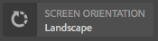

# ContextHub UI模块类型示例 {#sample-contexthub-ui-module-types}

ContextHub提供了多个示例UI模块，您可以在解决方案中使用这些模块。 提供了以下信息：

* UI模块的主要功能。
* 在何处查找源代码，以便您能够将其打开以用于学习目的。
* 如何配置UI模块。

有关将UI模块添加到ContextHub的信息，请参阅 [添加UI模块](configuring-contexthub.md#adding-a-ui-module). 有关开发UI模块的信息，请参阅 [创建ContextHub UI模块类型](extending-contexthub.md#creating-contexthub-ui-module-types).

## contexthub.base UI模块类型 {#contexthub-base-ui-module-type}

ContextHub.base UI模块类型是所有其他UI模块类型的基本类型。 因此，它为渲染存储数据提供了通用功能。

提供以下功能：

* **标题和图标：** 指定UI模块的标题和图标。 可以使用URL或从Coral UI图标库引用该图标。
* **存储数据：** 识别要从中检索数据的一个或多个存储。
* **内容：** 指定在UI模块中显示的内容（它显示在ContextHub工具栏中）。
* **弹出内容：** 指定单击或点按UI模块时显示在弹出窗口中的内容。
* **全屏模式：** 控制是否允许全屏模式。

源代码位于 `/libs/granite/contexthub/code/ui/container/js/ContextHub.UI.BaseModuleRenderer.js`.

### 配置 {#configuration}

使用JSON格式的Javascript对象配置ContextHub.base UI模块。 包含以下任意属性以配置UI模块功能：

* **图像：** 要显示为图标的图像的URL。
* **图标：** 名称 [Coral用户界面图标](https://helpx.adobe.com/experience-manager/6-4/sites/developing/using/reference-materials/coral-ui/coralui3/Coral.Icon.html) 类。 如果同时为图标和图像属性指定值，则会使用图像。
* **标题：** UI模块的标题。 当指针暂停在UI模块图标上时，将显示标题。
* **全屏：** 一个布尔值，指示UI模块是否支持全屏模式。 使用 `true` 支持全屏和 `false` 以防止全屏模式。
* **模板：** A [车把](https://handlebarsjs.com/) 模板，指定要在ContextHub工具栏中呈现的内容。 最多使用两个 `<p>` 标记。
* **storeMapping:** 键/存储映射。 在Handlebar模板中使用键值访问关联的ContextHub存储数据。
* **列表：** 一个项目数组，在单击UI模块后，它将作为列表显示在弹出窗口中。 如果包含此项目，请勿包含popoverTemplate。 值是使用以下键的对象数组：
   * 标题：要为此项目显示的文本
   * 图像：（可选）应显示在左侧的图像URL
   * 图标：（可选）应显示在左侧的CUI图标类；如果指定了图像，则忽略
   * 选定项：（可选）一个布尔值，用于指定是否应将此项目显示为已选定(true=selected)。 默认情况下，选定项目使用粗体显示。 使用 `listType` 属性来配置其他外观（请参阅下文）。
* **listType:** 用于弹出窗口列表项的样式。 使用以下任一值：
   * 复选标记
   * 复选框
   * 无线电
* **弹出窗口模板：** Handlebars模板，用于指定在单击UI模块时要在弹出窗口中呈现的内容。 如果包含此项目，请勿包含 `list` 项目。

### 示例 {#example}

以下示例配置c`ontexthub.base` 用于显示来自 [contexthub.emulators](sample-stores.md#granite-emulators-sample-store-candidate) 存储。 的 `template` 项目演示如何使用 `storeMapping` 项目已建立。

```javascript
{
   "icon": "coral-Icon--move",
    "title": "Screen Resolution",
    "storeMapping": {
      "emulator": "emulators"
    },
    "template": "<p>{{{ i18n \"Resolution\"}}}</p><p>{{{emulator.currentDevice.width}}} x {{{emulator.currentDevice.height}}}</p>"
}
```


## contexthub.browserinfo UI模块类型 {#contexthub-browserinfo-ui-module-type}

的 `contexthub.browserinfo` UI模块显示有关客户端Web浏览器和操作系统的信息。 从surferinfo存储库获取信息时，根据 [contexthub.surferinfo](sample-stores.md#contexthub-surferinfo-sample-store-candidate) 存储候选项。


UI模块的源代码位于 `/libs/granite/contexthub/components/modules/browserinfo`. 尽管 `contexthub.browserinfo` 扩展 `contexthub.base` UI模块，它不会覆盖或提供其他功能。 该实施为渲染浏览器信息提供了默认配置。

### 配置 {#configuration-1}

Contexthub.browserinfo UI模块的实例不需要Detail Configuration的值。 以下JSON文本表示模块的默认配置。

```javascript
{
   "icon":"coral-Icon--globe",
   "title":"Browser/OS Information",
   "storeMapping":{"surferinfo":"surferinfo"},
   "template":"<p>{{surferinfo.browser.family}} {{surferinfo.browser.version}}</p><p>{{surferinfo.os.name}} {{surferinfo.os.version}}</p>"
}
```

## contexthub.datetime UI模块类型 {#contexthub-datetime-ui-module-type}

的 `contexthub.datetime` UI模块显示存储在名为日期时间(基于 `contexthub.datetime` 存储候选项。


模块提供一个弹出窗体，用于更改存储中的日期和时间。

源 `contexthub.datetime` UI模块位于 `/libs/granite/contexthub/components/modules/datetime`.

### 配置 {#configuration-2}

Contexthub.datetime UI模块的实例不需要Detail Configuration的值。 以下JSON文本表示模块的默认配置。

```javascript
{
   "icon":"coral-Icon--clock",
   "title":"DATE&TIME",
   "clickable":true,
   "storeMapping":{"d":"datetime"},
   "template":"<p class=\"contexthub-module-line1\">{{i18n \"Date&Time\"}}</p><p class=\"contexthub-module-line2\">{{d.formatted.locale.date}} {{d.formatted.locale.time}}</p>",
   "popoverTemplate":"<div class=\"datetime center\"><div class=\"coral-DatePicker-calendar\" data-init=\"datepicker\"><input class=\"coral-Textfield\" type=\"datetime\" value=\"{{d.formatted.iso}}\"><button class=\"coral-Button coral-Button--secondary coral-Button--square\" title=\"{{i18n \"Datetime picker\"}}\"><i class=\"coral-Icon coral-Icon--calendar coral-Icon--sizeS\"></i></button></div></div>"
}
```

## contexthub.location UI模块类型 {#contexthub-location-ui-module-type}

的 `contexthub.location` UI模块显示客户端的经度和纬度。 模块提供了一个弹出窗口，其中显示一个Google映射，您可以单击该映射以更改当前位置。 模块从名为geolocation的ContextHub存储中获取信息，该存储基于 [contexthub.geolocation](sample-stores.md#contexthub-geolocation-sample-store-candidate) 存储候选项。


UI模块的源位于 `/etc/cloudsettings/default/contexthub/geolocation`.

### 配置 {#configuration-4}

ContextHub.location UI模块的实例不需要Detail Configuration的值。 以下JSON文本表示模块的默认配置。

```javascript
{
 "icon":"coral-Icon--compass",
 "title":"Location",
 "clickable":true,
 "editable":{"key":"/geolocation","disabled":[],"hidden":["/geolocation/generatedThumbnail","/geolocation/city","/geolocation/country"]},
 "fullscreen":true,
 "storeMapping":{"g":"geolocation"},
 "template":"<p>{{i18n \"Location\"}}</p><p>{{g.address.postalCode}} {{g.address.city}}{{#if g.address.city}}{{#if g.address.region}},{{/if}}{{/if}} {{g.address.region}}</p>",
 "list":[
  {"title":"Basel, Switzerland",
  "data":{"longitude":7.58929,"latitude":47.554746,"city":"Basel","country":"Switzerland"}},
  {"title":"Melbourne, Australia",
  "data":{"longitude":144.96328,"latitude":-37.814107,"city":"Melbourne","country":"Australia"}},
  {"title":"Beijing, China",
  "data":{"longitude":116.407526,"latitude":39.90403,"city":"Beijing","country":"China"}},
  {"title":"New York, NY, USA",
  "data":{"longitude":-74.005973,"latitude":40.714353,"city":"New York","country":"United States"}},
  {"title":"Paris, France",
  "data":{"longitude":2.352222,"latitude":48.856614,"city":"Paris","country":"France"}},
  {"title":"Rio de Janeiro, Brazil",
  "data":{"longitude":-43.20071,"latitude":-22.913395,"city":"Rio","country":"Brazil"}},
  {"title":"San Jose, CA, USA",
  "data":{"longitude":-121.894955,"latitude":37.339386,"city":"San Jose","country":"United States"}},
  {"title":"Tokyo, Japan",
  "data":{"longitude":139.691706,"latitude":35.689487,"city":"Shinjuku","country":"Japan"}}
 ],
 "listType":"checkmark"
}
```

## contexthub.screen-orientation UI模块类型 {#contexthub-screen-orientation-ui-module-type}

的 `contexthub.screen-orientation` UI模块显示客户端的当前屏幕方向。 虽然默认情况下处于禁用状态，但该模块会提供一个弹出窗口，允许您选择方向。 模块从名为模拟器的ContextHub存储中获取信息，该模拟器基于 [granite.emulators](sample-stores.md#granite-emulators-sample-store-candidate) 存储候选项。



UI模块的源位于 `/libs/granite/contexthub/components/modules/screen-orientation`.

### 配置 {#configuration-5}

实例 `contexthub.screen-orientation` UI模块不需要详细信息配置的值。 以下JSON文本表示模块的默认配置。 请注意， `clickable` 属性 `false` 默认情况下。 如果覆盖要设置的默认配置 `clickable` to `true`，则单击模块会显示一个弹出窗口，您可以从中选择方向。

```javascript
{
   "icon":"coral-Icon--rotateRight",
   "title":"Screen Orientation",
   "clickable":false,
   "storeMapping":{"emulator":"emulators"},
   "template":"<p>{{{ i18n \"Screen Orientation\" }}}</p><p>{{{ emulator.currentDevice.orientation }}}",
   "listReference":"/emulators/orientations",
   "listType":"checkmark"
}
```

## contexthub.tagcloud UI模块类型 {#contexthub-tagcloud-ui-module-type}

的 `contexthub.tagcloud` UI模块显示有关标记的信息。 在工具栏上，UI模块显示标记数。 弹出窗口会显示用于添加新标记的标记云和文本框。 UI模块从名为tagcloud的ContextHub存储中获取信息，该存储基于 `contexthub.tagcloud` 存储候选项。


UI模块的源位于 `/libs/granite/contexthub/components/modules/tagcloud`.

### 配置 {#configuration-6}

实例 `contexthub.tagcloud` UI模块不需要详细信息配置的值。 以下JSON文本表示模块的默认配置。

```javascript
{
   "icon":"coral-Icon--tag",
   "title":"TagCloud",
   "clickable":true,
   "storeMapping":{"t":"tagcloud"},
   "maxTags":20,
   "template":"<p class=\"contexthub-module-line1\">{{i18n \"TagCloud\"}}</p><p class=\"contexthub-module-line2\">{{stats.total}} {{i18n \"Tags\"}}</p>",
   "popoverTemplate":"<div class=\"contexthub-popover-content center\"><p class=\"stats\">{{stats.total}} {{i18n \"Tags\"}} | {{stats.hits}} {{i18n \"Hits\"}} | {{i18n \"Last tag\"}}: {{#if stats.recent}}{{stats.recent}}{{else}}{{i18n \"Unknown\"}}{{/if}}</p><p class=\"tagcloud\">{{#each tags}}<span class=\"tag{{this.weight}}\">{{this.name}}</span> {{/each}}</p><div class=\"coral-InputGroup\"><input type=\"text\" class=\"coral-InputGroup-input coral-Textfield tag-name\" placeholder=\"{{i18n \"Add a namespace:my/tag\"}}\" pattern=\"^[A-Za-z0-9_\\-]+(:[A-Za-z0-9_\\-\\/]+)?$\" title=\"{{i18n \"namespace:my/tag\"}}\"><span class=\"coral-InputGroup-button\"><button class=\"coral-Button coral-Button--secondary coral-Button--square contexthub-new-tag\" type=\"button\" title=\"{{i18n \"increment\"}}\"><i class=\"coral-Icon coral-Icon--sizeS coral-Icon--add\"></i></button></span></div></div>"
}
```

## granite.profile UI模块类型 {#granite-profile-ui-module-type}

的 `granite.profile` ContextHub UI模块显示当前用户的显示名称。 弹出窗口会显示用户的登录名，并允许您更改显示名称的值。 UI模块从名为“profile”的ContextHub存储中获取信息，该存储基于 [granite.profile](sample-stores.md#granite-profile-sample-store-candidate) 存储候选项。


UI模块的源位于 `/libs/granite/contexthub/components/modules/profile`.

### 配置 {#configuration-7}

实例 `granite.profile` UI模块不需要详细信息配置的值。 以下JSON文本表示模块的默认配置。

```javascript
{
   "icon":"coral-Icon--user",
   "title":"Profile",
   "clickable":true,
   "editable":{
      "key":"/profile",
      "disabled":["/profile/authorizableId"],
      "hidden":["/profile/avatar","/profile/path"]},
   "storeMapping":{"p":"profile"},
   "template":"<p class=\"contexthub-module-line1\">{{i18n \"Persona\"}}</p><p class=\"contexthub-module-line2\">{{p.displayName}}</p>",
   "listType":"checkmark"
}
```
