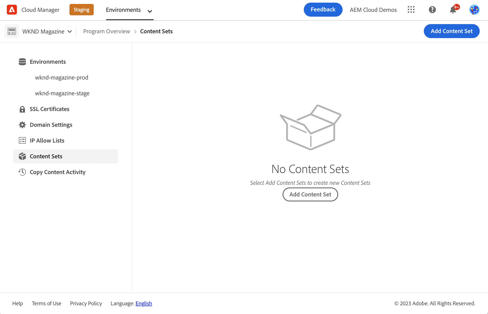
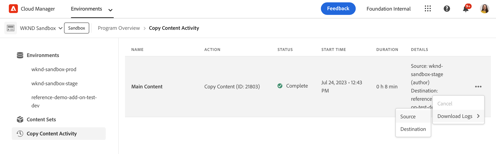

# 内容复制工具 {#content-copy}

内容复制工具使用户能够按需将可变内容从AEMas a Cloud Service上的生产环境复制到较低环境，以进行测试。

## 简介 {#introduction}

当前的真实数据对于测试、验证和用户验收很有价值。内容复制工具允许您将内容从生产AEMas a Cloud Service环境复制到暂存、开发或 [快速开发环境(RDE)](/help/implementing/developing/introduction/rapid-development-environments.md) 用于此类测试的环境。

要复制的内容由内容集定义。内容集由JCR路径列表组成，这些路径包含要从源创作服务环境复制到同一Cloud Manager项目中的目标创作服务环境的可变内容。 内容集中允许使用以下路径。

```text
/content
/conf/**/settings/wcm
/conf/**/settings/dam/cfm/models
/conf/**/settings/graphql/persistentQueries
/etc/clientlibs/fd/themes
```

复制内容时，源环境是真实的来源。

* 如果在目标环境中修改了内容，并且路径相同，则源环境中的内容会覆盖该内容。
* 如果路径不同，则源中的内容将与目标中的内容合并。

## 权限 {#permissions}

要使用内容复制工具，需要在源环境和目标环境中都拥有某些权限。

| 内容复制功能 | AEM管理员组 | 部署管理员角色 |
|---|---|---|
| 创建和修改[内容集](#create-content-set) | 非必填 | 必填 |
| 开始或取消[内容复制过程](#copy-content) | 必填 | 必填 |

有关权限以及如何设置这些权限的更多详细信息，请参阅 [AEMas a Cloud Service团队和产品配置文件](/help/onboarding/aem-cs-team-product-profiles.md).

## 创建内容集 {#create-content-set}

在可以复制任何内容之前，必须定义一个内容集。定义后，可以重用内容集来复制内容。 请按照以下步骤进行操作，以便创建内容集。

1. 在 [my.cloudmanager.adobe.com](https://my.cloudmanager.adobe.com/) 上登录到 Cloud Manager 并选择适当的组织和项目。

1. 使用侧面导航面板，导航到 **内容集** 选项卡 **概述** 页面。

1. 在屏幕的右上方，单击 **添加内容集**.

   

1. 在 **详细信息** 选项卡中，为内容集提供名称和描述，然后选择 **继续**.

   

1. 在向导的&#x200B;**内容路径**&#x200B;选项卡上，指定要包含在内容集中的可变内容的路径。

   1. 在&#x200B;**添加包含路径**&#x200B;字段中输入路径。
   1. 单击 **添加路径** 将路径添加到内容集。
   1. 单击 **添加路径** 必要时再来一次。
      * 最多允许50条路径。

   

1. 如果必须优化或限制内容集，则可以排除子路径。

   1. 在包含的路径列表中，单击 **添加排除子路径** 位于要限制的路径旁。
   1. 在选定路径下输入要排除的子路径。
   1. 选择 **排除路径**.
   1. 选择 **添加排除子路径** 再次添加，以根据需要排除其他路径。
      * 排除的路径必须相对于包含的路径。
      * 排除的路径数没有限制。

   

1. 您可以根据需要编辑指定的路径。

   1. 单击已排除子路径旁边的X ，以便可以删除它们。
   1. 单击路径旁边的省略号按钮，以便您能够显示 **编辑** 和 **删除** 选项。

   

1. 选择 **创建** 创建内容集。

内容集现在可用于在环境之间复制内容。

## 编辑内容集 {#edit-content-set}

遵循与创建内容步骤时类似的步骤。不要单击 **添加内容集**，从控制台中选择现有集，然后选择 **编辑** 从省略号菜单中。


编辑内容集时，您可以展开配置的路径以显示排除的子路径。

## 复制内容 {#copy-content}

创建内容集后，您可以使用该内容集复制内容。 请按照以下步骤操作，以便复制内容。

>[!NOTE]
> 请勿在环境上使用内容复制 [内容传输](/help/journey-migration/content-transfer-tool/using-content-transfer-tool/overview-content-transfer-tool.md) 操作正在该环境中运行。

1. 在 [my.cloudmanager.adobe.com](https://my.cloudmanager.adobe.com/) 上登录到 Cloud Manager 并选择适当的组织和项目。

1. 从&#x200B;**概述**&#x200B;页面导航到&#x200B;**环境**&#x200B;屏幕。

1. 从&#x200B;**环境**&#x200B;屏幕导航到&#x200B;**内容集**&#x200B;页面。

1. 从控制台选择一个内容集，然后从省略号菜单中选择&#x200B;**复制内容**。

   

   >[!NOTE]
   >
   >在以下情况下可能无法选择环境：
   >
   >* 用户没有适当的权限。
   >* 环境中有正在运行的管道或正在进行的复制内容操作。
   >* 环境正在休眠或启动。

1. 在&#x200B;**复制内容**&#x200B;对话框中，指定内容复制操作的源和目标。

   

   * 内容只能从较高的环境复制到较低的环境，或在开发/RDE环境之间复制，这些环境按如下层次结构排列（从最高到最低）：
      * 生产
      * 暂存
      * 开发/RDE

1. 如有必要，您还可以选择 **包括访问控制列表** 在复制过程中。

1. 选择 **复制**.

复制过程开始。复制过程的状态将反映在所选内容集的控制台中。

## 内容复制活动 {#copy-activity}

您可以在&#x200B;**复制内容活动**&#x200B;页面中监控复制过程的状态。

1. 在 [my.cloudmanager.adobe.com](https://my.cloudmanager.adobe.com/) 上登录到 Cloud Manager 并选择适当的组织和项目。

1. 从&#x200B;**概述**&#x200B;页面导航到&#x200B;**环境**&#x200B;屏幕。

1. 从&#x200B;**环境**&#x200B;屏幕导航到&#x200B;**复制内容活动**&#x200B;页面。


### 内容复制状态 {#statuses}

开始复制内容后，复制过程可能具有以下状态之一。

| 状态 | 描述 |
|---|---|
| 进行中 | 内容复制操作正在进行中 |
| 失败 | 内容复制操作失败 |
| 已完成 | 内容复制操作成功完成 |
| 已取消 | 用户在启动内容复制操作后将其取消 |

### 取消复制流程 {#canceling}

如果在启动内容复制操作后必须中止该操作，则可以选择取消该操作。

为此，请在 **复制内容活动** 页面上，选择 **取消** 之前启动的复制过程的省略号菜单中的操作。


>[!NOTE]
>
>取消内容复制操作时，可能会导致目标环境中的内容出现部分副本。 此情况可能会使目标环境处于不可用状态。
>
>如果您的环境由于取消而处于这种状态，请联系Adobe客户关怀部门以寻求帮助。

### 访问日志 {#accessing-logs}

您可以检查源环境和目标环境的日志，以了解任何已完成的内容复制过程。

为此，请在 **复制内容活动** 页面上，选择 **日志** 操作复制过程的省略号菜单，您要查看其日志，然后选择哪个环境。



日志将下载到您的本地计算机。 如果未开始下载，请检查弹出窗口阻止程序设置。

## 限制 {#limitations}

内容复制工具具有以下限制。

* 内容无法从较低级别的环境复制到较高级别的环境。
* 只能将内容从创作服务复制到创作服务。
* 跨程序的内容复制是不可能的。
* 在同一环境中运行并发的内容复制操作是不可能的。
* 每个内容集最多可以指定50个路径。 排除的路径没有限制。
* 请勿将内容复制工具用作克隆或镜像工具，因为它不能跟踪源上已移动或删除的内容。
* 内容复制工具没有版本控制功能，并且自上次内容复制操作以来，无法自动检测内容集中的源环境中已修改的内容或已创建的内容。
   * 如果只想使用内容更改来更新目标环境，则自上次内容复制操作以来，您必须创建一个内容集。 然后，指定自上次内容复制操作以来在其中进行了更改的源实例上的路径。
* 版本信息不包含在内容副本中。
