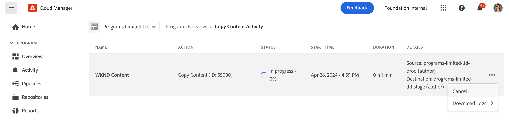

# 内容复制工具 {#content-copy}

內容複製工具可讓使用者根據需求將可變內容從其AEMas a Cloud Service生產環境複製到較低環境，以用於測試目的。

## 简介 {#introduction}

当前的真实数据对于测试、验证和用户验收很有价值。內容複製工具可讓您將內容從生產AEM環境複製到測試環境、開發環境或 [快速開發環境(RDE)](/help/implementing/developing/introduction/rapid-development-environments.md) 進行這類測試的環境。

要复制的内容由内容集定义。內容集包含JCR路徑清單，這些路徑包含要從來源製作服務環境複製到同一Cloud Manager程式中目標製作服務環境的可變內容。 内容集中允许使用以下路径。

```text
/content
/conf/**/settings/wcm
/conf/**/settings/dam/cfm/models
/conf/**/settings/graphql/persistentQueries
/etc/clientlibs/fd/themes
```

复制内容时，源环境是真实的来源。

* 如果在目标环境中修改了内容，如果路径相同，它将被源中的内容覆盖。
* 如果路径不同，源中的内容将与目标中的内容进行合并。

## 权限 {#permissions}

为了使用内容复制工具，在源环境和目标环境中都需要某些权限。

| 内容复制功能 | AEM管理員群組 | 部署经理角色 |
|---|---|---|
| 创建和修改[内容集](#create-content-set) | 必填 | 非必填 |
| 开始或取消[内容复制过程](#copy-content) | 必填 | 必填 |

## 创建内容集 {#create-content-set}

在複製任何內容之前，必須定義內容集。 内容集在定义之后可以重复使用来复制内容。请按照以下步骤操作来创建内容集。

1. 在 [my.cloudmanager.adobe.com](https://my.cloudmanager.adobe.com/) 登录 Cloud Manager 并选择适当的组织和程序。

1. 从&#x200B;**概述**&#x200B;页面导航到&#x200B;**环境**&#x200B;屏幕。

1. 从&#x200B;**环境**&#x200B;屏幕导航到&#x200B;**内容集**&#x200B;页面。

1. 点按或单击屏幕右上角的&#x200B;**添加内容集**&#x200B;按钮。

   

1. 於 **詳細資料** 標籤中，為內容集提供名稱和說明，然後點選或按一下 **繼續**.

   

1. 在向导的&#x200B;**内容路径**&#x200B;选项卡上，指定要包含在内容集中的可变内容的路径。

   1. 在&#x200B;**添加包含路径**&#x200B;字段中输入路径。
   1. 点按或单击&#x200B;**添加路径**&#x200B;按钮以将路径添加到内容集中。
   1. 根据需要，再次点按或单击&#x200B;**添加路径**&#x200B;按钮。
      * 最多允許五十個路徑。

   

1. 如果您需要优化或限制您的内容集，可以排除子路径。

   1. 在包含的路径列表中，点按或单击您需要限制的路径旁边的&#x200B;**添加排除子路径**&#x200B;图标。
   1. 在所选路径下输入要排除的子路径。
   1. 点按或单击&#x200B;**排除路径**。
   1. 根据需要，再次点按或单击&#x200B;**添加排除子路径**&#x200B;以添加要排除的其他路径。
      * 排除的路徑必須相對於包含的路徑。
      * 排除的路徑數目沒有限制。

   

1. 如果需要，您可以修改指定的路径。

   1. 点按或单击排除的子路径旁边的 X 以将其删除。
   1. 点按或单击路径旁边的省略号按钮以显示&#x200B;**编辑**&#x200B;和&#x200B;**删除**&#x200B;选项。

   

1. 点按或单击&#x200B;**创建**&#x200B;以创建内容集。

内容集现在可用于在环境之间复制内容。

## 编辑内容集 {#edit-content-set}

遵循与创建内容步骤时类似的步骤。不要点按或单击&#x200B;**添加内容集**，而是从控制台选择一个现有集，然后从省略号菜单中选择&#x200B;**编辑**。


請注意，編輯內容集時，您可能需要展開已設定的路徑以顯示排除的子路徑。

## 复制内容 {#copy-content}

创建内容集后，您可以使用它来复制内容。按照以下步骤操作来复制内容。

1. 在 [my.cloudmanager.adobe.com](https://my.cloudmanager.adobe.com/) 登录 Cloud Manager 并选择适当的组织和程序。

1. 从&#x200B;**概述**&#x200B;页面导航到&#x200B;**环境**&#x200B;屏幕。

1. 从&#x200B;**环境**&#x200B;屏幕导航到&#x200B;**内容集**&#x200B;页面。

1. 从控制台选择一个内容集，然后从省略号菜单中选择&#x200B;**复制内容**。

   

   >[!NOTE]
   >
   >在以下情况下可能无法选择环境：
   >
   >* 用户没有适当的权限。
   >* 环境中有正在运行的管道或正在进行的复制内容操作。
   >* 環境正在休眠或啟動。


1. 在&#x200B;**复制内容**&#x200B;对话框中，指定内容复制操作的源和目标。

   

   * 內容只能從較高的環境複製到較低的環境，或在開發/RDE環境之間複製，其中環境的階層如下所示（從最高到最低）：
      * 生产
      * 暂存
      * 開發/ RDE

1. 如有需要，您也可以選擇 **包含存取控制清單** 在復製程式中。

1. 点按或单击&#x200B;**复制**。

复制过程开始。复制过程的状态将反映在所选内容集的控制台中。

## 内容复制活动 {#copy-activity}

您可以在&#x200B;**复制内容活动**&#x200B;页面中监控复制过程的状态。

1. 在 [my.cloudmanager.adobe.com](https://my.cloudmanager.adobe.com/) 登录 Cloud Manager 并选择适当的组织和程序。

1. 从&#x200B;**概述**&#x200B;页面导航到&#x200B;**环境**&#x200B;屏幕。

1. 从&#x200B;**环境**&#x200B;屏幕导航到&#x200B;**复制内容活动**&#x200B;页面。


### 内容复制状态 {#statuses}

开始复制内容后，复制过程可能具有以下状态之一。

| 状态 | 描述 |
|---|---|
| 进行中 | 内容复制操作正在进行中 |
| 失败 | 内容复制操作失败 |
| 已完成 | 内容复制操作成功完成 |
| 已取消 | 使用者在啟動內容複製操作後將其取消 |

### 取消復製程式 {#cancelling}

如果您在啟動內容復製作業後需要中止該作業，您可以選擇取消該作業。

若要這麼做，請在 **複製內容活動** 頁面，選取 **取消** 動作（從您先前開始的復製程式省略符號選單中）。



>[!NOTE]
>
>取消內容複製操作時，可能會導致目標環境中的內容出現部分副本。 這可能會使目標環境處於無法使用的狀態。
>
>如果您的環境因取消而處於這種狀態，請聯絡Adobe客戶服務以尋求協助。

## 限制 {#limitations}

内容复制工具具有以下限制。

* 內容無法從較低層級環境複製到較高層級環境。
* 內容只能從製作服務複製到製作服務。
* 跨程序的内容复制是不可能的。
* 在同一环境中运行并发的内容复制操作是不可能的。
* 每个内容集最多可以指定五十条路径。排除的路径没有限制。
* 内容复制工具不应用作克隆或镜像工具，因为它无法跟踪源上移动或删除的内容。
* 内容复制工具没有版本控制能力，并且无法自动检测自上次内容复制操作以来在内容集中的源环境上修改或新创建的内容。
   * 如果您只想使用自上次內容復製作業以來發生的內容變更來更新目標環境，則需要建立內容集，並在自上次內容復製作業以來進行變更的來源執行個體上指定路徑。
* 版本信息不包含在内容副本中。
