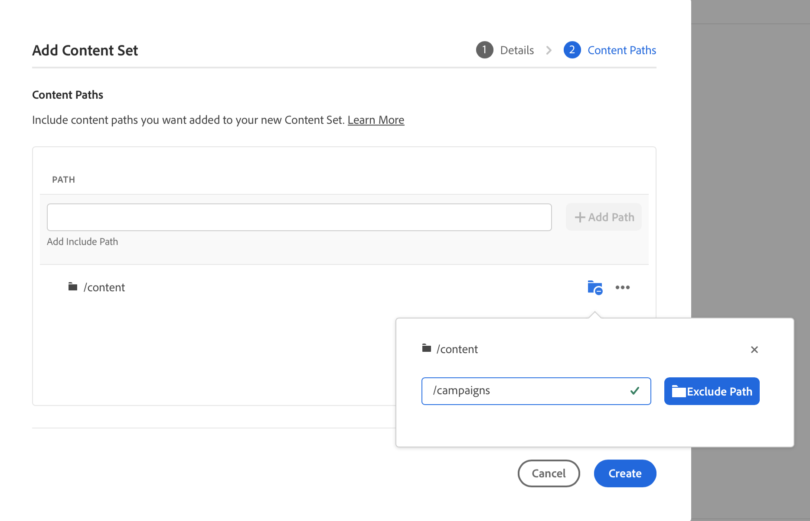

# 内容复制工具 {#content-copy}

内容复制工具使用户能够根据需要将可变内容从其AEMas a Cloud Service生产环境复制到较低环境，以进行测试。

## 简介 {#introduction}

当前的真实数据对于测试、验证和用户验收很有价值。内容复制工具允许您将内容从生产AEM环境复制到暂存、开发或 [快速开发环境(RDE)](/help/implementing/developing/introduction/rapid-development-environments.md) 用于此类测试的环境。

要复制的内容由内容集定义。内容集由一系列JCR路径组成，这些路径包含要在同一Cloud Manager程序内从源创作服务环境复制到目标创作服务环境的可变内容。 内容集中允许使用以下路径。

```text
/content
/conf/**/settings/wcm
/conf/**/settings/dam/cfm/models
/conf/**/settings/graphql/persistentQueries
/etc/clientlibs/fd/themes
```

复制内容时，源环境是真实的来源。

* 如果在目标环境中修改了内容，如果路径相同，它将被源中的内容覆盖。
* 如果路径不同，源中的内容将与目标中的内容进行合并。

## 权限 {#permissions}

为了使用内容复制工具，在源环境和目标环境中都需要某些权限。

| 内容复制功能 | AEM管理员组 | 部署经理角色 |
|---|---|---|
| 创建和修改[内容集](#create-content-set) | 必填 | 非必填 |
| 开始或取消[内容复制过程](#copy-content) | 必填 | 必填 |

## 创建内容集 {#create-content-set}

在复制任何内容之前，必须定义内容集。 内容集在定义之后可以重复使用来复制内容。请按照以下步骤操作来创建内容集。

1. 在 [my.cloudmanager.adobe.com](https://my.cloudmanager.adobe.com/) 登录 Cloud Manager 并选择适当的组织和程序。

1. 从&#x200B;**概述**&#x200B;页面导航到&#x200B;**环境**&#x200B;屏幕。

1. 从&#x200B;**环境**&#x200B;屏幕导航到&#x200B;**内容集**&#x200B;页面。

1. 点按或单击屏幕右上角的&#x200B;**添加内容集**&#x200B;按钮。

   

1. 在 **详细信息** 选项卡中，为内容集提供名称和描述，然后点按或单击 **继续**.

   

1. 在向导的&#x200B;**内容路径**&#x200B;选项卡上，指定要包含在内容集中的可变内容的路径。

   1. 在&#x200B;**添加包含路径**&#x200B;字段中输入路径。
   1. 点按或单击&#x200B;**添加路径**&#x200B;按钮以将路径添加到内容集中。
   1. 根据需要，再次点按或单击&#x200B;**添加路径**&#x200B;按钮。
      * 最多允许五十条路径。

   

1. 如果您需要优化或限制您的内容集，可以排除子路径。

   1. 在包含的路径列表中，点按或单击您需要限制的路径旁边的&#x200B;**添加排除子路径**&#x200B;图标。
   1. 在所选路径下输入要排除的子路径。
   1. 点按或单击&#x200B;**排除路径**。
   1. 根据需要，再次点按或单击&#x200B;**添加排除子路径**&#x200B;以添加要排除的其他路径。
      * 排除的路径必须相对于包含的路径。
      * 排除的路径数量没有限制。

   

1. 如果需要，您可以修改指定的路径。

   1. 点按或单击排除的子路径旁边的 X 以将其删除。
   1. 点按或单击路径旁边的省略号按钮以显示&#x200B;**编辑**&#x200B;和&#x200B;**删除**&#x200B;选项。

   

1. 点按或单击&#x200B;**创建**&#x200B;以创建内容集。

内容集现在可用于在环境之间复制内容。

## 编辑内容集 {#edit-content-set}

遵循与创建内容步骤时类似的步骤。不要点按或单击&#x200B;**添加内容集**，而是从控制台选择一个现有集，然后从省略号菜单中选择&#x200B;**编辑**。


请注意，在编辑内容集时，您可能需要展开配置的路径以显示排除的子路径。

## 复制内容 {#copy-content}

创建内容集后，您可以使用它来复制内容。按照以下步骤操作来复制内容。

1. 在 [my.cloudmanager.adobe.com](https://my.cloudmanager.adobe.com/) 登录 Cloud Manager 并选择适当的组织和程序。

1. 从&#x200B;**概述**&#x200B;页面导航到&#x200B;**环境**&#x200B;屏幕。

1. 从&#x200B;**环境**&#x200B;屏幕导航到&#x200B;**内容集**&#x200B;页面。

1. 从控制台选择一个内容集，然后从省略号菜单中选择&#x200B;**复制内容**。

   

   >[!NOTE]
   >
   >在以下情况下可能无法选择环境：
   >
   >* 用户没有适当的权限。
   >* 环境中有正在运行的管道或正在进行的复制内容操作。
   >* 环境正在休眠或启动。


1. 在&#x200B;**复制内容**&#x200B;对话框中，指定内容复制操作的源和目标。

   

   * 内容只能从较高的环境复制到较低的环境，或在开发/RDE环境之间复制，这些环境按如下层次（从最高到最低）排列：
      * 生产
      * 暂存
      * 开发/RDE

1. 如果需要，您还可以选择 **包括访问控制列表** 在复制过程中。

1. 点按或单击&#x200B;**复制**。

复制过程开始。复制过程的状态将反映在所选内容集的控制台中。

## 内容复制活动 {#copy-activity}

您可以在&#x200B;**复制内容活动**&#x200B;页面中监控复制过程的状态。

1. 在 [my.cloudmanager.adobe.com](https://my.cloudmanager.adobe.com/) 登录 Cloud Manager 并选择适当的组织和程序。

1. 从&#x200B;**概述**&#x200B;页面导航到&#x200B;**环境**&#x200B;屏幕。

1. 从&#x200B;**环境**&#x200B;屏幕导航到&#x200B;**复制内容活动**&#x200B;页面。


### 内容复制状态 {#statuses}

开始复制内容后，复制过程可能具有以下状态之一。

| 状态 | 描述 |
|---|---|
| 进行中 | 内容复制操作正在进行中 |
| 失败 | 内容复制操作失败 |
| 已完成 | 内容复制操作成功完成 |
| 已取消 | 用户在启动内容复制操作后取消该操作 |

### 取消复制流程 {#cancelling}

如果在启动内容复制操作后需要中止该操作，则可以选择取消该操作。

为此，请在 **复制内容活动** 页面上，选择 **取消** 之前启动的复制过程的省略号菜单中的操作。


>[!NOTE]
>
>取消内容复制操作时，可能会导致在目标环境中复制部分内容。 这可能会使目标环境处于不可用状态。
>
>如果您的环境由于取消而处于这种状态，请联系Adobe客户关怀部门寻求帮助。

## 限制 {#limitations}

内容复制工具具有以下限制。

* 内容不能从较低的环境复制到较高的环境。
* 内容只能从创作服务复制到创作服务。
* 跨程序的内容复制是不可能的。
* 在同一环境中运行并发的内容复制操作是不可能的。
* 每个内容集最多可以指定五十条路径。排除的路径没有限制。
* 内容复制工具不应用作克隆或镜像工具，因为它无法跟踪源上移动或删除的内容。
* 内容复制工具没有版本控制能力，并且无法自动检测自上次内容复制操作以来在内容集中的源环境上修改或新创建的内容。
   * 如果您希望仅使用自上次内容复制操作以来所做的内容更改来更新目标环境，则需要创建一个内容集，并在自上次内容复制操作以来进行了更改的源实例上指定路径。
* 版本信息不包含在内容副本中。
