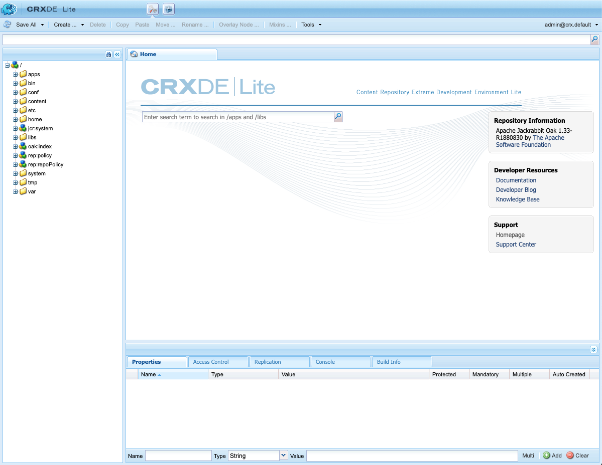

# 使用CRXDE Lite{#using-crxde-lite}

CRXDE Lite是AEM快速入门的一部分，您可以在浏览器中的本地开发环境中访问和修改存储库。 通过CRXDE Lite，您可以编辑文件、文件夹、节点和属性。 您可以在这个易于使用的界面中访问整个存储库。

>[!NOTE]
>
>CRXDE Lite仅在本地开发环境中可用。 它在AEM中不可用作Cloud Service。

## CRXDE Lite{#getting-started-with-crxde-lite}快速入门

要开始使用CRXDE Lite，请执行以下操作：

1. 启动本地AEM开发快速入门。
1. 在浏览器中，打开URL `https://<host>:<port>/crx/de`。
1. 输入&#x200B;**username**&#x200B;和&#x200B;**password**。
1. 单击&#x200B;**确定**。

CRXDE Lite用户界面在您的浏览器中如下所示：

您现在可以使用CRXDE Lite来开发应用程序。

>[!TIP]
>
>您还可以从AEM菜单访问CRXDE Lite。 从主菜单中选择&#x200B;**工具** -> **常规** -> **CRXDE Lite**。

## 用户界面{#overview-of-the-user-interface}概述

CRXDE Lite的用户界面有很多部分，功能很多。

### 顶部切换器栏{#top-switcher-bar}

通过顶部切换器栏，您可以在CRXDE Lite、包管理器和包共享之间快速切换。

### 节点路径小组件{#node-path-widget}

节点路径小组件显示当前选定节点的路径。

您还可以使用它跳转到节点，方法是手动输入路径或从其他位置粘贴路径，然后按Enter。

它还支持查找具有特定节点名称的节点。 输入要查找的节点名称，然后等待（或选择右侧的搜索图标）。 如果给定节点或节点已加载到资源管理器窗格中，则将显示列表，您可以选择路径并按Enter键导航到该路径。 请注意，它仅适用于当前加载到浏览器中CRXDE客户端应用程序的节点。 如果要搜索整个存储库，请使用&#x200B;**工具** -&amp;gt:**查询**。

### 浏览器窗格{#explorer-pane}

**Explorer Pane**&#x200B;显示存储库中所有节点的树。

单击某个节点以在&#x200B;**属性**&#x200B;选项卡中显示其属性。 单击某个节点后，您可以在工具栏中选择一项操作。 再次单击该节点以对其进行重命名。

“树导航过滤器”（双筒望远镜图标）允许您过滤存储库中名称包含输入文本的节点。 它仅适用于已本地加载的节点。

### 编辑窗格{#edit-pane}

**编辑窗格**&#x200B;允许您查看存储库中当前选定文件的内容。 打开的每个文件都将在窗格中显示为其自己的选项卡。

通过&#x200B;**Home**&#x200B;选项卡，您可以搜索内容和/或文档，并访问开发人员文档和Adobe支持。

双击&#x200B;**Explorer Pane**&#x200B;中的文件，以在&#x200B;**Edit Pane**&#x200B;中显示其内容。 然后，您可以修改并保存更改。

在&#x200B;**Edit Pane**&#x200B;中编辑文件后，工具栏上提供了以下工具：

* **在树中显示**  — 在存储库树中显示文件。
* **搜索/替换**  — 执行搜索或替换。

双击&#x200B;**编辑窗格**&#x200B;的状态行，可打开&#x200B;**转到行**&#x200B;对话框，以便您可以输入特定的行号。

### 属性选项卡{#properties-tab}

**属性选项卡**&#x200B;显示您选择的节点的属性。 您可以添加新属性或删除现有属性。

### 访问控制选项卡{#access-control-tab}

**访问控制选项卡**&#x200B;显示基于当前路径、存储库或主体的权限。

权限分为以下类别。

* **适用的访问控制策略**  — 可应用于当前选择的策略
* **本地访问控制策略**  — 当前策略应用于当前选择的本地
* **有效的访问控制策略**  — 应用于当前选择的当前策略，这些策略可以在本地设置，也可以从父节点继承

>[!NOTE]
要查看访问控制信息，登录CRXDE Lite的用户必须具有读取ACL条目的权限。

### 复制选项卡{#replication-tab}

**复制选项卡**&#x200B;显示当前节点的复制状态。 您可以复制并复制删除当前节点的操作。

###  控制台选项卡{#console-tab}

**控制台选项卡**&#x200B;显示日志消息。 您可以配置日志级别、清除控制台、固定到所选滚动位置并启用/禁用消息显示。

### “生成信息”选项卡{#build-info-tab}

**生成信息选项卡**&#x200B;在生成包时显示信息。

### 刷新按钮{#refresh-button}

**刷新按钮**&#x200B;刷新当前选择。 在您的存储库视图中，会更新其他用户所做的更改。 您所做的更改不会受到影响。

### 保存全部按钮{#save-all-button}

**Save All Button**&#x200B;保存您所做的所有更改。 在选择保存之前，所做的更改是临时的，在您退出控制台时，这些更改将丢失。

* **还原**  — 放弃自上次保存操作以来对选定节点所做的所有更改，然后重新加载选定节点的存储库的当前状态
* **全部还原**  — 放弃自上次保存操作以来在整个存储库中所做的所有更改，然后重新加载存储库的当前状态

### 创建按钮 {#create-button}

**创建按钮**&#x200B;是一个下拉菜单，用于在选定的节点下创建以下内容：

* 节点 — 具有任意节点类型的节点
* 文件 — `nt:file`节点及其nt:resource子节点
* 文件夹 — `nt:folder`节点

### 删除按钮{#delete-button}

**删除按钮**&#x200B;将删除所选节点。

### 复制按钮{#copy-button}

**复制按钮**&#x200B;复制所选节点。

## 粘贴按钮{#paste-button}

**粘贴按钮**&#x200B;会将复制的节点粘贴到选定节点下。

### 移动按钮{#move-button}

**移动按钮**&#x200B;将选定的节点移动到通过对话框设置的节点。

### 重命名 {#rename-button}

**重命名按钮**&#x200B;可重命名选定的节点。

### 混合{#mixins-button}

**混合按钮**&#x200B;允许您向节点类型添加混合类型。 混合类型主要用于添加高级功能。

### 工具 {#tools-button}

**工具按钮**&#x200B;是一个下拉菜单，其中提供了以下工具：

* **服务器配置**  — 用于访问Felix控制台(也可在 `https://<host>:<port>/system/console/configMgr`中找到)
* **查询**  — 查询存储库
* **权限**  — 查看和添加权限
* **测试访问控制**  — 测试特定路径和/或主体的权限
* **导出节点类型**  — 将系统中的节点类型导出为CND符号
* **导入节点类型**  — 使用CND符号导入节点类型。

### 登录小组件{#login-widget}

**登录小组件**&#x200B;显示当前登录的用户。

单击该页面可以以其他用户身份登录或重新登录。 `@crx.default`表示您位于存储库的默认（且仅限）工作区中。

**首选项**&#x200B;选项可用于设置您的UI语言，以及查看和自定义各种操作（如保存、搜索、创建注释等）的热键。

## 创建文件夹{#creating-a-folder}

要创建具有CRXDE Lite的文件夹，请执行以下操作：

1. 在您的 浏览器中打开 CRXDE Lite。
1. 在导航窗格中，右键单击要在其下创建新文件夹的文件夹，选择&#x200B;**创建……**，然后&#x200B;**创建文件夹……**。

1. 输入文件夹&#x200B;**名称**&#x200B;并单击&#x200B;**确定**。

1. 单击&#x200B;**Save All**&#x200B;以在服务器上保存更改。

## 创建节点{#creating-a-node}

要创建具有CRXDE Lite的节点，请执行以下操作：

1. 在您的 浏览器中打开 CRXDE Lite。
1. 在&#x200B;[**Explorer Pane**&#x200B;中，](#explorer-pane)右键单击要创建新节点的节点，选择&#x200B;**创建**，然后选择&#x200B;**创建节点**。
1. 输入&#x200B;**名称**&#x200B;并选择&#x200B;**类型**。
1. 单击&#x200B;**确定**。
1. 单击&#x200B;[**Save All Button**](#save-all-button)&#x200B;以在服务器上保存更改。

您现在可以通过修改属性或创建新节点来调整节点，以满足您的需求。

>[!NOTE]
大多数编辑操作（包括&#x200B;**Create Node**）都保留内存中的所有更改，并且仅在保存后（使用&#x200B;[**Save All Button**](#save-all-button)）才将它们存储在存储库中。 但是，某些操作（如移动）会自动保留。
在保存更改时，还由存储库执行有关新创建的节点是否被父节点的节点类型允许的验证。 如果在保存节点时收到错误消息，请检查内容结构是否有效（例如，不能将`nt:unstructured`节点创建为`nt:folder`节点的子节点）。

## 创建属性{#creating-a-property}

要创建具有CRXDE Lite的资产，请执行以下操作：

1. 在您的 浏览器中打开 CRXDE Lite。
1. 在&#x200B;[**Explorer Pane**&#x200B;中，](#explorer-pane)选择要添加新属性的节点。
1. 在底部窗格的&#x200B;[**属性选项卡**](#properties-tab)&#x200B;中，输入&#x200B;**名称**、**类型**&#x200B;和&#x200B;**值**。
1. 单击&#x200B;**添加**。
1. 单击&#x200B;[**Save All Button**](#save-all-button)&#x200B;以在服务器上保存更改。

## 创建文件{#creating-a-file}

要使用CRXDE Lite创建新文件，请执行以下操作：

1. 在您的 浏览器中打开 CRXDE Lite。
1. 在&#x200B;[**Explorer Pane**&#x200B;中，](#explorer-pane)右键单击要创建文件的组件，选择&#x200B;**创建**，然后选择&#x200B;**创建文件**。
1. 输入文件&#x200B;**名称**，包括其扩展名。
1. 单击&#x200B;**确定**。
1. 新文件将作为选项卡在&#x200B;[**编辑窗格**&#x200B;中打开。](#edit-pane)
1. 编辑文件。
1. 单击&#x200B;[**Save All Button**](#save-all-button)&#x200B;以保存更改。

## 导出和导入节点类型{#exporting-and-importing-node-types}

通过CRXDE Lite，您可以在[紧凑命名空间和节点类型定义(CND)符号](https://jackrabbit.apache.org/jcr/node-type-notation.html)中导入和/或导出节点类型定义。

要在CRXDE Lite中导出节点类型定义，请执行以下操作：

1. 在您的 浏览器中打开 CRXDE Lite。
1. 选择所需的节点。
1. 选择&#x200B;**工具**，然后选择&#x200B;**导出节点类型**。
1. 定义将以CND符号显示在浏览器新选项卡中。
1. 如有需要，保存信息。

要导入节点类型定义，请执行以下操作：

1. 在您的 浏览器中打开 CRXDE Lite。
1. 选择&#x200B;**工具**，然后选择&#x200B;**导入节点类型**。
1. 在&#x200B;[**编辑窗格**](#edit-pane)&#x200B;中打开一个标有&#x200B;**导入节点类型**&#x200B;的新选项卡。
1. 在&#x200B;**导入节点类型**&#x200B;选项卡的文本框中输入定义的CND符号。
1. 如果要更新现有定义，请选中&#x200B;**允许更新** 。
1. 单击&#x200B;**导入**。

## 记录 {#logging}

通过CRXDE Lite，可以显示位于文件系统`<aem-install-dir>/crx-quickstart/logs`处的文件`error.log`，并使用相应的日志级别对其进行筛选。 请按如下方式继续：

1. 在您的 浏览器中打开 CRXDE Lite。
1. 在窗口底部&#x200B;[**控制台选项卡**](#console-tab)&#x200B;右侧的下拉菜单中，选择&#x200B;**服务器日志**。
1. 单击&#x200B;**停止**&#x200B;图标以显示消息。

您可以：

* 通过单击&#x200B;**日志记录配置**&#x200B;图标，在Felix控制台中调整日志参数。
* 单击&#x200B;**清除控制台**&#x200B;图标可清除消息。
* 通过单击&#x200B;**固定控制台**&#x200B;图标，将消息固定到当前选择的位置。
* 通过单击&#x200B;**停止**&#x200B;图标，启用或禁用消息显示。
