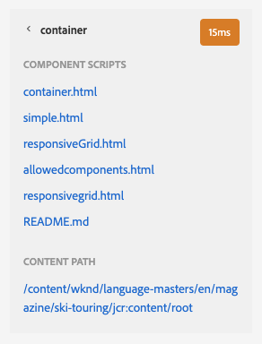

# 开发人员模式 {#developer-mode}

在AEM中编辑页面时，可以使用多个[模式](/help/sites-cloud/authoring/fundamentals/environment-tools.md#page-modes)，包括开发人员模式。 开发人员模式会打开一个侧面板，其中包含多个选项卡，为开发人员提供有关当前页面的技术信息。

有两个选项卡：

* **** 用于查看结构和性能信息的组件。
* **** 错误，无法看到发生的任何问题。

这些帮助开发人员：

* **** 发现页面的撰写方式。
* **调试：** 在何处和何时发生的事件，这反过来有助于解决问题。

>[!NOTE]
>
>开发人员模式：
>
>* 在移动设备上或桌面上的小窗口上不可用（由于空间限制）。
>  * 当宽度小于1024像素时，会发生这种情况。
>* 仅适用于属于`administrators`组成员的用户。

## 打开开发人员模式 {#opening-developer-mode}

开发人员模式作为页面编辑器的侧面板来实施。 要打开面板，请从页面编辑器工具栏的模式选择器中选择&#x200B;**Developer**:

该面板分为两个选项卡：

* **[组件](#components)**  — 此时会显示一个组件树，与作者的内 [容](/help/sites-cloud/authoring/fundamentals/environment-tools.md#content-tree) 树类似
* **[错误](#errors)**  — 出现问题时，将显示每个组件的详细信息。

### “组件”选项卡 {#components}

此时将显示一个组件树，该组件树：

* 概述页面上呈现的组件和模板链。 可以展开树以显示层次结构中的上下文。
* 显示呈现组件所需的服务器端计算时间。
* 用于展开树并选择树中的特定组件。 通过选择组件，可以访问组件详细信息；例如：
   * 存储库路径
   * 指向脚本的链接(在CRXDE Lite中访问)
   * 组件详细信息，如[组件控制台](/help/sites-cloud/authoring/features/components-console.md)中所示
* 树中选定的组件在编辑器中以蓝色边框表示。

此组件选项卡有助于：

* 确定并比较每个组件的渲染时间。
* 查看并了解层级。
* 通过查找慢速组件，了解并改进页面加载时间。

每个组件条目可以具有以下选项：

* **查看详细信息：** 指向列表的链接，其中显示：
   * 用于呈现组件的所有组件脚本。
   * 此特定组件的存储库内容路径。

      

* **编辑脚本：** 以CRXDE Lite方式打开组件脚本的链接。

* **查看组件详细信息：** 在组件控制台中打开组件的详 [细信息。](/help/sites-cloud/authoring/features/components-console.md)

通过点按或单击V形标记来展开组件条目还可能显示：

    *选定组件中的层次结构。
    *单独呈现选定组件、其中嵌套的任何单个组件的呈现时间以及组合的总计。

### “错误”选项卡 {#errors}

希望&#x200B;**Errors**&#x200B;选项卡将始终为空（如上所示），但是当出现问题时，可能会为每个组件显示以下详细信息：

* 当组件将条目写入错误日志、错误详细信息以及指向CRXDE Lite中相应代码的链接时，会出现警告。
* 组件打开管理员会话时出现警告。

例如，如果调用了未定义的方法，则生成的错误将显示在&#x200B;**Errors**&#x200B;选项卡中，而在发生错误时，**Components**&#x200B;选项卡树中的组件条目也将使用指示符标记。
