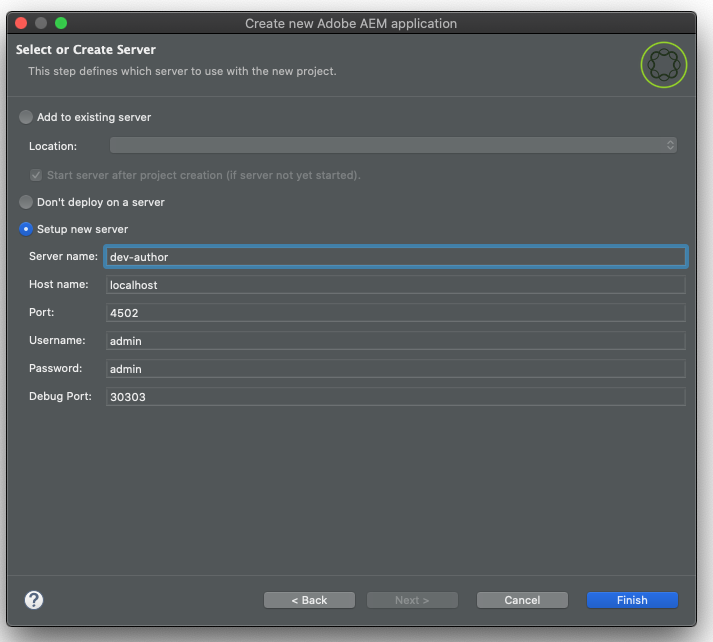

# 适用于 Eclipse 的 AEM 开发人员工具{#aem-developer-tools-for-eclipse}


## 概述 {#overview}

_适用于Eclipse的Experience Manager开发人员工具_&#x200B;是一个基于Apache许可证2下发布的适用于Apache Sling](https://sling.apache.org/documentation/development/ide-tooling.html)的[Eclipse插件的Eclipse插件。

它提供了几项使AEM开发更轻松的功能：

* 通过Eclipse服务器连接器与AEM实例无缝集成
* 内容和OSGi捆绑包的同步
* 使用代码热插拔功能调试支持
* 通过特定项目创建向导简单BootstrapAEM项目
* 轻松编辑JCR属性

## 要求 {#requirements}

在使用AEM Developer Tools之前，您需要：

* 下载并安装适用于Enterprise Java™开发人员的[Eclipse IDE](https://www.eclipse.org/downloads/packages/)。
* 按照[Eclipse常见问题解答](https://wiki.eclipse.org/FAQ_How_do_I_increase_the_heap_size_available_to_Eclipse)中的说明，通过编辑`eclipse.ini`配置文件来配置Eclipse安装，确保您至少有1 GB的栈内存。

>[!NOTE]
>
>在macOS上，您需要右键单击&#x200B;**Eclipse.app**，然后选择&#x200B;**显示包内容**&#x200B;以查找您的&#x200B;`eclipse.ini`**。**

## 如何安装适用于Eclipse的AEM开发人员工具 {#how-to-install-the-aem-developer-tools-for-eclipse}

当您满足上述[要求](#requirements)后，可以按如下方式安装插件：

1. 打开[AEM Developer Tools网站](https://eclipse.adobe.com/com.adobe.granite.ide.p2update-1.3.0.zip)。<!-- RB: OLD URL was (https://eclipse.adobe.com/aem/dev-tools/) This URL is generating a 404 error in the experience-manager-cloud-service.en LinkCheckExl report . The website appears to be dead; no redirects at all. Clicking "Installation Link" does not do anything. Only the link "Download archive" works. The "Online Documentation" link just takes you to the AEM Docs home page. Not sure if this topic is still needed?? -->

1. 复制&#x200B;**安装链接**。

   或者，您可以下载归档文件，而不是使用安装链接。 此方法允许脱机安装，但您不会以这种方式接收未通过自动更新通知。

1. 在Eclipse中，打开&#x200B;**帮助**&#x200B;菜单。
1. 单击&#x200B;**安装新软件**。
1. 单击&#x200B;**添加……**。
1. 在&#x200B;**名称**&#x200B;字段中，输入`AEM Developer Tools`。
1. 在&#x200B;**位置**&#x200B;字段中，复制安装URL。
1. 单击&#x200B;**添加**。
1. 检查&#x200B;**AEM**&#x200B;和&#x200B;**Sling**&#x200B;插件。
1. 单击&#x200B;**下一步**。
1. 在&#x200B;**安装详细信息**&#x200B;窗口中，再次单击&#x200B;**下一步**。
1. 接受许可协议，然后单击&#x200B;**完成**。
1. 单击&#x200B;**立即重新启动**&#x200B;以重新启动Eclipse。

## AEM视角 {#the-aem-perspective}

在Eclipse中，透视可确定窗口内可用的操作和视图，并支持与Eclipse中的资源进行面向任务的交互。 有关透视的更多详细信息，请参阅[Eclipse文档。](https://help.eclipse.org/latest/index.jsp)

_Eclipse的Experience Manager开发工具_&#x200B;提供了AEM Perspective，可让您完全控制AEM项目和实例。 要打开AEM Perspective，请执行以下操作：

1. 从Eclipse菜单栏中选择&#x200B;**窗口** > **透视** > **打开透视** > **其他**。
1. 在对话框中选择&#x200B;**AEM**，然后单击&#x200B;**打开**。


## 示例多模块项目 {#sample-multi-module-project}

_适用于Eclipse的Experience Manager开发人员工具_&#x200B;附带了一个示例的多模块项目，可帮助您快速掌握Eclipse中的项目设置。 它还可用作几项AEM功能的最佳实践指南。 [了解有关项目原型的更多信息](https://github.com/adobe/aem-project-archetype)。

按照以下步骤创建示例项目：

1. 在&#x200B;**文件** > **新建** > **项目**&#x200B;菜单中，浏览到&#x200B;**AEM**&#x200B;部分并选择&#x200B;**AEM示例多模块项目**。

   

1. 单击&#x200B;**下一步**。

   >[!NOTE]
   >
   >此步骤可能需要花些时间，因为m2eclipse必须扫描原型目录。

1. 从菜单中选择`com.adobe.granite.archetypes : sample-project-archetype : <highest-number>`，然后单击&#x200B;**下一步**。

   

1. 为示例项目提供以下字段：

   * **名称**
   * **组ID**
   * **项目ID**
   * **appId** — 您可能需要展开&#x200B;**高级**&#x200B;选项来设置此值。
   * **appTitle** — 您可能需要展开&#x200B;**高级**&#x200B;选项以设置此值。
   * **包** — 您可能需要展开&#x200B;**高级**&#x200B;选项来设置此值。

   

1. 单击&#x200B;**下一步**。

1. 然后，配置Eclipse连接的AEM服务器。

   要使用Debugger功能，您需要以调试模式启动AEM — 这可以通过在命令行中添加以下内容来实现：

   ```text
       -nofork -agentlib:jdwp=transport=dt_socket,server=y,suspend=n,address=10123
   ```

   

1. 单击&#x200B;**完成**。 将创建项目结构。

   >[!NOTE]
   >
   >在全新安装中（更具体地说，当从未下载maven依赖项时），您可能会创建项目，但出现错误。 在这种情况下，请按照[解析无效项目定义](#resolving-invalid-project-definition)中所述的过程操作。

## 如何导入现有项目 {#how-to-import-existing-projects}

您可以使用&#x200B;**新建项目**&#x200B;功能为您创建正确的结构：

1. 按照说明创建[示例多模块项目](#sample-multi-module-project)，您已为您创建了以下项目，这些项目允许健康地分离问题：

   * `/apps`和`/etc`内容的`PROJECT.ui.apps`
   * 已创作的`/content`的`PROJECT.ui.content`
   * Java™捆绑包`PROJECT.core`(当您想要添加Java™代码时，这些捆绑包会变得很有趣)
   * 集成测试的`PROJECT.it.launcher`和`PROJECT.it.tests`

1. 将`PROJECT.ui.apps`项目的内容替换为包的`apps`和`etc`文件夹：

   1. 在项目资源管理器面板中，展开`PROJECT.ui.apps` > `src` > `main` > `content` > `jcr_root` > `apps`。
   1. 右键单击`apps`文件夹，然后选择&#x200B;**显示位置** > **系统资源管理器**。
   1. 删除您现在应该看到的`apps`和`etc`文件夹，并将内容包的`apps`和`etc`文件夹放置在此处。
   1. 在Eclipse中，右键单击`PROJECT.ui.apps`项目并选择&#x200B;**刷新**。

1. 然后，对`PROJECT.ui.content`执行相同操作，并将其内容文件夹替换为您的包之一：

   1. 在项目资源管理器面板中，展开`PROJECT.ui.content` > `src` > `main` > `content` > `jcr_root` > `content`。
   1. 右键单击较深的内容文件夹，然后选择&#x200B;**显示于** > **系统资源管理器**。
   1. 删除您现在应该看到的内容文件夹，并将此处的内容包的内容文件夹放置在此处。
   1. 在Eclipse中，右键单击`PROJECT.ui.content`项目并选择&#x200B;**刷新**。

1. 现在，您必须更新这两个项目的`filter.xml`文件，以使其与内容包的内容相对应。 为此，请在单独的文本/代码编辑器中打开内容包的`META-INF/vault/filter.xml`文件。

   * 下面是您的`filter.xml`文件外观的示例：

   ```xml
   <?xml version="1.0" encoding="UTF-8"?>
   <workspaceFilter version="1.0">
       <filter root="/apps/foo"/>
       <filter root="/apps/foundation/components/bar"/>
       <filter root="/etc/designs/foo"/>
       <filter root="/content/foo"/>
       <filter root="/content/dam/foo"/>
       <filter root="/content/usergenerated/content/foo"/>
   </workspaceFilter>
   ```

1. 对于已拆分为两个项目的包内容，还必须将这些筛选规则拆分为两个并相应地更新两个项目的`filter.xml`文件。

   1. 在Eclipse中，打开`PROJECT.ui.apps/src/main/content/META-INF/filter.xml`。
   1. 将`<workspaceFilter>`元素的内容替换为以`/apps`和`/etc`开头的包的规则
      * 例如：

        ```xml
        <?xml version="1.0" encoding="UTF-8"?>
        <workspaceFilter version="1.0">
           <filter root="/apps/foo"/>
           <filter root="/apps/foundation/components/bar"/>
           <filter root="/etc/designs/foo"/>
        </workspaceFilter>
        ```

   1. 然后打开`PROJECT.ui.content/src/main/content/META-INF/filter.xml`。
   1. 将规则替换为以`/content`开头的包规则。
      * 例如：

        ```xml
        <?xml version="1.0" encoding="UTF-8"?>
        <workspaceFilter version="1.0">
           <filter root="/content/foo"/>
           <filter root="/content/dam/foo"/>
           <filter root="/content/usergenerated/content/foo"/>
        </workspaceFilter>
        ```

1. 确保保存所有更改。 您现在可以将该新内容同步到您的AEM实例。

1. 在“服务器”面板中，确保连接已启动，如果未启动，则确保连接已启动。
1. 单击&#x200B;**清理和Publish**&#x200B;图标。

完成后，您应在实例上运行包，保存后，任何更改都会自动同步到实例。

如果要从项目中重新生成包，请右键单击`PROJECT.ui.apps`或`PROJECT.ui.content`，然后选择&#x200B;**运行方式** > **Maven安装**。

现在，您已经创建了一个目标文件夹，其中包含了您的包（例如，`PROJECT.ui.apps-0.0.1-SNAPSHOT.zip`）。

## 疑难解答 {#troubleshooting}

### 解析无效的项目定义 {#resolving-invalid-project-definition}

要解决无效依赖项和项目定义，请按照以下步骤操作：

1. 选择所有已创建的项目。
1. 右键单击。
1. 在上下文菜单中，选择&#x200B;**Maven** > **更新项目**。
1. 检查&#x200B;**强制更新快照/版本**。
1. 单击&#x200B;**确定**。

Eclipse下载所需的依赖项。 这可能需要花些时间。

## 更多信息 {#more-information}

适用于Eclipse网站的官方Apache Sling IDE工具为您提供有用信息：

* 适用于Eclipse的&#x200B;[**Apache Sling IDE工具**&#x200B;用户指南](https://sling.apache.org/documentation/development/ide-tooling.html)，本文档将指导您了解AEM开发工具支持的整体概念、服务器集成和部署功能。
* [疑难解答部分](https://sling.apache.org/documentation/development/ide-tooling.html#troubleshooting)。
* [已知问题列表](https://sling.apache.org/documentation/development/ide-tooling.html#known-issues)。

以下官方[Eclipse](https://www.eclipse.org/)文档可以帮助设置环境：

* [开始使用Eclipse](https://eclipseide.org/getting-started/)
* [Eclipse Luna帮助系统](https://help.eclipse.org/latest/index.jsp)
* [Maven集成(m2eclipse)](https://www.eclipse.org/m2e/)
