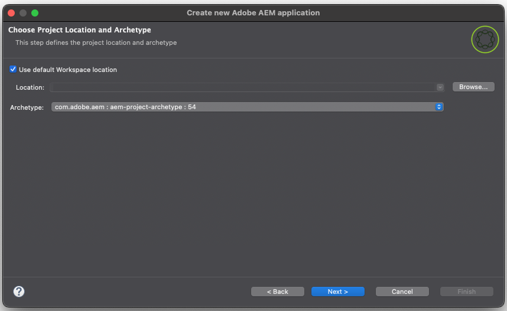

# 适用于 Eclipse 的 AEM 开发人员工具{#aem-developer-tools-for-eclipse}


## 概述 {#overview}

_适用于Eclipse的Experience Manager Developer Tools_&#x200B;是一个基于Apache许可证2下发布的适用于Apache Sling[的](https://sling.apache.org/documentation/development/ide-tooling.html)Eclipse插件的Eclipse插件。

它提供了多项功能，可简化AEM的开发：

* 通过Eclipse Server Connector与AEM实例无缝集成
* 内容和OSGi捆绑包的同步
* 使用代码热插拔功能调试支持
* 通过特定项目创建向导简单BootstrapAEM项目
* 轻松编辑JCR属性

## 要求 {#requirements}

在使用AEM Developer Tools之前，您需要：

* 下载并安装适用于Enterprise Java和Web开发人员的[Eclipse IDE。](https://www.eclipse.org/downloads/packages/)
   * 适用于Eclipse的AEM Developer Tools版本1.4.0与Eclipse 2022-12 (4.26)或更高版本兼容，并且需要Java 17或更高版本才能运行。
* 按照`eclipse.ini`Eclipse常见问题解答[中的说明，通过编辑](https://wiki.eclipse.org/FAQ_How_do_I_increase_the_heap_size_available_to_Eclipse%3F)配置文件来配置Eclipse安装，确保您至少有1 GB的栈内存。

>[!NOTE]
>
>在macOS上，您需要右键单击&#x200B;**Eclipse.app**，然后选择&#x200B;**显示包内容**&#x200B;以查找您的`eclipse.ini`。

## 如何安装适用于Eclipse的AEM开发人员工具 {#how-to-install-the-aem-developer-tools-for-eclipse}

满足上述[要求](#requirements)后，您可以按如下方式安装开发人员工具插件：

1. 打开[AEM Developer Tools网站。](https://eclipse.adobe.com/)

1. 复制&#x200B;**安装链接**。

   * 或者，您可以下载归档文件，而不是使用安装链接。
   * 此方法允许脱机安装，但您不会收到自动更新通知。

1. 在Eclipse中，打开&#x200B;**帮助**&#x200B;菜单。
1. 单击&#x200B;**安装新软件**。
1. 单击&#x200B;**添加……**。
1. 在&#x200B;**名称**&#x200B;字段中，输入`AEM Developer Tools`。
1. 在&#x200B;**位置**&#x200B;字段中，复制安装URL。
1. 单击&#x200B;**添加**。
1. 检查&#x200B;**AEM**&#x200B;和&#x200B;**Sling**&#x200B;插件。
1. 单击&#x200B;**下一步**。
1. 在&#x200B;**安装详细信息**&#x200B;窗口中，查看要安装的项，然后再次单击&#x200B;**下一步**。
1. 接受许可协议，然后单击&#x200B;**完成**。
1. 在出现的&#x200B;**信任颁发机构**&#x200B;对话框中，选择颁发机构/站点`https://eclipse.adobe.com`，然后单击&#x200B;**信任选定项**。
1. 在显示的&#x200B;**信任项目**&#x200B;对话框中，选择代码签名者并单击&#x200B;**信任选定项**。
1. 单击&#x200B;**立即重新启动**&#x200B;以重新启动Eclipse。

## AEM视角 {#the-aem-perspective}

在Eclipse中，**透视**&#x200B;确定窗口内可用的操作和视图，并支持与Eclipse中的资源进行面向任务的交互。 有关透视的更多详细信息，请参阅[Eclipse文档。](https://help.eclipse.org/latest/index.jsp)。

_适用于Eclipse的Experience Manager开发工具_&#x200B;从一个AEM角度提供了对AEM项目和实例的完全控制权。 要打开AEM透视，请执行以下操作：

1. 从Eclipse菜单栏中选择&#x200B;**窗口** > **透视** > **打开透视** > **其他**。
1. 在对话框中选择&#x200B;**AEM**，然后单击&#x200B;**打开**。


## 示例多模块项目 {#sample-multi-module-project}

_适用于Eclipse的Experience Manager Developer Tools_&#x200B;附带了一个示例多模块项目，可帮助您快速完成Eclipse中的项目设置。 此外，它还可用作利用[AEM项目原型](https://github.com/adobe/aem-project-archetype)的多个AEM功能的最佳实践指南。

按照以下步骤创建示例项目：

1. 在&#x200B;**文件** > **新建** > **项目**&#x200B;菜单中，浏览到&#x200B;**AEM**&#x200B;部分并选择&#x200B;**AEM示例多模块项目**。

   

1. 单击&#x200B;**下一步**。

   >[!NOTE]
   >
   >此步骤可能需要一些时间，因为[m2eclipse](https://eclipse.dev/m2e/)必须扫描原型目录。

1. 应在`com.adobe.aem : aem-project-archetype : <highest-number>`原型&#x200B;**下拉列表中自动选择**。 如果需要，请选择以前的版本。 单击&#x200B;**下一步**。

   

1. 为示例项目提供以下字段：

   * **名称**
   * **组ID**
   * **项目ID**
   * **appId** — 您可能需要展开&#x200B;**高级**&#x200B;选项来设置此值。
   * **appTitle** — 您可能需要展开&#x200B;**高级**&#x200B;选项以设置此值。
   * **包** — 您可能需要展开&#x200B;**高级**&#x200B;选项来设置此值。

   

1. 单击&#x200B;**下一步**。

1. 通过选择&#x200B;**设置新服务器**&#x200B;并提供服务器名称和必要的连接详细信息，配置Eclipse连接的AEM服务器。

   

   * 要使用调试器功能，您需要通过提供参数`-agentlib`在调试模式下启动AEM，例如：

   ```text
   $ java -agentlib:jdwp=transport=dt_socket,server=y,suspend=n,address=*:5005 -jar aem-author-p4502.jar
   ```

   >[!TIP]
   >
   >有关调试在本地AEM SDK上运行的项目的更多详细信息，请参阅文档[远程调试AEM SDK。](https://experienceleague.adobe.com/zh-hans/docs/experience-manager-learn/cloud-service/debugging/debugging-aem-sdk/remote-debugging)

1. 单击&#x200B;**完成**。

将创建项目结构。 将必要的工件下载到项目可能需要一些时间。

>[!NOTE]
>
>在全新安装时或以前未下载Maven依赖项时，Eclipse可能会报告项目是在创建时出错的。 在这种情况下，请按照[解决无效项目定义](#resolving-invalid-project-definition)一节中描述的步骤操作。

## 如何导入现有项目 {#how-to-import-existing-projects}

使用&#x200B;**新建项目**&#x200B;功能创建基本项目结构。

1. 按照说明创建[示例多模块项目，](#sample-multi-module-project)，这将创建一个基本的项目结构，其中关注点正常分离：

   * `PROJECT.ui.apps`和`/apps`内容的`/etc`
   * 已创作的`PROJECT.ui.content`的`/content`
   * Java包`PROJECT.core`
   * 集成测试的`PROJECT.it.launcher`和`PROJECT.it.tests`

1. 将`PROJECT.ui.apps`项目的内容替换为包的`apps`和`etc`文件夹：

   1. 在&#x200B;**项目资源管理器**&#x200B;面板中，展开`PROJECT.ui.apps` > `src` > `main` > `content` > `jcr_root` > `apps`。
   1. 右键单击`apps`文件夹，然后选择&#x200B;**显示位置** > **系统资源管理器**。
   1. 删除那里的`apps`和`etc`文件夹。
   1. 将内容包的`apps`和`etc`文件夹放在同一位置。
   1. 在Eclipse中，右键单击`PROJECT.ui.apps`项目并选择&#x200B;**刷新**。

1. 然后，对`PROJECT.ui.content`执行相同操作，并将其内容文件夹替换为您的包之一：

   1. 在&#x200B;**项目资源管理器**&#x200B;面板中，展开`PROJECT.ui.content` > `src` > `main` > `content` > `jcr_root` > `content`。
   1. 右键单击较深的内容文件夹，然后选择&#x200B;**显示于** > **系统资源管理器**。
   1. 在该处删除内容文件夹。
   1. 在同一位置，放置内容包的内容文件夹。
   1. 在Eclipse中，右键单击`PROJECT.ui.content`项目并选择&#x200B;**刷新**。

1. 通过在单独的文本/代码编辑器中打开内容包的`filter.xml`文件，更新这两个项目的`META-INF/vault/filter.xml`文件，使其对应于内容包的内容。

   * 下面是您的`filter.xml`文件外观的示例：

   ```xml
   <?xml version="1.0" encoding="UTF-8"?>
   <workspaceFilter version="1.0">
       <filter root="/apps/foo"/>
       <filter root="/apps/foundation/components/bar"/>
       <filter root="/etc/designs/foo"/>
       <filter root="/content/foo"/>
       <filter root="/content/dam/foo"/>
       <filter root="/content/usergenerated/content/foo"/>
   </workspaceFilter>
   ```

1. 对于已拆分为两个项目的包内容，还必须将这些筛选规则拆分为两个并相应地更新两个项目的`filter.xml`文件。

   1. 在Eclipse中，打开`PROJECT.ui.apps/src/main/content/META-INF/filter.xml`。
   1. 将`<workspaceFilter>`元素的内容替换为以`/apps`和`/etc`开头的包的规则
      * 例如：

        ```xml
        <?xml version="1.0" encoding="UTF-8"?>
        <workspaceFilter version="1.0">
           <filter root="/apps/foo"/>
           <filter root="/apps/foundation/components/bar"/>
           <filter root="/etc/designs/foo"/>
        </workspaceFilter>
        ```

   1. 然后打开`PROJECT.ui.content/src/main/content/META-INF/filter.xml`。
   1. 将规则替换为以`/content`开头的包规则。
      * 例如：

        ```xml
        <?xml version="1.0" encoding="UTF-8"?>
        <workspaceFilter version="1.0">
           <filter root="/content/foo"/>
           <filter root="/content/dam/foo"/>
           <filter root="/content/usergenerated/content/foo"/>
        </workspaceFilter>
        ```

1. 确保保存所有更改。 您现在可以将该新内容同步到您的AEM实例。

1. 在&#x200B;**服务器**&#x200B;面板中，确保您的连接已启动，如果，则不启动连接。

1. 单击&#x200B;**清理并发布**&#x200B;图标。

完成后，您的包应该会在实例上运行。 在保存时，任何更改都会自动同步到实例。

如果要从项目中重新生成包，请右键单击`PROJECT.ui.apps`或`PROJECT.ui.content`，然后选择&#x200B;**运行方式** > **Maven安装**。

现在，您已经创建了一个目标文件夹，其中包含了您的包（例如，`PROJECT.ui.apps-0.0.1-SNAPSHOT.zip`）。

## 疑难解答 {#troubleshooting}

### 解析无效的项目定义 {#resolving-invalid-project-definition}

要解决无效依赖项和项目定义，请按照以下步骤操作：

1. 选择所有已创建的项目。
1. 右键单击。
1. 在上下文菜单中，选择&#x200B;**Maven** > **更新项目**。
1. 检查&#x200B;**强制更新快照/版本**。
1. 单击&#x200B;**确定**。

Eclipse下载所需的依赖项。 这可能需要花些时间。

## 更多信息 {#more-information}

适用于Eclipse网站的官方Apache Sling IDE工具提供了有用的其他信息：

* 适用于Eclipse的&#x200B;[**Apache Sling IDE工具**&#x200B;用户指南](https://sling.apache.org/documentation/development/ide-tooling.html)将指导您了解AEM开发工具支持的整体概念、服务器集成和部署功能。
* [Apache Sling IDE工具疑难解答](https://sling.apache.org/documentation/development/ide-tooling.html#troubleshooting)
* [已知问题列表](https://sling.apache.org/documentation/development/ide-tooling.html#known-issues)

以下官方[Eclipse](https://www.eclipse.org/)文档可以帮助设置环境：

* [开始使用Eclipse](https://eclipseide.org/getting-started/)
* [Eclipse Luna帮助系统](https://help.eclipse.org/latest/index.jsp)
* [Maven集成(m2eclipse)](https://www.eclipse.org/m2e/)
