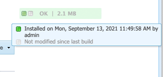

# 包管理器 {#working-with-packages}

包允许导入和导出存储库内容。 您可以使用包来安装新内容、在实例之间传输内容以及备份存储库内容。

使用包管理器，您可以在AEM实例和本地文件系统之间传输包以用于开发目的。

## 什么是包？ {#what-are-packages}

资源包是一个zip文件，其中以文件系统序列化形式保存存储库内容，称为存储库序列化，提供了易于使用且易于编辑的文件和文件夹的表示形式。 包中包含的内容通过使用过滤器进行定义。

资源包还包含保管库元信息，包括过滤器定义和导入配置信息。 包中可以包含其他内容属性（不用于包提取），例如描述、可视图像或图标。 这些附加内容属性仅用于内容包使用者和信息目的。

>[!NOTE]
>
>包表示生成包时内容的当前版本。 它们不包括AEM保留在存储库中的内容的任何以前版本。

## AEMas a Cloud Service中的包 {#aemaacs-packages}

为AEMas a Cloud Service应用程序创建的内容包必须在不可变内容和可变内容之间实现完全分离。 因此，包管理器只能用于管理包含内容的包。 任何代码都必须通过Cloud Manager部署。

>[!NOTE]
>
>包只能包含内容。 任何功能(例如， `/apps`)必须 [使用Cloud Manager中的CI/CD管道部署。](/help/implementing/cloud-manager/deploy-code.md)

>[!IMPORTANT]
>
>包管理器UI可能会返回 **未定义** 安装包需要超过10分钟时出现错误消息。 如果发生这种情况，请不要重试安装，因为安装在后台正常进行，并且多个并发导入进程可能会引发某些冲突。

有关如何管理AEMaaCS包的更多详细信息，请查看此文档 [部署到AEMas a Cloud Service](/help/implementing/deploying/overview.md) （位于部署用户指南中）。

## 包管理器 {#package-manager}

包管理器管理AEM安装上的包。 在 [分配了必要的权限](#permissions-needed-for-using-the-package-manager) 您可以将包管理器用于各种操作，包括配置、构建、下载和安装包。

### 所需权限 {#required-permissions}

要创建、修改、上传和安装包，用户必须在以下节点上拥有相应的权限：

* 删除时排除的完全权限 `/etc/packages`
* 包含包内容的节点

>[!CAUTION]
>
>授予资源包权限可能会导致敏感信息泄露和数据丢失。
>
>为了限制这些风险，强烈建议仅授予专用子树的特定组权限。

### 访问包管理器 {#accessing}

您可以通过以下三种方式访问包管理器：

1. 从AEM主菜单 — > **工具** -> **部署** -> **包**
1. 从 [CRXDE Lite](crxde.md) 使用顶部切换器栏
1. 直接通过访问 `http://<host>:<port>/crx/packmgr/`

### 包管理器UI {#ui}

包管理器分为四个主要功能区：

* **左侧导航面板**  — 利用此面板，可筛选和排序包列表。
* **包列表**  — 这是在左侧导航面板中按选定内容过滤和排序的实例上的包列表。
* **活动日志**  — 此面板首先将最小化，并展开以详细描述包管理器的活动，如构建或安装包时。 “活动日志”选项卡中还有其他按钮，用于：
   * **清除日志**
   * **显示/隐藏**
* **工具栏**  — 工具栏包含“左侧导航面板”和“包”列表的刷新按钮，以及用于搜索、创建和上传包的按钮。


单击左侧导航面板中的选项会立即过滤包列表。

单击资源包名称会展开资源包列表中的条目，以显示有关资源包的更多详细信息。


扩展资源包详细信息时，可使用工具栏按钮对资源包执行许多操作。

* [编辑](#edit-package)
* [生成](#building-a-package)
* [重新安装](#reinstalling-packages)
* [下载](#downloading-packages-to-your-file-system)

在 **更多** 按钮。

* [删除](#deleting-packages)
* [范围](#package-coverage)
* [个内容](#viewing-package-contents-and-testing-installation)
* [重新包装](#rewrapping-a-package)
* [其他版本](#other-versions)
* [卸载](#uninstalling-packages)
* [测试安装](#viewing-package-contents-and-testing-installation)
* [验证](#validating-packages)
* [复制](#replicating-packages)

### 包状态 {#package-status}

资源包列表中的每个条目都有一个状态指示器，可让您快速了解资源包的状态。 将鼠标悬停在状态上会显示包含状态详细信息的工具提示。



如果包已更改或从未构建，则状态将显示为一个链接，可快速执行重建或安装包的操作。

## 包设置 {#package-settings}

包本质上是一组过滤器，存储库数据则基于这些过滤器。 使用包管理器UI，您可以单击包，然后单击 **编辑** 按钮以查看包的详细信息，包括以下设置。

* [常规设置](#general-settings)
* [包过滤器](#package-filters)
* [包依赖项](#package-dependencies)
* [高级设置](#advanced-settings)
* [包屏幕截图](#package-screenshots)

### 常规设置 {#general-settings}

您可以编辑各种资源包设置以定义资源包描述、依赖关系和提供程序详细信息等信息。

的 **包设置** 对话框可通过 **编辑** 按钮 [创建](#creating-a-new-package) 或 [编辑](#viewing-and-editing-package-information) 包。 进行任何更改后，单击 **保存**.


| 字段 | 描述 |
|---|---|
| 名称 | 包的名称 |
| 组 | 要组织资源包，您可以键入新群组的名称或选择现有群组 |
| 版本 | 要用于版本的文本 |
| 描述 | 包的简要说明，允许HTML标记以进行格式设置 |
| 缩略图 | 包列表中显示的图标 |

### 包过滤器 {#package-filters}

过滤器标识要包含在包中的存储库节点。 A **过滤器定义** 指定以下信息：

* 的 **根路径** 要包含的内容
* **规则** 包含或排除根路径下的特定节点

使用 **+** 按钮。 使用删除规则 **-** 按钮。

规则将根据其顺序应用，以便使用 **向上** 和 **向下** 箭头按钮。

过滤器可以包含零个或多个规则。 未定义规则时，资源包包含根路径下的所有内容。

您可以为包定义一个或多个过滤器定义。 使用多个过滤器包含多个根路径中的内容。


创建过滤器时，您可以定义路径或使用正则表达式来指定要包含或排除的所有节点。

| 规则类型 | 描述 |
|---|---|
| include | 包含目录将包含该目录以及该目录（即整个子树）中的所有文件和文件夹，但 **将不会** 在指定的根路径下包含其他文件或文件夹。 |
| 排除 | 排除目录将排除该目录以及该目录中的所有文件和文件夹（即整个子树）。 |

首次定义包过滤器时，通常会定义包过滤器 [创建资源包。](#creating-a-new-package) 但是，也可以在以后编辑它们，之后应重新构建包，以根据新的过滤器定义更新其内容。

>[!TIP]
>
>一个包可以包含多个过滤器定义，以便来自不同位置的节点可以容易地合并到一个包中。

### 依赖项 {#dependencies}


| 字段 | 描述 | 示例/详细信息 |
|---|---|---|
| 测试方式 | 此产品包的目标产品名称和版本或与之兼容。 | `AEMaaCS` |
| 修复的问题 | 一个文本字段，用于列出通过此包修复的错误的详细信息，每行一个错误 | - |
| 依赖于 | 列出其他必需的包，以便当前包在安装时按预期运行 | `groupId:name:version` |
| 替换 | 此包替换的已弃用包列表 | `groupId:name:version` |

### 高级设置 {#advanced-settings}


| 字段 | 描述 | 示例/详细信息 |
|---|---|---|
| 名称 | 包的提供商的名称 | `WKND Media Group` |
| URL | 提供商的URL | `https://wknd.site` |
| 链接 | 指向提供程序页面的特定于包的链接 | `https://wknd.site/package/` |
| 需要 | 定义安装包时是否存在任何限制 | **管理员**  — 必须仅以管理员权限安装包&#x200B;<br>**重新启动**  — 安装包后必须重新启动AEM |
| AC 处理 | 指定在导入资源包时如何处理资源包中定义的访问控制信息 | **忽略**  — 在存储库中保留ACL <br>**覆盖**  — 覆盖存储库中的ACL <br>**合并**  — 合并两组ACL <br>**MergePreserve**  — 通过添加内容中不存在的主体的访问控制项，将内容中的访问控制与包中提供的访问控制项合并&#x200B;<br>**清除**  — 清除ACL |

### 包屏幕截图 {#package-screenshots}

您可以将多个屏幕截图附加到包，以直观地表示内容的显示方式。


## 包操作 {#package-actions}

可以对包执行许多操作。

### 创建资源包 {#creating-a-new-package}

1. [访问包管理器。](#accessing)

1. 单击 **创建资源包**.

   >[!TIP]
   >
   >如果您的实例包含大量包，则可能存在一个文件夹结构。 在这种情况下，在创建新资源包之前，可以更轻松地导航到所需的目标文件夹。

1. 在 **新包** 对话框，输入以下字段：

   

   * **包名称**  — 选择一个描述性名称，以帮助您（和其他人）轻松识别包的内容。

   * **版本**  — 这是用于指示版本的文本字段。 此名称将附加到包名称中，以构成zip文件的名称。

   * **组**  — 这是目标组（或文件夹）名称。 组可帮助您组织资源包。 如果组不存在，则会为该组创建文件夹。 如果将组名称留空，则将在主包列表中创建包。

1. 单击 **确定** 创建资源包。

1. AEM在包列表顶部列出新包。

   

1. 单击 **编辑** 定义 [包内容。](#package-contents) 单击 **保存** 编辑完设置后。

1. 您现在可以 [生成](#building-a-package) 包。

创建包后不强制立即构建包。 未构建的包不包含任何内容，并且只包含包的过滤器数据和其他元数据。

### 构建资源包 {#building-a-package}

资源包通常是在您同时构建的 [创建资源包](#creating-a-new-package)，但是您可以稍后返回以构建或重建包。 如果存储库中的内容已更改或包过滤器已更改，则此功能会非常有用。

1. [访问包管理器。](#accessing)

1. 通过单击包名称，从包列表中打开包详细信息。

1. 单击 **生成**. 此时会出现一个对话框，要求您确认您确实要构建包，因为任何现有的包内容都将被覆盖。

1. 单击&#x200B;**确定**。AEM会生成包，并在活动列表中列出添加到包的所有内容。 完成AEM时，会显示一条确认消息，确认已生成资源包，并且（关闭对话框时）会更新资源包列表信息。

### 编辑资源包 {#edit-package}

将包上传到AEM后，您可以修改其设置。

1. [访问包管理器。](#accessing)

1. 通过单击包名称，从包列表中打开包详细信息。

1. 单击 **编辑** 并更新 **[包设置](#package-settings)** 。

1. 单击 **保存** 保存。

您可能需要 [重新构建包](#building-a-package) 以根据您所做的更改更新其内容。

### 重新包装包 {#rewrapping-a-package}

构建包后，可以重新包装该包。 重新封装会更改包信息，而不包含缩略图、描述等，而不会更改包内容。

1. [访问包管理器。](#accessing)

1. 通过单击包名称，从包列表中打开包详细信息。

1. 单击 **编辑** 并更新 **[包设置](#package-settings)** 。

1. 单击 **保存** 保存。

1. 单击 **更多** -> **重新换行** 对话框将要求确认。

### 查看其他包版本 {#other-versions}

由于包的每个版本都以任何其他包的形式显示在列表中，因此包管理器可以找到所选包的其他版本。

1. [访问包管理器。](#accessing)

1. 通过单击包名称，从包列表中打开包详细信息。

1. 单击 **更多** -> **其他版本** 此时将打开一个对话框，其中包含包含状态信息的同一程序包的其他版本的列表。

### 查看包内容和测试安装 {#viewing-package-contents-and-testing-installation}

生成包后，您可以查看内容。

1. [访问包管理器。](#accessing)

1. 通过单击包名称，从包列表中打开包详细信息。

1. 要查看内容，请单击 **更多** -> **内容**、和包管理器会在活动日志中列出包的整个内容。

   

1. 要执行安装的干式运行，请单击 **更多** -> **测试安装** 和“包管理器”在活动日志中报告结果，就像安装完成一样。

   

### 将包下载到文件系统 {#downloading-packages-to-your-file-system}

1. [访问包管理器。](#accessing)

1. 通过单击包名称，从包列表中打开包详细信息。

1. 单击 **下载** 按钮或包详细信息区域中包的链接文件名。

1. AEM会将该包下载到您的计算机。

### 从文件系统上传包 {#uploading-packages-from-your-file-system}

1. [访问包管理器。](#accessing)

1. 选择要将包上传到的组文件夹。

1. 单击 **上传包** 按钮。

1. 提供有关已上传包的必要信息。

   

   * **包**  — 使用 **浏览……** 按钮，从本地文件系统中选择所需的包。
   * **强制上传**  — 如果已存在具有此名称的包，则此选项会强制上传并覆盖现有包。

1. 单击 **确定** 并且已上传选定的包，并且包列表会相应地更新。

包内容现在存在于AEM上，但若要使内容可供使用，请务必确保 [安装包](#installing-packages).

### 验证包 {#validating-packages}

由于包可以修改现有内容，因此在安装之前验证这些更改通常非常有用。

#### 验证选项 {#validation-options}

包管理器可以执行以下验证：

* [OSGi包导入](#osgi-package-imports)
* [叠加](#overlays)
* [ACL](#acls)

##### 验证 OSGi 包的导入情况 {#osgi-package-imports}

>[!NOTE]
>
>由于包不能用于在AEMaaCS中部署代码， **OSGi包导入** 无需验证。

**已检查的内容**

此验证会检查所有JAR文件（OSGi包）的包，提取其 `manifest.xml` （包含所述OSGi包所依赖的版本化依赖关系），并验证AEM实例使用正确的版本导出所述依赖关系。

**报告方式**

AEM实例无法满足的任何版本化依赖项都会列在包管理器的活动日志中。

**错误状态**

如果不满足依赖关系，则包中具有这些依赖关系的OSGi包将不会启动。 这会导致应用程序部署中断，因为任何依赖未启动的OSGi包的部署都将无法正常运行。

**错误解决**

要解决由于未满足要求的OSGi包而导致的错误，必须调整包中具有未满足的导入的依赖项版本。

##### 验证覆盖 {#overlays}

>[!NOTE]
>
>由于包不能用于在AEMaaCS中部署代码， **叠加** 无需验证。

**已检查的内容**

此验证可确定所安装的包是否包含目标AEM实例中已叠加的文件。

例如，假定在 `/apps/sling/servlet/errorhandler/404.jsp`，包含的包 `/libs/sling/servlet/errorhandler/404.jsp`，以便更改现有文件(位于 `/libs/sling/servlet/errorhandler/404.jsp`.

**报告方式**

包管理器的活动日志中介绍了任何此类叠加。

**错误状态**

错误状态表示资源包尝试部署的文件已经覆盖，因此资源包中的更改将被覆盖（并因此被“隐藏”），且不会生效。

**错误解决**

要解决此问题，请在 `/apps` 必须在 `/libs` 并根据需要将更改纳入叠加( `/apps`)，并重新部署覆盖的文件。

>[!NOTE]
>
>如果叠加的内容已正确纳入到叠加文件中，则验证机制无法进行协调。 因此，即使进行了必要的更改，此验证仍将继续报告冲突。

##### 验证 ACL {#acls}

**已检查的内容**

此验证会检查添加的权限、处理权限的方式（合并/替换），以及当前权限是否会受到影响。

**报告方式**

有关权限的介绍，请参阅包管理器的活动日志。

**错误状态**

无法提供显式错误。 验证仅指示是否将通过安装包来添加或影响任何新ACL权限。

**错误解决**

使用验证提供的信息，可以在CRXDE中查看受影响的节点，并且可以根据需要在包中调整ACL。

>[!CAUTION]
>
>作为最佳实践，建议软件包不要影响AEM提供的ACL，因为这可能会导致意外行为。

#### 执行验证 {#performing-validation}

可以采用两种不同的方式来验证包：

* [通过包管理器UI](#via-package-manager)
* [通过HTTPPOST请求（例如使用cURL）](#via-post-request)

上传包后但安装包之前，应始终进行验证。

##### 通过包管理器进行包验证 {#via-package-manager}

1. [访问包管理器。](#accessing)

1. 通过单击包名称，从包列表中打开包详细信息。

1. 要验证包，请单击 **更多** -> **验证**,

1. 在随后显示的模式对话框中，使用复选框选择验证类型，然后通过单击开始验证 **验证**.

1. 随后将运行所选验证，并且结果会显示在包管理器的活动日志中。

##### 通过HTTPPOST请求进行包验证 {#via-post-request}

POST请求采用以下形式。

```
https://<host>:<port>/crx/packmgr/service.jsp?cmd=validate&type=osgiPackageImports,overlays,acls
```

的 `type` 参数可以是任何以逗号分隔且无序的列表，其中包含：

* `osgiPackageImports`
* `overlays`
* `acls`

的值 `type` 默认为 `osgiPackageImports` 如果未明确传递。

使用cURL时，执行类似于以下语句：

```shell
curl -v -X POST --user admin:admin -F file=@/Users/SomeGuy/Desktop/core.wcm.components.all-1.1.0.zip 'http://localhost:4502/crx/packmgr/service.jsp?cmd=validate&type=osgiPackageImports,overlays,acls'
```

通过POST请求验证时，响应将作为JSON对象发送回来。

### 查看包覆盖面 {#package-coverage}

包由其过滤器定义。 您可以让包管理器将包的过滤器应用于您现有的存储库内容，以显示包的过滤器定义涵盖的存储库内容。

1. [访问包管理器。](#accessing)

1. 通过单击包名称，从包列表中打开包详细信息。

1. 单击 **更多** -> **覆盖**.

1. 活动日志中列出了覆盖范围的详细信息。

### 安装包 {#installing-packages}

上传资源包仅会将资源包内容添加到存储库，但无法访问该资源包内容。 必须安装上传的包才能使用包的内容。

>[!CAUTION]
>
>安装资源包可能会覆盖或删除现有内容。 仅当您确定包不会删除或覆盖您需要的内容时，才上传包。

在安装包之前，包管理器会自动创建一个包含将被覆盖的内容的快照包。 如果卸载包，将重新安装此快照。

1. [访问包管理器。](#accessing)

1. 通过单击包名称，从包列表中打开您要安装的包的包详细信息。

1. 单击 **安装** 按钮，或者 **安装** 链接。

1. 对话框将请求确认并允许指定其他选项。

   * **仅提取**  — 仅提取包，以便不创建快照，因此无法卸载
   * **保存阈值**  — 在触发自动保存之前的临时节点数（如果遇到并发修改异常，请增加）
   * **提取子包**  — 启用子包的自动提取
   * **访问控制处理**  — 指定在安装包时对包中定义的访问控制信息的处理方式(选项与 [高级包设置](#advanced-settings))
   * **依赖关系处理**  — 指定在安装过程中处理依赖项的方式

1. 单击&#x200B;**安装**。

1. 活动日志详细列出了安装进度。

安装完成并成功后，包列表会更新，并在 **已安装** 显示在包状态中。

### 重新安装包 {#reinstalling-packages}

重新安装软件包对已安装的软件包执行的步骤与在 [最初安装了包。](#installing-packages)

### 基于文件系统的上传和安装 {#file-system-based-upload-and-installation}

安装包时，完全可以放弃包管理器。 AEM可以检测放置在主机本地文件系统上特定位置的包，并自动上传和安装它们。

1. 在AEM安装文件夹下， `crx-quicksart` 文件夹（位于jar和旁边） `license.properties` 文件。 创建名为的文件夹 `install` 在 `crx-quickstart` 生成路径 `<aem-home>/crx-quickstart/install`.

1. 在此文件夹中，添加您的包。 系统将自动在您的实例上传和安装这些组件。

1. 上载和安装完成后，您可以在包管理器中看到包，就像您使用包管理器UI安装包一样。

如果实例正在运行，则在将其添加到 `install` 文件夹

如果实例未运行，则包会放置在 `install` 文件夹在启动时按字母顺序安装。

### 卸载包 {#uninstalling-packages}

卸载包会将存储库的内容还原为安装前由包管理器自动生成的快照。

1. [访问包管理器。](#accessing)

1. 通过单击包名称，从包列表中打开您要卸载的包的包详细信息。

1. 单击 **更多** -> **卸载**，从存储库中删除此包的内容。

1. 对话框将请求确认并列出所做的所有更改。

1. 将删除包并应用快照。 活动日志中显示了该过程的进度。

### 删除资源包 {#deleting-packages}

删除资源包时，仅会从资源包管理器中删除其详细信息。 如果此包已安装，则不会删除已安装的内容。

1. [访问包管理器。](#accessing)

1. 通过单击包名称，打开要从包列表中删除的包的包详细信息。

1. AEM会要求您确认是否要删除该包。 单击 **确定** 以确认删除。

1. 资源包信息会被删除，并且详细信息会在活动日志中报告。

### 复制包 {#replicating-packages}

复制包的内容以将其安装到发布实例上。

1. [访问包管理器。](#accessing)

1. 通过单击资源包名称，从资源包列表中打开要复制的资源包详细信息。

1. 单击 **更多** -> **复制**.

1. 将复制包，并在活动日志中报告详细信息。

## Software Distribution {#software-distribution}

AEM包可用于在AEMaaCS环境中创建和共享内容。

[Software Distribution](https://downloads.experiencecloud.adobe.com) 提供AEM包，以供在本地开发AEM SDK中使用。 在Software Distribution中提供的AEM包，除非获得Adobe支持的明确批准，否则不得在AEMaaCS云环境中安装。

有关更多信息，请查看 [Software Distribution文档](https://experienceleague.adobe.com/docs/experience-cloud/software-distribution/home.html).
