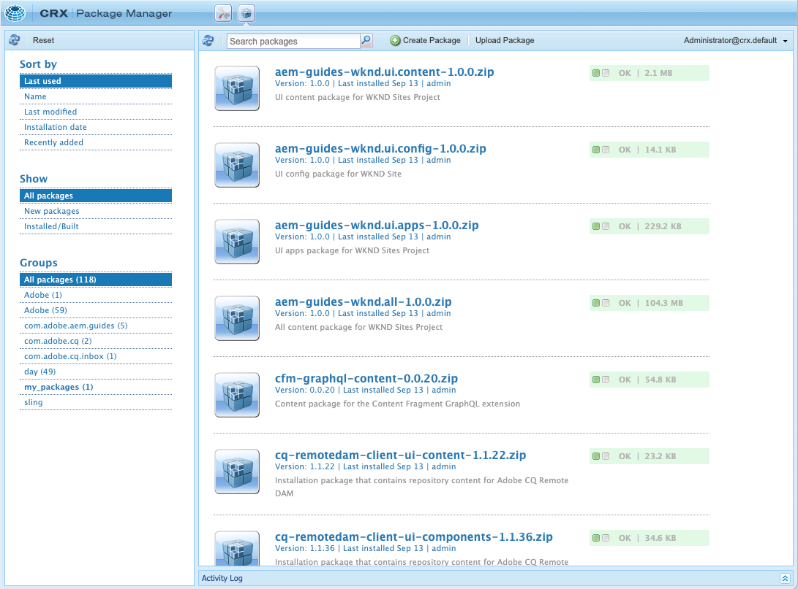

# 包管理器 {#working-with-packages}

套件可匯入和匯出存放庫內容。 您可以使用套件安裝新內容、在執行個體之間傳輸內容以及備份存放庫內容。

使用封裝管理員，您可以在AEM執行個體和本機檔案系統之間傳輸封裝，以用於開發目的。

## 什麼是套件？ {#what-are-packages}

套件是儲存檔案系統序列化表單中儲存庫內容的zip檔案，稱為儲存庫序列化，提供易於使用和編輯的檔案和資料夾表示法。 套件中包含的內容是使用篩選器來定義。

套件也包含儲存庫中繼資訊，包括篩選定義及匯入組態資訊。 套件中可包含不用於套件提取的其他內容屬性，例如說明、視覺影像或圖示。 這些額外的內容屬性僅供內容套件取用者參考，且僅供參考。

>[!NOTE]
>
>套件表示建置套件時內容的目前版本。 其中不包含AEM保留在存放庫中的任何舊版內容。

## AEMas a Cloud Service的套件 {#aemaacs-packages}

為AEMas a Cloud Service應用程式建立的內容套件，在不可變和可變內容之間必須有乾淨的分離。 因此，封裝管理員只能用於管理包含內容的封裝。 任何程式碼都必須透過Cloud Manager部署。

>[!NOTE]
>
>套件只能包含內容。 任何功能(例如，儲存於 `/apps`)必須是 [使用您在Cloud Manager中的CI/CD管道部署。](/help/implementing/cloud-manager/deploy-code.md)

>[!IMPORTANT]
>
>如果用于安装包的时间超过 10 分钟，包管理器 UI 可能会返回&#x200B;**未定义**&#x200B;错误消息。
>
>这不是因安装错误导致的，而是因 Cloud Service 对所有请求的超时导致的。
>
>如果您看到此类错误，请不要重试安装。安装过程在后台正常进行。如果您重新启动安装，则多个并发导入进程可能会引入一些冲突。

如需有關如何管理AEMaaCS套件的詳細資訊，請檢視此檔案 [部署至AEMas a Cloud Service](/help/implementing/deploying/overview.md) （位於部署使用手冊中）。

## 包管理器 {#package-manager}

封裝管理員會管理AEM安裝上的封裝。 在您擁有 [已指派必要的許可權](#permissions-needed-for-using-the-package-manager) 您可以將套件管理器用於各種動作，包括設定、建置、下載和安裝套件。

### 必要許可權 {#required-permissions}

若要建立、修改、上傳和安裝套件，使用者必須在以下節點上擁有適當的許可權：

* 完整權利(不包括刪除於 `/etc/packages`
* 包含套件內容的節點

>[!CAUTION]
>
>授予封裝的許可權可能會導致敏感資訊洩漏和資料遺失。
>
>若要限制這些風險，強烈建議僅針對專用子樹狀結構授予特定群組許可權。

### 存取封裝管理員 {#accessing}

您可以透過三種方式存取「封裝管理員」：

1. 從AEM主功能表 — > **工具** -> **部署** -> **套件**
1. 從 [CRXDE Lite](crxde.md) 使用頂端切換列
1. 直接存取 `http://<host>:<port>/crx/packmgr/`

### 封裝管理員UI {#ui}

封裝管理員分為四個主要功能區域：

* **左側導覽面板**  — 此面板可讓您篩選及排序套件清單。
* **封裝清單**  — 這是您執行個體上的套件清單，按照左側導覽面板中的選取專案進行篩選和排序。
* **活動記錄**  — 此面板一開始會最小化，並展開以詳細說明封裝管理器的活動，例如建立或安裝封裝時。 「活動記錄」標籤中還有其他按鈕可執行以下操作：
   * **清除記錄**
   * **显示/隐藏**
* **工具列**  — 工具列包含[左側導覽面板]和[封裝]清單的重新整理按鈕，以及用於搜尋、建立和上傳封裝的按鈕。



按一下左側導覽面板中的選項，會立即篩選封裝清單。

按一下封裝名稱會展開「封裝清單」中的專案，以顯示有關封裝的詳細資訊。


展開套件詳細資料時，可以透過工具列按鈕對套件執行許多動作。

* [编辑](#edit-package)
* [生成](#building-a-package)
* [重新安装](#reinstalling-packages)
* [下载](#downloading-packages-to-your-file-system)

下方有進一步的動作 **更多** 按鈕。

* [删除](#deleting-packages)
* [范围](#package-coverage)
* [个内容](#viewing-package-contents-and-testing-installation)
* [重新包装](#rewrapping-a-package)
* [其他版本](#other-versions)
* [卸载](#uninstalling-packages)
* [测试安装](#viewing-package-contents-and-testing-installation)
* [验证](#validating-packages)
* [复制](#replicating-packages)

### 封裝狀態 {#package-status}

封裝清單中的每個專案都有狀態指示器，可讓您一眼知道封裝的狀態。 將滑鼠懸停在狀態上會顯示工具提示，其中包含狀態的詳細資訊。


如果套件已變更或從未建置，則狀態會顯示為連結，以採取快速動作來重建或安裝套件。

## 封裝設定 {#package-settings}

套件基本上是一組篩選器，以及根據這些篩選器的存放庫資料。 使用封裝管理員UI，您可以按一下封裝，然後按一下 **編輯** 按鈕以檢視套件的詳細資訊，包括下列設定。

* [常规设置](#general-settings)
* [封裝篩選器](#package-filters)
* [套件相依性](#package-dependencies)
* [高级设置](#advanced-settings)
* [套件熒幕擷取畫面](#package-screenshots)

### 常规设置 {#general-settings}

您可以編輯各種封裝設定來定義資訊，例如封裝說明、相依性和提供者詳細資訊。

此 **封裝設定** 對話方塊可透過 **編輯** 按鈕時間 [建立](#creating-a-new-package) 或 [編輯](#viewing-and-editing-package-information) 套件。 完成任何變更後，按一下 **儲存**.


| 字段 | 描述 |
|---|---|
| 名称 | 套裝軟體的名稱 |
| 组 | 若要組織套件，您可以鍵入新群組的名稱或選取現有群組 |
| 版本 | 用於版本的文字 |
| 描述 | 允許格式化HTML標示的封裝的簡短說明 |
| 缩略图 | 隨套件清單一起出現的圖示 |

### 封裝篩選器 {#package-filters}

篩選器會識別要包含在封裝中的存放庫節點。 A **篩選器定義** 指定下列資訊：

* 此 **根路徑** 要包含的內容的
* **規則** 在根路徑底下包含或排除特定節點

使用新增規則 **+** 按鈕。 使用移除規則 **-** 按鈕。

系統會根據其順序套用規則，以便視需要使用 **上** 和 **向下** 箭頭按鈕。

篩選器可包含零個或多個規則。 未定義規則時，套件會包含根路徑下的所有內容。

您可以為封裝定義一或多個篩選定義。 使用多個篩選器以包含來自多個根路徑的內容。


建立篩選時，您可以定義路徑或使用規則運算式來指定您要包含或排除的所有節點。

| 規則型別 | 描述 |
|---|---|
| include | 包含目錄將會包含該目錄以及該目錄中的所有檔案和資料夾（即整個子樹狀結構），但是 **不會** 包括指定根路徑下的其他檔案或資料夾。 |
| 排除 | 排除目錄將會排除該目錄以及該目錄中的所有檔案和資料夾（即整個子樹狀結構）。 |

套件篩選器最常在您第一次使用時定義 [建立套件。](#creating-a-new-package) 不過，它們也可在稍後編輯，之後應重建套件以根據新的篩選定義更新其內容。

>[!TIP]
>
>一個套件可以包含多個篩選定義，以便輕鬆地將來自不同位置的節點合併到一個套件中。

### 依赖项 {#dependencies}


| 字段 | 描述 | 示例/详细信息 |
|---|---|---|
| 测试方式 | 鎖定此套件為目標或與其相容的產品名稱和版本。 | `AEMaaCS` |
| 修复的问题 | 允許列出此套件修正之錯誤詳細資料的文字欄位，每行一個錯誤 | - |
| 依赖于 | 列出其他必要的套件，以便在安裝時讓目前的套件如預期般執行 | `groupId:name:version` |
| 替换 | 此套件取代的已棄用套件清單 | `groupId:name:version` |

### 高级设置 {#advanced-settings}


| 字段 | 描述 | 示例/详细信息 |
|---|---|---|
| 名称 | 封裝提供者的名稱 | `WKND Media Group` |
| URL | 提供者的URL | `https://wknd.site` |
| 链接 | 提供者頁面的封裝特定連結 | `https://wknd.site/package/` |
| 需要 | 定義安裝套件時是否有任何限制 | **管理員**  — 套件只能以管理員許可權安裝&#x200B;<br>**重新啟動**  — 安裝套件後，必須重新啟動AEM |
| AC 处理 | 指定在匯入封裝時，如何處理封裝中定義的存取控制資訊 | **忽略**  — 保留存放庫中的ACL <br>**覆寫**  — 覆寫存放庫中的ACL <br>**合併**  — 合併兩組ACL <br>**MergePreserve**  — 透過新增內容中不存在的主體的存取控制專案，將內容中的存取控制與套件提供的存取控制合併&#x200B;<br>**清除**  — 清除ACL |

### 套件熒幕擷取畫面 {#package-screenshots}

您可以將多個熒幕擷取畫面附加至套件，以提供內容顯示方式的視覺化呈現。


## 套件動作 {#package-actions}

可以對套件執行許多動作。

### 建立套裝 {#creating-a-new-package}

1. [存取封裝管理員。](#accessing)

1. 按一下 **建立封裝**.

   >[!TIP]
   >
   >如果您的執行個體有許多套件，可能有資料夾結構就位。 在這種情況下，在建立新封裝之前，您可以更輕鬆地導覽至所需的目標資料夾。

1. 在 **新封裝** 對話方塊中，輸入下列欄位：

   

   * **封裝名稱**  — 選取描述性名稱，以協助您（和其他人）輕鬆識別封裝內容。

   * **版本**  — 這是文字欄位，可供您指出版本。 這會附加至封裝名稱，以形成zip檔案的名稱。

   * **群組**  — 這是目標群組（或資料夾）名稱。 群組可協助您組織套件。 如果群組尚不存在，則會建立資料夾。 如果您將群組名稱保留為空白，它將在主封裝清單中建立封裝。

1. 按一下 **確定** 以建立封裝。

1. AEM會在套裝程式清單頂端列出新套裝程式。

   

1. 按一下 **編輯** 以定義 [封裝內容。](#package-contents) 按一下 **儲存** 完成編輯設定後。

1. 您現在可以 [建置](#building-a-package) 您的封裝。

建立套件後，不必立即建置套件。 未建置的套件不包含任何內容，且僅由套件的篩選資料和其他中繼資料組成。

### 建置套件 {#building-a-package}

套件通常會在您建立時同時建置 [建立套件](#creating-a-new-package)，但您稍後可以返回以建置或重新建置套件。 如果存放庫中的內容已變更或封裝篩選條件已變更，此功能會很有用。

1. [存取封裝管理員。](#accessing)

1. 按一下封裝名稱，從封裝清單開啟封裝詳細資訊。

1. 按一下 **建置**. 對話方塊會要求您確認是否要建置封裝，因為任何現有的封裝內容都會被覆寫。

1. 单击&#x200B;**确定**。AEM會建置套件，並在活動清單中列出新增至套件的所有內容。 完成時，AEM會顯示確認封裝已建置，且（當您關閉對話方塊時）會更新封裝清單資訊。

### 編輯套裝 {#edit-package}

將套件上傳到AEM後，您可以修改其設定。

1. [存取封裝管理員。](#accessing)

1. 按一下封裝名稱，從封裝清單開啟封裝詳細資訊。

1. 按一下 **編輯** 並更新 **[封裝設定](#package-settings)** 視需要。

1. 按一下 **儲存** 以儲存。

您可能需要 [重新建置套件](#building-a-package) 以根據您所做的變更來更新其內容。

### 重新包裝套件 {#rewrapping-a-package}

建置套件後，即可重新包裝。 重新包裝會變更封裝資訊，而不使用縮圖、說明等，而不會變更封裝內容。

1. [存取封裝管理員。](#accessing)

1. 按一下封裝名稱，從封裝清單開啟封裝詳細資訊。

1. 按一下 **編輯** 並更新 **[封裝設定](#package-settings)** 視需要。

1. 按一下 **儲存** 以儲存。

1. 按一下 **更多** -> **折行** 而對話方塊會要求確認。

### 檢視其他封裝版本 {#other-versions}

由於每個封裝版本都會像任何其他封裝一樣顯示在清單中，封裝管理員可以找到所選封裝的其他版本。

1. [存取封裝管理員。](#accessing)

1. 按一下封裝名稱，從封裝清單開啟封裝詳細資訊。

1. 按一下 **更多** -> **其他版本** 隨即會開啟對話方塊，其中包含相同封裝的其他版本清單，內含狀態資訊。

### 檢視封裝內容和測試安裝 {#viewing-package-contents-and-testing-installation}

建立套件後，您可以檢視內容。

1. [存取封裝管理員。](#accessing)

1. 按一下封裝名稱，從封裝清單開啟封裝詳細資訊。

1. 若要檢視內容，請按一下 **更多** -> **內容**，而「封裝管理程式」會在活動記錄中列出封裝的完整內容。

   

1. 若要執行試執行安裝，請按一下 **更多** -> **測試安裝** 和「封裝管理程式」會在活動記錄中報告結果，就像已執行安裝一樣。

   

### 將套件下載至您的檔案系統 {#downloading-packages-to-your-file-system}

1. [存取封裝管理員。](#accessing)

1. 按一下封裝名稱，從封裝清單開啟封裝詳細資訊。

1. 按一下 **下載** 按鈕或套件詳細資訊區域中套件的連結檔案名稱。

1. AEM會將套件下載至您的電腦。

### 從您的檔案系統上傳套件 {#uploading-packages-from-your-file-system}

1. [存取封裝管理員。](#accessing)

1. 選取要將封裝上傳到的群組資料夾。

1. 按一下 **上傳套裝** 按鈕。

1. 提供有關已上傳封裝的必要資訊。

   

   * **封裝**  — 使用 **瀏覽……** 按鈕以從您的本機檔案系統選取所需的封裝。
   * **強制上傳**  — 如果已存在具有此名稱的套件，此選項會強制上傳並覆寫現有套件。

1. 按一下 **確定** 則會上傳選取的封裝，並相應地更新封裝清單。

套件內容現在存在於AEM上，但若要讓內容可供使用，請確定 [安裝套件](#installing-packages).

### 驗證套件 {#validating-packages}

由於套件可以修改現有內容，因此在安裝前驗證這些變更通常很有用。

#### 驗證選項 {#validation-options}

封裝管理程式可以執行下列驗證：

* [OSGi套件匯入](#osgi-package-imports)
* [叠加](#overlays)
* [ACL](#acls)

##### 验证 OSGi 包的导入情况 {#osgi-package-imports}

>[!NOTE]
>
>由於套件無法用於在AEMaaCS中部署程式碼， **OSGi套件匯入** 不需要驗證。

**檢查內容**

此驗證會檢查所有JAR檔案（OSGi套裝）的套件，擷取其 `manifest.xml` （其中包含所述OSGi套件所依賴的版本化相依性），並驗證AEM例項是否以正確版本匯出所述相依性。

**回報方式**

任何無法由AEM執行個體滿足的版本化相依性都會列在「封裝管理程式」的「活動記錄」中。

**錯誤狀態**

如果不滿足相依性，則具有這些相依性的套件中的OSGi套件組合將不會啟動。 這會導致中斷的應用程式部署，因為依賴未啟動OSGi套件的任何專案都將無法正常運作。

**錯誤解決**

若要解決因未滿足的OSGi套件組合所導致的錯誤，必須調整包含未滿足匯入的套件組合中的相依性版本。

##### 验证覆盖 {#overlays}

>[!NOTE]
>
>由於套件無法用於在AEMaaCS中部署程式碼， **覆蓋** 不需要驗證。

**檢查內容**

此驗證會判斷要安裝的套件是否包含已在目的地AEM執行個體中覆蓋的檔案。

例如，假設現有覆蓋位於 `/apps/sling/servlet/errorhandler/404.jsp`，此套件包含 `/libs/sling/servlet/errorhandler/404.jsp`，如此一來，它就會變更位於 `/libs/sling/servlet/errorhandler/404.jsp`.

**回報方式**

任何此類覆蓋圖會在「封裝管理程式」的「活動記錄」中加以說明。

**錯誤狀態**

錯誤狀態表示套件正嘗試部署已覆蓋的檔案，因此套件中的變更將會被覆蓋覆蓋（因此「隱藏」），而不會生效。

**錯誤解決**

若要解決此問題，維護中的覆蓋檔案的維護者 `/apps` 必須檢閱中覆蓋檔案的變更 `/libs` 並視需要將變更併入覆蓋圖( `/apps`)，並重新部署覆蓋的檔案。

>[!NOTE]
>
>如果覆蓋的內容已正確併入覆蓋檔案中，驗證機制就無法調解。 因此，即使進行了必要的變更，此驗證仍會繼續報告衝突。

##### 验证 ACL {#acls}

**檢查內容**

此驗證會檢查要新增哪些許可權、如何處理這些許可權（合併/取代），以及目前的許可權是否會受到影響。

**回報方式**

這些許可權會在「封裝管理程式的活動記錄」中說明。

**錯誤狀態**

無法提供明確的錯誤。 驗證只會指出安裝套件是否會新增或影響任何新的ACL許可權。

**錯誤解決**

使用驗證提供的資訊，可以在CRXDE中檢視受影響的節點，並根據需要在套件中調整ACL。

>[!CAUTION]
>
>最佳實務建議套件不要影響AEM提供的ACL，因為這樣可能會導致非預期的行為。

#### 執行驗證 {#performing-validation}

套件的驗證可以透過兩種不同的方式完成：

* [透過封裝管理程式UI](#via-package-manager)
* [透過HTTPPOST請求，例如使用cURL](#via-post-request)

上傳套件後且安裝套件前應一律進行驗證。

##### 透過封裝管理程式進行封裝驗證 {#via-package-manager}

1. [存取封裝管理員。](#accessing)

1. 按一下封裝名稱，從封裝清單開啟封裝詳細資訊。

1. 若要驗證套件，請按一下 **更多** -> **驗證**，

1. 在隨後出現的強制回應對話方塊中，使用核取方塊來選取驗證型別，然後按一下以開始驗證 **驗證**.

1. 接著會執行選取的驗證，而結果會顯示在「封裝管理程式的活動記錄」中。

##### 透過HTTPPOST要求進行套件驗證 {#via-post-request}

POST請求會採用下列形式。

```
https://<host>:<port>/crx/packmgr/service.jsp?cmd=validate&type=osgiPackageImports,overlays,acls
```

此 `type` 引數可以是任何以逗號分隔的無序清單，包含：

* `osgiPackageImports`
* `overlays`
* `acls`

的值 `type` 預設為 `osgiPackageImports` 如果未明確傳遞。

使用cURL時，執行類似下列的陳述式：

```shell
curl -v -X POST --user admin:admin -F file=@/Users/SomeGuy/Desktop/core.wcm.components.all-1.1.0.zip 'http://localhost:4502/crx/packmgr/service.jsp?cmd=validate&type=osgiPackageImports,overlays,acls'
```

透過POST要求驗證時，回應會以JSON物件形式傳回。

### 檢視封裝涵蓋範圍 {#package-coverage}

套件由其篩選器定義。 您可以讓封裝管理員將封裝的篩選器套用至現有的存放庫內容，以顯示封裝的篩選器定義所涵蓋的存放庫內容。

1. [存取封裝管理員。](#accessing)

1. 按一下封裝名稱，從封裝清單開啟封裝詳細資訊。

1. 按一下 **更多** -> **涵蓋範圍**.

1. 涵蓋範圍詳細資訊會列在活動記錄中。

### 安裝套件 {#installing-packages}

上傳套件只會將套件內容新增至存放庫，但無法存取。 您必須安裝上傳的套件，才能使用套件的內容。

>[!CAUTION]
>
>安裝套件可能會覆寫或刪除現有內容。 只有在您確定套件不會刪除或覆寫您需要的內容時，才會上傳套件。

在安裝套件之前，封裝管理程式會自動建立包含將被覆寫之內容的快照套件。 如果您解除安裝套裝軟體，將會重新安裝此快照。

1. [存取封裝管理員。](#accessing)

1. 按一下封裝名稱，從封裝清單開啟您要安裝的封裝詳細資訊。

1. 按一下 **安裝** 專案詳細資訊中的按鈕或 **安裝** 套件狀態中的連結。

1. 對話方塊將會要求確認，並允許指定其他選項。

   * **僅擷取**  — 僅解壓縮套件，以免建立快照，因此無法解除安裝
   * **儲存臨界值**  — 觸發自動儲存之前的暫時節點數目（如果您遇到並行修改例外狀況，則會增加）
   * **擷取子封裝**  — 啟用自動擷取子封裝
   * **存取控制處理**  — 指定安裝套件時，如何處理套件中定義的存取控制資訊(選項與 [進階封裝設定](#advanced-settings))
   * **相依性處理**  — 指定在安裝期間處理相依性的方式

1. 按一下 **安裝**.

1. 活動記錄檔會詳細說明安裝進度。

安裝完成並成功後，封裝清單會更新，而且文字也會更新 **已安裝** 會顯示在封裝狀態中。

### 重新安裝套件 {#reinstalling-packages}

重新安裝套裝軟體會對已安裝的套裝軟體執行相同的步驟，這些步驟會在下列情況下處理： [初始安裝套件。](#installing-packages)

### 以檔案系統為基礎的上傳和安裝 {#file-system-based-upload-and-installation}

安裝套件時，您可以完全放棄套件管理員。 AEM可以偵測放置在主機本機檔案系統上特定位置的套件，並自動上傳及安裝這些套件。

1. 在AEM安裝資料夾下，有一個 `crx-quicksart` 在jar旁的資料夾和 `license.properties` 檔案。 建立名為的資料夾 `install` 在 `crx-quickstart` 產生路徑 `<aem-home>/crx-quickstart/install`.

1. 在此資料夾中，新增您的套件。 它們會自動上傳並安裝在您的執行個體上。

1. 上傳和安裝完成後，您可以在套件管理器中檢視套件，就像您已使用套件管理器UI進行安裝一樣。

如果執行個體正在執行，上傳和安裝會在您將其新增至的套件時立即開始 `install` 資料夾

如果執行個體未執行，則會將套件置於 `install` 資料夾會在啟動時依字母順序安裝。

### 解除安裝套件 {#uninstalling-packages}

解除安裝套件會將存放庫的內容還原為安裝前由Package Manager自動建立的快照。

1. [存取封裝管理員。](#accessing)

1. 按一下封裝名稱，開啟您要從封裝清單解除安裝之封裝的詳細資料。

1. 按一下 **更多** -> **解除安裝**，即可從存放庫中移除此套件的內容。

1. 對話方塊將會要求確認並列出所有正在進行的變更。

1. 套裝軟體會被移除並套用快照。 處理程式的進度會顯示在活動記錄檔中。

### 刪除套裝 {#deleting-packages}

刪除封裝只會從「封裝管理員」刪除其詳細資訊。 如果已經安裝此套件，則不會刪除安裝的內容。

1. [存取封裝管理員。](#accessing)

1. 按一下封裝名稱，開啟您要從封裝清單中刪除之封裝的封裝詳細資訊。

1. AEM會要求您確認要刪除套裝軟體。 按一下 **確定** 以確認刪除。

1. 套件資訊會遭到刪除，而詳細資訊會回報於「活動記錄」。

### 複製封裝 {#replicating-packages}

複製套件的內容以將其安裝在發佈執行個體上。

1. [存取封裝管理員。](#accessing)

1. 按一下封裝名稱，開啟您要從封裝清單復寫之封裝的封裝詳細資訊。

1. 按一下 **更多** -> **復寫**.

1. 會複製套件，並在「活動記錄」中報告詳細資訊。

## Software Distribution {#software-distribution}

AEM Packages可用於在AEMaaCS環境中建立和共用內容。

[Software Distribution](https://downloads.experiencecloud.adobe.com) 提供用於本機開發AEM SDK的AEM套件。 除非獲得Adobe支援的明確批准，否則在Software Distribution上提供的AEM套件不得安裝在AEMaaCS雲端環境中。

如需詳細資訊，請檢視 [Software Distribution檔案](https://experienceleague.adobe.com/docs/experience-cloud/software-distribution/home.html).
