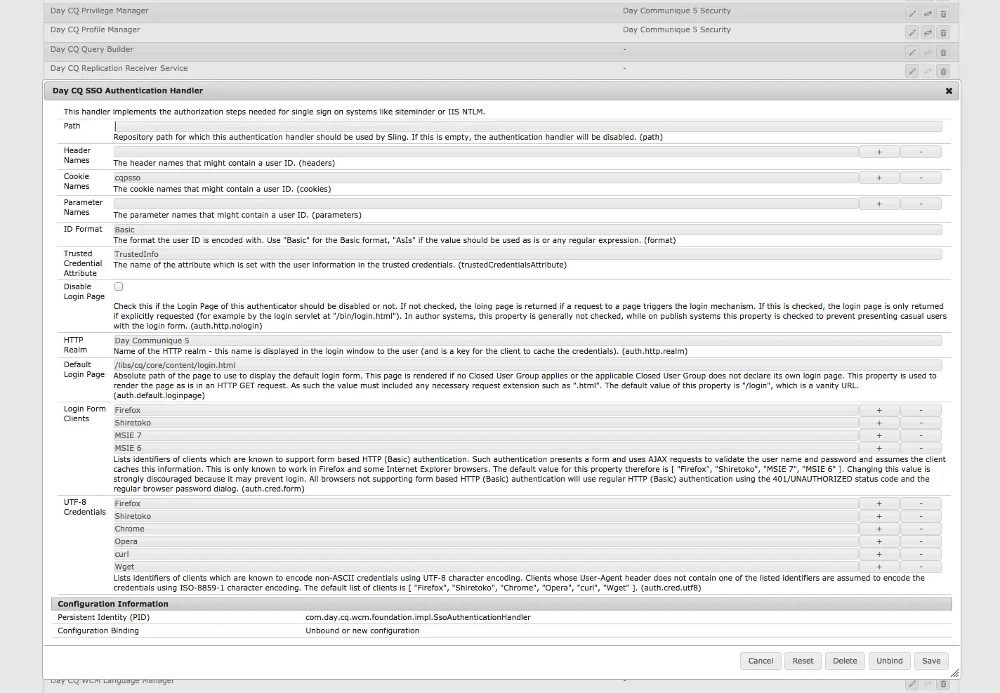
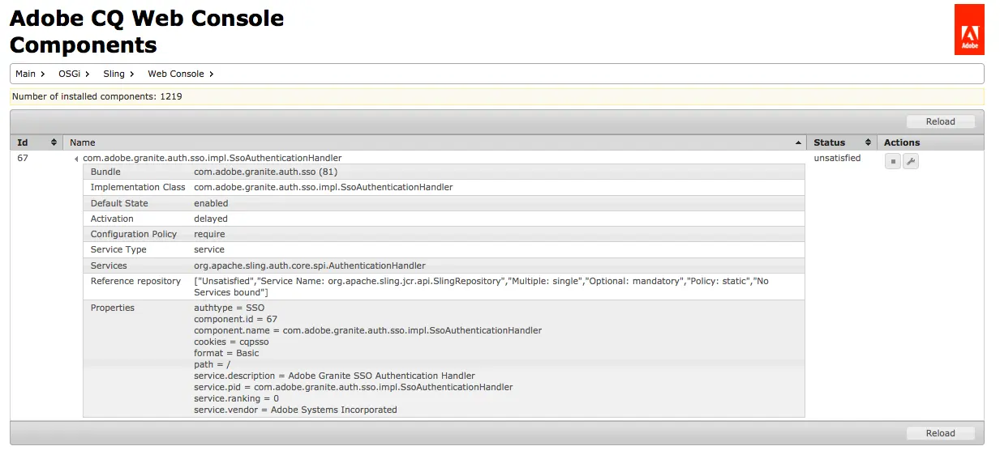

# 网页控制台 {#web-console}

了解如何使用Adobe Experience Manager的(AEM) Web控制台管理本地开发的OSGi设置和捆绑包。

## 概述 {#overview}

AEM as a Cloud Service在运行时将[配置和代码视为不可变。](/help/release-notes/aem-cloud-changes.md#apps-libs-immutable) 这意味着所有配置都必须像在生产环境中代码一样进行部署。 对于生产实例，这可以确保传递质量关卡，并提供当前环境的稳定性和清晰度级别。

但是，出于开发目的，通常需要进行OSGi配置更新和捆绑包更改来测试临时开发更改。 作为AEM as a Cloud Service SDK的一部分，Web控制台允许这样做。 有关Adobe Experience Manager as a Cloud Service的OSGi配置的更多信息，请参阅文档[为AEM as a Cloud Service配置OSGi](/help/implementing/deploying/configuring-osgi.md)。

可以从`http://<host>:<port>/system/console`访问该控制台

Web控制台提供了用于维护OSGi捆绑包的一系列屏幕，包括：

* [配置](#configuration)：用于配置OSGi包，因此是配置AEM系统参数的基础机制
* [包](#bundles)：用于安装包
* [组件](#components)：用于控制AEM所需组件的状态

所做的任何更改都将立即应用于正在运行的开发系统。 无需重新启动。

在Web控制台中，任何提及默认设置的描述都与Sling默认设置相关。 AEM有自己的默认值，因此默认设置可能与控制台中记录的那些值不同。

Adobe Experience Manager (AEM)中的Web控制台基于[Apache Felix Web管理控制台](https://felix.apache.org/documentation/subprojects/apache-felix-web-console.html)。 Apache Felix是社区努力实施OSGi R4服务平台，其中包括OSGi框架和标准服务。

>[!NOTE]
>
>Web控制台只能在AEM as a Cloud Service SDK中用于本地开发。 它在生产环境中不可用。

>[!TIP]
>
>要在生产环境中检查OSGi配置、捆绑包和组件的状态，请使用[Developer Console。](/help/implementing/developing/introduction/aem-developer-console.md)

## 配置 {#configuration}

**Configuration**&#x200B;屏幕用于配置OSGi包，因此是配置AEM系统参数的基础机制。 可通过以下任一方式访问&#x200B;**配置**&#x200B;选项卡：

* 下拉菜单： **OSGi ->配置**
* URL： `http://<host>:<port>/system/console/configMgr`

此时将显示配置列表：

此屏幕上的下拉列表中提供了两种类型的配置：

* **配置**&#x200B;允许您更新现有配置。 它们具有永久标识(PID)，可以是：
   * 标准且是AEM的组成部分 — 如果删除这些值，则将返回到默认设置，则此为必需字段。
   * 从工厂配置创建的实例 — 这些实例由用户创建，删除将删除实例。
* **工厂配置**&#x200B;允许您创建所需功能对象的实例。 该标识将分配给永久标识，然后列在配置下拉列表中。

从列表中选择任何条目将显示与该配置相关的参数：

然后，您可以根据需要更新参数并：

* **保存**&#x200B;以保存所做的更改。
   * 对于工厂配置，这将创建一个具有永久标识的实例。
   * 然后，新实例将列在Configurations下。
* **重置**&#x200B;以将屏幕上显示的参数重置为上次保存的参数。
* **删除**&#x200B;以删除当前配置。
   * 如果为standard，则参数将返回到默认设置。
   * 如果是从工厂配置创建的，则会删除特定实例。
* **取消绑定**&#x200B;以取消绑定绑定绑定包中的当前配置。
* **取消**&#x200B;以取消任何当前更改。

>[!TIP]
>
>有关更多详细信息，请参阅使用Web控制台[OSGi配置](/help/implementing/deploying/configuring-osgi.md)。

## 包 {#bundles}

**包**&#x200B;屏幕用于安装AEM所需的OSGi包。 可通过以下任一方法访问屏幕：

* 下拉菜单： **OSGi -> Bundels**
* URL： `http://<host>:<port>/system/console/bundles`

此时将显示捆绑包列表：

使用此屏幕，您可以：

* **安装或更新**&#x200B;以安装新捆绑包或更新现有捆绑包。
   * 您可以&#x200B;**浏览**&#x200B;以查找包含捆绑包的文件，并指定它是否应立即&#x200B;**启动**，以及启动级别&#x200B;**为**。
* **重新加载**&#x200B;以刷新显示的列表。
* **刷新包**&#x200B;以检查所有包的引用并根据需要刷新。
   * 例如，在更新后，由于以前的引用，旧版本和新版本可能仍在运行。 此选项会检查并移动对新版本的所有引用，从而允许旧版本停止。
* **启动**&#x200B;以根据指定的启动级别启动捆绑包。
* **停止**&#x200B;以停止捆绑包。
* **卸载**&#x200B;以从系统中卸载该捆绑包。

该列表指定捆绑包的状态。 单击特定捆绑包名称会显示详细信息。

>[!TIP]
>
>在&#x200B;**更新**&#x200B;之后，Adobe建议您单击&#x200B;**刷新包**。

## 组件 {#components}

通过&#x200B;**组件**&#x200B;屏幕，您可以启用和禁用组件。 可以通过以下任一方式访问该区域：

* 下拉菜单： **主 — >组件**

* URL： `http://<host>:<port>/system/console/components`

此时将显示组件列表。 您可以使用各种图标来启用、禁用或（在适当时）打开特定组件的配置详细信息。

单击特定组件的名称可显示有关其状态的详细信息。 在此处，您还可以启用、禁用或重新加载组件。

>[!NOTE]
>
>启用或禁用组件仅在SDK重新启动之前适用。
>
>开始状态在组件描述符中定义，组件描述符在开发期间生成，并在包创建时存储在包中。

## 生成OSGi配置 {#generating-osgi-configs}

Web控制台可用于配置OSGi组件，并将OSGi配置导出为JSON。 这对于配置AEM提供的OSGi组件非常有用，在AEM项目中定义OSGi配置的开发人员可能无法很好地了解这些组件的OSGi属性及其值格式。

有关详细信息，请参阅文档[为Adobe Experience Manager as a Cloud Service配置OSGi](/help/implementing/deploying/configuring-osgi.md#generating-osgi-configurations-using-the-web-console)。
