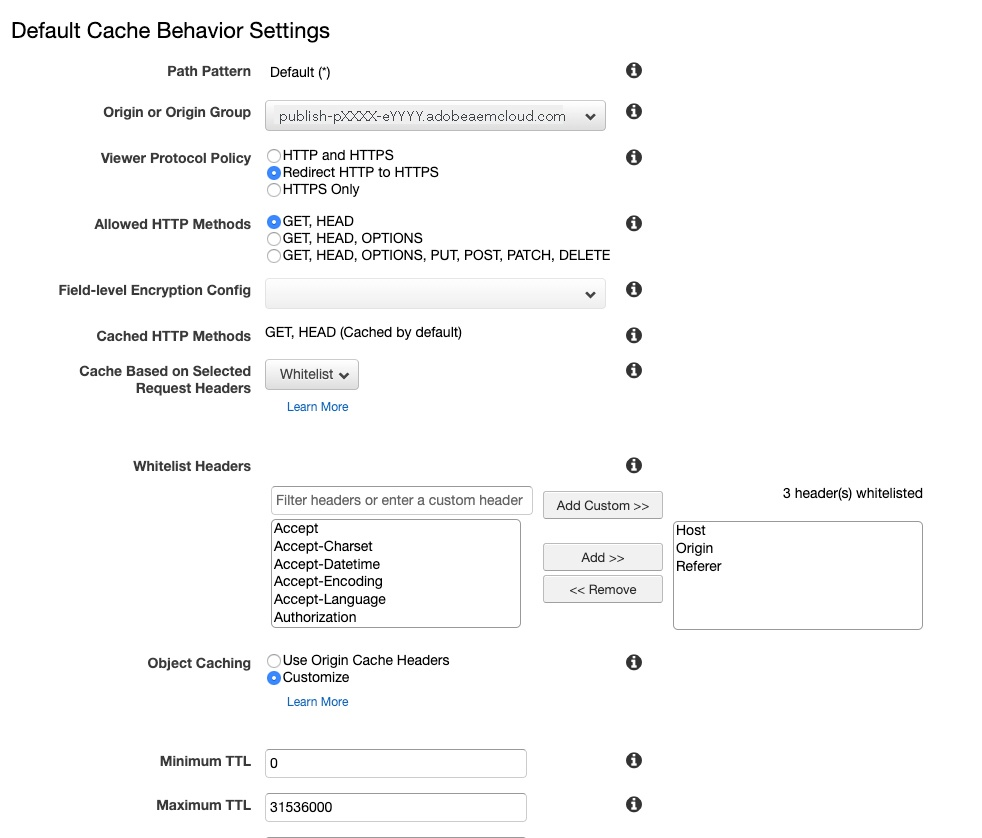
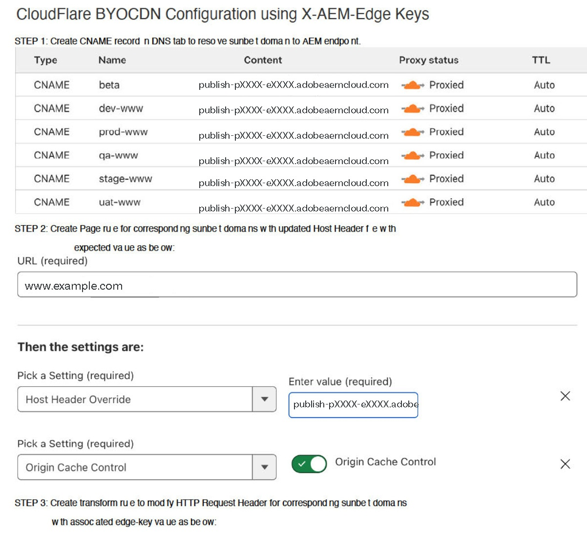

# AEM as a Cloud Service 中的 CDN {#cdn}

>[!CONTEXTUALHELP]
>id="aemcloud_golive_cdn"
>title="AEM as a Cloud Service 中的 CDN"
>abstract="AEM as a Cloud Service 随附一个内置 CDN。其主要目的是通过从浏览器附近的边缘 CDN 节点提供可缓存的内容来减少延迟。它经过全面的管理和配置，可提供最佳的 AEM 应用程序性能。"

AEM as a Cloud Service 随附一个内置 CDN。其主要目的是通过从浏览器附近的边缘 CDN 节点提供可缓存的内容来减少延迟。它经过全面的管理和配置，可提供最佳的 AEM 应用程序性能。

AEM管理的CDN可满足大多数客户的性能和安全要求。 对于发布层，客户可以选择从自己的 CDN 指向发布层，但这种情况下客户必须自行管理。 这种情况视个案而定，具体取决于是否在满足某些先决条件，包括但不限于客户及其 CDN 供应商具有难以舍弃的旧版集成。

<!-- ERROR: NEITHER URL IS FOUND (HTTP ERROR 404) Also, see the following videos [Cloud 5 AEM CDN Part 1](https://experienceleague.adobe.com/docs/experience-manager-learn/cloud-service/cloud-5/cloud5-aem-cdn-part1.html) and [Cloud 5 AEM CDN Part 2](https://experienceleague.adobe.com/docs/experience-manager-learn/cloud-service/cloud-5/cloud5-aem-cdn-part2.html) for additional information about CDN in AEM as a Cloud Service. -->

## AEM托管的CDN  {#aem-managed-cdn}

请阅读以下章节，以使用Cloud Manager自助服务UI来准备使用AEM现成CDN进行内容交付：

1. [管理 SSL 证书](/help/implementing/cloud-manager/managing-ssl-certifications/introduction.md)
1. [管理自定义域名](/help/implementing/cloud-manager/custom-domain-names/introduction.md)

**限制流量**

默认情况下，对于AEM托管的CDN设置，所有公共流量都可以进入发布服务，无论对于生产环境还是非生产（开发和暂存）环境。 您可以通过Cloud Manager用户界面限制给定环境（例如，按IP地址范围限制暂存）的发布服务流量。

请参阅[管理 IP 允许列表](/help/implementing/cloud-manager/ip-allow-lists/introduction.md)了解详情。

>[!CAUTION]
>
>AEM托管的CDN仅处理来自所允许IP的请求。 如果您将自己的CDN指向AEM允许列表托管的CDN，请确保CDN的IP包含在中。

## 客户CDN指向AEM管理的CDN {#point-to-point-CDN}

>[!CONTEXTUALHELP]
>id="aemcloud_golive_byocdn"
>title="客户 CDN 指向 AEM 托管 CDN"
>abstract="AEM as a Cloud Service 为客户提供了使用现有 CDN 的选项。对于发布层，客户可以选择从自己的 CDN 指向发布层，但这种情况下客户必须自行管理。 这种情况视个案而定，具体取决于是否在满足某些先决条件，包括但不限于客户及其 CDN 供应商具有难以舍弃的旧版集成。"

如果客户必须使用其现有的CDN，则可以管理该CDN，并将其指向AEM管理的CDN，前提是满足以下条件：

* 客户必须拥有一个费时费力的现有CDN。
* 客户必须管理它。
* 客户必须能够配置CDN以与AEMas a Cloud Service配合使用 — 请参阅下面提供的配置说明。
* 客户必须有随时待命的工程CDN专家，以防出现与案例相关的问题。
* 客户在进入生产阶段之前必须执行并成功通过负载测试。

配置说明：

1. 将CDN指向AdobeCDN的入口作为其源域。 例如：`publish-p<PROGRAM_ID>-e<ENV-ID>.adobeaemcloud.com`。
1. 将SNI设置为AdobeCDN的入口。
1. 将Host标头设置为原始域。 例如：`Host:publish-p<PROGRAM_ID>-e<ENV-ID>.adobeaemcloud.com`。
1. 设置 `X-Forwarded-Host` 标头，以便AEM可以确定主机标头。 例如：`X-Forwarded-Host:example.com`。
1. 套 `X-AEM-Edge-Key`. 该值应来自Adobe。

   * 需要，以便AdobeCDN能够验证请求的源并传递 `X-Forwarded-*` 标头到AEM应用程序。 例如，`X-Forwarded-For` 用于确定客户端IP。 因此，可信呼叫方（即客户管理的CDN）有责任确保 `X-Forwarded-*` 标头（请参阅下面的注释）。
   * 或者，在以下情况下可以阻止对AdobeCDN入口的访问： `X-AEM-Edge-Key` 不存在。 如果需要直接访问AdobeCDN的入口，请通知Adobe（将被阻止）。

请参阅 [CDN供应商配置示例](#sample-configurations) 部分，以了解来自主要CDN供应商的配置示例。

在接受实时流量之前，您应向Adobe的客户支持部门验证端到端流量路由是否正常运行。

在获得 `X-AEM-Edge-Key`，您可以测试请求是否按如下方式正确路由。

在Linux®中：

```
curl https://publish-p<PROGRAM_ID>-e<ENV-ID>.adobeaemcloud.com -H "X-Forwarded-Host: example.com" -H "X-AEM-Edge-Key: <PROVIDED_EDGE_KEY>"
```

在Windows中：

```
curl https://publish-p<PROGRAM_ID>-e<ENV-ID>.adobeaemcloud.com --header "X-Forwarded-Host: example.com" --header "X-AEM-Edge-Key: <PROVIDED_EDGE_KEY>"
```

>[!NOTE]
>
>使用您自己的CDN时，您不需要在Cloud Manager中安装域和证书。 AdobeCDN中的路由使用默认域完成 `publish-p<PROGRAM_ID>-e<ENV-ID>.adobeaemcloud.com` 应在请求中发送 `Host` 标头。 覆盖请求 `Host` 具有自定义域名的标头可能会导致AdobeCDN错误地路由请求。


>[!NOTE]
>
>管理自己CDN的客户应确保通过发送到AEM CDN的标头的完整性。 例如，建议客户全部清除 `X-Forwarded-*` 标头并将其设置为已知值和控制值。 例如， `X-Forwarded-For` 应包含客户端的IP地址，而 `X-Forwarded-Host` 应包含站点的主机。

>[!NOTE]
>
>沙盒程序环境不支持客户提供的CDN。

仅当存在缓存缺失时，才需要客户CDN和AEM CDN之间的额外跃点。 通过使用本文描述的缓存优化策略，添加客户CDN应只引入可忽略的延迟。

发布层支持此客户CDN配置，但创作层不支持此配置。

### CDN供应商配置示例 {#sample-configurations}

下面是来自几家领先的CDN供应商的几项配置示例。

**Akamai**


**Amazon CloudFront**




**Cloudflare**




## 地理位置标题 {#geo-headers}

AEM-managed CDN通过以下方式向每个请求添加标头：

* 国家/地区代码： `x-aem-client-country`
* 大陆代码： `x-aem-client-continent`

>[!NOTE]
>
>如果存在客户管理的CDN，这些标头将反映客户CDN代理服务器的位置，而不是实际的客户端。 因此，对于客户管理的CDN，地理位置标头应由客户CDN管理。

国家/地区代码的值是所述的Alpha-2代码 [此处](https://en.wikipedia.org/wiki/ISO_3166-1).

大陆代码的值为：

* AF非洲
* 南极洲
* AS亚洲
* 欧盟欧洲
* NA北美洲
* OC大洋洲
* 南美洲南部

此信息对于用例可能很有用，例如根据请求的来源（国家/地区）重定向到不同的url。 对于依赖于地理信息的缓存响应，请使用Vary标头。 例如，重定向到特定国家/地区的登陆页面应始终包含 `Vary: x-aem-client-country`. 如果需要，您可以使用 `Cache-Control: private` 以防止缓存。 另请参阅 [缓存](/help/implementing/dispatcher/caching.md#html-text).
