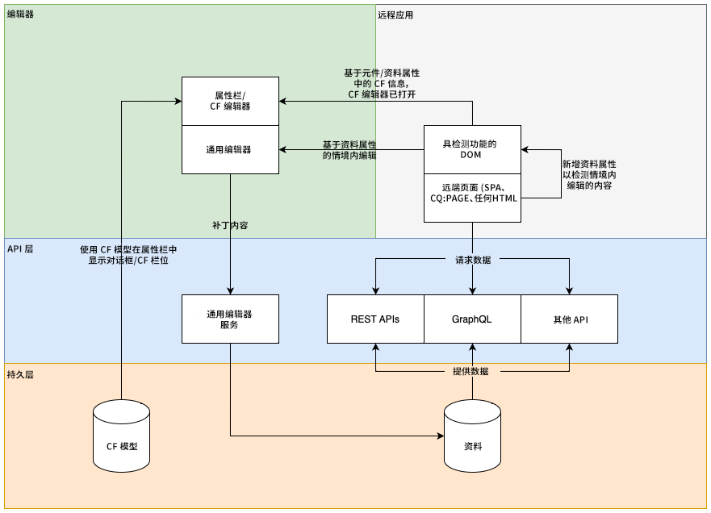

# Universal Editor 架构 {#architecture}

了解 Universal Editor 的架构以及数据如何在其服务和层之间流动。

{{universal-editor-status}}

## 架构构建块 {#building-blocks}

Universal Editor 由四个基本构建块组成，这些构建块将进行交互，使内容作者能够在任意实施中编辑任何内容的任何方面，以提供卓越的体验，提升内容速度并提供最先进的开发人员体验。

1. [编辑器](#editors)
1. [远程应用程序](#remote-app)
1. [API 层](#api-layer)
1. [持久层](#persistence-layer)

本文档概述了所有这些构建块以及它们交换数据的方式。

>[!TIP]
>
>若要查看 Universal Editor 及其架构，请参阅 [AEM Universal Editor 快速入门](getting-started.md)，了解如何获取 Universal Editor 访问权限以及如何对第一个 AEM 应用程序插桩以使用 Universal Editor。

### 编辑器 {#editors}

* **Universal Editor** – Universal Editor 使用已插桩的 DOM 来允许就地编辑内容。 请参阅[属性和类型](attributes-types.md)，了解有关必要元数据的详细信息。请参阅文档 [AEM Universal Editor 快速入门](getting-started.md)，了解 AEM 中插桩示例。
* **属性边栏**  — 组件的某些属性无法在上下文中编辑，例如轮播的轮播时间或应始终打开或关闭折叠选项卡。 为了允许编辑此类组件信息，在编辑器的侧边栏中提供了一个基于表单的编辑器。

### 远程应用程序 {#remote-app}

要在 Universal Editor 中使应用程序可在上下文中编辑，必须对 DOM 进行插桩。 远程应用程序必须在 DOM 中呈现某些属性。请参阅[属性和类型](attributes-types.md)，了解有关必要元数据的详细信息。请参阅文档 [AEM Universal Editor 快速入门](getting-started.md)，了解 AEM 中插桩示例。

Universal Editor 力求成为最小 SDK，因此，插桩是远程应用程序实施的责任。

### API 层 {#api-layer}

* **内容数据** – 对于 Universal Editor，内容数据的源系统和使用方式都不重要。唯一重要的是使用上下文中可编辑数据来定义和提供所需的属性。
* **持久化数据** – 每个可编辑数据都有一个 URN 标识符。 此 URN 用于将持久性路由到正确的系统和资源。

### 持久层 {#persistence-layer}

* **内容片段模型** – 为了支持用于编辑内容片段属性的边栏、内容片段编辑器和基于表单的编辑器，需要每个组件和内容片段的模型。
* **内容**  — 内容可以存储在任何位置，如AEM、Magento等。

## Universal Editor Service 和后端系统调度 {#service}

Universal Editor 将所有内容更改调度到称为 Universal Editor Service 的集中服务。此服务在 Adobe I/O Runtime 上运行，根据提供的 URN 加载扩展注册表中的可用插件。该插件负责与后端进行通信并返回统一响应。

## 呈现管道 {#rendering-pipelines}

### 服务器端呈现 {#server-side}

### 静态网站生成 {#static-generation}

### 客户端呈现 {#client-side}

## 其他资源 {#additional-resources}

要了解有关 Universal Editor 的更多信息，请参阅这些文档。

* [Universal Editor 简介](introduction.md) – 了解 Universal Editor 如何支持在任意实施中编辑任何内容的任何方面，以提供卓越的体验，提升内容速度并提供最先进的开发人员体验。
* [使用 Universal Editor 创作内容](authoring.md) – 了解内容作者使用 Universal Editor 创建内容是多么轻松和直观。
* [使用 Universal Editor 发布内容](publishing.md) – 了解 Universal Editor 如何发布内容以及您的应用程序如何处理发布的内容。
* [AEM Universal Editor 快速入门](getting-started.md) – 了解如何获取 Universal Editor 访问权限以及如何对第一个 AEM 应用程序插桩以使用 Universal Editor。
* [属性和类型](attributes-types.md) – 了解 Universal Editor 所需的数据属性和类型。
* [Universal Editor 身份验证](authentication.md) – 了解 Universal Editor 如何进行身份验证。
