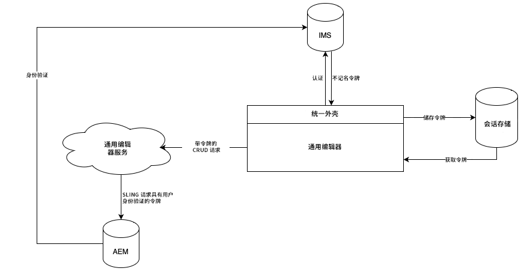

# Universal Editor 身份验证 {#authentication}

了解 Universal Editor 如何进行身份验证。

## 选项 {#options}

Universal Editor 使用 Adobe Identity Management System (IMS) 身份验证（通过 Unified Shell 提供）。

所有应用程序/远程页面负责对所需后端系统进行身份验证。由于 Universal Editor Service 是一项独立服务，因此它需要对后端系统进行此身份验证才能执行 CRUD 操作。

## 标准流程 {#standard-flow}

这是允许 AEM as a Cloud Service 和使用 IMS 的 AMS 使用 Universal Editor 的解决方案。

要使用 Universal Editor，用户必须登录到对 IMS 进行身份验证的 Unified Shell。提供的 IMS 令牌存储在用户会话存储中。

当用户执行 CRUD 操作时，将使用 HTTP 标头中的 IMS 持有者令牌向 Universal Editor Service 发送调用。随后，Universal Editor Service 使用持有者令牌对 AEM 后端系统的请求进行身份验证，以用户的名义执行操作。

