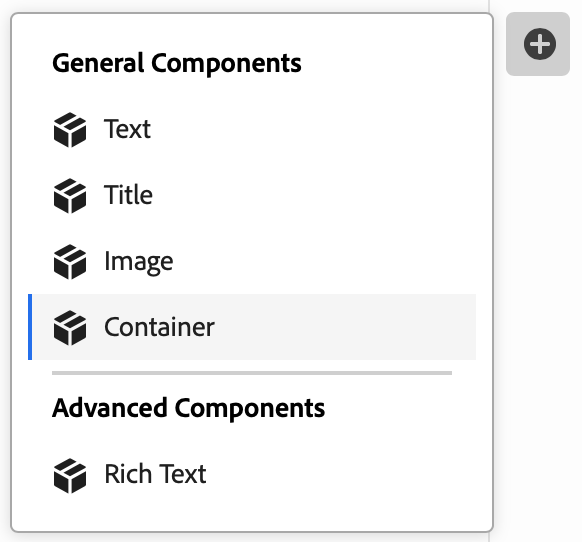

# 使用 Universal Editor 创作内容 {#authoring}

了解内容作者使用 Universal Editor 创建内容是多么轻松和直观。

## 简介 {#introduction}

Universal Editor 支持在任意实施中编辑任何内容的任何方面，以提供卓越的体验，提升内容速度并提供最先进的开发人员体验。

为此，Universal Editor 为内容作者提供了一个直观的 UI，只需少量培训即可开始编辑内容。本文档介绍了 Universal Editor 的创作体验。

>[!TIP]
>
>有关 Universal Editor 的更详细介绍，请参阅文档 [Universal Editor 简介](introduction.md)。

>[!NOTE]
>
>Universal Editor 仍在开发中。目前，它无法编辑所有内容类型。

## 准备应用程序 {#prepare-app}

要使用 Universal Editor 为应用程序创作内容，应用程序必须由开发人员进行检测以支持编辑器。

>[!TIP]
>
>请参阅 [AEM Universal Editor 快速入门](getting-started.md)，查看有关如何配置 AEM 应用程序以使用 Universal Editor 的示例。

## 登录 {#sign-in}

在检测应用程序是否可以使用通用编辑器后，登录到通用编辑器。 您需要Adobe ID才能登录和 [有权访问通用编辑器。](getting-started.md#request-access)

登录后，将要编辑的页面的 URL 输入到[地址栏](#location-bar)中，这样您就可以开始编辑内容，例如[文本内容](#text-mode)或[媒体内容](#media-mode)。

## 了解 UI {#ui}

UI 分为五个主要区域。

* [Experience Cloud 标题](#experience-cloud-header)
* [Universal Editor 标题](#universal-editor-header)
* [模式边栏](#mode-rail)
* [编辑器](#editor)
* [属性边栏](#properties-rail)

### Experience Cloud 标题 {#experience-cloud-header}

Experience Cloud 标题始终显示在屏幕顶部。它是一个锚点，可让您知道您在 Experience Cloud 中的位置，并帮助您导航到其他 Experience Cloud 应用程序。

#### Experience Manager {#experience-manager}

选择标题左侧的 Adobe Experience Cloud 链接可导航到 Experience Manager 解决方案的根来访问工具，例如 [Cloud Manager](/help/onboarding/cloud-manager-introduction.md)、[Cloud Acceleration Manager](/help/journey-migration/cloud-acceleration-manager/introduction/overview-cam.md) 和 [Software Distribution](https://experienceleague.adobe.com/docs/experience-cloud/software-distribution/home.html)。

#### 组织 {#organization}

这将显示您当前登录的组织。如果您的Adobe ID与多个组织关联，请选择切换到其他组织。

#### 解决方案 {#solutions}

点按或单击解决方案切换器可快速跳转到其他 Experience Cloud 解决方案。

#### 帮助 {#help}

可使用帮助图标快速访问学习和支持资源。

#### 通知 {#notifications}

此图标带有一个标记，显示当前分配的未完成[通知](/help/implementing/cloud-manager/notifications.md)的数量。

#### 用户属性 {#user-properties}

选择代表您的用户的图标以访问您的用户设置。 如果您尚未配置用户图片，系统会随机分配一个图标。

### Universal Editor 标题 {#universal-editor-header}

Universal Editor 标题始终显示在屏幕顶部，位于 [Experience Cloud 标题的正下方。](#experience-cloud-header)它为您提供了快速访问权限，以便导航到另一个页面进行编辑以及发布当前页面。

#### “主页”按钮 {#home-button}

使用主页按钮可返回到通用编辑器的起始页

在起始页上，您可以输入要用通用编辑器编辑的站点的URL。

>[!NOTE]
>
>要使用通用编辑器编辑的任何页面必须 [用于支持通用编辑器。](getting-started.md)

#### 位置栏 {#location-bar}

位置栏为您显示正在编辑的页面的位置。选择可输入另一个要编辑的页面的地址。

>[!TIP]
>
>使用热键 `L` 可打开地址栏。

>[!NOTE]
>
>要使用通用编辑器编辑的任何页面必须 [用于支持通用编辑器。](getting-started.md)

#### 身份验证标头设置 {#authentication-settings}

如果需要设置身份验证密码，请选择身份验证标头设置图标。

#### 模拟器设置 {#emulator}

选择模拟图标以定义通用编辑器呈现页面的方式。

点按或单击模拟图标将显示选项。

默认情况下，编辑器会在桌面布局中打开，其中高度和宽度由浏览器自动定义。

您还可选择模拟移动设备并在 Universal Editor 中：

* 定义其方向
* 定义宽度和高度
* 更改方向

#### 打开应用程序预览 {#open-app-preview}

选择打开应用程序预览图标可在自身浏览器选项卡中打开您当前编辑的页面，无需编辑即可预览您的内容。

>[!TIP]
>
>使用热键 `O`（字母 O）可打开应用程序预览。

#### 发布 {#publish}

选择“发布”按钮，以便将更改发布到实时内容以供读者使用。

>[!TIP]
>
>有关使用 Universal Editor 发布内容的更多信息，请参阅文档[使用 Universal Editor 发布内容](publishing.md)。

### 模式边栏 {#rail}

模式边栏位于“主页”按钮的正下方，并且始终位于编辑器的左侧。 它允许在不同使用模式之间轻松切换编辑器。

#### 预览模式 {#preview-mode}

在预览模式中，编辑器中呈现的页面与在您发布的服务上看到的一样。这允许内容作者通过单击链接等来导航内容。

>[!TIP]
>
>使用热键 `P` 可切换到预览模式。

#### 组件模式 {#component-mode}

在组件模式下，内容作者可以选择要编辑的组件，包括：

* 就地[编辑纯文本](#editing-content)。
* [编辑富文本](#editing-rich-text) 中的其他格式选项的位置。
* [编辑媒体内容](#editing-media)
* [编辑内容片段](#edit-content-fragment)

选择组件后，其内容的详细信息将显示在 [属性边栏。](#properties-rail) 根据内容类型，您可以在就地或属性边栏中进行编辑。

>[!TIP]
>
>使用热键 `C` 切换到组件模式。

### 编辑器 {#editor}

编辑器占据窗口的大部分区域，并在其中呈现在[地址栏](#location-bar)中指定的页面。

* 如果编辑器位于 [组件模式，](#component-mode) 内容将可编辑，但您无法关注链接。
* 如果编辑器处于[预览模式](#preview-mode)下，则可在内容中导航并可访问链接，但无法编辑内容。

### 属性边栏 {#properties-rail}

属性边栏始终位于编辑器的右侧。 根据其模式的不同，它可显示在内容中选择的某个组件或页面内容的层次结构的详细信息。

#### 属性模式 {#properties-mode}

在属性模式中，边栏显示当前在编辑器中选择的组件的属性。这是加载页面时属性边栏的默认模式。

根据选择的组件类型，可以在属性边栏中显示和修改详细信息。

请注意，并非所有组件都有可显示和/或编辑的详细信息。

>[!TIP]
>
>使用热键 `D` 可切换到属性模式。

#### 内容树模式 {#content-tree-mode}

在内容树模式中，边栏显示页面内容的层次结构。

在内容树中选择某个项目时，编辑器将滚动到该内容并将其选定。

>[!TIP]
>
>使用热键 `F` 可切换到内容树模式。

##### 编辑 {#edit}

时间 [组件模式，](#component-mode) 所选组件的编辑选项将显示在属性边栏中。 在属性边栏中，您可以编辑选定的组件。 如果选定的组件是内容片段，您还可以选择编辑按钮。

点按或单击“编辑”按钮将在一个新的选项卡中打开[内容片段编辑器](/help/assets/content-fragments/content-fragments-managing.md#opening-the-fragment-editor)。这将允许您访问内容片段编辑器的全部功能以编辑关联的内容片段。

根据工作流的需求，您可能需要在通用编辑器中或直接在内容片段编辑器中编辑内容片段。

>[!TIP]
>
>使用热键 `E` 可编辑所选组件。

##### 添加 {#add}

如果在内容树或编辑器中选择了容器组件，则属性边栏上会显示添加选项。

点击或单击“添加”按钮将打开一个可用组件的下拉菜单[添加到选定的容器。](#adding-components)

>[!TIP]
>
>使用热键`A`将组件添加到选定的容器组件。

##### 删除 {#delete}

如果在内容树或编辑器中选择容器组件中的组件，则属性边栏上会显示删除选项。

点击或单击删除按钮[删除该组件。](#deleting-components)

>[!TIP]
>
>使用热键 `Shift+Backspace` 从容器中删除选定的组件。

## 编辑内容 {#editing-content}

编辑内容是简单而直观的。在 [组件模式](#component-mode)，当您将鼠标悬停在编辑器中的内容上时，可编辑的内容会以蓝色框突出显示。

>[!TIP]
>
>请注意，在组件模式下，点按或单击内容会选择内容进行编辑。 如果要通过以下链接导航内容，请切换到 [预览模式。](#preview-mode)

根据您选择的内容，您可能有不同的就地编辑选项，并且您可能会在中为内容提供其他信息和选项。 [属性边栏。](#properties-rail)

### 编辑纯文本 {#edit-plain-text}

如果您在 [组件模式](#component-mode) 并选择一个纯文本组件，您可以通过双击或双击该组件就地编辑文本。

按Enter/Return键或选择文本框外部以保存更改。

当您选择选择文本组件时，其详细信息将显示在属性边栏中。 您还可以编辑边栏中的文本。

此外，可在属性边栏中找到有关文本的详细信息。 一旦焦点离开属性边栏中已编辑的字段，更改将自动保存。

### 编辑富文本 {#edit-rich-text}

如果您在 [组件模式](#component-mode) 并选择一个富文本组件，您可以通过双击或双击该组件就地编辑文本。

按Enter/Return键或选择文本框外部以保存更改。

此外，属性边栏中还提供了文本上的格式选项和详细信息。 一旦焦点离开属性边栏中已编辑的字段，更改将自动保存。

### 编辑媒体 {#edit-media}

如果您在 [组件模式](#component-mode) 并且选择一个图像，则可以在属性边栏中查看其详细信息。

选择 **替换** 按钮替换属性边栏中选定图像的预览下的图像，以将其替换为您资源库中的另一个图像。

1. [资源选择器](/help/assets/asset-selector.md#using-asset-selector)窗口会打开，以供您选择资源。
1. 选择以选择新资源。
1. 选择 **选择** 以返回到替换资产的属性边栏。

更改会自动保存到您的内容中。

>[!TIP]
>
>使用热键 `R` 可打开资源选择器以替换所选图像。

### 编辑内容片段 {#edit-content-fragment}

如果您在 [组件模式](#component-mode) 然后您选择 [内容片段，](/help/sites-cloud/administering/content-fragments/overview.md) 您可以在属性边栏中编辑其详细信息。

在选定内容片段的内容模型中定义的字段在属性边栏中显示和可编辑。

如果您选择与内容片段相关的字段，则内容片段会加载到组件边栏中，并且会自动滚动到该字段。

一旦焦点离开属性边栏中已编辑的字段，更改将自动保存。

如果您想在 [内容片段编辑器](/help/sites-cloud/administering/content-fragments/authoring.md) 相反，请单击 [编辑按钮](#edit) 在模式边栏中。

根据工作流的需求，您可能需要在通用编辑器中或直接在内容片段编辑器中编辑内容片段。

### 向容器添加组件 {#adding-components}

1. 在内容树或编辑器中选择一个容器组件。
1. 然后，在属性边栏中选择添加图标。

   

该组件被插入到容器中并可以在编辑器中进行编辑。

>[!TIP]
>
>使用热键 `A` 可将组件添加到选定容器。

### 从容器中删除组件 {#deleting-components}

1. 在内容树或编辑器中选择一个容器组件。
1. 选择容器的V形图标以在内容树中展开其内容。
1. 然后，在内容树中，选择容器内的一个组件。
1. 在属性边栏中选择删除图标。

   

选定的组件已删除。

>[!TIP]
>
>使用热键 `Shift+Backspace` 可从容器中删除选定组件。

### 对容器中的组件重新排序 {#reordering-components}

1. 在内容树或编辑器中选择一个容器组件。
1. 如果尚未进入[内容树模式，](#content-tree-mode)切换到它。
1. 选择容器的V形图标以在内容树中展开其内容。
1. 拖动容器内组件旁边的手柄图标表明您可以重新排列它们。拖动组件以对它们在容器内重新排序。

   

1. 拖动的组件在组件树中变成灰色，而插入点由蓝线表示。释放组件以将其放置在新位置。

组件在内容树和编辑器中重新排序

## 预览内容 {#previewing-content}

编辑完内容后，您通常需要导航内容以查看它在其他页面内容中的外观。在[预览模式](#preview-mode)中，您可以单击链接来像阅读器一样导航您的内容。内容在编辑器中呈现，就像它将要发布的那样。

请注意，在预览模式中，点按或单击内容的反应与对内容阅读器的反应一样。如果要选择要编辑的内容，请切换到 [组件模式。](#component-mode)

## 其他资源 {#additional-resources}

要了解有关 Universal Editor 的更多信息，请参阅这些文档。

* [Universal Editor 简介](introduction.md) – 了解 Universal Editor 如何支持在任意实施中编辑任何内容的任何方面，以提供卓越的体验，提升内容速度并提供最先进的开发人员体验。
* [使用 Universal Editor 发布内容](publishing.md) – 了解 Universal Editor 如何发布内容以及您的应用程序如何处理发布的内容。
* [AEM Universal Editor 快速入门 ](getting-started.md) – 了解如何获取 Universal Editor 访问权限以及如何对第一个 AEM 应用程序插桩以使用 Universal Editor。
* [Universal Editor 架构](architecture.md) – 了解 Universal Editor 的架构以及数据如何在其服务和层之间流动。
* [属性和类型](attributes-types.md) – 了解 Universal Editor 所需的数据属性和类型。
* [Universal Editor 身份验证](authentication.md) – 了解 Universal Editor 如何进行身份验证。
