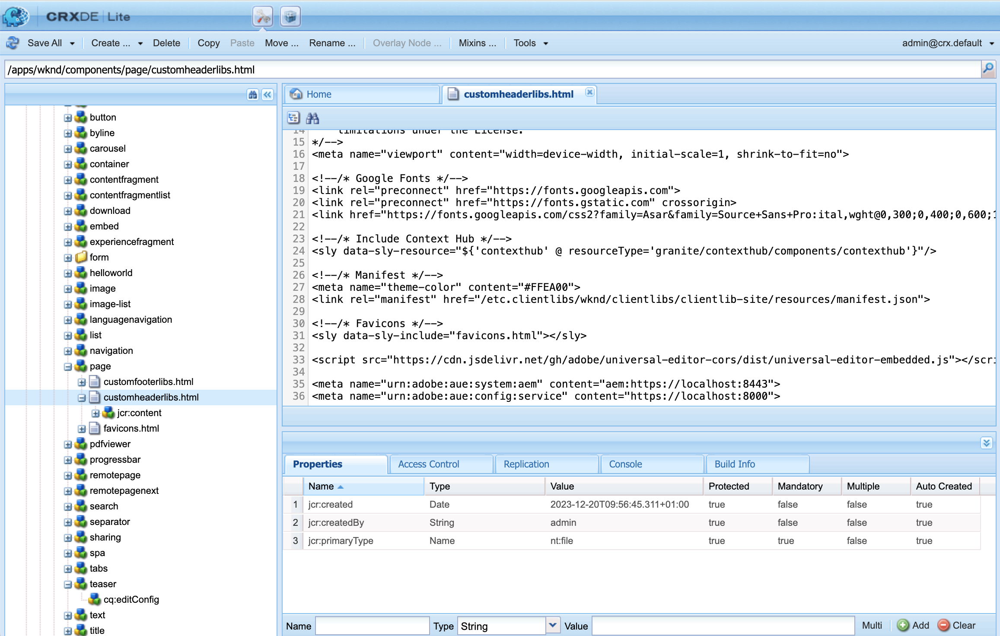
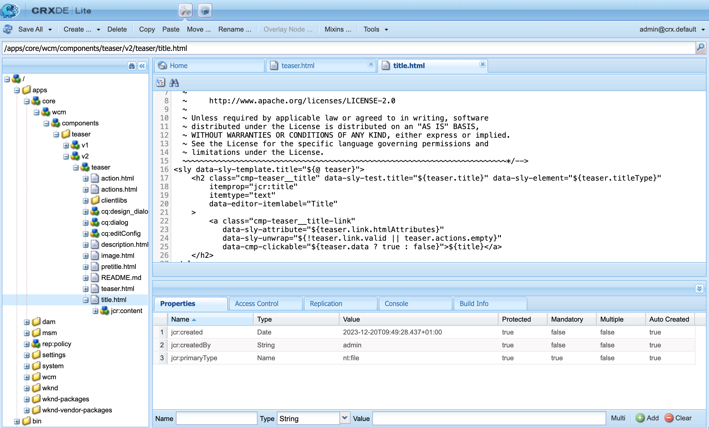
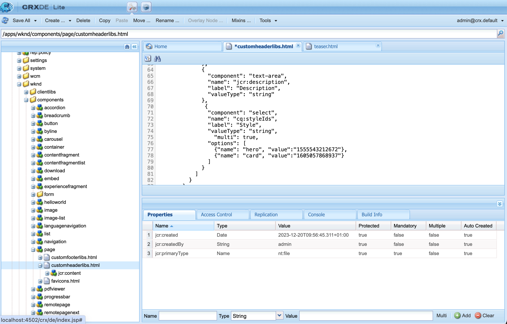

# 面向AEM开发人员的通用编辑器概述 {#developer-overview}

如果您是一名AEM开发人员，并且对Universal Editor的工作方式以及如何在您的项目中使用它感兴趣，本文档将为您提供端到端介绍，引导您对WKND项目进行检测以使用Universal Editor。

## 用途 {#purpose}

本文档以开发人员的身份介绍了通用编辑器的工作方式以及如何检测应用程序如何使用该编辑器。

它通过大多数AEM开发人员熟悉的标准示例（核心组件和WKND站点）来完成此操作，并装备一些示例组件，以便使用通用编辑器进行编辑。

>[!TIP]
>
>本文档采取额外步骤来说明通用编辑器的工作方式，并旨在加深开发人员对编辑器的了解。 因此，它不是检测应用程序的最直接途径，而是最能说明通用编辑器及其工作方式的途径。
>
>如果您希望尽快启动并运行，请参阅AEM](/help/implementing/universal-editor/getting-started.md)文档中的[通用编辑器快速入门。

## 先决条件 {#prerequisites}

要遵循本概述，您需要以下可用项。

* [AEM as a Cloud Service的本地开发实例](https://experienceleague.adobe.com/docs/experience-cloud/software-distribution/home.html)
   * 您的本地开发实例必须在`localhost`.](https://experienceleague.adobe.com/docs/experience-manager-learn/foundation/security/use-the-ssl-wizard.html)上使用HTTPS进行[配置以进行开发
   * [必须安装WKND演示站点。](https://github.com/adobe/aem-guides-wknd)
* [访问通用编辑器](/help/implementing/universal-editor/getting-started.md#onboarding)
* [本地通用编辑器服务](/help/implementing/universal-editor/local-dev.md)正在运行以进行开发
   * 确保将浏览器引导至[接受本地服务自签名证书。](/help/implementing/universal-editor/local-dev.md#editing)

除了Web开发一般熟悉之外，本文档假定您基本熟悉AEM开发。 如果您没有开发AEM的经验，请考虑先查看[WKND教程，然后再继续。](/help/implementing/developing/introduction/develop-wknd-tutorial.md)

## 启动AEM并登录到通用编辑器 {#sign-in}

如果您尚未安装WKND，则必须运行本地AEM开发实例，并启用HTTPS，如先决条件中所述。[](#prerequisites)此概述假定您的实例在`https://localhost:8443`上运行。

1. 在AEM编辑器中打开主WKND英语母版页。

   ```text
   https://localhost:8443/editor.html/content/wknd/language-masters/en.html
   ```

1. 在编辑器的&#x200B;**页面信息**&#x200B;菜单中，选择&#x200B;**以发布的形式查看**。 该操作将在新选项卡中打开同一页面，并禁用AEM编辑器。

   ```text
   https://localhost:8443/content/wknd/language-masters/en.html?wcmmode=disabled
   ```

1. 复制此链接。

1. 现在登录到通用编辑器。

   ```text
   https://experience.adobe.com/#/aem/editor
   ```

1. 将您之前复制的WKND内容的链接粘贴到通用编辑器的&#x200B;**站点URL**&#x200B;字段中，然后单击&#x200B;**打开**。

   

## 通用编辑器尝试加载内容 {#sameorigin}

通用编辑器在一个框架中加载要编辑的内容。 AEMX帧选项的默认设置可防止出现这种情况，在尝试加载WKND的本地副本时，浏览器中可明确看到此错误并在控制台输出中予以详述。

浏览器出错

X-Frame选项`sameorigin`阻止在框架中呈现AEM页面。 必须删除此标头才能允许在通用编辑器中加载页面。

1. 打开Configuration Manager。

   ```text
   https://localhost:8443/system/console/configMgr
   ```

1. 编辑OSGi配置`org.apache.sling.engine.impl.SlingMainServlet`

   用于SAMEORIGIN的

1. 删除属性&#x200B;**其他响应标头**&#x200B;的属性`X-Frame-Options=SAMEORIGIN`。

1. 保存更改。

现在，如果重新加载通用编辑器，您会看到AEM页面已加载。

>[!TIP]
>
>* 有关此OSGi配置的更多详细信息，请参阅文档[AEM中的通用编辑器入门](/help/implementing/universal-editor/getting-started.md#sameorigin)。
>* 有关AEM中OSGi的详细信息，请参阅文档[为Adobe Experience Manager as a Cloud Service配置OSGi](/help/implementing/deploying/configuring-osgi.md)。

## 处理同一站点Cookie {#samesite-cookies}

当通用编辑器加载您的页面时，它会加载到AEM登录页面，以确保您通过身份验证可以进行更改。

但是，您无法成功登录。 在显示浏览器控制台时，您可以看到浏览器已阻止在框架上输入


登录令牌Cookie将作为第三方域发送到AEM。 因此，AEM中必须允许相同站点的Cookie。

1. 打开Configuration Manager。

   ```text
   https://localhost:8443/system/console/configMgr
   ```

1. 编辑OSGi配置`com.day.crx.security.token.impl.impl.TokenAuthenticationHandler`

   相同站点Cookie的

1. 将登录令牌Cookie **的属性** SameSite属性更改为`None`。

1. 保存更改。

现在，如果您重新加载通用编辑器，则可以成功登录到AEM并加载目标页面。

>[!TIP]
>
>* 有关此OSGi配置的更多详细信息，请参阅文档[AEM中的通用编辑器入门](/help/implementing/universal-editor/getting-started.md#samesite-cookies)。
>* 有关AEM中OSGi的详细信息，请参阅文档[为Adobe Experience Manager as a Cloud Service配置OSGi](/help/implementing/deploying/configuring-osgi.md)。

## 通用编辑器连接到远程帧 {#ue-connect-remote-frame}

在将页面加载到通用编辑器并登录到AEM后，通用编辑器将尝试连接到远程框架。 此操作可通过必须在远程框架中加载的JavaScript库来完成。 如果JavaScript库不存在，则页面最终会在控制台中创建超时错误。


您必须将必要的JavaScript库添加到WKND应用程序的页面组件中。

1. 打开 CRXDE Lite。

   ```text
   https://localhost:8443/crx/de
   ```

1. 在`/apps/wknd/components/page`下，编辑文件`customheaderlibs.html`。

   

1. 将JavaScript库添加到文件的末尾。

   ```html
   <script src="https://universal-editor-service.adobe.io/cors.js" async></script>
   ```

1. 单击&#x200B;**全部保存**，然后重新加载通用编辑器。

现在，页面将随适当的JavaScript库一起加载，以允许通用编辑器连接到您的页面，并且超时错误不再显示在控制台中。

>[!TIP]
>
>* 库可以加载到页眉或页脚中。

>[!NOTE]
>
>由于包已被弃用，因此不再建议使用以前推荐的方法包含JavaScript库`<script src="https://universal-editor-service.experiencecloud.live/corslib/LATEST"></script>`或通过npmjs.com来使用。
>
>如果应用程序仍使用已弃用的包，则通用编辑器将在UI中显示警告，指出检测到过时的包。

## 定义连接以保留更改 {#connection}

现在，WKND页面可在通用编辑器中成功加载，JavaScript库也可加载以将编辑器连接到应用程序。

但是，您可能注意到无法与通用编辑器中的页面进行交互。 通用编辑器无法实际编辑您的页面。 为了使通用编辑器能够编辑您的内容，您需要定义一个连接，以便它知道在哪里写入内容。 对于本地开发，您需要回写到位于`https://localhost:8443`的本地AEM开发实例。

1. 打开 CRXDE Lite。

   ```text
   https://localhost:8443/crx/de
   ```

1. 在`/apps/wknd/components/page`下，编辑文件`customheaderlibs.html`。

   

1. 在文件末尾添加必要的元数据，以便连接到本地AEM实例。

   ```html
   <meta name="urn:adobe:aue:system:aem" content="aem:https://localhost:8443">
   ```

   * 始终建议使用最新版本的库。 如果您需要以前的版本，请参阅文档[AEM中的通用编辑器快速入门。](/help/implementing/universal-editor/getting-started.md#alternative)

1. 将连接到本地Universal Editor服务所需的元数据添加到文件末尾。

   ```html
   <meta name="urn:adobe:aue:config:service" content="https://localhost:8000">
   ```

1. 单击&#x200B;**全部保存**，然后重新加载通用编辑器。

现在，通用编辑器不仅可以从本地AEM开发实例成功加载您的内容，而且可以知道在何处保留您使用本地通用编辑器服务所做的任何更改。 这是使用通用编辑器检测应用程序是否可编辑的第一步。

>[!TIP]
>
>* 有关连接元数据的更多详细信息，请参阅文档[AEM中的通用编辑器入门](/help/implementing/universal-editor/getting-started.md#connection)。
>* 有关通用编辑器结构的更多详细信息，请参阅文档[通用编辑器架构](/help/implementing/universal-editor/architecture.md#service)。
>* 有关如何连接到通用编辑器的自托管版本的更多详细信息，请参阅文档[使用通用编辑器进行本地AEM开发](/help/implementing/universal-editor/local-dev.md)。

## 检测组件 {#instrumenting-components}

但是，您可能会注意到您仍然不能使用通用编辑器。 如果尝试在通用编辑器中单击WKND页面顶部的Teaser，则实际上无法选择该页面（或该页面上的任何其他内容）。

组件还必须通过检测才能使用通用编辑器进行编辑。 为此，必须编辑Teaser组件。 因此，您需要叠加核心组件，因为核心组件在`/libs`下，这是不可变的。

1. 打开 CRXDE Lite。

   ```text
   https://localhost:8443/crx/de
   ```

1. 选择节点`/libs/core/wcm/components`并单击工具栏上的&#x200B;**覆盖节点**。

1. 选择`/apps/`作为&#x200B;**叠加位置**，单击&#x200B;**确定**。

   

1. 选择`/libs/core/wcm/components`下的`teaser`节点，然后单击工具栏中的&#x200B;**复制**。

1. 在`/apps/core/wcm/components`处选择覆盖的节点，然后单击工具栏中的&#x200B;**粘贴**。

1. 双击文件`/apps/core/wcm/components/teaser/v2/teaser/teaser.html`以进行编辑。

   

1. 在第一个`div`末尾的第26行左右，添加该组件的检测详细信息。

   ```text
   data-aue-resource="urn:aem:${resource.path}"
   data-aue-type="component"
   data-aue-label="Teaser"
   ```

1. 单击工具栏中的&#x200B;**全部保存**&#x200B;并重新加载通用编辑器。

1. 在通用编辑器中，单击页面顶部的Teaser组件，查看是否现在可以选择该组件。

1. 如果单击通用编辑器属性面板中的&#x200B;**内容树**&#x200B;图标，则可以看到编辑器已识别页面上的所有Teaser（您现在已检测该编辑器）。 您选择的Teaser是高亮显示的。

   

>[!TIP]
>
>有关覆盖节点的更多详细信息，请参阅文档[在Adobe Experience Manager as a Cloud Service中使用Sling资源合并器](/help/implementing/developing/introduction/sling-resource-merger.md)。

## Teaser的乐器子组件 {#subcomponents}

您现在可以选择Teaser，但仍不可编辑。 这是因为Teaser是不同组件（如图像和标题组件）的组合。 您必须检测这些子组件才能对其进行编辑。

1. 打开 CRXDE Lite。

   ```text
   https://localhost:8443/crx/de
   ```

1. 选择节点`/apps/core/wcm/components/teaser/v2/teaser/`并双击`title.html`文件。

   

1. 在`h2`标记的末尾（在第17行附近）插入以下属性。

   ```text
   data-aue-prop="jcr:title"
   data-aue-type="text"
   data-aue-label="Title"
   ```

1. 单击工具栏中的&#x200B;**全部保存**&#x200B;并重新加载通用编辑器。

1. 单击页面顶部的同一Teaser组件的标题，现在可以选择该组件。 内容树还会将标题显示为所选Teaser组件的一部分。

   

您现在可以编辑Teaser组件的标题！

## 这都是什么意思？ {#what-does-it-mean}

现在您可以编辑Teaser的标题，让我们花些时间回顾一下您取得的成就和做法。

您已通过检测Teaser组件来将其识别到通用编辑器。

* `data-aue-resource`在AEM中标识正在编辑的资源。
* `data-aue-type`定义应将项目视为页面组件（而不是容器）。
* `data-aue-label`在选定Teaser的UI中显示用户友好的标签。

您还检测了Teaser组件中的标题组件。

* `data-aue-prop`是写入的JCR属性。
* `data-aue-type`是应如何编辑该属性。 在这种情况下，使用文本编辑器，因为它是标题（而不是富文本编辑器）。

## 定义身份验证标头 {#auth-header}

现在，您可以编辑内联Teaser的标题，并且所做的更改会保留在浏览器中。


但是，如果重新加载浏览器，则会重新加载上一个标题。 这是因为，尽管通用编辑器知道如何连接到您的AEM实例，但它尚无法通过您的AEM实例的身份验证将更改写回JCR。

如果显示浏览器开发人员工具的网络选项卡并搜索`update`，则会在尝试编辑标题时遇到401错误。


使用通用编辑器编辑生产AEM内容时，通用编辑器使用您用来登录编辑器的IMS令牌来验证AEM，以便于写回到JCR。

在本地开发时，无法使用AEM身份提供程序，因为IMS令牌仅传递到Adobe拥有的域。 您需要通过明确设置身份验证标头来手动提供身份验证方法。

1. 在通用编辑器界面中，单击工具栏中的&#x200B;**身份验证标头**&#x200B;图标。

1. 复制所需的身份验证标头以验证本地AEM实例，然后单击&#x200B;**保存**。

   

1. 重新加载通用编辑器，现在编辑Teaser的标题。

浏览器控制台中不再报告任何错误，并且所做的更改将保留回您的本地AEM开发实例。

如果您在浏览器开发人员工具中调查流量并查找`update`事件，则可以查看更新的详细信息。


```json
{
  "connections": [
    {
      "name": "aem",
      "protocol": "aem",
      "uri": "https://localhost:8443"
    }
  ],
  "target": {
    "resource": "urn:aem:/content/wknd/language-masters/en/jcr:content/root/container/carousel/item_1571954853062",
    "type": "text",
    "prop": "jcr:title"
  },
  "value": "Tiny Toon Adventures"
}
```

* `connections`是到您的本地AEM实例的连接
* `target`是在JCR中更新的确切节点和属性
* `value`是您所做的更新。

您可以看到更改在JCR中持续存在。

在JCR](assets/dev-write-back-jcr.png)中更新![

>[!TIP]
>
>有许多工具可在线生成用于测试和开发目的的必需身份验证标头。
>
>基本身份验证标头示例`Basic YWRtaW46YWRtaW4=`用于用户/密码组合`admin:admin`，这是本地AEM开发中常见的。

## 为应用程序检测“属性”面板 {#properties-rail}

现在，您拥有一个经检测可以使用通用编辑器进行编辑的应用程序！

编辑当前仅限于Teaser标题的内联编辑。 但是，在某些情况下，就地编辑不够。 在键盘输入处，可以编辑Teaser的标题等文本。 不过，更复杂的项目需要能够显示并允许编辑结构化数据，这与它在浏览器中的呈现方式不同。 这是属性面板的用途。

要更新应用程序以使用属性面板进行编辑，请返回到应用程序的页面组件的头文件。 在这里，您已经建立了与本地AEM开发实例和本地Universal Editor服务的连接。 您必须在此定义可在应用程序中编辑的组件及其数据模型。

1. 打开 CRXDE Lite。

   ```text
   https://localhost:8443/crx/de
   ```

1. 在`/apps/wknd/components/page`下，编辑文件`customheaderlibs.html`。

   

1. 在文件的末尾添加定义组件所需的脚本。

   ```html
   <script type="application/vnd.adobe.aue.component+json">
   {
     "groups": [
       {
         "title": "General Components",
         "id": "general",
         "components": [
           {
             "title": "Teaser",
             "id": "teaser",
             "plugins": {
               "aem": {
                 "page": {
                   "resourceType": "wknd/components/teaser"
                 }
               }
             }
           },
           {
             "title": "Title",
             "id": "title",
             "plugins": {
               "aem": {
                 "page": {
                   "resourceType": "wknd/components/title"
                 }
               }
             }
           }
         ]
       }
     ]
   }
   </script>
   ```

1. 在其下方，在文件末尾添加定义模型所需的脚本。

   ```html
   <script type="application/vnd.adobe.aue.model+json">
   [
     {
       "id": "teaser",
       "fields": [
         {
           "component": "text-input",
           "name": "jcr:title",
           "label": "Title",
           "valueType": "string"
         },
         {
           "component": "text-area",
           "name": "jcr:description",
           "label": "Description",
           "valueType": "string"
         }
       ]
     },
     {
       "id": "title",
       "fields": [
         {
           "component": "select",
           "name": "type",
           "value": "h1",
           "label": "Type",
           "valueType": "string",
           "options": [
             { "name": "h1", "value": "h1" },
             { "name": "h2", "value": "h2" },
             { "name": "h3", "value": "h3" },
             { "name": "h4", "value": "h4" },
             { "name": "h5", "value": "h5" },
             { "name": "h6", "value": "h6" }
           ]
         }
       ]
     }
   ]
   </script>
   ```

1. 单击工具栏中的&#x200B;**全部保存**。

## 这都是什么意思？ {#what-does-it-mean-2}

要使用“属性”面板进行编辑，必须将组件分配给`groups`，因此每个定义都以包含组件的组列表开始。

* `title`是组的名称。
* `id`是组的唯一标识符，在本例中，是组成页面内容的一般组件，而不是页面布局的高级组件。

然后，每个组都有一个`components`数组。

* `title`是组件的名称。
* `id`是组件的唯一标识符，在本例中为Teaser。

然后，每个组件都有一个插件定义，定义如何将组件映射到AEM。

* `aem`是处理编辑的插件。 可以将其视为处理组件的服务。
* `page`定义它属于哪种组件，在此例中为标准页面组件。
* `resourceType`是实际AEM组件的映射。

然后，每个组件都必须映射到`model`以定义各个可编辑字段。

* `id`是模型的唯一标识符，它必须与组件的ID匹配。
* `fields`是单个字段的数组。
* `component`是输入类型，如文本或文本区域。
* `name`是该字段映射到的JCR中的字段名称。
* `label`是出现在编辑器UI中的字段描述。
* `valueType`是数据类型。

## 为属性面板检测组件 {#properties-rail-component}

您还需要在元件级别定义元件应使用的模型。

1. 打开 CRXDE Lite。

   ```text
   https://localhost:8443/crx/de
   ```

1. 双击文件`/apps/core/wcm/components/teaser/v2/teaser/teaser.html`以进行编辑。

   

1. 在第一个`div`的末尾（大约在第32行），在您之前添加的属性之后，添加Teaser组件将使用的模型的检测详细信息。

   ```text
   data-aue-model="teaser"
   ```

1. 单击工具栏中的&#x200B;**全部保存**&#x200B;并重新加载通用编辑器。

现在，您已准备好测试针对组件检测的属性面板。

1. 在通用编辑器中，单击Teaser的标题可再次编辑它。

1. 单击属性面板以显示属性选项卡，并查看刚刚检测的字段。

   

您现在可以像之前一样内联编辑Teaser的标题，或者在属性面板中编辑。 在这两种情况下，更改将保留回本地AEM开发实例。

## 向属性面板添加其他字段 {#add-fields}

通过使用已实施组件的数据模型的基本结构，您可以按照相同的模型添加其他字段。

例如，您可以添加字段来调整组件的样式。

1. 打开 CRXDE Lite。

   ```text
   https://localhost:8443/crx/de
   ```

1. 在`/apps/wknd/components/page`下，编辑文件`customheaderlibs.html`。

   

1. 在模型定义脚本中，为样式字段向`fields`数组添加一个附加项。 在插入新字段之前，请记得在最后一个字段之后添加逗号。

   ```json
   {
      "component": "select",
      "name": "cq:styleIds",
      "label": "Style",
      "valueType": "string",
        "multi": true,
      "options": [
        {"name": "hero", "value":"1555543212672"},
        {"name": "card", "value":"1605057868937"}
      ]
   }
   ```

1. 单击工具栏中的&#x200B;**全部保存**&#x200B;并重新加载通用编辑器。

1. 单击Teaser的标题可再次编辑它。

1. 单击属性面板并查看一个新字段可调整组件的样式。

   

通过此方式，组件的JCR中的任何字段都可以在通用编辑器中公开。

## 摘要 {#summary}

恭喜！现在，您可以检测自己的AEM应用程序以使用通用编辑器。

开始检测您自己的应用程序时，请牢记您在本示例中执行的基本步骤。

1. [您可以设置开发环境。](#prerequisites)
   * 在安装了WKND的HTTPS上本地运行的AEM
   * 在HTTPS上本地运行的通用编辑器服务
1. 您已更新AEM的OSGi设置，以允许远程加载其内容。
   * [&#39;org.apache.sling.engine.impl.SlingMainServlet&#39;](#sameorigin)
   * [&#39;com.day.crx.security.token.impl.impl.TokenAuthenticationHandler&#39;](#samesite-cookies)
1. [您已添加 ](#ue-connect-remote-frame)
1. [您定义了一个连接，以将更改保留在 ](#connection)
   * 您定义了到本地AEM开发实例的连接。
   * 您还定义了到本地Universal Editor服务的连接。
1. [您检测了Teaser组件。](#instrumenting-components)
1. [您检测了Teaser的子组件。](#subcomponents)
1. [您定义了一个自定义身份验证标头，以便可以使用本地通用编辑器服务保存更改。](#auth-header)
1. [您检测了应用程序是否使用属性面板。](#properties-rail)
1. [您检测了Teaser组件以使用属性面板。](#properties-rail-component)

您可以按照这些相同的步骤来检测您自己的应用程序，以便与通用编辑器一起使用。 JCR中的任何属性都可以向通用编辑器公开。

## 其他资源 {#additional-resources}

请查阅以下文档，了解有关通用编辑器功能的更多信息和详细信息。

* 如果您希望尽快启动并运行，请参阅AEM](/help/implementing/universal-editor/getting-started.md)文档中的[通用编辑器快速入门。
* 有关必要的OSGi配置的更多详细信息，请参阅文档[AEM中的通用编辑器入门](/help/implementing/universal-editor/getting-started.md#sameorigin)。
* 有关连接元数据的更多详细信息，请参阅文档[AEM中的通用编辑器入门](/help/implementing/universal-editor/getting-started.md#connection)。
* 有关通用编辑器结构的更多详细信息，请参阅文档[通用编辑器架构](/help/implementing/universal-editor/architecture.md#service)。
* 有关如何连接到通用编辑器的自托管版本的更多详细信息，请参阅文档[使用通用编辑器进行本地AEM开发](/help/implementing/universal-editor/local-dev.md)。
* 有关覆盖节点的更多详细信息，请参阅文档[在Adobe Experience Manager as a Cloud Service中使用Sling资源合并器](/help/implementing/developing/introduction/sling-resource-merger.md)。

