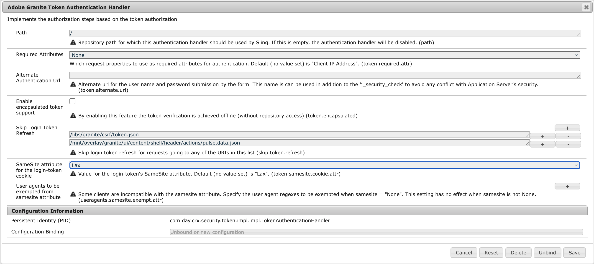
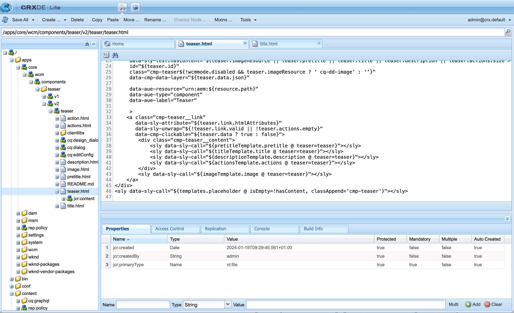

# 面向 AEM 开发人员的通用编辑器概述 {#developer-overview}

如果您是 AEM 开发人员，很想了解通用编辑器如何工作以及如何在项目中使用它，本文档将为您提供一个端到端说明，指导您适配 WKND 项目，以便您能为此项目使用通用编辑器。

## 用途 {#purpose}

本文档为开发人员介绍了通用编辑器如何工作以及如何适配您的应用程序，使其能与编辑器工作。

文档采用了一个大多数 AEM 开发人员熟悉的标准示例、核心组件和 WKND 网站，对一些示例组件进行适配，使它们能够在通用编辑器中进行编辑。

>[!TIP]
>
>文档还额外通过几个步骤来说明通用编辑器如何工作，旨在加深开发人员对编辑器的理解。因此，它不是采用最直接的方式来适配应用程序，而是以最有效的方式来说明通用编辑器及其工作方法。
>
>如果您想尽快开始运行，请参阅[在 AEM 中使用通用编辑器快速入门](/help/implementing/universal-editor/getting-started.md)文档。

## 先决条件 {#prerequisites}

要按照这个概述进行操作，您需要满足以下条件。

* [AEM as a Cloud Service 的本地开发实例](https://experienceleague.adobe.com/docs/experience-cloud/software-distribution/home.html)
   * 您的本地开发实例必须[配置 HTTPS 才能在 `localhost` 上进行开发](https://experienceleague.adobe.com/docs/experience-manager-learn/foundation/security/use-the-ssl-wizard.html)。
   * [必须安装 WKND 演示网站](https://github.com/adobe/aem-guides-wknd)。
* [有权访问通用编辑器](/help/implementing/universal-editor/getting-started.md#onboarding)。
* 为开发目的而运行的[本地通用编辑器服务](/help/implementing/universal-editor/local-dev.md)。
   * 请确保将您的浏览器导向[接受本地服务自签名证书](/help/implementing/universal-editor/local-dev.md#editing)。

除了比较熟悉 Web 开发之外，本文档还假设您对 AEM 开发有基本的了解。如果您没有 AEM 开发经验，请考虑[在继续阅读本概述之前先查看 WKND 教程](/help/implementing/developing/introduction/develop-wknd-tutorial.md)。

## 启动 AEM 并登录通用编辑器 {#sign-in}

您必须运行您的本地 AEM 开发实例，安装 WKND 并启用 HTTPS，满足[先决条件](#prerequisites)中详细列出的条件。本概述假设您的实例在 `https://localhost:8443` 上运行。

1. 在 AEM 编辑器中打开 WKND 主英语语言母版页。

   ```text
   https://localhost:8443/editor.html/content/wknd/language-masters/en.html
   ```

1. 在编辑器的&#x200B;**页面信息**&#x200B;菜单中选择&#x200B;**以发布的形式查看**。现在会在新选项卡中打开同一页面，并且 AEM 编辑器被禁用。

   ```text
   https://localhost:8443/content/wknd/language-masters/en.html?wcmmode=disabled
   ```

1. 复制此链接。

1. 现在登录通用编辑器。

   ```text
   https://experience.adobe.com/#/aem/editor
   ```

1. 将您刚刚复制的 WKND 内容链接粘贴到通用编辑器的&#x200B;**网站 URL**&#x200B;字段中，然后点击&#x200B;**打开**。

   

## 通用编辑器尝试加载内容 {#sameorigin}

通用编辑器加载内容，并放在一个框架中用于编辑。AEM 的 X-Frame 选项的默认设置阻止这种操作，当您尝试加载 WKND 的本地副本时，可以在浏览器中清楚地看到这个错误，控制台中会输出一个详细说明。


X-Frame 选项 `sameorigin` 阻止在框架中渲染 AEM 页面。您必须删除这个头部，允许在通用编辑器中加载页面。

1. 打开配置管理器。

   ```text
   https://localhost:8443/system/console/configMgr
   ```

1. 编辑 OSGi 配置 `org.apache.sling.engine.impl.SlingMainServlet`

   

1. 删除&#x200B;**附加响应头**&#x200B;的属性 `X-Frame-Options=SAMEORIGIN`。

1. 保存更改。

现在，如果您重新加载通用编辑器，就会看到您的 AEM 页面已加载。

>[!TIP]
>
>* 有关此 OSGi 配置的更多详细信息，请参阅文档 [在 AEM 中使用通用编辑器快速入门](/help/implementing/universal-editor/getting-started.md#sameorigin)。
>* 有关 AEM 中 OSGi 的详细信息，请参阅文档[为 Adobe Experience Manager as a Cloud Service 配置 OSGi](/help/implementing/deploying/configuring-osgi.md)。

## 处理相同网站 Cookie {#samesite-cookies}

当通用编辑器加载您的页面时，它会加载到 AEM 登录页面，以确保您通过身份验证，有权进行更改。

但是您无法成功登录。显示浏览器控制台，您可以看到浏览器阻止了框架上的输入


登录令牌 Cookie 被发送到作为第三方域的 AEM。因此，AEM 中必须允许使用相同网站 Cookie。

1. 打开配置管理器。

   ```text
   https://localhost:8443/system/console/configMgr
   ```

1. 编辑 OSGi 配置 `com.day.crx.security.token.impl.impl.TokenAuthenticationHandler`

   

1. **将登录令牌 Cookie 的 SameSite 属性**&#x200B;更改为 `None`。

1. 保存更改。

现在，如果您重新加载通用编辑器，您就可以成功登录 AEM，您的目标页面也会加载。

>[!TIP]
>
>* 有关此 OSGi 配置的更多详细信息，请参阅文档 [在 AEM 中使用通用编辑器快速入门](/help/implementing/universal-editor/getting-started.md#samesite-cookies)。
>* 有关 AEM 中 OSGi 的详细信息，请参阅文档[为 Adobe Experience Manager as a Cloud Service 配置 OSGi](/help/implementing/deploying/configuring-osgi.md)。

## 通用编辑器与远程框架连接 {#ue-connect-remote-frame}

页面加载到通用编辑器并且您登录到 AEM 后，通用编辑器会尝试与远程框架连接。这是通过一个 JavaScript 库完成的，必须在远程框架中加载这个库。如果不存在 JavaScript 库，页面最终会在控制台中产生一个超时错误。


您必须将必要的 JavaScript 库添加到 WKND 应用程序的页面组件。

1. 打开 CRXDE Lite。

   ```text
   https://localhost:8443/crx/de
   ```

1. 在 `/apps/wknd/components/page` 中编辑文件 `customheaderlibs.html`。

   

1. 将 JavaScript 库添加到文件末尾。

   ```html
   <script src="https://universal-editor-service.adobe.io/cors.js" async></script>
   ```

1. 点击&#x200B;**保存全部**，然后重新加载通用编辑器。

现在会使用正确的 JavaScript 库加载页面，以允许通用编辑器连接到您的页面，控制台中不再出现超时错误。

>[!TIP]
>
>* 此库可以加载到页眉或页脚中。

>[!NOTE]
>
>之前建议的包含 JavaScript 库 `<script src="https://universal-editor-service.experiencecloud.live/corslib/LATEST"></script>` 的方法或通过 npmjs.com 添加库的方法都不再推荐，因为这个包已被弃用。
>
>如果应用程序仍在使用已弃用的包，通用编辑器就会在 UI 中显示一个检测到过时包的警告。

## 定义连接以保留更改 {#connection}

现在，通用编辑器中已成功加载 WKND 页面，JavaScript 库也已加载，编辑器已与您的应用程序连接。

但是您可能注意到您无法在通用编辑器中与页面交互。通用编辑器的确无法编辑您的页面。要使通用编辑器能够编辑您的内容，您需要定义一个连接，使它知道要在哪里写入内容。在本地开发的情况下，您需要写回到您的本地 AEM 开发实例，位于：`https://localhost:8443`。

1. 打开 CRXDE Lite。

   ```text
   https://localhost:8443/crx/de
   ```

1. 在 `/apps/wknd/components/page` 中编辑文件 `customheaderlibs.html`。

   

1. 将连接本地 AEM 实例所需的元数据添加到文件末尾。

   ```html
   <meta name="urn:adobe:aue:system:aem" content="aem:https://localhost:8443">
   ```

   * 始终推荐使用此库的最新版本。如果需要先前的版本，请参阅文档[在 AEM 中使用通用编辑器快速入门](/help/implementing/universal-editor/getting-started.md#alternative)。

1. 将连接本地通用编辑器服务所需的元数据添加到文件末尾。

   ```html
   <meta name="urn:adobe:aue:config:service" content="https://localhost:8000">
   ```

1. 点击&#x200B;**保存全部**，然后重新加载通用编辑器。

现在，通用编辑器不仅可以从您的本地 AEM 开发实例成功加载您的内容，而且还知道要在哪里保留您用本地通用编辑器服务所做的任何更改。这是适配您的应用程序，使其可使用通用编辑器进行编辑的第一步。

>[!TIP]
>
>* 有关连接元数据的更多详细信息，请参阅文档[在 AEM 中使用通用编辑器快速入门](/help/implementing/universal-editor/getting-started.md#connection)。
>* 有关通用编辑器结构的更多详细信息，请查看文档[通用编辑器架构](/help/implementing/universal-editor/architecture.md#service)。
>* 有关如何连接自托管版本的通用编辑器的更多详细信息，请查看文档[使用通用编辑器进行本地 AEM 开发](/help/implementing/universal-editor/local-dev.md)。

## 适配组件 {#instrumenting-components}

但是，您可能会注意到，通用编辑器仍然做不了很多事情。如果您尝试在通用编辑器中点击 WKND 页面顶部的 Teaser，实际上无法选择它（或页面上的任何其他内容）。

您的组件还必须经过适配才能用通用编辑器进行编辑。为此，您必须编辑 Teaser 组件。因此您需要叠加核心组件，因为核心组件在 `/libs` 中，这是不可变的。

1. 打开 CRXDE Lite。

   ```text
   https://localhost:8443/crx/de
   ```

1. 选择节点 `/libs/core/wcm/components`，然后点击工具栏上的&#x200B;**叠加节点**。

1. **叠加位置**&#x200B;选择 `/apps/`，然后点击 **OK**。

   

1. 选择 `/libs/core/wcm/components` 中的 `teaser` 节点，然后点击工具栏中的&#x200B;**复制**。

1. 选择 `/apps/core/wcm/components` 中的叠加节点，然后点击工具栏中的&#x200B;**粘贴**。

1. 双击文件 `/apps/core/wcm/components/teaser/v2/teaser/teaser.html` 进行编辑。

   

1. 在第一个 `div` 的末尾，大约在第 26 行，添加此组件的适配详细信息。

   ```text
   data-aue-resource="urn:aem:${resource.path}"
   data-aue-type="component"
   data-aue-label="Teaser"
   ```

1. 点击工具栏中的&#x200B;**保存全部**，然后重新加载通用编辑器。

1. 在通用编辑器中点击页面顶部的 Teaser 组件，现在您可以选择它了。

1. 如果您点击通用编辑器的属性面板中的&#x200B;**内容树**&#x200B;图标，您可以看到编辑器现在识别了页面上的所有您已将其适配的 Teaser。您选择的 Teaser 会突出显示。

   

>[!TIP]
>
>有关叠加节点的更多详细信息，请查看文档[在 Adobe Experience Manager as a Cloud Service 中使用 Sling 资源合并器](/help/implementing/developing/introduction/sling-resource-merger.md)。

## 适配 Teaser 的子组件 {#subcomponents}

您现在可以选择 Teaser，但仍然无法编辑它。这是因为 Teaser 是由图像和标题组件等不同组件组合而成的。您必须适配这些子组件才能编辑它们。

1. 打开 CRXDE Lite。

   ```text
   https://localhost:8443/crx/de
   ```

1. 选择节点 `/apps/core/wcm/components/teaser/v2/teaser/`，然后双击 `title.html` 文件。

   

1. 在 `h2` 标记末尾，大约第 17 行，插入以下属性。

   ```text
   data-aue-prop="jcr:title"
   data-aue-type="text"
   data-aue-label="Title"
   ```

1. 点击工具栏中的&#x200B;**保存全部**，然后重新加载通用编辑器。

1. 点击页面顶部相同的 Teaser 组件的标题，您现在可以选择它。内容树也会将标题显示为所选 Teaser 组件的一部分。

   

您现在可以编辑 Teaser 组件的标题！

## 所有这些意味着什么？ {#what-does-it-mean}

现在您可以编辑 Teaser 的标题了，我们来回顾一下您已完成的步骤以及如何完成的。

您适配了 Teaser 组件，使通用编辑器能够识别到它。

* `data-aue-resource` 标识出 AEM 中正在编辑的资源。
* `data-aue-type` 定义了这些项应被视为页面组件（而不是容器，比如说）。
* `data-aue-label` 在 UI 中为选定的 Teaser 显示一个用户友好的标签。

您还适配了 Teaser 组件中的标题组件。

* `data-aue-prop` 是写入的 JCR 属性。
* `data-aue-type` 是编辑属性的方法。在本例中使用文本编辑器，因为它是一个标题（而不是富文本编辑器，比如说）。

## 定义身份验证头部 {#auth-header}

现在您可以用内联方法编辑 Teaser 的标题，更改会保留在浏览器中。


但是，如果您重新加载浏览器，会重新加载之前的标题。这是因为，尽管通用编辑器知道如何连接您的 AEM 实例，但它还无法对您的 AEM 实例进行身份验证，因此无法将更改写回到 JCR。

如果您打开浏览器开发人员工具的网络选项卡，搜索 `update`，您会发现在尝试编辑标题时出现 401 错误。


当使用通用编辑器编辑您的生产 AEM 内容时，通用编辑器会使用您用于登录编辑器的相同 IMS 令牌来对 AEM 进行身份验证，以便写回到 JCR。

当您进行本地开发时，您无法使用 AEM 身份标识提供者，因为 IMS 令牌仅被传递到 Adobe 拥有的域。您需要明确设置身份验证头部，手动提供身份验证方法。

1. 在通用编辑器界面中，点击工具栏中的&#x200B;**身份验证头部**&#x200B;图标。

1. 复制必要的身份验证头部，对您的本地 AEM 实例进行身份验证，然后点击&#x200B;**保存**。

   

1. 重新加载通用编辑器，现在编辑 Teaser 的标题。

浏览器控制台中不再报告任何错误，更改被写回到您的本地 AEM 开发实例。

如果您查看浏览器开发人员工具中的流量，搜索 `update` 事件，您可以看到关于更新的详细信息。


```json
{
  "connections": [
    {
      "name": "aem",
      "protocol": "aem",
      "uri": "https://localhost:8443"
    }
  ],
  "target": {
    "resource": "urn:aem:/content/wknd/language-masters/en/jcr:content/root/container/carousel/item_1571954853062",
    "type": "text",
    "prop": "jcr:title"
  },
  "value": "Tiny Toon Adventures"
}
```

* `connections` 是与您的本地 AEM 实例的连接
* `target` 是 JCR 中更新的准确节点和属性
* `value` 是您做的更新。

您可以看到更改被保留在 JCR 中。


>[!TIP]
>
>网上有许多工具可用于生成测试和开发所需的身份验证头部。
>
>基本身份验证头部示例 `Basic YWRtaW46YWRtaW4=` 适用于 `admin:admin` 的用户/密码组合，这在本地 AEM 开发中很常见。

## 为属性面板适配应用程序 {#properties-rail}

现在，您的应用程序已经过适配，可以用通用编辑器进行编辑！

目前的编辑仅限于对 Teaser 标题进行内联编辑。然而，有些情况下就地编辑是不够的。通过键盘输入可以编辑 Teaser 标题这类的文本。然而，更复杂的组件需要能够显示出来并允许编辑结构化数据，无论浏览器中如何渲染。这就是属性面板的作用。

要更新您的应用程序以使用属性面板进行编辑，请返回到您的应用程序页面组件的头文件。在这里，您已经建立了与本地 AEM 开发实例和本地通用编辑器服务的连接。您必须在这里定义在应用程序中可编辑的组件及其数据模型。

1. 打开 CRXDE Lite。

   ```text
   https://localhost:8443/crx/de
   ```

1. 在 `/apps/wknd/components/page` 中编辑文件 `customheaderlibs.html`。

   

1. 在文件末尾添加定义组件所需的脚本。

   ```html
   <script type="application/vnd.adobe.aue.component+json">
   {
     "groups": [
       {
         "title": "General Components",
         "id": "general",
         "components": [
           {
             "title": "Teaser",
             "id": "teaser",
             "plugins": {
               "aem": {
                 "page": {
                   "resourceType": "wknd/components/teaser"
                 }
               }
             }
           },
           {
             "title": "Title",
             "id": "title",
             "plugins": {
               "aem": {
                 "page": {
                   "resourceType": "wknd/components/title"
                 }
               }
             }
           }
         ]
       }
     ]
   }
   </script>
   ```

1. 在它的下面，在文件末尾添加定义模型所需的脚本。

   ```html
   <script type="application/vnd.adobe.aue.model+json">
   [
     {
       "id": "teaser",
       "fields": [
         {
           "component": "text-input",
           "name": "jcr:title",
           "label": "Title",
           "valueType": "string"
         },
         {
           "component": "text-area",
           "name": "jcr:description",
           "label": "Description",
           "valueType": "string"
         }
       ]
     },
     {
       "id": "title",
       "fields": [
         {
           "component": "select",
           "name": "type",
           "value": "h1",
           "label": "Type",
           "valueType": "string",
           "options": [
             { "name": "h1", "value": "h1" },
             { "name": "h2", "value": "h2" },
             { "name": "h3", "value": "h3" },
             { "name": "h4", "value": "h4" },
             { "name": "h5", "value": "h5" },
             { "name": "h6", "value": "h6" }
           ]
         }
       ]
     }
   ]
   </script>
   ```

1. 点击工具栏中的&#x200B;**保存全部**。

## 所有这些意味着什么？ {#what-does-it-mean-2}

要使用属性面板进行编辑，必须将组件分配给 `groups`，使每个定义都以一个包含组件的组列表开始。

* `title` 是组的名称。
* `id` 是组的唯一标识符，在本例中是组成页面内容的普通组件，而不是用于页面布局的高级组件，比如说。

每个组都有一个 `components` 数组。

* `title` 是组件的名称。
* `id` 是组件的唯一标识符，在本例中为 Teaser。

然后，每个组件都有一个定义组件如何映射到 AEM 的插件定义。

* `aem` 是处理编辑操作的插件。这可以被认为是处理组件的服务。
* `page` 定义组件的类型，在本例中是标准页面组件。
* `resourceType` 是与实际 AEM 组件之间的映射。

然后每个组件都必须映射到一个 `model`，以定义各个可编辑字段。

* `id` 是模型的唯一标识符，它必须与组件的 ID 匹配。
* `fields` 是各字段组成的数组。
* `component` 是输入的类型，例如文本或文本区域。
* `name` 是该字段映射到 JCR 中的那个字段名称。
* `label` 是编辑器 UI 中显示的字段的描述。
* `valueType` 是数据的类型。

## 为属性面板适配组件 {#properties-rail-component}

您还需要在组件级别定义组件应该使用哪个模型。

1. 打开 CRXDE Lite。

   ```text
   https://localhost:8443/crx/de
   ```

1. 双击文件 `/apps/core/wcm/components/teaser/v2/teaser/teaser.html` 进行编辑。

   

1. 在第一个 `div` 的末尾，大约在第 32 行，在您刚才添加的属性后面添加对 Teaser 组件将使用的模型进行适配的详细信息。

   ```text
   data-aue-model="teaser"
   ```

1. 点击工具栏中的&#x200B;**保存全部**，然后重新加载通用编辑器。

您已为组件配置了属性面板，现在可以测试面板。

1. 在通用编辑器中点击 Teaser 的标题，再次编辑。

1. 点击属性面板显示属性选项卡，查看您刚刚适配过的字段。

   

现在，您可以像之前那样以内联方式编辑 Teaser 的标题，也可以在属性面板中编辑。在这两种情况下，更改都会写入到您的本地 AEM 开发实例。

## 在属性面板中添加附加字段 {#add-fields}

使用您已实施的组件的数据模型基本结构，您可以按照相同的模型添加其他字段。

例如，您可以添加一个字段来调整组件的样式设置。

1. 打开 CRXDE Lite。

   ```text
   https://localhost:8443/crx/de
   ```

1. 在 `/apps/wknd/components/page` 中编辑文件 `customheaderlibs.html`。

   

1. 在模型定义脚本中，在样式字段的 `fields` 数组中额外添加一项。请记住在插入新字段之前，在最后一个字段后面添加逗号。

   ```json
   {
      "component": "select",
      "name": "cq:styleIds",
      "label": "Style",
      "valueType": "string",
        "multi": true,
      "options": [
        {"name": "hero", "value":"1555543212672"},
        {"name": "card", "value":"1605057868937"}
      ]
   }
   ```

1. 点击工具栏中的&#x200B;**保存全部**，然后重新加载通用编辑器。

1. 点击 Teaser 的标题可以再次编辑。

1. 点击属性面板，您可以看到多了一个调整组件样式的新字段。

   

组件的 JCR 中的任何字段都可以通过这种方式在通用编辑器中公开。

## 摘要 {#summary}

恭喜！现在，您可以适配自己的 AEM 应用程序，使其能在通用编辑器中编辑。

当您开始适配自己的应用程序时，请记住您在此例中执行的那些基本步骤。

1. [您设置了开发环境](#prerequisites)。
   * AEM 在 HTTPS 上本地运行，安装 WKND
   * 通用编辑器服务在 HTTPS 上本地运行
1. 您更新了 AEM 的 OSGi 设置，以允许远程加载其内容。
   * [`org.apache.sling.engine.impl.SlingMainServlet`](#sameorigin)
   * [`com.day.crx.security.token.impl.impl.TokenAuthenticationHandler`](#samesite-cookies)
1. [您在应用程序的页面组件的 `customheaderlibs.html` 文件中添加了 `universal-editor-embedded.js` 库](#ue-connect-remote-frame)。
1. [您定义了一个连接，将更改保留在应用程序的页面组件的 `customheaderlibs.html` 文件中](#connection)。
   * 您定义了一个与本地 AEM 开发实例的连接。
   * 您还定义了一个与本地通用编辑器服务的连接。
1. [您适配了 Teaser 组件](#instrumenting-components)。
1. [您适配了 Teaser 的子组件](#subcomponents)。
1. [您定义了一个自定义身份验证头，以便可以使用本地通用编辑器服务保存更改](#auth-header)。
1. [您适配了应用程序，以使用属性面板](#properties-rail)。
1. [您适配了 Teaser 组件，以使用属性面板](#properties-rail-component)。

您可以采用这些相同的步骤适配您自己的应用程序，以使用通用编辑器进行编辑。JCR 中的任何属性都可以在通用编辑器中公开。

## 其他资源 {#additional-resources}

请参阅以下文档，了解有关通用编辑器功能的更多信息和详细信息。

* 如果您想尽快开始运行，请参阅[在 AEM 中使用通用编辑器快速入门](/help/implementing/universal-editor/getting-started.md)文档。
* 有关必要的 OSGi 配置的更多详细信息，请参阅文档 [在 AEM 中使用通用编辑器快速入门](/help/implementing/universal-editor/getting-started.md#sameorigin)。
* 有关连接元数据的更多详细信息，请参阅文档[在 AEM 中使用通用编辑器快速入门](/help/implementing/universal-editor/getting-started.md#connection)。
* 有关通用编辑器结构的更多详细信息，请查看文档[通用编辑器架构](/help/implementing/universal-editor/architecture.md#service)。
* 有关如何连接自托管版本的通用编辑器的更多详细信息，请查看文档[使用通用编辑器进行本地 AEM 开发](/help/implementing/universal-editor/local-dev.md)。
* 有关叠加节点的更多详细信息，请查看文档[在 Adobe Experience Manager as a Cloud Service 中使用 Sling 资源合并器](/help/implementing/developing/introduction/sling-resource-merger.md)。

