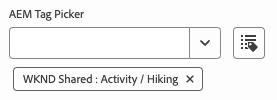
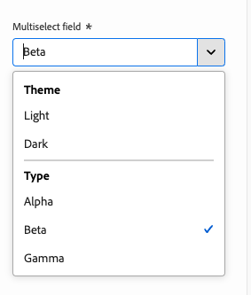

# 模型定义、字段和组件类型 {#field-types}

通过示例了解通用编辑器可在属性边栏中编辑的字段和组件类型。 了解如何通过创建模型定义并链接到组件来检测自己的应用程序。

## 概述 {#overview}

调整自己的应用程序以便与通用编辑器一起使用时，必须检测组件，并定义它们可以在编辑器的属性边栏中操作的字段和组件类型。 可通过创建模型并从组件链接到模型来完成此操作。

本文档概述了模型定义以及可用的字段和组件类型以及示例配置。

>[!TIP]
>
>如果您不熟悉如何针对通用编辑器检测应用程序，请参阅文档 [面向AEM开发人员的通用编辑器概述。](/help/implementing/universal-editor/developer-overview.md)

## 模型定义结构 {#model-structure}

要通过通用编辑器中的属性边栏配置组件，必须存在模型定义并将其链接到组件。

模型定义是一个JSON结构，从模型数组开始。

```json
[
  {
    "id": "model-id",        // must be unique
    "fields": []             // array of fields which shall be rendered in the properties rail
  }
]
```

请参阅 **[字段](#fields)** 部分，以了解有关如何定义 `fields` 数组。

要将模型定义与元件一起使用，请将 `data-aue-model` 属性可以使用。

```html
<div data-aue-resource="urn:datasource:/content/path" data-aue-type="component"  data-aue-model="model-id">Click me</div>
```

## 加载模型定义 {#loading-model}

创建模型后，可将其作为外部文件引用。

```html
<script type="application/vnd.adobe.aue.model+json" src="<url-of-model-definition>"></script>
```

或者，也可以内联定义模型。

```html
<script type="application/vnd.adobe.aue.model+json">
  { ... model definition ... }
</script>
```

## 字段 {#fields}

字段对象具有以下类型定义。

| 配置 | 值类型 | 描述 | 必填 |
|---|---|---|---|
| `component` | `ComponentType` | 组件的呈现器 | 是 |
| `name` | `string` | 需要保留数据的属性 | 是 |
| `label` | `FieldLabel` | 字段的标签 | 是 |
| `description` | `FieldDescription` | 字段描述 | 否 |
| `placeholder` | `string` | 字段的占位符 | 否 |
| `value` | `FieldValue` | 默认值 | 否 |
| `valueType` | `ValueType` | 标准验证，可以是 `string`， `string[]`， `number`， `date`， `boolean` | 否 |
| `required` | `boolean` | 字段是否为必填字段 | 否 |
| `readOnly` | `boolean` | 字段是否为只读 | 否 |
| `hidden` | `boolean` | 默认情况下是否隐藏字段 | 否 |
| `condition` | `RulesLogic` | 显示或隐藏字段的规则，基于 [条件](/help/implementing/universal-editor/customizing.md#conditionally-hide) | 否 |
| `multi` | `boolean` | 字段是否为多字段 | 否 |
| `validation` | `ValidationType` | 字段的验证规则 | 否 |
| `raw` | `unknown` | 组件可以使用的原始数据 | 否 |

### 组件类型 {#component-types}

以下是可用于呈现字段的组件类型。

| 描述 | 组件类型 |
|---|---|
| [AEM标记](#aem-tag) | `aem-tag` |
| [AEM内容](#aem-content) | `aem-content` |
| [布尔型](#boolean) | `boolean` |
| [复选框组](#checkbox-group) | `checkbox-group` |
| [容器](#container) | `container` |
| [日期时间](#date-time) | `date-time` |
| [多选](#multiselect) | `multiselect` |
| [数字](#number) | `number` |
| [单选按钮组](#radio-group) | `radio-group` |
| [引用](#reference) | `reference` |
| [富文本](#rich-text) | `rich-text` |
| [选择](#select) | `select` |
| [选项卡](#tab) | `tab` |
| [文本](#text) | `text` |

#### AEM标记 {#aem-tag}

AEM标记组件类型会启用AEM标记选取器，该选取器可用于将标记附加到组件。

>[!BEGINTABS]

>[!TAB 示例]

```json
{
  "id": "aem-tag-picker",
  "fields": [
    {
      "component": "aem-tag",
      "label": "AEM Tag Picker",
      "name": "cq:tags",
      "valueType": "string"
    }
  ]
}
```

>[!TAB 屏幕快照]



>[!ENDTABS]

#### AEM内容 {#aem-content}

AEM内容组件类型会启用AEM内容选取器，该选取器可用于设置内容引用。

>[!BEGINTABS]

>[!TAB 示例]

```json
{
  "id": "aem-content-picker",
  "fields": [
    {
      "component": "aem-content",
      "name": "reference",
      "value": "",
      "label": "AEM Content Picker",
      "valueType": "string"
    }
  ]
}
```

>[!TAB 屏幕快照]


>[!ENDTABS]

#### 布尔值 {#boolean}

布尔组件类型存储呈现为切换的简单true/false值。 它提供了额外的验证类型。

| 验证类型 | 值类型 | 描述 | 必填 |
|---|---|---|---|
| `customErrorMsg` | `string` | 如果输入的值不是布尔值时将显示的消息 | 否 |

>[!BEGINTABS]

>[!TAB 示例1]

```json
{
  "id": "boolean",
  "fields": [
    {
      "component": "boolean",
      "label": "Boolean",
      "name": "boolean",
      "valueType": "boolean"
    }
  ]
}
```

>[!TAB 示例2]

```json
{
  "id": "another-boolean",
  "fields": [
    {
      "component": "boolean",
      "label": "Boolean",
      "name": "boolean",
      "valueType": "boolean",
      "validation": {
        "customErrorMsg": "Think, McFly. Think!"
      }
    }
  ]
}
```

>[!TAB 屏幕快照]


>[!ENDTABS]

#### 复选框组 {#checkbox-group}

与布尔值类似，复选框组组件类型允许选择多个true/false项目，呈现为多个复选框。

>[!BEGINTABS]

>[!TAB 示例]

```json
{
  "id": "checkbox-group",
  "fields": [
    {
      "component": "checkbox-group",
      "label": "Checkbox Group",
      "name": "checkbox",
      "valueType": "string[]",
      "options": [
        { "name": "Option 1", "value": "option1" },
        { "name": "Option 2", "value": "option2" }
      ]
    }
  ]
}
```

>[!TAB 屏幕快照]


>[!ENDTABS]

#### 容器 {#container}

容器组件类型允许对组件进行分组。 它提供了额外的配置。

| 配置 | 值类型 | 描述 | 必填 |
|---|---|---|---|
| `collapsible` | `boolean` | 容器是否可折叠 | 否 |

>[!BEGINTABS]

>[!TAB 示例]

```json
 {
  "id": "container",
  "fields": [
    {
      "component": "container",
      "label": "Container",
      "name": "container",
      "valueType": "string",
      "collapsible": true,
      "fields": [
        {
          "component": "text-input",
          "label": "Simple Text 1",
          "name": "text",
          "valueType": "string"
        },
        {
          "component": "text-input",
          "label": "Simple Text 2",
          "name": "text2",
          "valueType": "string"
        }
      ]
    }
  ]
}
```

>[!TAB 屏幕快照]


>[!ENDTABS]

#### 内容片段 {#content-fragment}

内容片段选取器可用于选择 [内容片段](/help/sites-cloud/authoring/fragments/content-fragments.md) 及其变体（如果需要）。 它提供了额外的配置。

| 配置 | 值类型 | 描述 | 必填 |
|---|---|---|---|
| `variationName` | `string` | 用于存储所选变量的变量名称。 如果未定义，则不会显示变体选取器 | 否 |

>[!BEGINTABS]

>[!TAB 示例1]

```json
[
  {
    "id": "aem-content-fragment",
    "fields": [
      {
        "component": "aem-content-fragment",
        "name": "picker",
        "label": "Content Fragment Picker",
        "valueType": "string",
        "variationName": "contentFragmentVariation"
      }
    ]
  }
]
```

>[!TAB 屏幕快照]


>[!ENDTABS]

#### 日期时间 {#date-time}

日期时间分量类型允许指定日期、时间或它们的组合。 它提供了其他配置。

| 配置 | 值类型 | 描述 | 必填 |
|---|---|---|---|
| `displayFormat` | `string` | 日期字符串的显示格式 | 是 |
| `valueFormat` | `string` | 存储日期字符串的格式 | 是 |

它还提供额外的验证类型。

| 验证类型 | 值类型 | 描述 | 必填 |
|---|---|---|---|
| `customErrorMsg` | `string` | 出现以下情况时将显示的消息 `valueFormat` 不符合 | 否 |

>[!BEGINTABS]

>[!TAB 示例1]

```json
{
  "id": "date-time",
  "fields": [
    {
      "component": "date-time",
      "label": "Date & Time",
      "name": "date",
      "valueType": "date"
    }
  ]
}
```

>[!TAB 示例2]

```json
{
  "id": "another-date-time",
  "fields": [
    {
      "component": "date-time",
       "valueType": "date-time",
      "name": "field1",
      "label": "Date Time",
      "description": "This is a date time field that stores both date and time.",
      "required": true,
      "placeholder": "YYYY-MM-DD HH:mm:ss",
      "displayFormat": null,
      "valueFormat": null,
      "validation": {
        "customErrorMsg": "Marty! You have to come back with me!"
      }
    },
    {
      "component": "date-time",
      "valueType": "date",
      "name": "field2",
      "label": "Another Date Time",
      "description": "This is another date time field that only stores the date.",
      "required": true,
      "placeholder": "YYYY-MM-DD",
      "displayFormat": null,
      "valueFormat": null,
      "validation": {
        "customErrorMsg": "Back to the future!"
      }
    },
    {
      "component": "date-time",
      "valueType": "time",
      "name": "field3",
      "label": "Yet Another Date Time",
      "description": "This is another date time field that only stores the time.",
      "required": true,
      "placeholder": "HH:mm:ss",
      "displayFormat": null,
      "valueFormat": null,
      "validation": {
        "customErrorMsg": "Great Scott!"
      }
    }
  ]
}
```

>[!TAB 屏幕快照]


>[!ENDTABS]

#### 体验片段 {#experience-fragment}

体验片段选取器可用于选择 [体验片段](/help/sites-cloud/authoring/fragments/experience-fragments.md) 及其变体（如果需要）。 它提供了额外的配置。

| 配置 | 值类型 | 描述 | 必填 |
|---|---|---|---|
| `variationName` | `string` | 用于存储所选变量的变量名称。 如果未定义，则不会显示变体选取器 | 否 |

>[!BEGINTABS]

>[!TAB 示例1]

```json
[
  {
    "id": "aem-experience-fragment",
    "fields": [
      {
        "component": "aem-experience-fragment",
        "name": "picker",
        "label": "Experience Fragment Picker",
        "valueType": "string",
        "variationName": "experienceFragmentVariation"
      }
    ]
  }
]
```

>[!TAB 屏幕快照]


>[!ENDTABS]


#### 多选 {#multiselect}

多选组件类型在下拉列表中显示多个可供选择的项目，包括对可选元素进行分组的功能。

>[!BEGINTABS]

>[!TAB 示例1]

```json
{
  "id": "multiselect",
  "fields": [
    {
      "component": "multiselect",
      "name": "multiselect",
      "label": "Multi Select",
      "valueType": "string",
      "options": [
        { "name": "Option 1", "value": "option1" },
        { "name": "Option 2", "value": "option2" }
      ]
    }
  ]
}
```

>[!TAB 示例2]

```json
{
  "id": "multiselect-grouped",
  "fields": [
    {
      "component": "multiselect",
      "name": "property",
      "label": "Multiselect field",
      "valueType": "string",
      "required": true,
      "maxSize": 2,
      "options": [
        {
          "name": "Theme",
          "children": [
            { "name": "Light", "value": "light" },
            { "name": "Dark",  "value": "dark" }
          ]
        },
        {
          "name": "Type",
          "children": [
            { "name": "Alpha", "value": "alpha" },
            { "name": "Beta", "value": "beta" },
            { "name": "Gamma", "value": "gamma" }
          ]
        }
      ]
    }
  ]
}
```

>[!TAB 屏幕截图]




>[!ENDTABS]

#### 数字 {#number}

数字组件类型允许输入数字。 它提供了其他验证类型。

| 验证类型 | 值类型 | 描述 | 必填 |
|---|---|---|---|
| `numberMin` | `number` | 允许的最小数量 | 否 |
| `numberMax` | `number` | 允许的最大数量 | 否 |
| `customErrorMsg` | `string` | 出现以下情况时将显示的消息 `numberMin` 或 `numberMax` 不符合 | 否 |

>[!BEGINTABS]

>[!TAB 示例1]

```json
{
  "id": "number",
  "fields": [
    {
      "component": "number",
      "name": "number",
      "label": "Number",
      "valueType": "number",
      "value": 0
    }
  ]
}
```

>[!TAB 示例2]

```json
{
  "id": "another-number",
  "fields": [
   {
      "component": "number",
      "valueType": "number",
      "name": "field1",
      "label": "Number Field",
      "description": "This is a number field.",
      "required": true,
      "placeholder": null,
      "validation": {
        "numberMin": 0,
        "numberMax": 88,
        "customErrorMsg": "You also need 1.21 gigawatts."
      }
    }
  ]
}
```

>[!TAB 屏幕快照]


>[!ENDTABS]

#### 单选按钮组 {#radio-group}

单选按钮组组件类型允许从呈现为类似于复选框组的组的组的多个选项中进行互斥选择。

>[!BEGINTABS]

>[!TAB 示例]

```json
{
  "id": "radio-group",
  "fields": [
    {
      "component": "radio-group",
      "label": "Radio Group",
      "name": "radio",
      "valueType": "string",
      "options": [
        { "name": "Option 1", "value": "option1" },
        { "name": "Option 2", "value": "option2" }
      ]
    }
  ]
}
```

>[!TAB 屏幕快照]


>[!ENDTABS]

#### 引用 {#reference}

引用组件类型允许从当前对象引用另一个数据对象。

>[!BEGINTABS]

>[!TAB 示例]

```json
{
  "id": "reference",
  "fields": [
    {
      "component": "reference",
      "label": "Reference",
      "name": "reference",
      "valueType": "string"
    }
  ]
}
```

>[!TAB 屏幕快照]


>[!ENDTABS]

#### 富文本 {#rich-text}

富文本允许多行、富文本输入。 它提供了其他验证类型。

| 验证类型 | 值类型 | 描述 | 必填 |
|---|---|---|---|
| `maxSize` | `number` | 允许的最大字符数 | 否 |
| `customErrorMsg` | `string` | 出现以下情况时将显示的消息 `maxSize` 已超出 | 否 |

>[!BEGINTABS]

>[!TAB 示例1]

```json
{
  "id": "richtext",
  "fields": [
    {
      "component": "richtext",
      "name": "rte",
      "label": "Rich Text",
      "valueType": "string"
    }
  ]
}
```

>[!TAB 示例2]

```json
{
  "id": "another-richtext",
  "fields": [
    {
      "component": "richtext",
      "name": "rte",
      "label": "Rich Text",
      "valueType": "string",
      "validation": {
        "maxSize": 1000,
        "customErrorMsg": "That's about as funny as a screen door on a battleship."
      }
    }
  ]
}
```

>[!TAB 屏幕快照]


>[!ENDTABS]

#### 选择 {#select}

选择组件类型允许从下拉菜单中的预定义选项列表中选择单个选项。

>[!BEGINTABS]

>[!TAB 示例]

```json
{
  "id": "select",
  "fields": [
    {
      "component": "select",
      "label": "Select",
      "name": "select",
      "valueType": "string",
      "options": [
        { "name": "Option 1", "value": "option1" },
        { "name": "Option 2", "value": "option2" }
      ]
    }
  ]
}
```

>[!TAB 屏幕快照]


>[!ENDTABS]

#### 选项卡 {#tab}

选项卡组件类型允许您在多个选项卡上将其他输入字段分组在一起，以改善作者的布局组织。

A `tab` 可以将定义视为数组中的分隔符 `fields`. 之后的一切 `tab` 将被放置在该选项卡上，直到有新的 `tab` 之后，会将以下项目放置到新选项卡上。

如果希望项目出现在所有选项卡上方，则必须在任何选项卡之前定义它们。

>[!BEGINTABS]

>[!TAB 示例]

```json
{
  "id": "tab",
  "fields": [
    {
      "component": "tab",
      "label": "Tab 1",
      "name": "tab1"
    },
    {
      "component": "text-input",
      "label": "Text 1",
      "name": "text1",
      "valueType": "string"
    },
    {
      "component": "tab",
      "label": "Tab 2",
      "name": "tab2"
    },
    {
      "component": "text-input",
      "label": "Text 2",
      "name": "text2",
      "valueType": "string"
    }
  ]
}
```

>[!TAB 屏幕快照]


>[!ENDTABS]

#### 文本 {#text}

文本允许单行文本输入。  它包含其他验证类型。

| 验证类型 | 值类型 | 描述 | 必填 |
|---|---|---|---|
| `minLength` | `number` | 允许的最小字符数 | 否 |
| `maxLength` | `number` | 允许的最大字符数 | 否 |
| `regExp` | `string` | 输入文本必须匹配的正则表达式 | 否 |
| `customErrorMsg` | `string` | 出现以下情况时将显示的消息 `minLength`， `maxLength`，和/或 `regExp` 违反了 | 否 |

>[!BEGINTABS]

>[!TAB 示例1]

```json
{
  "id": "simpletext",
  "fields": [
    {
      "component": "text",
      "name": "text",
      "label": "Simple Text",
      "valueType": "string"
    }
  ]
}
```

>[!TAB 示例2]

```json
{
  "id": "another simpletext",
  "fields": [
    {
      "component": "text",
      "name": "text",
      "label": "Simple Text",
      "valueType": "string",
      "description": "This is a text input with validation.",
      "required": true,
      "validation": {
        "minLength": 1955,
        "maxLength": 1985,
        "regExp": "^foo:.*",
        "customErrorMsg": "Why don't you make like a tree and get outta here?"
      }
    }
  ]
}
```

>[!TAB 屏幕快照]


>[!ENDTABS]
