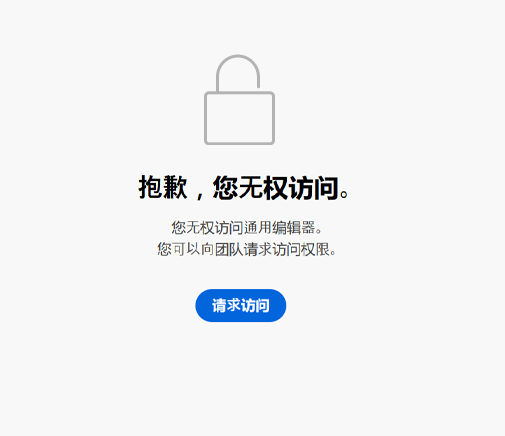

# AEM Universal Editor 快速入门 {#getting-started}

了解如何获取 Universal Editor 访问权限以及如何对第一个 AEM 应用程序插桩以使用 Universal Editor。

>[!TIP]
>
>如果您想深入研究示例，可以查看 [GitHub 上的 Universal Editor 示例应用程序](https://github.com/adobe/universal-editor-sample-editable-app)。

## 载入步骤 {#onboarding}

虽然 Universal Editor 可以编辑来自任何来源的内容，但本文档将以 AEM 应用程序为例。

需要执行大量步骤来载入您的 AEM 应用程序并为其插桩以使用 Universal Editor。

1. [请求访问 Universal Editor。](#request-access)
1. [包括 Universal Editor 核心库。](#core-library)
1. [添加必要的 OSGi 配置。](#osgi-configurations)
1. [在页面上插桩。](#instrument-page)

本文档将引导您完成这些步骤。

## 请求访问 Universal Editor {#request-access}

您首先需要请求访问 Universal Editor。请转到 [https://experience.adobe.com/#/aem/editor](https://experience.adobe.com/#/aem/editor)，登录，然后验证您是否有权访问 Universal Editor。

如果您无权访问，则可通过同一页面上链接的表单请求访问。



单击&#x200B;**请求访问**&#x200B;并按照指示填写表格以请求访问。Adobe 代表将审查您的请求并联系您以讨论您的用例。

## 包括 Universal Editor 核心库 {#core-library}

您的应用程序需要先包含以下依赖项，之后才能插桩以与 Universal Editor 结合使用。

```javascript
@adobe/universal-editor-cors
```

要激活插桩，需要将以下导入添加到 `index.js`。

```javascript
import "@adobe/universal-editor-cors";
```

### 非 React 应用程序的替代项 {#alternative}

如果您没有实施 React 应用程序和/或需要服务器端呈现，替代方法是将以下内容包含到文档正文中。

```html
<script src="https://cdn.jsdelivr.net/gh/adobe/universal-editor-cors/dist/universal-editor-embedded.js" async></script>
```

## 添加必要的 OSGi 配置 {#osgi-configurations}

要能够使用 Universal Editor 通过应用程序编辑 AEM 内容，必须在 AEM 中完成 CORS 和 Cookie 设置。

[必须在 AEM 创作实例上设置以下 OSGi 配置。](/help/implementing/deploying/configuring-osgi.md)

* `com.day.crx.security.token.impl.impl.TokenAuthenticationHandler` 中的 `SameSite Cookies = None`
* 移除 X-FRAME-OPTIONS：`org.apache.sling.engine.impl.SlingMainServlet` 中的 SAMEORIGIN 标头

### com.day.crx.security.token.impl.impl.TokenAuthenticationHandler {#samesite-cookies}

登录令牌 Cookie 必须作为第三方域发送到 AEM。因此，必须将相同站点 Cookie 明确设置为 `None`。

必须在 `com.day.crx.security.token.impl.impl.TokenAuthenticationHandler` OSGi 配置中设置此属性。

```xml
<?xml version="1.0" encoding="UTF-8"?>
<jcr:root xmlns:sling="http://sling.apache.org/jcr/sling/1.0"
          xmlns:jcr="http://www.jcp.org/jcr/1.0" jcr:primaryType="sling:OsgiConfig"
          token.samesite.cookie.attr="None" />
```

### org.apache.sling.engine.impl.SlingMainServlet {#sameorigin}

X-Frame-Options：SAMEORIGIN 阻止在 iframe 中呈现 AEM 页面。移除标头将允许加载页面。

必须在 `org.apache.sling.engine.impl.SlingMainServlet` OSGi 配置中设置此属性。

```xml
<?xml version="1.0" encoding="UTF-8"?>
<jcr:root xmlns:sling="http://sling.apache.org/jcr/sling/1.0"
          xmlns:jcr="http://www.jcp.org/jcr/1.0"
          jcr:primaryType="sling:OsgiConfig"
          sling.additional.response.headers="[X-Content-Type-Options=nosniff]"/>
```

## 在页面上插桩 {#instrument-page}

Universal Editor 服务需要一个[统一资源名称 (URN)](https://en.wikipedia.org/wiki/Uniform_Resource_Name) 来为正在编辑的应用程序内容识别和使用正确的后端系统。因此，需要 URN 模式将内容映射回内容资源。

添加到页面的监测属性主要由 [HTML 微数据](https://developer.mozilla.org/en-US/docs/Web/HTML/Microdata)构成，这是一种行业标准，也可用于使 HTML 更具语义，使 HTML 文档可建立索引等。

### 创建连接 {#connections}

应用程序中使用的连接将作为 `<meta>` 标记存储在页面的 `<head>` 中。

```html
<meta name="urn:adobe:aem:editor:<referenceName>" content="<protocol>:<url>">
```

* `<referenceName>` – 这是一个短名称，可在文档中重复使用以标识连接。例如 `aemconnection`
* `<protocol>` – 这表明要使用的 Universal Editor 持久性服务的持久性插件。例如 `aem`
* `<url>` – 这是保存更改的系统的 URL。例如 `http://localhost:4502`

标识符 `adobe:aem:editor` 表示与 Adobe Universal Editor 相连。

`itemid` 将使用 `urn` 前缀来缩短标识符。

```html
itemid="urn:<referenceName>:<resource>"
```

* `<referenceName>` – 这是 `<meta>` 标记中提到的命名引用。例如 `aemconnection`
* `<resource>` – 这是指向目标系统中资源的指针。例如 AEM 内容路径（如 `/content/page/jcr:content`）

>[!TIP]
>
>有关 Universal Editor 所需的数据属性和类型的更多详细信息，请参阅文档[属性和类型](attributes-types.md)。

### 示例连接 {#example}

```html
<html>
<head>
    <meta name="urn:adobe:aem:editor:aemconnection" content="aem:https://localhost:4502">
    <meta name="urn:adobe:aem:editor:fcsconnection" content="fcs:https://example.franklin.adobe.com/345fcdd">
</head>
<body>
        <aside>
          <ul itemscope itemid="urn:aemconnection:/content/example/list" itemtype="container">
            <li itemscope itemid="urn:aemconnection/content/example/listitem" itemtype="component">
              <p itemprop="name" itemtype="text">Jane Doe</p>
              <p itemprop="title" itemtype="text">Journalist</p>
              
            </li>
 
...
 
            <li itemscope itemid="urn:fcsconnection:/documents/mytext" itemtype="component">
              <p itemprop="name" itemtype="text">John Smith</p>
              <p itemid="urn:aemconnection/content/example/another-source" itemprop="title" itemtype="text">Photographer</p>
              
            </li>
          </ul>
        </aside>
</body>
</html>
```

## 您已准备好使用 Universal Editor {#youre-ready}

您的应用程序现已插桩，可以使用 Universal Editor 了！

请参阅文档[使用 Universal Editor 创作内容](authoring.md)，了解内容作者使用 Universal Editor 创建内容是多么轻松和直观。

## 其他资源 {#additional-resources}

要了解有关 Universal Editor 的更多信息，请参阅这些文档。

* [通用编辑器简介](introduction.md)  — 了解通用编辑器如何支持编辑任何实施中任何内容的任何方面，以便您能够提供卓越的体验、提高内容速度并提供一流的开发人员体验。
* [使用 Universal Editor 创作内容](authoring.md) – 了解内容作者使用 Universal Editor 创建内容是多么轻松和直观。
* [使用 Universal Editor 发布内容](publishing.md) – 了解 Universal Visual Editor 如何发布内容以及您的应用程序如何处理发布的内容。
* [Universal Editor 架构](architecture.md) – 了解 Universal Editor 的架构以及数据如何在其服务和层之间流动。
* [属性和类型](attributes-types.md) – 了解 Universal Editor 所需的数据属性和类型。
* [Universal Editor 身份验证](authentication.md) – 了解 Universal Editor 如何进行身份验证。
