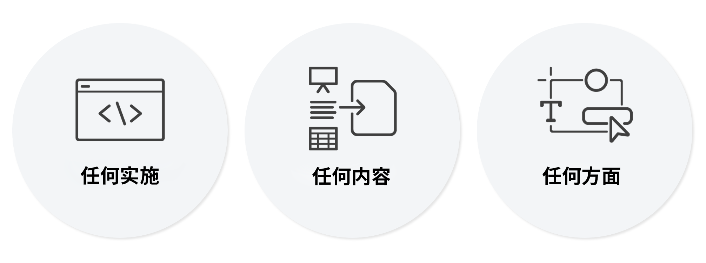

# Universal Editor 简介 {#introduction}

通用编辑器是一个通用的可视化编辑器，它是Adobe Experience Manager Sites的一部分。 它使作者能够对任何Headless或Headful体验进行“所见即所得”(WYSIWYG)编辑。 了解它如何帮助内容作者提供卓越的体验以及它如何为开发人员提供无与伦比的自由。

## 背景 {#background}

通用编辑器提供了高效、直观的上下文创作体验，只需进行最少的培训。 利用它，作者可以直接在Web体验的上下文中管理其内容，以及它向访客显示的确切方式。 作为真正的编辑器即服务，并且总体上更灵活，它打算最终取代页面编辑器。

作者得益于通用编辑器的灵活性，因为它支持对所有形式的AEM内容进行相同的一致可视化编辑：内容片段和页面组件同样可以进行就地编辑和布局合成。 当在Web体验中并排显示时，甚至可以编辑这两种形式的内容，而作者不必切换上下文。 与AEM中以前的编辑器相比，这是一个巨大的改进，以前的编辑器仅支持一种类型的内容。

开发人员受益于通用编辑器的多功能性，因为它也支持实施之间的真正分离。 它允许开发人员利用他们选择的几乎任何框架或架构，而无需施加任何SDK或技术限制。 这种灵活性甚至可以轻松为通用编辑器检测现有Web应用程序，而无需重新构建它们。

## 真正的通用 {#universal}

可对 Universal Editor 进行插桩以用于任意实施、任何内容以及内容的任何方面。

### 任意实施 {#any-implementation}

由于可以通过多种不同方式构建体验，因此，任何实施都可以利用 Universal Editor，以便作者能够执行上下文编辑。

用户一般认为 Headless 实施仅限作者编辑基于表单的 UI 中的所有内容，但 Universal Editor 并非如此

利用 Universal Editor 的实施的要求非常直接，并且支持以下内容：

* **任何架构**  — 服务器端渲染、边缘端渲染、客户端渲染等。
* **任何框架** - Vanilla AEM或任何第三方框架，如React、Next.js、Angular等。
* **任何托管** – 可以本地托管到 AEM，或托管于远程域上

### 任何内容 {#any-content}

内容作者应拥有以前由 AEM 页面编辑器提供的同样强大的编辑体验。不过，Universal Editor 允许内容作者在上下文中可视化地编辑&#x200B;**任何**&#x200B;内容，并支持：

* **AEM 页面结构** – `cq:Pages` 的嵌套 `cq:Components`，包括体验片段
* **AEM内容片段**  — 编辑内容片段中显示在体验上下文中的内容。
* **文档** – 概念验证表明 Word、Excel、Google 文档或 Markdown 文档也可以用相同的方式编辑（这是 WIP）。

### 任何方面 {#any-aspect}

对于内容作者来说，内容不仅仅与包含的信息有关，还与信息的呈现和接收方式有关。内容附带了额外的元数据和插桩规则，Universal Editor 可以理解这些规则并进行编辑，包括：

* **应用布局和样式**  — 通过使用样式系统，营销从业者和内容作者可以为其内容应用不同的样式，并为内容创建不同的布局，例如列、轮盘、选项卡、折叠等。

## 价值 {#value}

通过将内容编辑体验与任何特定的内容交付系统分离，编辑器变得真正通用而灵活，可让内容作者提供卓越的体验，提升内容速度并提供最先进的开发人员体验。

* **提供卓越的体验** – 为了使从业者能够为访客创造引人入胜的体验，Universal Editor 允许从业人员在预览上下文中创建和编辑内容。这使他们创建的内容既能适合体验设计，又能构成对访客有意义的历程。
* **提升内容速度** – 为了简化从业人员的管理工作流程，Universal Editor 允许在预览中编辑内容，通过仅显示与该上下文相关的选项来指导从业人员，并使工作流程独立于内容源。
* **最先进的开发人员体验** – 为了支持真实的异构应用环境，Universal Editor 完全解耦且与技术无关，允许开发人员使用他们喜欢的技术堆栈来实施体验。

## 内容片段编辑器中的 Universal Editor {#universal-editor-content-fragment-editor}

乍一看，Universal Editor 和内容片段编辑器似乎提供了类似的编辑功能。但这些编辑器却提供了完全不同的功能，并且它们为营销从业人员完成了不同的作业。

### 内容片段编辑器 {#content-fragment-editor}

营销从业人员希望创建内容而不必关注其布局，以便它能够在多种体验环境中重复使用。

* 要完成的基本作业是扩展内容策略。

### Universal Editor {#universal-editor}

营销从业人员想创建根据给定上下文的布局定制的内容，以提供卓越的体验。

* 要完成的基本作业是与读者建立令人信服的联系。

## 限制 {#limitations}

当您探索通用编辑器并在自己的项目中进一步实施时，请牢记以下限制。

* 不超过25个AEM资源（内容片段、页面、体验片段、资产等） 应作为单个页面上的检测引用。
* AEMas a Cloud Service是唯一受支持的AEM后端。
* AEMas a Cloud Service版本 `2023.8.13099` 或更高版本为必填项。
* 内容作者必须拥有自己的个人Experience Cloud帐户。
* 支持的浏览器包括Chrome和Edge

## 其他资源 {#additional-resources}

要了解有关 Universal Editor 的更多信息，请参阅这些文档。

* [使用 Universal Editor 创作内容](/help/sites-cloud/authoring/universal-editor/authoring.md) – 了解内容作者使用 Universal Editor 创建内容是多么轻松和直观。
* [使用 Universal Editor 发布内容](/help/sites-cloud/authoring/universal-editor/publishing.md) – 了解 Universal Editor 如何发布内容以及您的应用程序如何处理发布的内容。
* [AEM Universal Editor 快速入门 ](getting-started.md) – 了解如何获取 Universal Editor 访问权限以及如何对第一个 AEM 应用程序插桩以使用 Universal Editor。
* [Universal Editor 架构](architecture.md) – 了解 Universal Editor 的架构以及数据如何在其服务和层之间流动。
* [属性和类型](attributes-types.md) – 了解 Universal Editor 所需的数据属性和类型。
* [Universal Editor 身份验证](authentication.md) – 了解 Universal Editor 如何进行身份验证。
