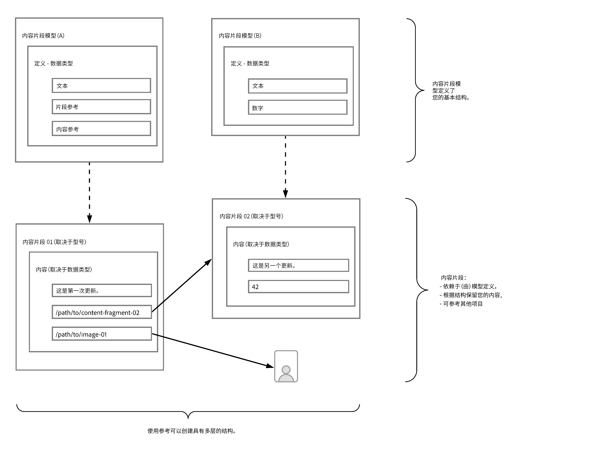

# 了解使用AEM实现无头的内容建模基础知识 {#content-modeling-headless-basics}

## 迄今为止的故事 {#story-so-far}

在[AEM无头内容架构师历程](overview.md)的开头， [简介](introduction.md)介绍了与无头内容建模相关的基本概念和术语。

本文以这些内容为基础，以便您了解如何为AEM无头项目构建内容模型。

## 目标 {#objective}

* **受众**:初学者
* **目标**:介绍无头CMS内容建模的概念

## 使用内容片段模型进行内容建模 {#architect-content-fragment-models}

内容（数据）建模是一组已建立的技术，通常在开发关系数据库时使用，因此内容建模对AEM Headless意味着什么？

### 为什么？ {#why}

要确保您的应用程序能够始终如一地高效地从AEM请求和接收所需内容，必须对此内容进行结构化。

这意味着您的应用程序事先知道响应的形式，因此知道如何处理。 这比接收自由格式内容要容易得多，后者必须进行解析以确定内容包含的内容，因此，还要确定内容的使用方式。

### 如何介绍？ {#how}

AEM使用内容片段来提供向应用程序无头交付内容所需的结构。

内容模型的结构是：

* 通过定义内容片段模型实现，
* 用作内容生成所用内容片段的基础。

>[!NOTE]
>
>内容片段模型还用作AEM GraphQL架构的基础，用于检索内容 — 有关更多信息，请参阅开发人员历程。

对内容的请求使用AEM GraphQL API（标准GraphQL API的自定义实施）进行。 AEM GraphQL API允许应用程序对内容片段执行（复杂）查询，每个查询均根据特定的模型类型。

然后，您的应用程序可以使用返回的内容。

## 使用内容片段模型创建结构 {#create-structure-content-fragment-models}

内容片段模型提供了多种机制，允许您定义内容的结构。

内容片段模型描述实体。

>[!NOTE]
>必须在配置浏览器中启用内容片段功能，才能创建新模型。

>[!TIP]
>
>应该命名模型，以便内容作者知道在创建内容片段时要选择的模型。

在模型中：

1. **数据** 类型允许您定义单个属性。例如，将包含教师姓名的字段定义为&#x200B;**Text**，其服务年限定义为&#x200B;**Number**。
1. 数据类型&#x200B;**内容引用**&#x200B;和&#x200B;**片段引用**&#x200B;允许您创建与AEM中其他内容的关系。
1. **片段引用**&#x200B;数据类型允许您通过嵌套内容片段（根据模型类型）来实现多级结构。 这对于内容建模至关重要。

例如：

## 数据类型 {#data-types}

AEM提供了以下数据类型来为内容建模：

* 单行文本
* 多行文本
* 数字
* 布尔型
* 日期和时间
* 枚举
* 标记
* 内容引用
* 片段引用
* JSON 对象

>[!NOTE]
>
>有关更多详细信息，请参阅内容片段模型 — 数据类型。

## 引用和嵌套内容 {#references-nested-content}

两种数据类型提供对特定片段外部内容的引用：

* **内容**
引用这提供了对任何类型的其他内容的简单引用。例如，您可以引用指定位置的图像。

* **片段**
引用此操作提供对其他内容片段的引用。此类引用用于创建嵌套内容，其中介绍了为内容建模所需的关系。
数据类型可配置为允许片段作者执行以下操作：
   * 直接编辑引用的片段。
   * 根据相应的模型创建新内容片段

>[!NOTE]
>
>您还可以使用文本块中的链接来创建临时引用。

## 结构级别（嵌套片段） {#levels-of-structure-nested-fragments}

对于对&#x200B;**片段引用**&#x200B;数据类型进行内容建模，可以创建多个级别的结构和关系。

通过此参考，您可以&#x200B;*连接*&#x200B;各种内容片段模型以表示相互关系。 这允许无头应用程序跟踪连接并根据需要访问内容。

>[!NOTE]
>
>应谨慎使用此方法，最佳做法可根据需要定义为&#x200B;*嵌套，但应尽量定义*&#x200B;嵌套。

片段引用就是这样做的 — 它们允许您引用其他片段。

例如，您可能定义了以下内容片段模型：

* 城市
* 公司
* 人员
* 奖项

看起来很简单，但公司当然有CEO和员工…….这些都是人，每个人都定义为人。

一个人可以获得一个奖（或两个奖）。

* 我的公司 — 公司
   * 首席执行官 — 人员
   * 员工 — 人员
      * 个人奖 — 奖

这只是开始。 根据复杂性，奖项可以是特定于公司的，或者公司可以在特定的金融城设立其主要办事处。

使用片段引用可以表示这些相互关系，正如您（架构师）、内容作者和无标题应用程序所理解的那样。

## 下一步 {#whats-next}

现在，您已经学习了基础知识，接下来的步骤是[了解如何在AEM](model-structure.md)中创建内容片段模型。 这将介绍和讨论各种可用的参照，以及如何使用片段引用创建结构级别 — 无头建模的关键部分。

## 其他资源 {#additional-resources}

* [内容片段模型](/help/assets/content-fragments/content-fragments-models.md)

   * [内容片段模型 — 数据类型](/help/assets/content-fragments/content-fragments-models.md#data-types)

* [创作概念](/help/sites-cloud/authoring/getting-started/concepts.md)

* [基本操作](/help/sites-cloud/authoring/getting-started/basic-handling.md)  — 此页面主要基于站点控制台，但 **** 许多/大多数功能也与在“资产”控制台下创 **作内** 容片 **** 段相关。

* [使用内容片段](/help/assets/content-fragments/content-fragments.md)
