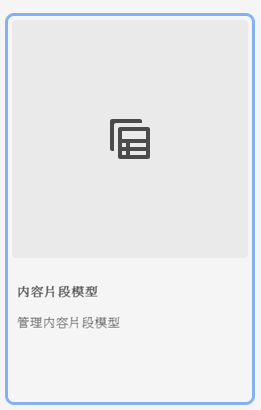

# 了解如何在AEM中创建内容片段模型 {#architect-headless-content-fragment-models}

## 迄今为止的故事 {#story-so-far}

在[AEM无头内容创作历程](overview.md)的开头， [使用AEM的无头内容建模基础知识](basics.md)介绍了与无头创作相关的基本概念和术语。

本文以这些内容为基础，以便您了解如何为您的AEM无头项目创建您自己的内容片段模型。

## 目标 {#objective}

* **受众**:初学者
* **目标**:使用内容片段模型为无头CMS建模内容的概念和机制。

<!-- which persona does this? -->
<!-- and who allows the configuration on the folders? -->

<!--
## Enabling Content Fragment Models {#enabling-content-fragment-models}

At the very start you need to enable Content Fragment Models for your site, this is done in the Configuration Browser; under Tools -> General -> Configuration Browser. You can either select to configure the global entry, or create a new configuration. For example:

>[!NOTE]
>
>See Additional Resources - Content Fragments in the Configuration Browser
-->

## 创建内容片段模型 {#creating-content-fragment-models}

然后，可以创建内容片段模型并定义结构。 这可以在工具 — >资产 — >内容片段模型下完成。

选择此选项后，导航到模型的位置，然后选择&#x200B;**创建**。 您可以在此输入各种关键详细信息。

默认情况下，会激活选项&#x200B;**启用模型**。 这意味着，当您保存模型后，即可使用（在创建内容片段时）。 如果需要，您可以停用此模型 — 有机会稍后启用（或禁用）现有模型。

使用&#x200B;**创建**&#x200B;确认，然后可以&#x200B;**打开**&#x200B;模型以开始定义结构。

## 定义内容片段模型 {#defining-content-fragment-models}

首次打开新模型时，您将看到：左侧有一个较大的空白，右侧有一长串&#x200B;**数据类型**:

那么，该怎么办？

您可以将&#x200B;**数据类型**&#x200B;的实例拖动到左侧空格上 — 您已经在定义模型！

添加数据类型后，将需要为该字段定义&#x200B;**属性**。 具体取决于所使用的类型。 例如：

您可以添加所需数量的字段。 例如：

### 您的内容作者 {#your-content-authors}

内容作者看不到用于创建模型的实际数据类型和属性。 这意味着您可能必须提供有关它们如何完成特定字段的帮助和信息。 有关基本信息，您可以使用字段标签和默认值，但更复杂的情况可能需要考虑项目特定文档。

>[!NOTE]
>
>请参阅其他资源 — 内容片段模型。

## 管理内容片段模型 {#managing-content-fragment-models}

<!-- needs more details -->

管理内容片段模型涉及：

* 启用（或禁用）这些片段 — 这样可在创建内容片段时供作者使用。
* 删除 — 始终需要删除，但您需要了解删除已用于内容片段（特别是已发布的片段）的模型。

## 发布 {#publishing}

<!-- needs more details -->

在发布任何相关内容片段时/之前，需要发布内容片段模型。

>[!NOTE]
>
>如果作者尝试发布模型尚未发布的内容片段，则会显示一个选择列表以指示该情况，并且模型将随该片段一起发布。

>[!NOTE]
>
>锁定（已发布）内容片段模型功能处于测试阶段。

发布模型后，该模型会立即&#x200B;*locked*&#x200B;进入创作的只读模式。 这旨在防止更改会导致现有GraphQL架构和查询出错，尤其是在发布环境中。 该参数在控制台中由&#x200B;**Locked**&#x200B;指示。

当模型为&#x200B;**Locked**（在只读模式下）时，可以查看模型的内容和结构，但不能直接编辑它们；但是，您可以从控制台或模型编辑器中管理&#x200B;**锁定的**&#x200B;模型。

## 下一步 {#whats-next}

现在，您已经学习了基础知识，接下来的步骤是开始创建您自己的内容片段模型。

## 其他资源 {#additional-resources}

* [创作概念](/help/sites-cloud/authoring/getting-started/concepts.md)

* [基本操作](/help/sites-cloud/authoring/getting-started/basic-handling.md)  — 此页面主要基于站点控制台，但许多/大多数功能也与导航到“资产”控制台下的内容片段模型并对其 **** 执行 **操作相关**  **** 联。

* [使用内容片段](/help/assets/content-fragments/content-fragments.md)

   * [内容片段模型](/help/assets/content-fragments/content-fragments-models.md)

      * [定义内容片段模型](/help/assets/content-fragments/content-fragments-models.md#defining-your-content-fragment-model)

      * [启用或禁用内容片段模型](/help/assets/content-fragments/content-fragments-models.md#enabling-disabling-a-content-fragment-model)

      * [允许在Assets文件夹中使用内容片段模型](/help/assets/content-fragments/content-fragments-models.md#allowing-content-fragment-models-assets-folder)

      * [删除内容片段模型](/help/assets/content-fragments/content-fragments-models.md#deleting-a-content-fragment-model)

      * [发布内容片段模型](/help/assets/content-fragments/content-fragments-models.md#publishing-a-content-fragment-model)

      * [取消发布内容片段模型](/help/assets/content-fragments/content-fragments-models.md#unpublishing-a-content-fragment-model)

      * [锁定（已发布）内容片段模型](/help/assets/content-fragments/content-fragments-models.md#locked-published-content-fragment-models)

* 入门指南

   * [创建内容片段模型无头快速入门指南](/help/implementing/developing/headless/getting-started/create-content-model.md)
