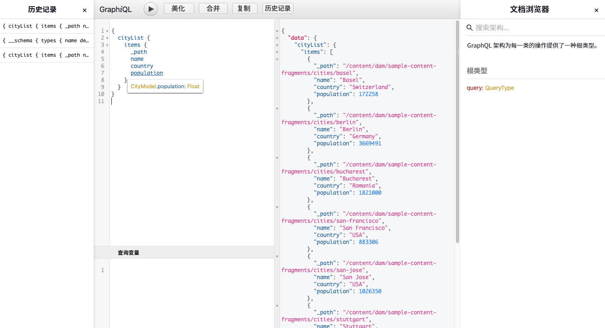

# 如何通过 AEM 传递 API 访问您的内容 {#access-your-content}

在 [AEM Headless 开发人员历程](overview.md)的这一部分中，您可以了解如何使用 GraphQL 查询访问内容片段的内容并将其提供给您的应用程序（Headless 传递）。

## 迄今为止的故事 {#story-so-far}

在 AEM Headless 历程的上一文档[如何为内容建模](model-your-content.md)中，您已学习 AEM 中内容建模的基础知识，因此，您现在应了解如何为您的内容结构建模，然后使用 AEM 内容片段模型和内容片段实施该结构：

* 了解与内容建模相关的概念和术语。
* 了解为什么需要进行内容建模才能进行 Headless 内容传递。
* 了解如何使用 AEM 内容片段模型实施此结构（以及使用内容片段创作内容）。
* 了解如何为内容建模；带基本示例的准则。

本文基于这些基础知识编写，以便您了解如何使用 AEM GraphQL API 访问 AEM 中现有的 Headless 内容。

* **受众**：初学者
* **目标**：了解如何使用 AEM GraphQL 查询来访问内容片段的内容：
   * 介绍 GraphQL 和 AEM GraphQL API。
   * 深入了解 AEM GraphQL API 的详细信息。
   * 查看一些示例查询以实际工作原理。

## 您想访问您的内容？ {#so-youd-like-to-access-your-content}

那么...您已获得所有这些结构整齐的内容（在内容片段中），并且正等待为您的新应用程序提供信息。问题是如何做到这一点？

您需要通过一种方式来锁定特定的内容，选择所需内容并将其返回到您的应用程序以供进一步处理。

借助 Adobe Experience Manager (AEM) as a Cloud Service，您可以使用 AEM GraphQL API 选择性地访问您的内容片段以仅返回您需要的内容。这意味着您可以实施结构化内容的 Headless 传递以便在您的应用程序中使用。

>[!NOTE]
>
>AEM GraphQL API 是基于标准 GraphQL API 规范的自定义实施。

## GraphQL – 简介 {#graphql-introduction}

GraphQL 是一种开源规范，它提供：

* 一种查询语言，可让您从结构化对象中选择特定内容。
* 一个运行库，用于使用结构化内容实施这些查询。

GraphQL 是一个强类型 API。这意味着，*所有*&#x200B;内容必须按类型清晰地编排和组织，以便 GraphQL 能够&#x200B;*理解*&#x200B;访问内容和访问方式。数据字段将在 GraphQL 架构中定义，该架构定义了内容对象的结构。

之后，GraphQL 端点提供响应 GraphQL 查询的路径。

所有这一切意味着，您的应用程序可以准确、可靠和高效地选择它需要的内容（仅在与 AEM 结合使用时需要的内容）。

>[!NOTE]
>
>请参阅 *GraphQL*.org 和 *GraphQL*.com。

<!--
## AEM and GraphQL {#aem-graphql}

GraphQL is used in various locations in AEM; for example:

* Content Fragments
  * A customized API has been developed for this use-case (Headless Delivery to your app).
    * This is the AEM GraphQL API.
* Commerce
  * AEM Commerce consumes data from a Commerce platform via GraphQL.
  * There are GraphQL integrations between AEM and various third-party commerce solutions, used with the extension hooks provided by the CIF Core Components.
    * This does not use the AEM GraphQL API.

>[!NOTE]
>
>This step of the Headless Journey is only concerned with the AEM GraphQL API and Content Fragments.
-->

## AEM GraphQL API {#aem-graphql-api}

AEM GraphQL API 是基于标准 GraphQL API 规范的自定义版本，经过专门配置以允许您对内容片段执行（复杂）查询。

使用内容片段，因为内容是根据内容片段模型构建的。这将满足 GraphQL 的基本要求。

* 内容片段模型由一个或多个字段构成。
   * 根据数据类型定义每个字段。
* 内容片段模型用于生成相应的 AEM GraphQL 架构。

为了实际访问 GraphQL for AEM（和内容），可使用端点提供访问路径。

然后，您的应用程序可以使用通过 AEM GraphQL API 返回的内容。

为了帮助您直接输入和测试查询，标准 GraphiQL 接口的实施也可用于 AEM GraphQL（这可以与 AEM 一起安装）。它提供了诸如语法突出显示、自动完成、自动建议等功能，以及历史记录和在线文档。

>[!NOTE]
>
>AEM GraphQL API 实施基于 GraphQL Java 库。

<!--
### Use Cases for Author and Publish Environments {#use-cases-author-publish-environments}

The use cases for the AEM GraphQL API can depend on the type of AEM as a Cloud Service environment:

* Publish environment; used to: 
  * Query content for JS application (standard use-case)

* Author environment; used to: 
  * Query content for "content management purposes":
    * GraphQL in AEM as a Cloud Service is currently a read-only API.
    * The REST API can be used for CR(u)D operations.
-->

## 用于 AEM GraphQL API 的内容片段 {#content-fragments-use-with-aem-graphql-api}

内容片段可作为 GraphQL for AEM 架构和查询的基础，如下所示：

* 它们允许您设计、创建、组织和发布独立于页面的内容，可以 Headless 方式传递这些内容。
* 它们基于内容片段模型，该模型使用一系列数据类型预定义了结果片段的结构。
* 可使用定义模型时提供的片段引用数据类型来实现额外的结构层。

### 内容片段模型 {#content-fragments-models}

这些内容片段模型：

* 一旦&#x200B;**启用**，用于生成架构。
* 提供 GraphQL 所需的数据类型和字段。它们确保您的应用程序仅请求可能的内容，并接收预期内容。
* 数据类型&#x200B;**片段引用**&#x200B;可在模型中使用来引用其他内容片段，因此可引入其他级别的结构。

### 片段引用 {#fragment-references}

**片段引用**&#x200B;和&#x200B;**片段引用 UUID**：

* 是在定义内容片段模型时可用的特定数据类型。
* 引用另一个片段，具体取决于特定的内容片段模型。
* 让您依次创建和检索结构化数据。

   * 定义为&#x200B;**多源**，则主片段可以引用（检索）多个子片段。

## 实际使用 AEM GraphQL API {#actually-using-aem-graphiql}

### 初始设置 {#initial-setup}

在开始查询您的内容之前，您需要：

* 启用端点
   * 使用“工具” > “常规” > “GraphQL”
   * [启用 GraphQL 端点](/help/headless/graphql-api/graphql-endpoint.md)
      * 这也将启用 GraphiQL IDE。

### 示例结构 {#sample-structure}

要在查询中实际使用 AEM GraphQL API，我们可以使用两个非常基本的内容片段模型结构：

* 公司
   * 姓名 - 文本
   * CEO（人员）– 片段引用
   * 员工（人员）– 片段引用
* 人员
   * 姓名 – 文本
   * 名字 – 文本

如您所见，“CEO”和“员工”字段引用“人员”片段。

使用片段模型：

* 在内容片段编辑器中创建内容时
* 生成您将查询的 GraphQL 架构

### 用于测试查询的位置 {#where-to-test-your-queries}

可以在 GraphiQL 接口中输入查询。您可以通过以下任一方式访问查询编辑器：

* **工具** > **常规** > **GraphQL 查询编辑器**
* 直接；例如，`http://localhost:4502/aem/graphiql.html`



### 查询快速入门 {#getting-Started-with-queries}

直接查询用于返回“公司”架构中所有条目的名称。可在此处请求所有公司名称的列表：

```xml
query {
  companyList {
    items {
      name
    }
  }
}
```

略微复杂一点的查询用于选择所有姓名不是“Jobs”的人员。这将从所有人员中筛选出姓名不是 Jobs 的人员。这是使用 EQUALS_NOT 运算符实现的（还有更多）：

```xml
query {
  personList(filter: {
    name: {
      _expressions: [
        {
          value: "Jobs"
          _operator: EQUALS_NOT
        }
      ]
    }
  }) {
    items {
      name
      firstName
    }
  }
}
```

您还可以构建更复杂的查询。例如，针对所有至少有一位员工的姓名为“Smith”的公司的查询。此查询演示了针对姓名为“Smith”的任意人员的筛选，并跨两个嵌套片段返回信息：

```xml
query {
  companyList(filter: {
    employees: {
      _match: {
        name: {
          _expressions: [
            {
              value: "Smith"
            }
          ]
        }
      }
    }
  }) {
    items {
      name
      ceo {
        name
        firstName
      }
      employees {
        name
        firstName
      }
    }
  }
}
```

有关如何使用 AEM GraphQL API 以及配置必要元素的完整详细信息，您可以引用：

* 了解如何将 GraphQL 与 AEM 结合使用
* 示例内容片段结构
* 了解如何将 GraphQL 与 AEM 结合使用 – 示例内容和查询

## 后续内容 {#whats-next}

现在您已了解如何使用 AEM GraphQL API 访问和查询 Headless 内容，您现在可以[了解如何使用 REST API 访问和更新内容片段的内容](update-your-content.md)。

## 其他资源 {#additional-resources}

* [Adobe Experience Manager as a Cloud Service API](https://developer.adobe.com/experience-cloud/experience-manager-apis/)
* [GraphQL.org](https://graphql.org)
   * [架构](https://graphql.org/learn/schema/)
   * [变量](https://graphql.org/learn/queries/#variables)
   * [GraphQL Java 库](https://graphql.org/code/#java)
* [GraphiQL](https://graphql.org/learn/serving-over-http/#graphiql)
* [了解如何将 GraphQL 与 AEM 结合使用](/help/headless/graphql-api/content-fragments.md)
   * [启用 GraphQL 端点](/help/headless/graphql-api/graphql-endpoint.md)
   * [安装 AEM GraphiQL 接口](/help/headless/graphql-api/graphiql-ide.md)
* [示例内容片段结构](/help/headless/graphql-api/sample-queries.md#content-fragment-structure-graphql)
* [了解如何将 GraphQL 与 AEM 结合使用 – 示例内容和查询](/help/headless/graphql-api/sample-queries.md)
   * [示例查询 – 一个特定城市片段](/help/headless/graphql-api/sample-queries.md#sample-single-specific-city-fragment)
   * [元数据的示例查询 – 列出标题为 GB 的奖项的元数据](/help/headless/graphql-api/sample-queries.md#sample-metadata-awards-gb)
   * [示例查询 – 具有指定变体的所有城市](/help/headless/graphql-api/sample-queries.md#sample-cities-named-variation)
* [在配置浏览器中启用内容片段功能](/help/sites-cloud/administering/content-fragments/setup.md#enable-content-fragment-functionality-configuration-browser)
* [使用内容片段](/help/sites-cloud/administering/content-fragments/overview.md)
   * [内容片段模型](/help/sites-cloud/administering/content-fragments/managing-content-fragment-models.md)
   * [JSON 输出](/help/assets/content-fragments/content-fragments-json-preview.md)
* [了解跨源资源共享 (CORS)](https://experienceleague.adobe.com/docs/experience-manager-learn/foundation/security/understand-cross-origin-resource-sharing.html?lang=zh-Hans#understand-cross-origin-resource-sharing-(cors))
* [GraphQL 持久化查询 - 在 Dispatcher 中启用缓存](/help/headless/deployment/dispatcher-caching.md)
* [为服务器端 API 生成访问令牌](/help/implementing/developing/introduction/generating-access-tokens-for-server-side-apis.md)
* [AEM Headless 快速入门](https://experienceleague.adobe.com/docs/experience-manager-learn/getting-started-with-aem-Headless/graphql/overview.html?lang=zh-Hans) - 一个简短的视频教程系列，概述了如何使用 AEM 的 Headless 功能，包括内容建模和 GraphQL。
