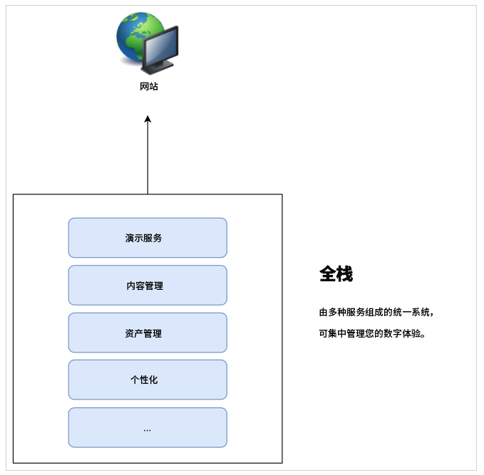
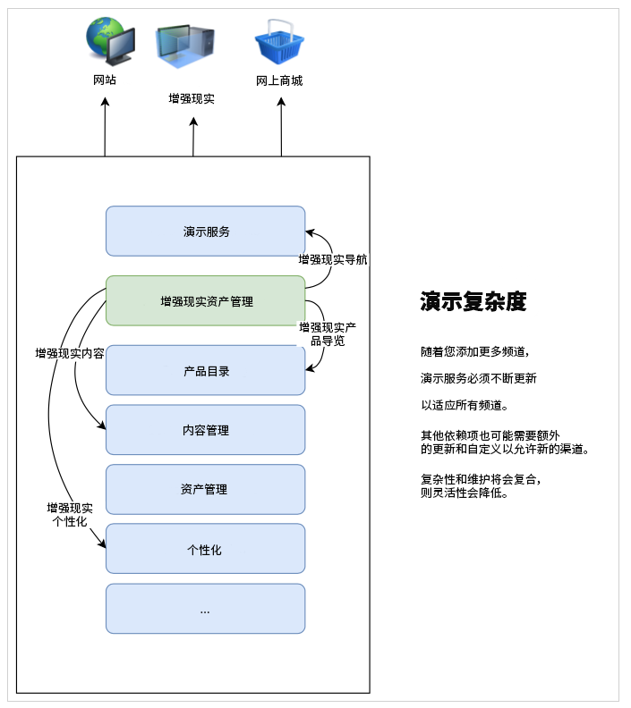
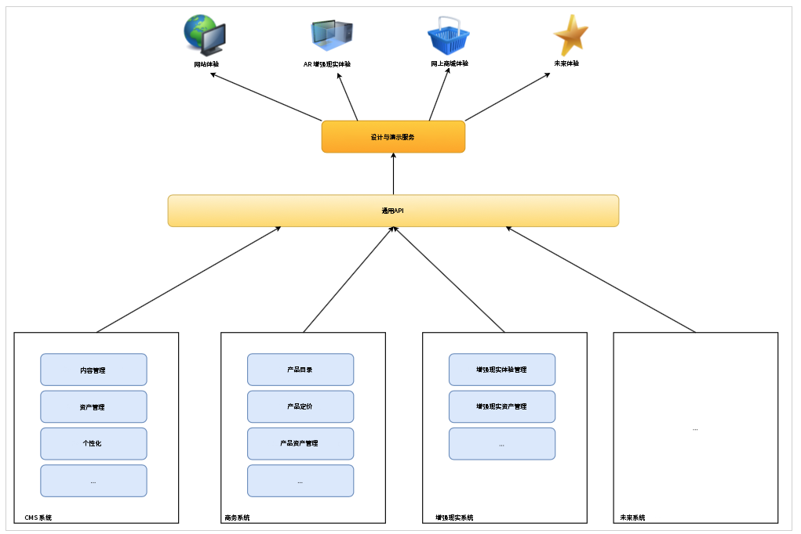

# 了解CMS无头开发{#learn-about}

在[AEM无头开发人员历程的这一部分中，](overview.md)了解无头技术以及使用无头技术的原因。

## 目标 {#objective}

本文档可帮助您了解无标题内容交付以及应使用它的原因。 阅读后，您应该：

* 了解无头内容交付的基本概念和术语
* 了解为何需要无头
* 在高级别了解无头概念的使用方式及其相互关系

## 全栈内容交付{#full-stack}

自从易于使用的大型内容管理系统(CMS)兴起以来，各公司一直利用它们作为管理报文传送、品牌推广和通信的中心位置。 将CMS用作管理体验的中心点，通过消除在不同系统中重复任务的需要，提高了效率。

在全栈CMS中，用于处理内容的所有功能都在CMS中。 系统的功能构成了CMS堆栈的不同组件。 全栈解决方案具有许多优势。

* 您有一个系统需要维护。
* 内容是集中管理的。
* 系统的所有服务都已集成。
* 内容创作是无缝的。

因此，如果您想要添加新渠道或支持新类型的体验，则可以在堆栈中插入一个（或多个）新组件，并且只有一个位置进行更改。

堆栈中依赖项的复杂性会很快变得明显，因为您发现堆栈中的其他项目可能需要调整以适应更改。

## 全栈交付限制 {#limits}

全栈方法本身就会创建一个思洛存储器，所有体验都可以在一个系统中着陆。 更改或添加思洛存储器的一个组件需要更改其他组件，这些更改会耗费大量时间且成本高昂。

在传统设置中，呈现系统往往与CMS紧密相连，这一点尤为明显。 任何新渠道通常都意味着对呈现系统的更新，这可能会影响所有其他渠道。

当您花费更多精力在堆栈的所有组件之间协调更改时，此自然容器的限制会变得显而易见。

无论是平台还是接触点，用户都期望获得参与度，这要求您在提供体验的方式上保持灵活性。  这种多渠道方法是数字体验的标准，在某些情况下，全栈方法可能会被证明不灵活。

## 无头{#the-head}中的头

任何系统的头通常是该系统的输出渲染器，通常以GUI或其他图形输出的形式。

例如，无头服务器可能位于服务器机房的机架中，且未连接显示器。 要访问它，您必须远程连接到它。 在这种情况下，监视器是负责呈现服务器输出的头。 作为服务的使用者，在远程连接到该服务时，请提供您自己的头（显示器）。

当我们讨论无头CMS时，CMS会管理内容并继续向消费者提供内容。 但是，无头CMS仅以标准化方式传送&#x200B;**内容**，从而忽略最终输出渲染，将内容的&#x200B;**表示**&#x200B;保留给消费服务。

消费性服务(无论是AR体验、网店、移动体验、渐进式Web应用程序(PWA)等)从无头CMS中获取内容并提供自己的呈现。 他们负责为您的内容提供自己的头脑。

省略头部通过消除复杂性来简化CMS。 这样做还会将呈现内容的责任转移到实际需要内容且通常更适合此类呈现的服务上。

## 解耦 {#decoupling}

通过公开一组功能强大且灵活的应用程序编程接口(API)，您的所有体验都可以利用这些接口来实现无头交付。 API是服务之间的通用语言，通过标准化的内容交付在内容级别将它们绑定在一起，但允许它们灵活地实施自己的解决方案。

无头是一个将内容与其演示内容分离的示例。 或者从更宽泛的意义上讲，将前端与服务堆栈的后端分离。 在无头设置中，呈现系统（头）与内容管理（尾）分离。 这两个调用仅通过API调用进行交互。

这种分离意味着每个消费服务（前端）都可以基于通过API交付的相同内容构建其体验，从而确保内容重复使用和一致性。 消费服务随后可以实施自己的演示系统，从而允许内容管理堆栈（后端）轻松地横向扩展。

## 技术基础 {#technology}

无头方法允许您构建技术堆栈，以便轻松、快速地适应未来的数字体验需求。

过去，CMS的API通常基于REST。 代表性状态传输(REST)以无状态方式将资源作为文本提供。 这允许使用一组预定义的操作来读取和修改资源。 REST通过确保内容的无状态表示，实现了Web上各种服务之间的互操作性。

仍然需要强大的REST API。 但是，REST请求可以是大而详细的。 如果您有多个用户对所有渠道进行REST调用，则此密集度会加大，性能可能会受到影响。

无头内容交付通常使用GraphQL API。 GraphQL允许进行类似的无状态传输，但允许进行更具针对性的查询，从而减少所需查询的总数，并提高性能。 通常，会看到解决方案使用REST和GraphQL的混合，这实质上是为手头的作业选择最佳工具。

无论您选择的API是什么，通过基于常用API定义无头系统，您都可以利用最新的浏览器和其他Web技术，如渐进式Web应用程序(PWA)。 API创建了易于扩展且适应性强的标准接口。

通常，内容在客户端呈现。 这通常意味着有人在移动设备上调用您的内容，CMS将交付内容，然后移动设备（客户端）负责呈现您提供的内容。 如果设备已老或速度较慢，则数字体验同样会很慢。

将内容与呈现分离意味着可以更好地控制此类客户端性能问题。 服务器端渲染(SSR)负责将内容从客户端浏览器渲染到服务器。 这样，作为内容提供商，如果您需要提供一定级别的保证性能，您就能够为受众提供所需的内容。

## 组织挑战 {#organization}

无外设为提供数字体验提供了灵活的世界。 但这种灵活性也可能带来其自身的挑战。

拥有多种不同的渠道意味着他们各自拥有自己的演示系统。 尽管他们通过相同的API使用相同的内容，但由于不同的演示文稿，体验可能会有所不同。 必须关注和注意确保客户体验的一致性。

通过实施仔细的设计系统、共享模式库、利用可重用的设计组件以及已建立的开放客户端框架，可以确保一致的体验，但这必须得到规划。

## 未来是无头，未来是现在 {#future}

数字体验将继续定义品牌与客户的交互方式。 无头设计令人兴奋的是，它为我们提供了灵活性，以满足不断变化的客户期望。

预测未来是不可能的，但是无头让你有能力对未来带来的任何东西做出反应。

## AEM和Headless {#aem-and-headless}

在您继续完成此开发人员历程时，您将了解AEM如何支持无头交付及其全栈交付功能。

作为数字体验管理行业的领导者，Adobe认识到，体验创建者所面临的现实挑战的理想解决方案很少是二元选择。 因此，AEM不仅支持两种模型，而且还独特地允许两种模型的无缝混合使用，将无头和全栈的优势混合在一起，从而帮助您最好地为内容消费者提供服务，无论他们位于何处。

此历程重点介绍内容交付的仅无头模型。 但是，一旦您掌握了此基础知识，您就可以进一步了解如何利用这两个模型的强大功能。

## 下一步是什么{#what-is-next}

感谢您开始您的AEM无头历程！ 现在，您阅读了本文档，您应该：

* 了解无头内容交付的基本概念和术语。
* 了解为何以及何时需要无头。
* 在高级别了解无头概念的使用方式及其相互关系。

在此知识的基础上，继续您的AEM无头历程，方法是接下来阅读文档[AEM无头Cloud Service入门](getting-started.md)，您将在该文档中了解如何设置必要工具，以及如何开始考虑AEM如何处理无头内容交付及其先决条件。

## 其他资源 {#additional-resources}

虽然建议您通过查看文档[AEM Headless as a Cloud Service快速入门，继续进入无头开发历程的下一部分，但是](getting-started.md)以下是一些额外的可选资源，可更深入地了解本文档中提到的某些概念，但无需继续进行无头开发历程。

* [Adobe Experience ManagerCloud Service架构简介](/help/core-concepts/architecture.md)  — 了解AEM作为Cloud Service的结构
* [AEM无头Tutorials](https://experienceleague.adobe.com/docs/experience-manager-learn/getting-started-with-aem-headless/overview.html)  — 通过这些动手实践教程，了解如何使用各种选项通过AEM将内容交付到无头端点，并选择适合您的选项。
