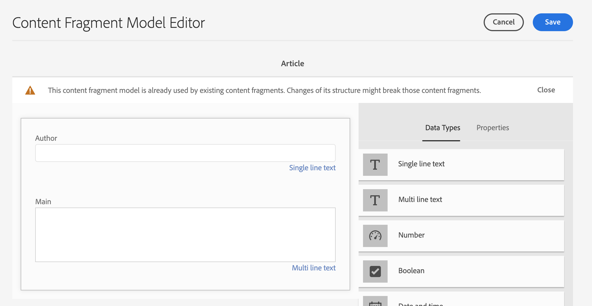
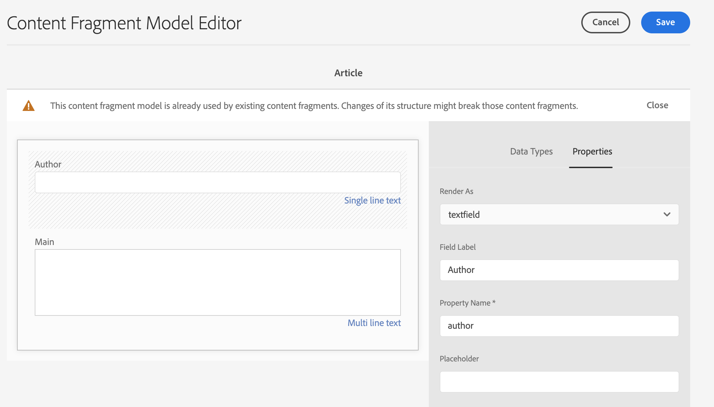

# AEM Headless本地化入门 {#getting-started}

了解如何组织无头内容以及AEM本地化工具的工作方式。

## 迄今为止的故事 {#story-so-far}

在AEM无头本地化历程的上一个文档中，[了解无头内容和如何在AEM中进行本地化](learn-about.md)您学习了无头CMS的基本理论，您现在应该：

* 了解无头内容交付的基本概念。
* 熟悉AEM如何支持无头和本地化。

本文基于这些基础知识，以便您了解AEM如何存储和管理无头内容，以及如何使用AEM本地化工具翻译该内容。

## 目标 {#objective}

本文档可帮助您了解如何开始在AEM中本地化无头内容。 阅读后，您应该：

* 了解内容结构对本地化的重要性。
* 了解AEM如何存储无头内容。
* 熟悉AEM本地化工具。

## 要求和先决条件 {#requirements-prerequisites}

在开始本地化无头AEM内容之前，需要满足一些要求。

### 知识 {#knowledge}

* 体验CMS的本地化内容
* 使用大型CMS基本功能的经验
* 具有AEM基本操作的工作知识
* 了解您使用的翻译服务
* 基本了解您翻译的内容

>[!TIP]
>
>如果您不熟悉使用大型CMS(如AEM)，请考虑先查看[基本操作](/help/sites-cloud/authoring/getting-started/basic-handling.md)文档，然后再继续。 基本处理文档未包含在历程中，因此，完成后请返回本页。

### 工具 {#tools}

* 用于测试内容翻译的沙盒访问权限
* 连接到首选翻译服务的凭据
* 是AEM中`project-administrators`组的成员

## 结构是关键 {#content-structure}

AEM内容（无头网页或传统网页）由其结构驱动。 AEM对内容结构要求很少，但在项目规划中仔细考虑内容层次结构可以使本地化更简单。

>[!TIP]
>
>在无头项目开始时计划翻译和本地化。 及早与项目经理和内容架构师密切合作。
>
>“国际化项目经理”可能需要作为单独的角色，其职责是确定哪些内容应翻译、哪些不翻译，哪些翻译内容可由区域或本地内容制作者修改。

制定所需内容本地化计划。

* 您是否需要不同的语言或语言才能适应地区具体情况？
* 您是否需要富媒体内容（如图像或视频）在不同区域设置中有所不同？

## AEM如何存储无标题内容 {#headless-content-in-aem}

对于本地化专家而言，深入了解AEM如何管理无头内容并不重要。 但是，熟悉基本概念和术语后来使用AEM本地化工具将非常有用。 最重要的是，您需要了解您自己的内容及其结构，以便将其有效地本地化。

### 内容模型 {#content-models}

为了能够跨渠道、区域和语言一致地交付无头内容，内容必须高度结构化。 AEM使用内容模型来强制实施此结构。 将内容模型视为一种用于创建无标题内容的模板或模式。 由于每个项目都有自己的需求，因此每个项目都定义自己的内容片段模型。 AEM对此类模型没有固定要求或结构。

内容架构师在项目早期就可以定义此结构。 与先前推荐的一样，作为本地化专家，您应该与内容架构师密切合作，以了解和组织内容。

由于内容模型定义了内容的结构，因此您需要知道模型的哪些字段需要翻译。 通常，您会与内容架构师合作来定义此内容。 要浏览内容模型的字段，请执行以下步骤。

1. 导航到&#x200B;**工具** -> **资产** -> **内容片段模型**。
1. 内容片段模型通常存储在文件夹结构中。 点按或单击您项目的文件夹。
1. 列出了模型。 点按或单击模型以查看详细信息。
   
1. 将打开&#x200B;**内容片段模型编辑器**。
   1. 左列包含模型的字段。 这篇专栏文章让我们感兴趣。
   1. 右列包含可添加到模型的字段。 我们可以忽略此列。
      
1. 点按或单击模型的一个字段。 AEM标记该字段，该字段的详细信息将显示在右列中。
   

对于必须翻译的所有字段，请注意字段&#x200B;**属性名称**。 您将需要此信息才能进入历程的下一步。

### 内容片段 {#content-fragments}

内容作者使用内容模型来创建实际的无标题内容。 内容作者选择要基于的内容的模型，然后创建内容片段。 内容片段是模型的实例，表示要无头地交付的实际内容。

如果内容模型是内容的模式，则内容片段是基于这些模式的实际内容。

内容片段作为数字资产管理(DAM)的一部分，作为AEM中的资产进行管理。 这很重要，因为它们都位于路径`/content/dam`下。

## 推荐的内容结构 {#recommended-structure}

如前所建议，请与您的内容架构师合作，为您自己的项目确定适当的内容结构。 但是，下面是一个经过验证、简单且直观的结构，它非常有效。

在`/content/dam`下为项目定义基本文件夹。

```text
/content/dam/<your-project>
```

创作内容的语言称为语言根。 在我们的示例中，它是英语，它应位于此路径下方。

```text
/content/dam/<your-project>/en
```

如果将置于主控语言下，则可能需要本地化的所有项目内容。

```text
/content/dam/<your-project>/en/<your-project-content>
```

本地化应创建为与语言根目录一起的同级文件夹。 例如，德语将具有以下路径。

```text
/content/dam/<your-project>/de
```

最终结构可能如下所示。

```text
/content
    |- dam
        |- your-project
            |- en
                |- some
                |- exciting
                |- headless
                |- content
            |- de
            |- fr
            |- it
            |- ...
        |- another-project
        |- ...
```

## AEM本地化工具 {#localization-tools}

现在，您已了解内容片段是什么以及内容结构的重要性，接下来我们便可以了解如何将此内容本地化。 AEM中的本地化工具非常强大，但很容易在较高的级别上理解。

* **翻译连接器**  — 连接器是AEM与您使用的翻译服务之间的链接。
* **翻译规则**  — 规则定义特定路径下应翻译的内容。
* **翻译项目**  — 翻译项目将应作为单次翻译工作处理的内容汇集在一起，并跟踪翻译的进度，与连接器连接以传输要翻译的内容并从翻译服务接收回该内容。

通常，您只需为实例设置一次连接器，并为每个无头项目设置规则。 然后，您使用翻译项目将内容本地化，并持续更新其翻译。

## 下一步 {#what-is-next}

现在，您已完成此部分无头本地化历程，接下来您应该：

* 了解内容结构对本地化的重要性。
* 了解AEM如何存储无头内容。
* 熟悉AEM本地化工具。

在此知识的基础上，继续您的AEM无头本地化历程，方法是接下来查看文档[配置翻译连接器](configure-connector.md)，您将从中了解如何将AEM连接到翻译服务。|

## 其他资源 {#additional-resources}

虽然建议您通过查看文档[配置翻译连接器](configure-connector.md)进入无头本地化历程的下一部分，但是以下是一些额外的可选资源，这些资源可以更深入地了解本文档中提到的某些概念，但不需要继续在无头历程中继续。

* [AEM基本操作](/help/sites-cloud/authoring/getting-started/basic-handling.md)  — 了解AEM UI的基础知识，以便能够轻松导航并执行基本任务，如查找内容。
* [识别要翻译的内容](/help/sites-cloud/administering/translation/rules.md)  — 了解翻译规则如何识别需要翻译的内容。
* [配置翻译集成框架](/help/sites-cloud/administering/translation/integration-framework.md)  — 了解如何配置翻译集成框架以与第三方翻译服务相集成。
* [管理翻译项目](/help/sites-cloud/administering/translation/managing-projects.md)  — 了解如何在AEM中创建和管理机器翻译项目和人工翻译项目。
