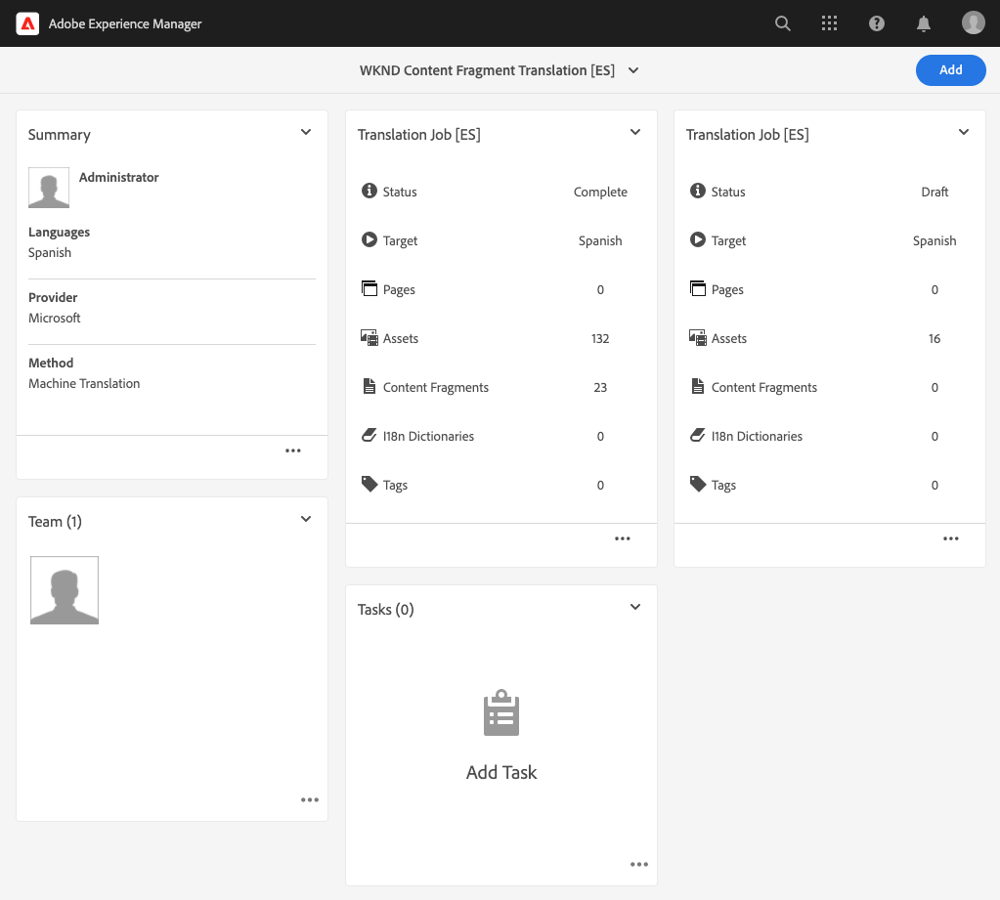

# 发布翻译后的内容 {#publish-content}

了解如何发布本地化的内容。

## 迄今为止的故事 {#story-so-far}

在AEM无头本地化历程的上一个文档中， [翻译内容，](configure-connector.md)您学习了如何使用AEM翻译项目来翻译无头内容。 您现在应该：

* 了解翻译项目是什么。
* 能够创建新的翻译项目。
* 使用翻译项目来翻译您的无头内容。

现在，您的初始翻译已完成，本文将引导您完成发布该内容的下一步，以及在基础语言根内容发生更改时如何更新翻译。

## 目标 {#objective}

本文档可帮助您了解如何在AEM中发布无标题内容，以及如何创建持续工作流以保持翻译处于最新状态。 阅读本文档后，您应：

* 了解AEM的创作 — 发布模型。
* 了解如何发布翻译后的内容。
* 能够为翻译内容实施持续更新模型。

## AEM创作 — 发布模型 {#author-publish}

在发布内容之前，最好了解AEM创作 — 发布模型。 用最简单的术语来说， AEM将系统的用户分成两组。

1. 创建和管理内容和系统的用户
1. 从系统中使用内容的用户。

因此，AEM将实际分为两个实例。

1. **author**&#x200B;实例是内容作者和管理员在其中创建和管理内容的系统。
1. **publish**&#x200B;实例是将内容交付给用户的系统。

在创作实例上创建内容后，必须将其传输到发布实例，才能供使用。 从创作到发布的转移过程称为&#x200B;**publication**。

## 发布翻译内容 {#publishing}

一旦您对翻译内容的状态感到满意，您便可以发布该内容，以便无头服务能够使用该内容。 执行此操作的最简单方法是导航到项目资产文件夹。

```text
/content/dam/<your-project>/
```

在此路径下，您拥有每个翻译语言的子文件夹，并可以选择要发布的。

1. 转到&#x200B;**Navigation** -> **Assets** -> **Files**&#x200B;并打开项目文件夹。
1. 在此，您将看到语言根文件夹和所有其他语言文件夹。 选择要发布的本地化语言。
   
1. 点按或单击&#x200B;**管理发布**。
1. 在&#x200B;**管理发布**&#x200B;窗口中，确保在&#x200B;**操作**&#x200B;下自动选择&#x200B;**发布**，并在&#x200B;**计划**&#x200B;下选择&#x200B;**Now**。 单击或点按&#x200B;**下一步**。
   
1. 在下一个&#x200B;**管理发布**&#x200B;窗口中，确认已选择/已选择正确的路径。 点按或单击&#x200B;**发布**。
   
1. AEM会在屏幕底部显示一条弹出消息，以确认发布操作。
   

您的本地化无标题内容现已发布！ 现在，您的无头服务可以访问并使用它。

>[!TIP]
>
>发布时，您可以选择多个项目（即多个语言文件夹），以便一次发布多个本地化版本。

发布内容时还有其他选项，例如计划发布时间（超出此历程的范围）。 有关详细信息，请参阅文档末尾的[其他资源](#additional-resources)部分。

## 更新翻译的内容 {#updating-translations}

本地化和翻译很少是一次性练习。 通常，初始本地化完成后，内容作者会继续在语言根目录中添加和修改内容。 这意味着您还需要更新翻译的内容。

具体的项目要求将定义您需要更新翻译的频率，以及在执行更新之前将遵循哪个决策过程。 一旦您决定更新翻译，AEM中的过程将非常简单。 由于初始翻译基于翻译项目，因此任何更新也是如此。

1. 导航到&#x200B;**导航** -> **资产** -> **文件**。 请记住，AEM中的无标题内容存储为称为内容片段的资产。
1. 选择项目的语言根。 在本例中，我们选择了`/content/dam/wknd/en`。
1. 点按或单击边栏选择器，并显示&#x200B;**引用**&#x200B;面板。
1. 点按或单击&#x200B;**语言副本**。
1. 选中&#x200B;**语言副本**&#x200B;复选框。
1. 展开引用面板底部的&#x200B;**更新语言副本**&#x200B;部分。
1. 在&#x200B;**项目**&#x200B;下拉列表中，选择&#x200B;**添加到现有翻译项目**。
1. 在&#x200B;**现有翻译项目**&#x200B;下拉列表中，选择为初始翻译创建的项目。
1. 点按或单击&#x200B;**开始**。


内容会添加到现有翻译项目。 要查看翻译项目，请执行以下操作：

1. 导航到&#x200B;**Navigation** -&amp; **Projects**。
1. 点按或单击您刚刚更新的项目。
1. 点按或单击您更新的语言之一。

您将看到项目中添加了新的工作卡。 在此示例中，添加了另一个西班牙语翻译。



您会注意到新信息卡中列出的统计信息（资产数量和内容片段数）不同。 这是因为AEM识别自上次翻译后发生的更改，并且仅包含需要翻译的新内容（包括重新翻译更新的内容或首次翻译新内容）。

从这一刻起，您[开始并管理翻译作业，就像您对原作一样。](translate-content.md#using-translation-project)

## 历程结束？ {#end-of-journey}

恭喜！ 您已完成无头本地化历程！ 您现在应该：

* 概述什么是无标题内容交付。
* 了解AEM的无头功能。
* 了解AEM本地化功能以及它们与无标题内容的相关性。
* 能够开始本地化您自己的无头内容。

现在，您可以将自己的无头内容本地化为AEM。 但是，AEM是一款功能强大的工具，还有许多其他选项可供使用。 查看下一节中提供的一些其他资源，了解有关您在此历程中看到的功能的更多信息。

## 其他资源 {#additional-resources}

* [管理翻译项目](/help/sites-cloud/administering/translation/managing-projects.md)  — 了解翻译项目和其他功能（如人文翻译工作流和多语言项目）的详细信息。
* [创作概念](/help/sites-cloud/authoring/getting-started/concepts.md)  — 更详细地了解AEM的创作和发布模型。本文档重点介绍页面创作，而不是内容片段，但该理论仍适用。
* [发布页面](/help/sites-cloud/authoring/fundamentals/publishing-pages.md)  — 了解发布内容时可用的其他功能。本文档重点介绍页面创作，而不是内容片段，但该理论仍适用。
